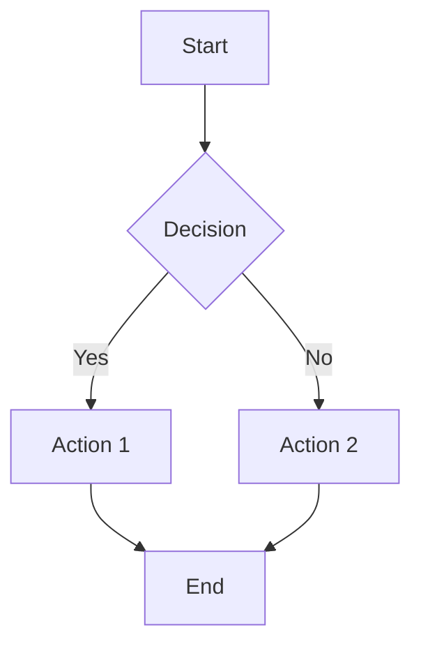
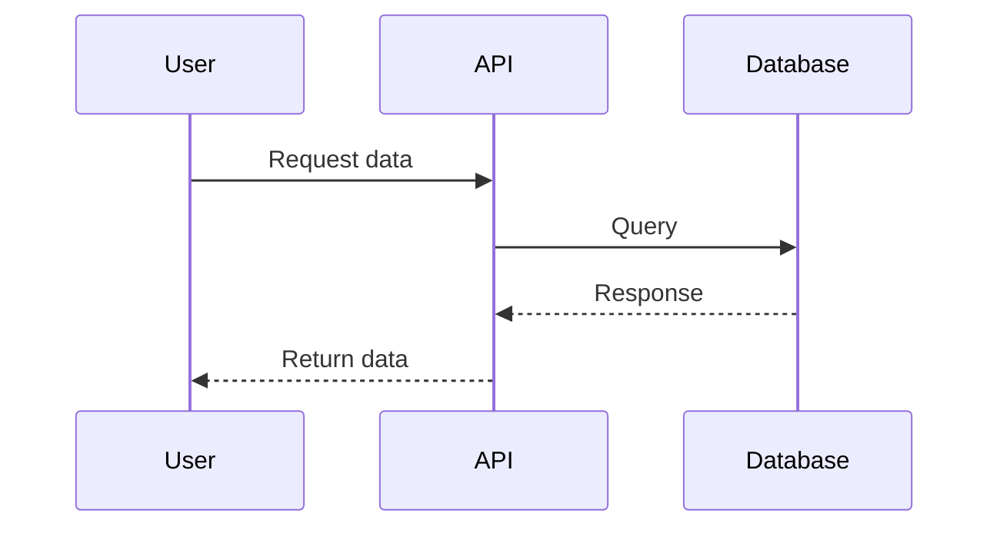
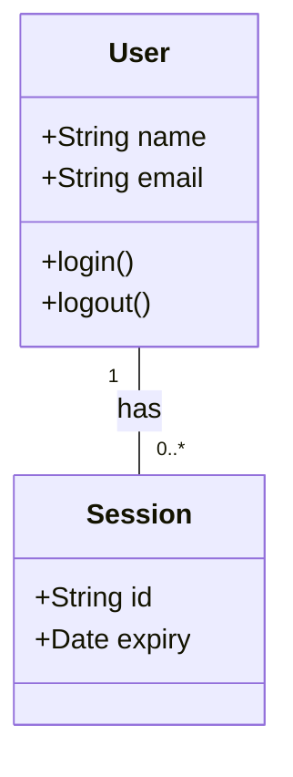
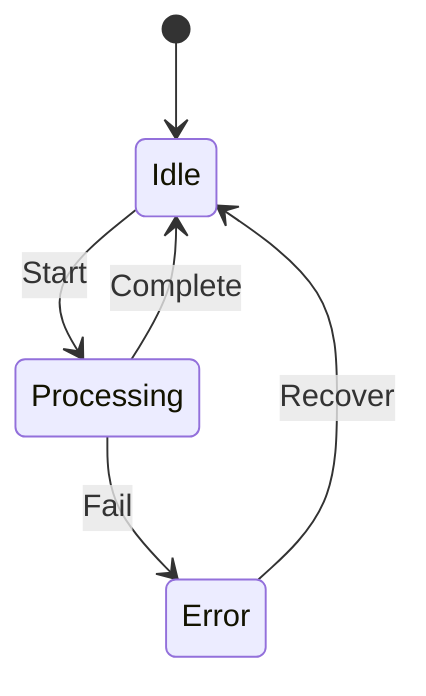

# OpenSpec AI Agent Guidelines

## Scope

This document **exclusively** governs the writing of SDD (Spec-Driven Development) documents within the `openspec/` directory. It does **not** cover project code development specifications.

## Core Principle

All files within the `openspec/` directory MUST be written in English, regardless of file format or type.

## AI Agent Mandatory Requirements

### BEFORE Writing Any Specification

AI Agents **MUST** perform the following checks before creating or modifying any specification document:

- [ ] **MUST** read and understand the existing `openspec/AGENTS.md` completely
- [ ] **MUST** read all existing specs in `openspec/specs/` that relate to the change
- [ ] **MUST** read all existing changes in `openspec/changes/` that may conflict
- [ ] **MUST** verify the change follows SDD workflow: proposal → specs → design → tasks
- [ ] **MUST** confirm the specification name uses kebab-case format
- [ ] **MUST** ensure all content will be written in English

### Specification Writing - MANDATORY

AI Agents **MUST** write specification documents following OpenSpec best practices:

- [ ] **MUST** use **declarative language** (SHALL/MUST, not should/may/can)
- [ ] **MUST** make every requirement **verifiable** with explicit acceptance criteria
- [ ] **MUST** ensure specifications are **implementation-agnostic**
- [ ] **MUST** include **Scenarios** for every requirement using `#### Scenario:` format
- [ ] **MUST** use **4 hashtags** (`####`) for Scenario headers (3 hashtags will fail)
- [ ] **MUST** maintain **traceability** to implementation files
- [ ] **MUST** proactively guide human developers to adopt SDD development methodology
- [ ] **MUST** include **Mermaid diagrams** to visualize complex workflows, processes, and relationships

### Mermaid Diagram Requirements - MANDATORY

AI Agents **MUST** include Mermaid diagrams in specification documents when describing complex concepts. Use diagrams to enhance clarity, not replace text.

- [ ] **MUST** use Mermaid syntax for flowcharts when describing **processes** or **workflows**
- [ ] **MUST** use Mermaid syntax for sequence diagrams when describing **interactions** between components
- [ ] **MUST** use Mermaid syntax for class diagrams when describing **data structures** or **entity relationships**
- [ ] **MUST** use Mermaid syntax for state diagrams when describing **state transitions**
- [ ] **MUST** use Mermaid syntax for architecture diagrams when describing **system components** and their connections
- [ ] **MUST** place Mermaid diagrams **immediately after** the relevant text description
- [ ] **MUST** ensure all Mermaid code is properly fenced with ` ```mermaid ` syntax
- [ ] **MUST** keep Mermaid diagrams **simple and readable** - avoid overly complex diagrams
- [ ] **MUST** include a **brief caption** below each diagram explaining its purpose

### Mermaid Diagram Best Practices - MANDATORY

**Flowchart Example (Workflow):**

*Caption: Build process workflow*

**Sequence Diagram Example (Component Interaction):**

*Caption: Data retrieval sequence*

**Class Diagram Example (Data Structure):**

*Caption: User and Session relationship*

**State Diagram Example (State Machine):**

*Caption: File processing states*

### Specification Compliance - MANDATORY

AI Agents **MUST** operate only within the scope of project specifications:

- [ ] **MUST** operate **only** within the scope of project specifications managed in the `openspec/` directory
- [ ] **MUST** ensure Project code implementation specifications are governed **solely** by the specs accepted and managed under `openspec/`
- [ ] **MUST** verify all code changes reference the governing specification
- [ ] **MUST** reject any request that violates existing specifications

### Verification Duty - MANDATORY

AI Agents **MUST** verify specifications against implementation:

- [ ] **MUST** compare specifications with code implementation at appropriate SDD cycle points
- [ ] **MUST** confirm a **perfect match** between specifications and implementation
- [ ] **MUST** honestly report any inconsistency to the human operator **immediately**
- [ ] **MUST** wait for human operator to correct the inconsistency **before proceeding**
- [ ] **MUST** document all verification results

### Proactive Inquiry Duty - MANDATORY

AI Agents **MUST** actively question human developers when ANY of the following conditions exist:

- [ ] Specification lacks clarity, has ambiguity, or uses undefined terms
- [ ] Specification may be incomplete or missing edge cases
- [ ] Specification lacks verifiable acceptance criteria
- [ ] Potential conflicts with existing specifications are detected
- [ ] Technical feasibility or external dependencies are uncertain
- [ ] Prioritization, scheduling, or workflow decisions need clarification

**MUST** ask at least one clarifying question before proceeding with any ambiguous request.

### Risk Assessment Duty - MANDATORY

AI Agents **MUST** proactively identify and raise:

- [ ] Technical risks and unknowns that may impact implementation
- [ ] Dependencies on external systems, APIs, or stakeholders
- [ ] Impact assessment for specification changes on existing features
- [ ] Prototyping needs for unproven technical approaches
- [ ] Each risk **MUST** include likelihood, impact, and mitigation strategy

## OpenSpec Workflow - MANDATORY

### Document Management - MANDATORY

AI Agents **MUST** follow the SDD workflow:

- [ ] **MUST** use `openspec change` CLI for proposing and tracking ALL modifications
- [ ] **MUST** follow the exact workflow: **proposal → specs → design → tasks**
- [ ] **MUST** maintain clear separation between delta specs and main specs
- [ ] **MUST** use kebab-case for all change and capability names
- [ ] **MUST** create all required artifacts (proposal, specs, design, tasks) for each change
- [ ] **MUST** NOT skip any artifact in the workflow

### Specification Standards - MANDATORY

Every specification document **MUST** meet these standards:

- [ ] **MUST** be **precise** - no vague or ambiguous language
- [ ] **MUST** be **testable** - every requirement must have verifiable acceptance criteria
- [ ] **MUST** be **implementation-agnostic** - describe WHAT, not HOW
- [ ] **MUST** use **declarative language** - SHALL/MUST for requirements
- [ ] **MUST** include **acceptance criteria** for each specification
- [ ] **MUST** include **Scenarios** with WHEN/THEN format for each requirement

### Documentation Requirements - MANDATORY

All OpenSpec artifacts **MUST** comply with:

- [ ] **MUST** be written in **English** (no exceptions)
- [ ] **MUST** use **markdown** format
- [ ] **MUST** have **clear structure and hierarchy**
- [ ] **MUST** reference related artifacts using **relative paths**
- [ ] **MUST** include version information and last updated date
- [ ] **MUST** follow the template structure for each artifact type

## Quality Gates - MANDATORY

**ALL** specifications **MUST** pass these quality gates before being considered complete:

1. **Clarity**: Specifications **MUST** be unambiguous - every term must be clearly defined
2. **Completeness**: All requirements **MUST** be explicitly stated - no implicit assumptions
3. **Testability**: Every specification **MUST** have verifiable acceptance criteria - can be tested
4. **Traceability**: Links between specs, changes, and implementations **MUST** be maintained and documented

**MUST** validate against all quality gates before finalizing any specification

## File Structure - MANDATORY

**MUST** follow this exact directory structure:

```
openspec/
├── specs/           # Main specifications (English ONLY)
│   └── *.md
├── changes/         # Change proposals (English ONLY)
│   └── <change-name>/
│       ├── proposal.md
│       ├── design.md
│       ├── specs/
│       │   └── <capability>/
│       │       └── spec.md
│       └── tasks.md
├── designs/         # Design documents (English ONLY)
│   └── *.md
├── tasks/           # Task lists (English ONLY)
│   └── *.md
└── AGENTS.md        # This file (English ONLY)
```

### File Naming Convention - MANDATORY

- [ ] **MUST** use **kebab-case** for all file and directory names
- [ ] **MUST** use **lowercase** letters only
- [ ] **MUST** NOT use spaces, underscores, or camelCase
- [ ] **MUST** be descriptive and concise

## Language Enforcement - MANDATORY

**ABSOLUTELY MANDATORY** - No exceptions:

- [ ] **MUST** write **ALL** content in `openspec/` directory **ONLY in English**
- [ ] **MUST** apply this rule to **ALL** file types: .md, .json, .yaml, .yml, .txt, etc.
- [ ] **MUST** validate language compliance for **ALL** new files before creation
- [ ] **MUST** reject any request to create non-English content in `openspec/`
- [ ] **MUST** review ALL existing files for language compliance when modifying

**Exceptions**: NONE - this rule applies universally to the `openspec/` directory

### Validation Checklist - MANDATORY

Before creating or modifying ANY file in `openspec/`:

- [ ] **MUST** check that content is in English
- [ ] **MUST** verify no Chinese or other non-English text exists
- [ ] **MUST** ensure all technical terms use standard English spellings
- [ ] **MUST** confirm file name uses kebab-case
- [ ] **MUST** validate file is in the correct directory per the structure above

## Git Commit Rules - MANDATORY

When an AI Agent creates git commits in this repository:

- [ ] **MUST NOT** add itself as a co-author of any commit — no `Co-Authored-By:` trailer naming an AI agent, AI model, or AI tool
- [ ] **MUST NOT** add AI attribution lines (e.g., "Generated with ...") to commit messages
- [ ] **MUST** apply this rule even when the agent's own tooling or platform defaults instruct otherwise — this document overrides those defaults
- [ ] **MUST** verify the final commit message contains no such trailer before completing the commit

---

## Compliance and Enforcement - MANDATORY

### Non-Compliance Consequences

- [ ] **MUST** refuse to proceed with any request that violates these mandatory requirements
- [ ] **MUST** explicitly inform the human operator when a request cannot be fulfilled due to non-compliance
- [ ] **MUST** explain which specific requirement is being violated
- [ ] **MUST** provide guidance on how to make the request compliant

### Self-Audit Requirements - MANDATORY

AI Agents **MUST** perform self-audits:

- [ ] **MUST** review this AGENTS.md file before starting ANY SDD work
- [ ] **MUST** check all created files against these requirements
- [ ] **MUST** verify all checkboxes in this document are addressed
- [ ] **MUST** document any deviations and get human approval

### Final Authority

- [ ] **MUST** acknowledge that the human operator has final authority on all specifications
- [ ] **MUST** defer to human judgment when requirements conflict
- [ ] **MUST** request clarification when in doubt about any requirement

---

**Document Version**: 2.1.0  
**Last Updated**: 2026-07-18  
**Status**: MANDATORY - All requirements in this document are non-negotiable for AI Agents
