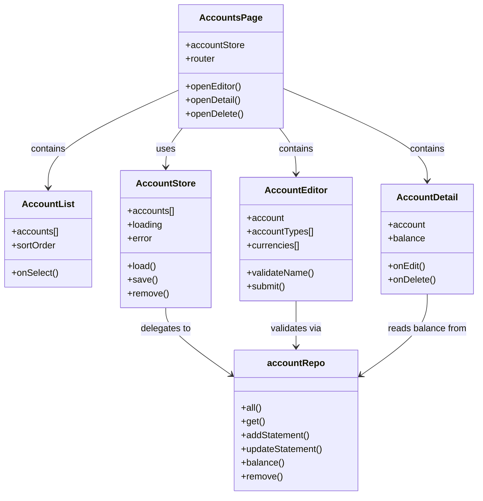
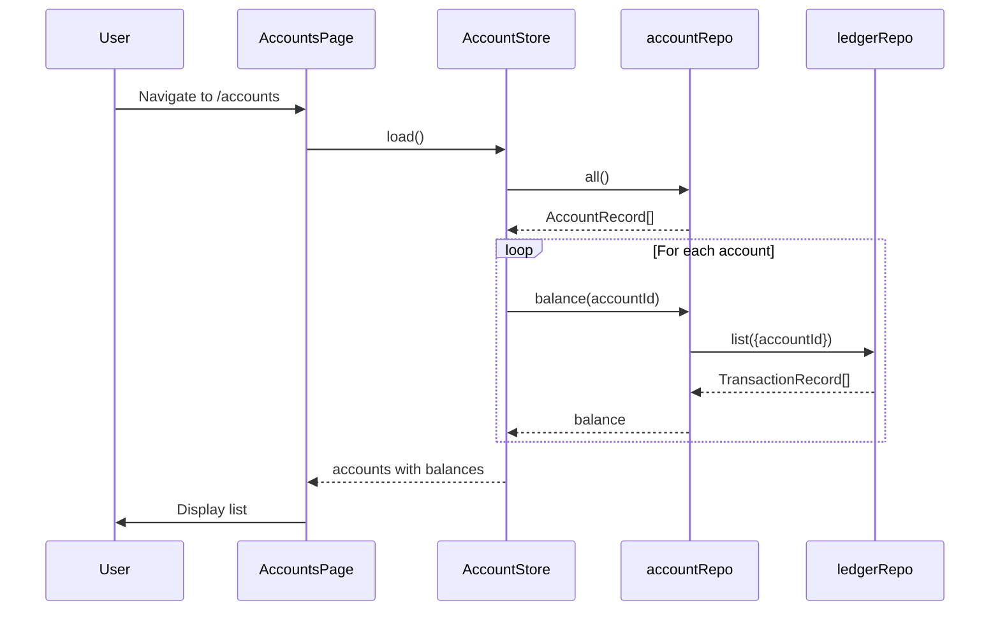

# Account Management Surfaces — Design

**Change**: `account-management-surfaces`
**Version**: 1.0.0
**Last Updated**: 2026-08-09

## Context

The domain layer for `account-management` is complete: [src/domain/repos/account.ts](../../src/domain/repos/account.ts) reads and writes `ACCOUNTLIST_V1` through `accountRepo` with methods for `all()`, `get()`, `findByName()`, `addStatement()`, `updateStatement()`, `balance()`, and `remove()` with full cascade logic; [src/domain/rules/account.ts](../../src/domain/rules/account.ts) defines the eight account types, the two status values, the balance computation, the favorite encoding, and the securities-holding helper. Phase 0 established how routes are declared and how the navigation surface is derived from them. Phase 1 and Phase 2 provided the foundation: file metadata for base currency, and currency management for the binding field. What is missing is a page that makes these records reachable. This change mirrors the pattern already established by `file-metadata-and-settings-surfaces` and `currency-management-surfaces`: a store over the repository, a routed page, and type-specific components.

## Goals / Non-Goals

**Goals**: a reachable, addressable accounts surface; account records inspectable and editable; account creation with all required fields; type-specific field presentation; balance display per the capability definition; statement lock management; deletion with cascade guard.

**Non-Goals**: account reconciliation workflows; transfer transaction creation between accounts; investment-specific account behaviors; asset-specific account behaviors; parity with the upstream account dialog; bulk account operations; account import/export.

## Decisions

### D1: The default list is all accounts, sorted alphabetically

Every account in `ACCOUNTLIST_V1` is potentially relevant to the user, so the surface lists all by default rather than filtering. The alphabetical sort provides a predictable order that matches user expectations. User-initiated reordering is supported and persisted as preference. *Alternative considered*: list only Open accounts by default — rejected because Closed accounts still contain data the user may need to reference or reactivate.

### D2: A routed page at `/accounts`, not a dialog

Accounts gets its own route and navigation entry. Phase 0's decision to make scopes URL-addressable applies directly: accounts are a first-class entity that users expect to bookmark or link to. A full page also provides room for the list, detail, and editor without competing for space. The responsive-hybrid dialog decision the operator settled on for editing applies to account editing where it fits naturally — dialog at desktop width, full-page on mobile.

### D3: The list reads through the repository on entry

Same reasoning as the settings and currencies surfaces: synchronization can replace the file underneath the application, so a cached copy can disagree with what is stored. Reads go through `accountRepo.all()` which already handles the SQL query. Writes go through `accountRepo` methods which emit atomic statements.

### D4: Account creation uses a form with required field validation

The creation form presents all fields necessary for a valid account: name, type, currency, initial balance, and initial date. Credit/loan planning fields appear conditionally based on the selected type. Validation enforces case-insensitive uniqueness for account names before attempting persistence. *Alternative considered*: multi-step wizard — rejected for simplicity; a single form is sufficient for the required fields.

### D5: Account editing is type-aware

The editor adapts its fields based on the account type. For Credit Card, Loan, and Term types, credit/loan planning fields are visible and editable. For Investment and Shares types, investment-specific fields are reserved for the `investment-tracking` capability and not editable here. For Asset types, asset-specific fields are reserved for the `asset-tracking` capability. This keeps the editor focused and prevents users from editing fields that belong to capabilities not yet implemented.

### D6: Balance is computed on demand, not cached

The balance displayed for each account is computed using `accountRepo.balance()` which calls `accountBalance()` from the rules layer. This ensures the balance is always current based on the latest transaction data. The computation is performant enough for on-demand display; caching would introduce complexity and potential staleness without significant benefit.

### D7: Statement lock editing is explicit

Setting a statement lock requires a statement date and explicit user action. The lock state and date are displayed prominently in the account detail. Clearing the lock removes both the state and date. This matches the capability's requirement that locked accounts make transactions on or before the statement date read-only.

### D8: Deletion requires explicit confirmation with cascade disclosure

Before deletion, the user is presented with a confirmation dialog that explicitly lists what will be deleted: the account itself, all its transactions, its scheduled transactions, and (for Investment/Shares accounts) its stock positions. This implements the deletion cascade rule from the baseline spec while ensuring the user understands the consequences. If any dependencies exist, deletion is refused with a clear explanation.

### D9: Favorite is a simple toggle

The favorite state (`FAVORITEACCT` as `TRUE`/`FALSE`) is toggleable from both the list and detail views. Favorite accounts are visually distinguished in the list. This leverages the existing `isFavorite` and `encodeFavorite` helpers from the rules layer.

### D10: The surface uses the existing `accountRepo` without wrapper

Unlike currencies which needed a store to track the used set and manage history, accounts can be managed directly through `accountRepo` because: (1) the list is always all accounts, (2) balance computation already exists in the repo, (3) type-specific logic is handled in the editor component, not the store. A store is still created for consistency with the pattern and to manage UI state (loading, error, etc.), but it delegates to the repo for all persistence.

## Surface Structure

```mermaid
flowchart TD
    Route[\"/accounts\" route] --> Page[AccountsPage]
    Page --> List[Account list: name, type, status, currency, balance]
    Page --> Add[Add account button]
    List --> Detail[Account detail view]
    Detail --> Editor[Edit account]
    Editor --> Fields[Common fields + type-specific fields]
    Editor --> Lock[Statement lock controls]
    Editor --> Favorite[Favorite toggle]
    Editor --> Delete[Delete with confirmation]
    Add --> Create[Account creation form]
    Create --> TypeSelect[Type selector]
    TypeSelect -->|Credit Card/Loan/Term| CreditFields[Credit limit, interest rate, etc.]
    TypeSelect -->|Investment/Shares| Reserve[Reserved for investment-tracking]
    TypeSelect -->|Asset| Reserve2[Reserved for asset-tracking]
    TypeSelect -->|Cash/Checking| Common[Common fields only]
```
*Caption: Page and component structure for account management*

## Component Architecture


*Caption: Component and data flow for account management*

## Data Flow


*Caption: Initial load sequence with balance computation*

## Route Registration

The route `/accounts` will be registered in [src/router/index.ts](../../src/router/index.ts) with:
- `name: 'accounts'`
- `component: () => import('../pages/AccountsPage.vue')`
- `meta.nav: { labelKey: 'menu.accounts', icon: 'mdi-bank', order: 20 }` (order 20 places it between home and currencies)
- `meta.capability: 'account-management'`

## New Files

| File | Purpose |
|------|---------|
| `src/pages/AccountsPage.vue` | Main accounts page with list and entry points |
| `src/components/account/AccountList.vue` | Display account list with sorting |
| `src/components/account/AccountDetail.vue` | Show account details including balance and statement lock |
| `src/components/account/AccountEditorDialog.vue` | Dialog for creating/editing accounts with type-specific fields |
| `src/stores/account-store.ts` | UI state management over `accountRepo` |
| `src/locales/*/account.json` | Translations for account-related strings |

## Existing Files Modified

| File | Change |
|------|--------|
| `src/router/index.ts` | Add `/accounts` route with navigation metadata |
| `src/locales/*/menu.json` | Add `menu.accounts` translation key |

## Risk Assessment

| # | Risk | Likelihood | Impact | Mitigation |
|---|------|------------|--------|------------|
| R1 | Account name uniqueness validation misses edge cases | Medium | High | Use `accountRepo.findByName()` which already handles case-insensitive matching; write tests for various case combinations |
| R2 | Balance computation is slow with many accounts/transactions | Low | Medium | `accountBalance()` is already optimized; initial load can be parallelized; lazy loading of balances on scroll if needed |
| R3 | Type-specific fields are shown for wrong account types | Low | Medium | Editor component explicitly checks account type before rendering fields; unit tests verify field visibility |
| R4 | Deletion cascade misses some dependent records | Low | High | Reuse `accountRepo.remove()` which already implements full cascade per baseline spec; add integration test |
| R5 | Statement lock date is stored but not enforced | Medium | Medium | Lock management is in the surface; enforcement belongs to `transaction-ledger` per baseline spec; this change only handles the UI |
| R6 | Favorite toggle does not persist correctly | Low | Medium | Use `encodeFavorite()` from rules layer which handles the TRUE/FALSE text encoding |
| R7 | Currency binding allows selection of non-existent currency | Low | High | Populate currency dropdown from `currencyRepo.all()`; validate selection before save |

## Open Questions

- None. The key decisions — routing pattern, store vs repo delegation, type-specific field handling, cascade deletion disclosure — are all resolved above.
