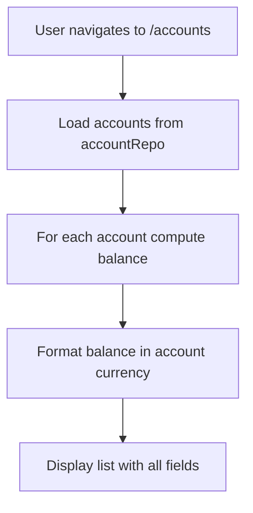
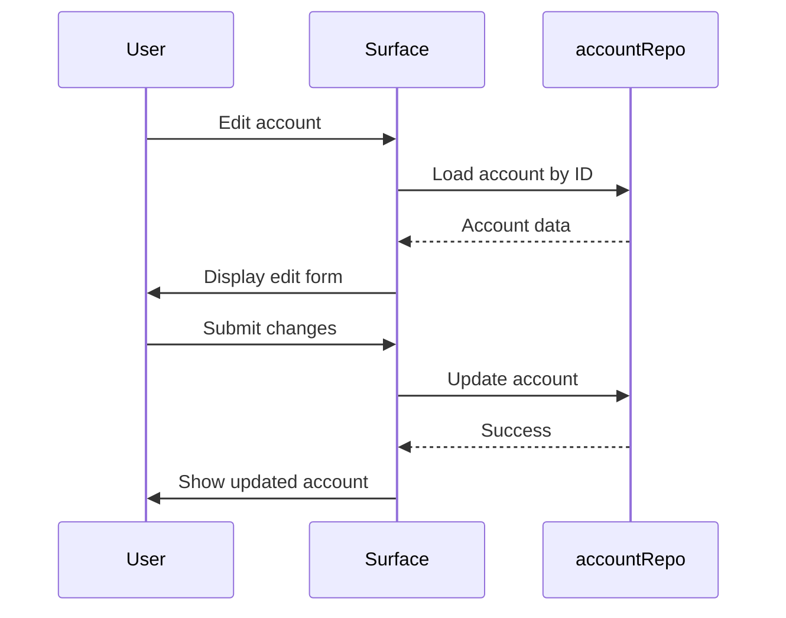
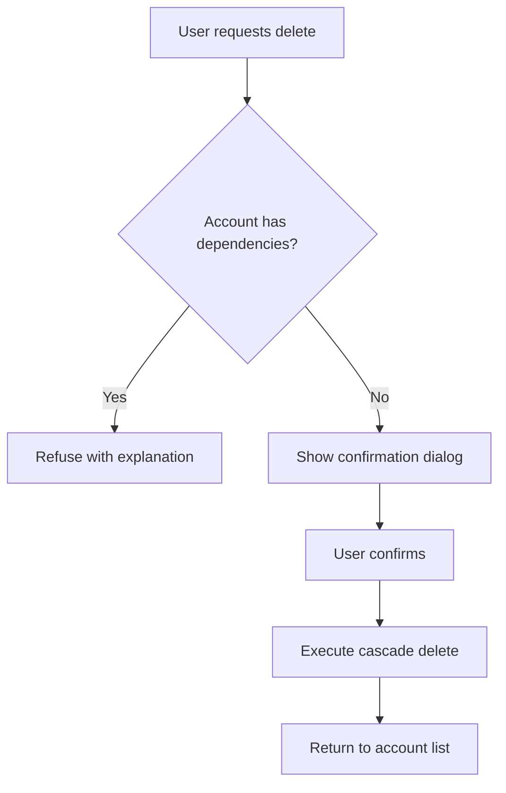

# account-management Specification — Delta

**Capability**: `account-management`
**Version**: 1.1.0
**Last Updated**: 2026-08-09
**Change**: `account-management-surfaces`
**Delta Type**: MODIFIED

Governed by [AGENTS.md](../../../AGENTS.md). Related change artifacts: [proposal.md](../../proposal.md), [design.md](../../design.md), [tasks.md](../../tasks.md).

This delta ADDS user-facing requirements to the `account-management` capability. The baseline established data semantics and behavioral rules; this delta specifies the surfaces through which users interact with those rules.

## ADDED Requirements

### Requirement: Accounts Surface Route

The application SHALL provide a dedicated route `/accounts` accessible from the navigation drawer that displays the accounts surface.

- The route SHALL be registered under the `app-shell-navigation` routing governance.
- The route SHALL be protected by the same authentication/authorization as all other routes.

#### Scenario: Accounts route is reachable

- **WHEN** the user navigates to `/accounts`
- **THEN** the accounts surface SHALL be displayed

#### Scenario: Accounts route appears in navigation

- **WHEN** the navigation drawer is opened
- **THEN** an "Accounts" entry SHALL be present and selecting it SHALL navigate to `/accounts`

### Requirement: Account List Display

The accounts surface SHALL display a list of all accounts persisted in `ACCOUNTLIST_V1`, showing for each: account name, account type, status, currency code, and current balance formatted in that currency.

- The list SHALL be sorted alphabetically by account name by default.
- The list SHALL support user-initiated reordering and that order SHALL be persisted as user preference.
- The balance SHALL be computed as `INITIALBAL` plus the sum of transaction flows per Requirement: Account Balance Definition in the baseline spec.
- Closed accounts SHALL be visually distinguished from Open accounts.

*Caption: Account list display flow*

#### Scenario: All accounts are listed

- **WHEN** the user opens the accounts surface
- **THEN** every account in `ACCOUNTLIST_V1` SHALL appear in the list

#### Scenario: Balance is computed correctly

- **WHEN** an account has initial balance `1000` and transactions with flows summing to `-250`
- **THEN** the displayed balance SHALL be `750` formatted in the account's currency

#### Scenario: Closed accounts are distinguished

- **WHEN** the list contains both Open and Closed accounts
- **THEN** Closed accounts SHALL have a visual indicator (e.g., struck-through name, different row color)

### Requirement: Account Creation

The application SHALL allow users to create new accounts through the accounts surface.

- The creation form SHALL present fields for: account name (required), account type (required, one of the eight upstream strings), currency (required, reference to existing `CURRENCYFORMATS_V1` row), initial balance (required), initial date (required).
- For Credit Card, Loan, and Term account types, the form SHALL additionally present: credit limit, minimum balance, interest rate, payment due date, minimum payment fields.
- Account name SHALL be validated for case-insensitive uniqueness before creation.
- On successful creation, the user SHALL be returned to the account list with the new account visible.

#### Scenario: User creates a checking account

- **WHEN** the user fills in name="My Checking", type="Checking", currency="USD", initial balance="1000", initial date="2026-01-01"
- **AND** submits the form
- **THEN** a new account SHALL be persisted with those values
- **AND** the user SHALL be returned to the account list showing the new account

#### Scenario: Duplicate account name is rejected

- **WHEN** the user attempts to create an account with a name that differs only by case from an existing account
- **THEN** the creation SHALL be rejected with an error message
- **AND** no account SHALL be created

#### Scenario: Missing required field prevents creation

- **WHEN** the user attempts to create an account without providing a currency
- **THEN** the creation SHALL be rejected
- **AND** an error message SHALL indicate which field is missing

### Requirement: Account Editing

The application SHALL allow users to edit existing accounts through the accounts surface.

- All persisted fields from the baseline spec SHALL be editable: account name, account type, status, currency, initial balance, initial date, favorite flag.
- Credit/loan planning fields SHALL be editable for Credit Card, Loan, and Term account types.
- Statement lock fields (statement locked, statement date) SHALL be editable.
- Editing account name SHALL enforce case-insensitive uniqueness against all other account names.
- Editing account type SHALL be allowed, but the user SHALL be warned that changing type may affect which fields are relevant.
- On successful edit, the user SHALL be returned to the account detail with changes visible.

*Caption: Account editing sequence*

#### Scenario: User changes account name

- **WHEN** the user edits an account's name from "Old Name" to "New Name"
- **AND** no other account has that name (case-insensitive)
- **THEN** the account name SHALL be updated

#### Scenario: Type change warns user

- **WHEN** the user changes an account type from "Checking" to "Credit Card"
- **THEN** a confirmation dialog SHALL warn that field relevance will change
- **AND** if confirmed, the type SHALL be updated

### Requirement: Type-Specific Field Presentation

The account editor SHALL adapt the fields displayed based on the selected account type.

- For **Credit Card**, **Loan**, and **Term** account types, credit/loan planning fields SHALL be visible and editable: `CREDITLIMIT`, `MINIMUMBALANCE`, `INTERESTRATE`, `PAYMENTDUEDATE`, `MINIMUMPAYMENT`.
- For **Investment** and **Shares** account types, investment-specific fields SHALL be reserved for the `investment-tracking` capability and not editable here.
- For **Asset** account types, asset-specific fields SHALL be reserved for the `asset-tracking` capability and not editable here.
- For **Cash** and **Checking** account types, only the common account fields SHALL be displayed.

#### Scenario: Credit card fields appear for credit card account

- **WHEN** the user creates or edits a Credit Card account
- **THEN** credit limit, interest rate, payment due date, and minimum payment fields SHALL be visible

#### Scenario: Cash account shows only common fields

- **WHEN** the user creates or edits a Cash account
- **THEN** only account name, type, currency, initial balance, initial date, and favorite flag SHALL be visible

### Requirement: Statement Lock Management

The application SHALL allow users to set and clear statement locks on accounts through the account detail view.

- Setting a statement lock SHALL require a statement date.
- When a statement lock is active, the account detail SHALL display the lock date and a clear indication that transactions on or before that date are read-only.
- Clearing a statement lock SHALL remove the lock date and restore full editability.
- The statement lock behavior SHALL conform to Requirement: Statement Lock Declaration in the baseline spec.

#### Scenario: User sets statement lock

- **WHEN** the user sets a statement lock with date "2026-07-31" on an account
- **THEN** the lock state and date SHALL be persisted
- **AND** the account detail SHALL display the lock indicator

#### Scenario: User clears statement lock

- **WHEN** the user clears a statement lock on an account
- **THEN** the lock state and date SHALL be removed
- **AND** the lock indicator SHALL disappear from the account detail

### Requirement: Account Deletion from Surface

The application SHALL allow users to delete accounts from the accounts surface, subject to the deletion cascade rules defined in the baseline.

- The delete action SHALL be offered on the account detail view.
- Before deletion, the user SHALL be warned with a confirmation dialog listing what will be deleted: the account itself, all its transactions, its scheduled transactions, and (for Investment/Shares accounts) its stock positions.
- If the account has any dependent records (transactions, scheduled transactions, stock positions), the delete action SHALL be refused with an explanation of what references exist.
- If deletion is allowed, it SHALL proceed as a single logical operation per Requirement: Account Deletion Cascade in the baseline spec.
- On successful deletion, the user SHALL be returned to the account list with the deleted account no longer visible.

*Caption: Account deletion flow with cascade guard*

#### Scenario: Deletion refused when transactions exist

- **WHEN** the user attempts to delete an account that has transactions
- **THEN** the deletion SHALL be refused
- **AND** an error message SHALL indicate that transactions reference the account

#### Scenario: Deletion succeeds when no dependencies

- **WHEN** the user attempts to delete an account with no transactions, scheduled transactions, or stock positions
- **AND** confirms the deletion
- **THEN** the account and all its data SHALL be removed
- **AND** the user SHALL be returned to the account list

### Requirement: Favorite Account Indication

The application SHALL allow users to mark accounts as favorites through the accounts surface.

- The `FAVORITEACCT` field SHALL be persisted as the text `TRUE` or `FALSE` per the baseline spec.
- Favorite accounts SHALL be visually distinguished in the account list (e.g., star icon, different ordering).
- The favorite state SHALL be toggleable from the account list or detail view.

#### Scenario: User marks account as favorite

- **WHEN** the user toggles the favorite state of an account
- **THEN** the `FAVORITEACCT` field SHALL be updated to `TRUE` or `FALSE` accordingly

#### Scenario: Favorite accounts are highlighted

- **WHEN** the account list is displayed
- **THEN** accounts with `FAVORITEACCT` = `TRUE` SHALL have a visual favorite indicator

### Requirement: Balance Display Formatting

The balance displayed for each account SHALL be formatted according to the currency's formatting rules from `currency-management`.

- The balance value SHALL be computed per Requirement: Account Balance Definition in the baseline spec.
- The formatted display SHALL use the currency's prefix/suffix symbols, decimal separator, grouping separator, and scale.
- Negative balances SHALL be clearly indicated (typically with a minus sign or parentheses, per currency convention).

#### Scenario: Balance formatted with currency symbols

- **WHEN** an account uses currency USD with prefix symbol "$"
- **AND** has a balance of 1500.50
- **THEN** the displayed balance SHALL be "$1,500.50"

#### Scenario: Negative balance is clearly indicated

- **WHEN** an account has a negative balance
- **THEN** the displayed balance SHALL clearly indicate the negative value
