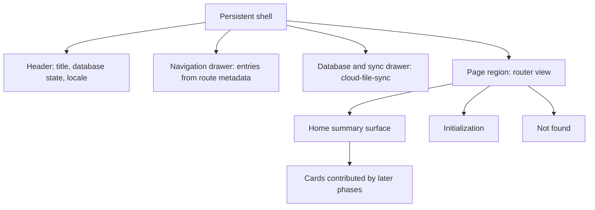

# App Shell and Navigation — Design

**Change**: `app-shell-navigation`
**Version**: 1.0.0
**Last Updated**: 2026-08-09

## Context

The shell already exists in outline: [src/App.vue](../../../src/App.vue) mounts a Quasar layout with a header, a left navigation drawer, a right database and synchronization drawer, and a page container. What is missing is everything the page container needs — the route table serves only `/init`, `/auth/callback` and a development probe, while the drawer links to `/` and `/about`. The readiness guard already works and is worth keeping exactly as it is; this change formalizes it and fills the hole around it. The domain layer landed in `domain-data-layer`, so the data is reachable, but no domain page is in scope here: those arrive with Phases 1 through 10.

## Goals / Non-Goals

**Goals**: a working home; a route table whose every entry is accounted for by a specification; navigation driven by the URL; nothing rendering blank; every shell string translatable.

**Non-Goals**: any domain page, register or dashboard widget; an about page; theming or layout redesign beyond what a working home requires; changes to the database or synchronization drawer.

## Decisions

### D1: Phase 0's home ships the frame, not the data

The home is a card surface that later phases contribute to. Phase 0 delivers the surface plus a first-run empty state and no card, because the only cards worth showing — account groups, net worth, upcoming scheduled items — belong to capabilities whose feature requirements do not exist yet. Rendering account balances here would pull Phase 3 forward and require requirements to be added to `account-management` in this change. *Alternative considered*: surface account balances now, since the domain layer can already compute them — rejected as phase leakage; the operator's decision was explicitly that the summary is "extended progressively as phases land".

### D2: Cards register themselves; the home does not know them

The home renders whatever card components are registered for it, so a later phase adds a card by contributing one rather than by editing the home. This keeps every later phase's diff inside its own capability and makes the "no card yet" state a natural case rather than a special one.

### D3: The navigation list is derived from the route table

Entries come from route metadata rather than a hand-maintained list, so an entry cannot point at a path that is not served — the failure the current drawer exhibits. Active state comes from the router's own matching rather than from a stored selection, which is what makes destinations deep-linkable.

### D4: The guard keeps its current shape

The existing `beforeEach` redirect is correct: exempt the initialization surface and the authentication terminal, defer everything else until the store reports ready. This change adds the not-found route and the home route around it and leaves the logic alone, other than expressing the exemptions as route metadata so a future capability can declare its own exempt route without editing the guard.

### D5: Retire the debug dump rather than relocate it

The `PRAGMA user_version` result rendered into a `<pre>` in the database drawer is developer scaffolding predating any governed shell. The schema version is genuinely useful, so it becomes a translated entry in the database drawer; the raw dump goes.

### D6: Drop the about link instead of backfilling a page

`/about` is a broken link with nothing behind it and nothing in Phase 0 that needs one. Removing the entry is the minimal correct fix; if an about surface is wanted later it arrives with its own change and its own route requirement.

## Shell Structure

*Caption: What Phase 0 puts in place — the page region finally has destinations.*

## Risk Assessment

| # | Risk | Likelihood | Impact | Mitigation |
|---|---|---|---|---|
| R1 | An empty home reads as a broken app | Medium | Medium | The empty state names the database state and the next action rather than showing a blank card grid |
| R2 | Later phases bypass the card registry and edit the home directly | Medium | Low | D2 makes contributing a card the path of least resistance; the requirement wording makes the surface's independence normative |
| R3 | Route metadata drifts from the specifications that declare routes | Low | Medium | The route registry requirement puts the obligation on each capability's own change, and route entries carry the capability they belong to |
| R4 | Existing end-to-end tests assume the current post-readiness behavior | Low | Low | They assert database readiness and isolation, not the landing page; they will now land on a real home, which is the intended improvement |

## Open Questions

- None. The two UX decisions this change depends on — URL-routed scopes and the progressive summary-card home — were resolved by the operator on 2026-08-08 and are recorded in the capability map's standing constraints.
