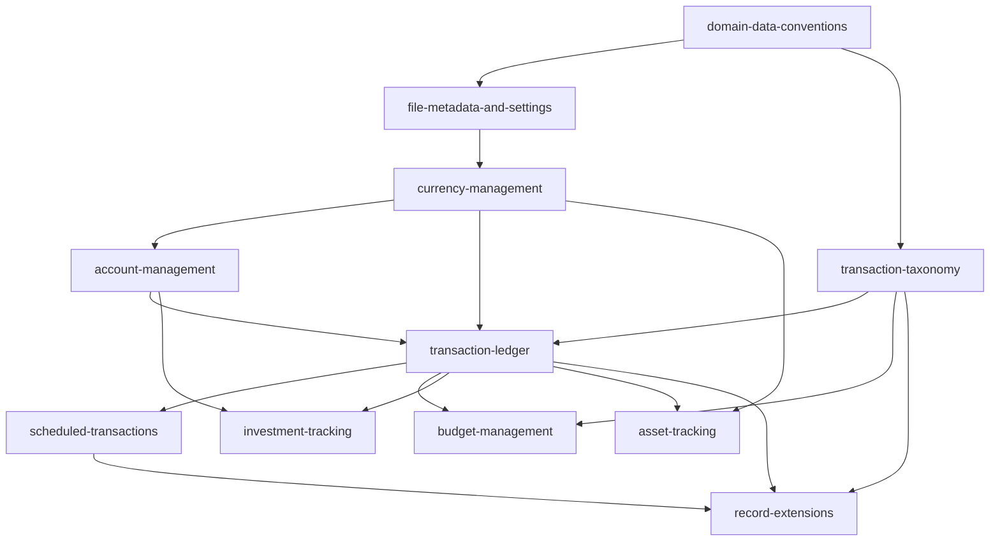

# Domain Model Baseline — Design

**Change**: `domain-model-baseline`
**Version**: 1.0.0
**Last Updated**: 2026-08-08

## Context

The upstream analysis (C++ source `mmex/moneymanagerex/src/`, DDL `mmex/database/tables.sql`, schema version 21) yields 25 tables whose referential integrity is almost entirely application-level: the only declared SQL foreign key is `TAGLINK_V1.TAGID → TAG_V1.TAGID`. Enumerations are persisted as English display strings enforced only in C++, and several DDL comments describing them are stale. The PWA implements no domain feature yet, but it already creates this schema verbatim from the vendored submodule and must keep producing files desktop MMEX can open. This change turns that analysis into normative capability specifications before any feature code exists.

## Goals / Non-Goals

**Goals**

- Partition the 25 tables into coherent, singly-owned domain capabilities with explicit boundaries.
- Make full bidirectional `.mmb` compatibility a normative, testable requirement with one authoritative home.
- Record every persisted vocabulary (types, statuses, encodings) normatively, so implementers never re-derive them from stale DDL comments.
- Keep every baseline requirement verifiable against the current implementation (AGENTS.md Verification Duty).

**Non-Goals**

- No feature mandates: nothing here obliges the application to ship a register, editor, or page.
- No schema evolution: the baseline forbids, rather than proposes, schema divergence.
- No coverage of the feature layers (reports, import/export, filters, dashboard) — deferred to future changes.

## Decisions

### D1: Extract a shared `domain-data-conventions` capability

Eight-plus rules cut across every domain: round-trip fidelity, the REFTYPE vocabulary, the `-1` sentinel, ISO-8601 text dates, NOCASE name uniqueness, English enum persistence, application-level referential integrity, and rowid-alias keys. Repeating them in eleven specs would guarantee drift. One capability owns them; every domain spec opens with a scoped Schema Fidelity requirement that cites the conventions instead of restating them. *Alternative considered*: a non-normative appendix — rejected because these rules must be individually testable (AGENTS.md quality gates).

### D2: One taxonomy capability, not three

Categories, payees, and tags exist solely to classify ledger rows and share one lifecycle (create, hide via `ACTIVE`, relocate/merge, delete-only-if-unused). Three micro-specs would triple governance overhead for ~3 requirements each. *Alternative considered*: separate specs per entity — rejected as reviewer overhead without a boundary benefit.

### D3: Investments and assets stay separate

Both sides use `TRANSLINK_V1` and a derived-cache write-back discipline, but the financial semantics share nothing: a moving-average cost book versus continuously compounded appreciation. The link *representation* (overloaded `TOACCOUNTID`, sentinels `32701`/`32702`) is owned by `transaction-ledger`; each linked domain owns its own side's arithmetic.

### D4: Attachments and custom fields merge into `record-extensions`

Both are polymorphic `(REFTYPE, REFID)` side-tables that decorate any core record and cascade on purge. Attachment **binary** storage is excluded — the desktop stores files in a folder beside the `.mmb`, which has no analogue under OPFS plus single-file Drive sync; the baseline governs row custody only (see Open Questions).

### D5: Data-model-first wording reconciles the Verification Duty

AGENTS.md demands a "perfect match between specifications and implementation". A baseline for unimplemented features squares with that as follows: custody/fidelity requirements are already satisfied by the current implementation (it creates the vendored schema unmodified and does not interpret domain tables); behavioral rules are phrased conditionally ("WHEN the application computes an account balance THEN it SHALL …"), which is vacuously satisfied until the feature exists and binding from its first commit; feature obligations are absent by design and arrive as ADDED requirements in later implementation changes. No requirement in this change asserts that a feature exists.

### D6: Round-trip fidelity lives in `domain-data-conventions`

The compatibility doctrine (schema v21, `DATAVERSION` `3`, no schema-object additions or removals, unknown-data custody, desktop↔PWA in both directions) is the headline requirement of the conventions capability. Each domain spec carries a one-requirement scoped echo naming its own tables, with that domain's concrete round-trip scenario. Boundary: `infrastructure-baseline` owns how the schema arrives (vendored provenance, migration mechanics); conventions owns what writers may do to the data.

### D7: All eleven capabilities in one change, implementation phased afterwards

Operator decision (2026-08-08): establish the whole baseline at once so boundaries are drawn coherently and reviewed together, accepting one large documentation review in exchange. Implementation follows per-domain in separate changes, each pairing its delta requirements with code, ordered by the dependency graph below.

### D8: UX divergence is escalated, never silently specified

Operator instruction (2026-08-08): where desktop UX does not suit a PWA, the operator decides the PWA UX. Baseline requirements are therefore worded UX-neutrally (obligations on data and outcomes, not on dialogs or timing tied to desktop idioms), and every known UX-entangled rule is listed in Open Questions below. Newly discovered ones are raised with the operator before the affected requirement is finalized.

## Dependency Graph

*Caption: Capability prerequisites (arrow points from prerequisite to dependent). The register's projection of future scheduled occurrences is specified inside `scheduled-transactions`, so the ledger never depends back on it.*

## Implementation Phase Order (for future changes)

| Phase | Future change delivers | Capabilities exercised |
|---|---|---|
| 0 | Application shell, home route, navigation governance | (new `app-shell-navigation` capability, out of this change) |
| 1 | File metadata and settings surfaces | `file-metadata-and-settings` |
| 2 | Currency management | `currency-management` |
| 3 | Accounts | `account-management` |
| 4 | Categories, payees, tags | `transaction-taxonomy` |
| 5 | Transaction register (largest; may split core vs trash/lock) | `transaction-ledger` |
| 6 | Scheduled transactions | `scheduled-transactions` |
| 7 | Budgets | `budget-management` |
| 8 | Custom fields; attachment metadata (storage gate first) | `record-extensions` |
| 9 | Stocks | `investment-tracking` |
| 10 | Assets | `asset-tracking` |

Investments and assets are late deliberately: they build on the ledger's linkage machinery and their cache write-back rules are the riskiest compatibility surface.

## Risk Assessment

| # | Risk | Likelihood | Impact | Mitigation |
|---|---|---|---|---|
| R1 | Attachment binaries do not fit single-file Drive sync (desktop keeps files in a folder beside the `.mmb`) | High | High | Resolved by operator decision (2026-08-08, Open Question 5): permanent read-only stance — metadata custody only, no binary management; risk retired |
| R2 | `REPORT_V1` Lua content cannot execute in the browser | Certain | Medium | Custody-only requirement: preserve rows, never execute; a future change may propose a governed runtime |
| R3 | Derived caches (`STOCK_V1` position fields, `ASSETS_V1.VALUE`): a reactive implementation that computes live but forgets to write back corrupts what desktop displays | Medium | High | Persist-on-recompute is normative in both specs |
| R4 | Enum-string drift: DDL comments are stale relative to the C++ enums | Medium | High | Specs enumerate persisted strings normatively; C++ model headers cited as authority |
| R5 | i18n trap: localized labels leak into persisted values | Medium | High | Dedicated conventions requirement with a locale-switch scenario |
| R6 | Purge-on-open mutates the file, triggering a sync upload from merely opening | Medium | Low | Cadence decided (2026-08-08, Open Question 1): after sync settles, at most once per calendar day; `cloud-file-sync` already debounces |
| R7 | Unbounded projection of infinite scheduled series | Medium | Medium | Bounded-horizon requirement in `scheduled-transactions` |
| R8 | New-database wizard seeding gap (does `initNewDb()` seed `DATAVERSION` `3` and a base currency pointer?) | Medium | Low | Read-only audit task in this change; any mismatch is reported to the operator, not silently fixed |

## Open Questions

### UX decisions (all seven resolved by the operator, 2026-08-08, per D8)

1. **Purge-on-open and auto-execute-on-open** — desktop runs trash purge and scheduled auto-execution at file open; a PWA opens the database every session and may race Drive sync.
   **Resolved (2026-08-08)**: run after the database is ready and synchronization has settled (first sync completed, or no binding exists), at most once per calendar day, tracking the last-run date. Never on every page load.
2. **Scheduled-transaction entry prompts** — desktop pops "enter payment" dialogs at startup (`Manual` auto-execute mode).
   **Resolved (2026-08-08)**: in-app banner plus a navigation badge counting due items; tapping through leads to the schedule surface for per-item confirmation. No modal dialog sequence.
3. **Register scoping and navigation** — desktop uses tree-navigation virtual selectors (all/trash/favorites/by-type).
   **Resolved (2026-08-08)**: URL-routed scopes (for example `/accounts/:id`, `/transactions`, `/trash`) with sidebar navigation synchronized to the URL; every scope is deep-linkable.
4. **UDFC register columns** — custom fields promoted into five desktop grid columns.
   **Resolved (2026-08-08)**: not columnized in the PWA. Custom fields surface in transaction detail and edit forms only; UDFC slot assignments remain custody-only data.
5. **Attachment storage and UX** — see R1.
   **Resolved (2026-08-08)**: read-only stance. The PWA never manages attachment binaries; it displays and edits metadata rows only. This is the permanent baseline position — revisiting it requires a new change (which would also touch `cloud-file-sync`); no such change is planned.
6. **Editing surfaces** — desktop's modal transaction dialog, inline calculator, and frequent-notes picker are idioms, not obligations.
   **Resolved (2026-08-08)**: responsive hybrid — dialog presentation at desktop width, maximized full-page presentation on mobile; feature parity (dual amounts, splits, frequent notes) without cloning the desktop layout.
7. **Home dashboard** — deferred with the feature layers; PWA home UX is a blank slate.
   **Resolved (2026-08-08)**: a concise summary-card home (account groups with balances, net worth, upcoming scheduled items), mobile-first, extended progressively as phases land. No wholesale port of the desktop widget set.

### Other (still open)

8. Whether the future `transaction-ledger` implementation splits into two changes (core vs trash/statement-lock).
9. Whether phases 1 and 2 merge into one implementation change.
