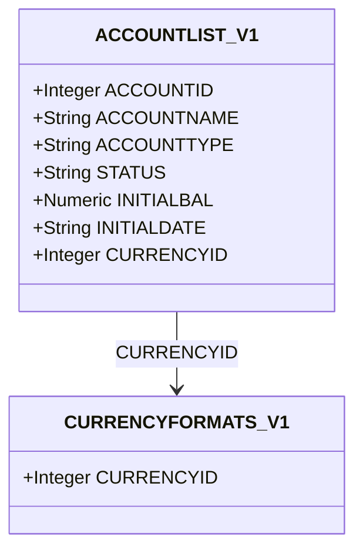

# Account Management — Delta: New Capability

**Change**: `domain-model-baseline`
**Capability**: `account-management`
**Version**: 1.0.0
**Last Updated**: 2026-08-08

**Scope**: Account records (`ACCOUNTLIST_V1`): the eight account types, status, currency binding, initial balance, the account balance definition, statement-lock and credit/loan fields, and deletion cascades. Non-scope: the transaction flow function and statement-lock enforcement (`transaction-ledger`); investment valuation (`investment-tracking`); asset valuation (`asset-tracking`). All rules inherit `domain-data-conventions`.

## ADDED Requirements

### Requirement: Schema Fidelity for the Account Table

The application SHALL persist `ACCOUNTLIST_V1` in conformance with `domain-data-conventions`.

- Account names SHALL be unique case-insensitively.
- `FAVORITEACCT` SHALL be persisted as the text `TRUE` or `FALSE`.

Traceability: [mmex/database/tables.sql](../../../mmex/database/tables.sql), [mmex/moneymanagerex/src/model/Model_Account.h](../../../mmex/moneymanagerex/src/model/Model_Account.h).

#### Scenario: Account rows round-trip

- **WHEN** a desktop-created database with accounts of every type is opened and persisted
- **THEN** all account rows the user did not edit SHALL be unchanged

### Requirement: Account Types

The application SHALL persist the account type as exactly one of the upstream strings: `Cash`, `Checking`, `Credit Card`, `Loan`, `Term`, `Investment`, `Asset`, `Shares`.

- The upstream C++ enum order differs from the DDL comment order; the C++ header is authoritative for any ordinal use.
- The type determines which domain an account participates in: `Investment` and `Shares` accounts host stock positions (`investment-tracking`); all types participate in the ledger.

*Caption: The account record and its sole outbound reference — every account is denominated in one currency.*

Traceability: [mmex/moneymanagerex/src/model/Model_Account.h](../../../mmex/moneymanagerex/src/model/Model_Account.h).

#### Scenario: Type strings persist verbatim

- **WHEN** the user creates a credit-card account
- **THEN** the persisted `ACCOUNTTYPE` SHALL be exactly `Credit Card`

### Requirement: Account Status

The application SHALL persist account status as exactly `Open` or `Closed`, and SHALL treat an unrecognized stored status as `Closed` when reading.

Traceability: [mmex/moneymanagerex/src/model/Model_Account.h](../../../mmex/moneymanagerex/src/model/Model_Account.h).

#### Scenario: Unknown status reads as closed

- **WHEN** the application reads an account whose status column holds an unrecognized value
- **THEN** the account SHALL be treated as `Closed` without rewriting the stored value

### Requirement: Currency Binding

Every account SHALL reference a currency, and amounts on an account SHALL be interpreted in that currency.

Traceability: [mmex/database/tables.sql](../../../mmex/database/tables.sql).

#### Scenario: Account creation requires a currency

- **WHEN** the user creates an account
- **THEN** the persisted row SHALL reference an existing `CURRENCYFORMATS_V1` row

### Requirement: Account Balance Definition

When the application computes an account's balance, it SHALL compute `INITIALBAL` plus the sum of the account flow of every transaction touching the account, where the flow function is defined by `transaction-ledger`.

- `INITIALDATE` records the account's opening date; computations bounded by date SHALL NOT include transactions before it is meaningful to do so per the consuming feature.
- For `Investment` and `Shares` accounts, market and invested values are additionally defined by `investment-tracking`.

Traceability: [mmex/moneymanagerex/src/model/Model_Account.cpp](../../../mmex/moneymanagerex/src/model/Model_Account.cpp) (`balance`).

#### Scenario: Balance is initial balance plus flows

- **WHEN** the application computes the balance of an account with initial balance `100` and transactions whose flows sum to `-30`
- **THEN** the reported balance SHALL be `70`

### Requirement: Statement Lock Declaration

The application SHALL persist the statement-lock fields (`STATEMENTLOCKED`, `STATEMENTDATE`) with upstream semantics: when locked, transactions on the account dated on or before the statement date are read-only.

- Enforcement of the read-only rule on ledger rows is owned by `transaction-ledger`.

Traceability: [mmex/moneymanagerex/src/model/Model_Account.h](../../../mmex/moneymanagerex/src/model/Model_Account.h).

#### Scenario: Lock fields round-trip

- **WHEN** a desktop-created database contains an account with a statement lock
- **THEN** the lock state and date SHALL be preserved and honored by any editing feature

### Requirement: Credit and Loan Fields

The application SHALL persist the credit/loan planning fields (`CREDITLIMIT`, `MINIMUMBALANCE`, `INTERESTRATE`, `PAYMENTDUEDATE`, `MINIMUMPAYMENT`) with upstream meaning.

- `MINIMUMBALANCE` and `CREDITLIMIT` feed the scheduled-transaction execution guard defined in `scheduled-transactions`.

Traceability: [mmex/database/incremental_upgrade/database_version_7.sql](../../../mmex/database/incremental_upgrade/database_version_7.sql) (introduction of these columns).

#### Scenario: Planning fields are preserved and editable

- **WHEN** the user edits an account's credit limit
- **THEN** only that field SHALL change and all other planning fields SHALL be preserved

### Requirement: Account Deletion Cascade

When the application deletes an account, it SHALL cascade per the owning capabilities: the account's transactions (including their splits and polymorphic rows), its scheduled transactions, and its stock positions are removed in the same logical operation.

Traceability: [mmex/moneymanagerex/src/model/Model_Account.cpp](../../../mmex/moneymanagerex/src/model/Model_Account.cpp) (`remove`).

#### Scenario: Deleting an account leaves no orphans

- **WHEN** the user deletes an account that has transactions, scheduled transactions, and stock positions
- **THEN** all of those dependent records SHALL be removed
- **AND** no reference to the deleted account SHALL remain in any owned table
