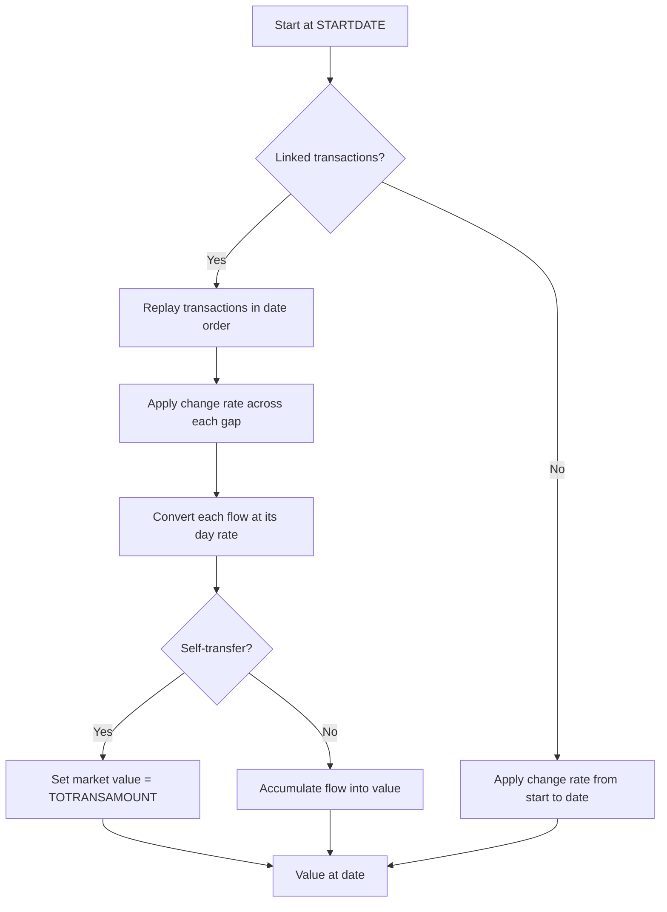

# Asset Tracking — Delta: New Capability

**Change**: `domain-model-baseline`
**Capability**: `asset-tracking`
**Version**: 1.0.0
**Last Updated**: 2026-08-08

**Scope**: Non-financial assets (`ASSETS_V1`) and the asset side of `TRANSLINK_V1`: classification, appreciation/depreciation, valuation with and without linked transactions, and the asset value cache. Non-scope: ledger row semantics and link representation (`transaction-ledger`); the stock side of `TRANSLINK_V1` (`investment-tracking`). All rules inherit `domain-data-conventions`.

## ADDED Requirements

### Requirement: Schema Fidelity for the Asset Table

The application SHALL persist `ASSETS_V1` and asset-side `TRANSLINK_V1` rows in conformance with `domain-data-conventions`.

- Asset-side `TRANSLINK_V1` rows SHALL carry `LINKTYPE` exactly `Asset`.
- `ASSETSTATUS` ordinals are reversed relative to accounts (`Closed` = 0, `Open` = 1); any ordinal use SHALL follow the asset model's own order.
- `VALUECHANGEMODE` (`Percentage`, `Linear`) SHALL be persisted verbatim; current upstream valuation does not branch on it, and this application SHALL NOT invent divergent semantics for it.

Traceability: [mmex/database/tables.sql](../../../mmex/database/tables.sql), [mmex/moneymanagerex/src/model/Model_Asset.h](../../../mmex/moneymanagerex/src/model/Model_Asset.h).

#### Scenario: Asset rows round-trip

- **WHEN** a desktop-created database with assets of several types and linked transactions is opened and persisted
- **THEN** all asset rows the user did not edit SHALL be unchanged

### Requirement: Asset Classification

The application SHALL persist the asset type as exactly one of the upstream strings (`Property`, `Automobile`, `Household Object`, `Art`, `Jewellery`, `Cash`, `Other`) and the status as `Open` or `Closed`.

Traceability: [mmex/moneymanagerex/src/model/Model_Asset.h](../../../mmex/moneymanagerex/src/model/Model_Asset.h).

#### Scenario: Type strings persist verbatim

- **WHEN** the user records a household object asset
- **THEN** the persisted `ASSETTYPE` SHALL be exactly `Household Object`

### Requirement: Appreciation and Depreciation

When the application projects an asset's value over time, it SHALL apply the configured change (`None`, `Appreciates`, `Depreciates`) using the annual percentage rate compounded continuously by day: the value is multiplied by `exp(±(rate / 36500) × days)`.

- `None` leaves the value constant between explicit events.
- The `ASSET_COMPOUNDING` file fact (default `Day`) SHALL be preserved per `file-metadata-and-settings`.

Traceability: [mmex/moneymanagerex/src/model/Model_Asset.cpp](../../../mmex/moneymanagerex/src/model/Model_Asset.cpp) (`valueAtDate`).

#### Scenario: Depreciation shrinks value over elapsed days

- **WHEN** the application values a depreciating asset some days after its start date with no linked transactions
- **THEN** the market value SHALL equal the recorded value multiplied by `exp(-(rate / 36500) × days)`

### Requirement: Asset Valuation

When the application values an asset at a date, it SHALL follow the upstream replay algorithm.

- Dates before the asset's start date value to zero.
- Without linked transactions, both cost and market value start at the recorded `VALUE` and the change rate applies from the start date to the requested date.
- With linked transactions, the application SHALL replay them in date order (skipping soft-deleted rows), applying the change rate across the gaps between transaction dates, converting each transaction at its date's rate per `currency-management`; a self-transfer on the asset account sets the market value outright — an explicit revaluation.
- Asset values are expressed in the base currency.

*Caption: Valuing an asset at a date — replay linked history, compound across gaps, honor explicit revaluations.*

Traceability: [mmex/moneymanagerex/src/model/Model_Asset.cpp](../../../mmex/moneymanagerex/src/model/Model_Asset.cpp) (`valueAtDate`).

#### Scenario: Self-transfer revalues outright

- **WHEN** an asset's linked history contains a self-transfer with destination amount `50000`
- **THEN** the market value at that date SHALL be `50000` regardless of the prior computed value

#### Scenario: Value before start date is zero

- **WHEN** the application values an asset at a date before its start date
- **THEN** both cost and market value SHALL be zero

### Requirement: Asset Value Cache Write-Back

The application SHALL recompute and **persist** `ASSETS_V1.VALUE` whenever a linked transaction is created, edited, deleted, restored, or purged: the signed sum of linked non-deleted, non-void transactions (a withdrawal from the paying account increases the asset's value, a deposit decreases it), each converted at its date's rate.

- Persisting is mandatory even when values are computed reactively — desktop MoneyManagerEx reads the cached column.

Traceability: [mmex/moneymanagerex/src/model/Model_Translink.cpp](../../../mmex/moneymanagerex/src/model/Model_Translink.cpp) (`UpdateAssetValue`).

#### Scenario: Restoring a linked transaction refreshes the cache

- **WHEN** the user restores a trashed transaction linked to an asset
- **THEN** `ASSETS_V1.VALUE` SHALL be recomputed and written in the same logical operation
