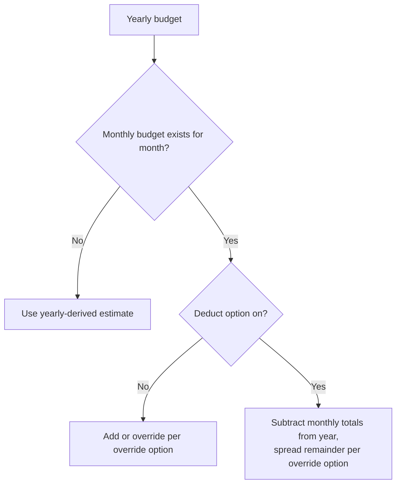

# Budget Management — Delta: New Capability

**Change**: `domain-model-baseline`
**Capability**: `budget-management`
**Version**: 1.0.0
**Last Updated**: 2026-08-08

**Scope**: Budget period containers (`BUDGETYEAR_V1`) and per-category budget entries (`BUDGETTABLE_V1`): period naming, entry periods with annualization, the yearly/monthly overlay computation, actuals joining, and period copying. Non-scope: `BUDGETSPLITTRANSACTIONS_V1`, which despite its name belongs to `scheduled-transactions` and SHALL NOT be read or written as budget data; budget performance reports (future). All rules inherit `domain-data-conventions`.

## ADDED Requirements

### Requirement: Schema Fidelity for Budget Tables

The application SHALL persist `BUDGETYEAR_V1` and `BUDGETTABLE_V1` in conformance with `domain-data-conventions`, with case-insensitively unique period names and the `ACTIVE` flag on entries.

Traceability: [mmex/database/tables.sql](../../../mmex/database/tables.sql), [mmex/moneymanagerex/src/model/Model_Budget.h](../../../mmex/moneymanagerex/src/model/Model_Budget.h).

#### Scenario: Budget rows round-trip

- **WHEN** a desktop-created database with yearly and monthly budgets is opened and persisted
- **THEN** all budget rows the user did not edit SHALL be unchanged

### Requirement: Budget Period Naming

The application SHALL distinguish yearly from monthly budget periods by the period name's form: a four-character name (`2025`) is yearly; a longer name (`2025-03`) is monthly.

- This name-length convention is load-bearing upstream logic and SHALL be preserved; the application SHALL create names only in these two forms.

Traceability: [mmex/moneymanagerex/src/model/Model_Budget.cpp](../../../mmex/moneymanagerex/src/model/Model_Budget.cpp) (`copyBudgetYear`).

#### Scenario: Name form determines period kind

- **WHEN** the application reads a budget period named `2024-11`
- **THEN** it SHALL be treated as the monthly budget for November 2024

### Requirement: Budget Entry Periods and Annualization

The application SHALL persist each budget entry's `PERIOD` as exactly one of the nine upstream strings and SHALL annualize amounts by the fixed factors: `None` ×0, `Weekly` ×52, `Fortnightly` ×26, `Monthly` ×12, `Every 2 Months` ×6, `Quarterly` ×4, `Half-Yearly` ×2, `Yearly` ×1, `Daily` ×365.

- A monthly estimate is the annualized amount divided by twelve.
- The DDL comment's period list (`Bi-Weekly`, `Bi-Monthly`) is stale; the C++ period name table is authoritative, and an unrecognized stored string parses as `None` per the upstream fallback.

Traceability: [mmex/moneymanagerex/src/model/Model_Budget.h](../../../mmex/moneymanagerex/src/model/Model_Budget.h), [mmex/moneymanagerex/src/model/Model_Budget.cpp](../../../mmex/moneymanagerex/src/model/Model_Budget.cpp) (`getEstimate`).

#### Scenario: Weekly entry annualizes by 52

- **WHEN** a category's budget entry is `Weekly` with amount `10`
- **THEN** its yearly estimate SHALL be `520` and its monthly estimate SHALL be `520 / 12`

### Requirement: Yearly and Monthly Overlay Computation

When the application computes budget figures for a year, it SHALL combine the yearly budget with any monthly budgets by the upstream overlay algorithm, honoring the two file options.

- Baseline: each category's yearly entry contributes a monthly estimate to every month, and the yearly total to the year.
- Each existing monthly budget overrides or adds to its month according to the options: with the deduct option on, explicitly budgeted monthly totals are subtracted from the yearly figure and the remainder is spread over the remaining months (all twelve, or only unbudgeted months when the override option is also on); with the deduct option off, the flat monthly estimate applies to every month, or only to unbudgeted months under the override option.

*Caption: Combining yearly and monthly budgets for one category and month.*

Traceability: [mmex/moneymanagerex/src/model/Model_Budget.cpp](../../../mmex/moneymanagerex/src/model/Model_Budget.cpp) (`getBudgetStats`).

#### Scenario: Monthly budget overrides its month

- **WHEN** the deduct and override options are on and March has an explicit monthly budget for a category
- **THEN** March SHALL use the monthly figure
- **AND** the yearly remainder SHALL be spread only over months without an explicit monthly budget

### Requirement: Actuals Join

When the application compares budget to actuals, it SHALL derive actuals by category from the ledger, honoring the ledger's exclusion rules (void, soft-deleted) and the file's reporting-calendar settings.

- There is no stored relationship between budgets and transactions; the join key is the category alone.

Traceability: [mmex/moneymanagerex/src/model/Model_Category.cpp](../../../mmex/moneymanagerex/src/model/Model_Category.cpp) (`getCategoryStats`).

#### Scenario: Voided spending leaves actuals

- **WHEN** a transaction contributing to a budgeted category's actuals is voided
- **THEN** the category's actuals SHALL decrease by that transaction's amount

### Requirement: Budget Period Copying

When the user creates a budget period from an existing one, the application SHALL clone the source's entries; creating a monthly budget from a yearly one under the deduct option SHALL convert each line to `Monthly` with the remaining yearly amount spread over the unbudgeted months.

Traceability: [mmex/moneymanagerex/src/model/Model_Budget.cpp](../../../mmex/moneymanagerex/src/model/Model_Budget.cpp) (`copyBudgetYear`).

#### Scenario: Copying a year clones its entries

- **WHEN** the user creates budget period `2027` copied from `2026`
- **THEN** every `2026` entry SHALL exist in `2027` with the same category, period, and amount
