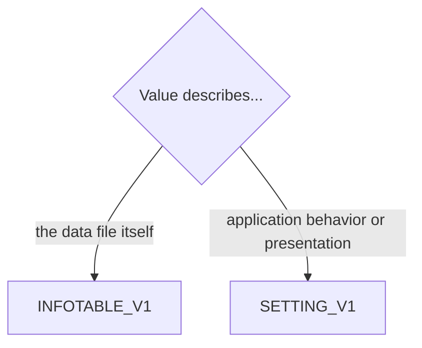

# File Metadata and Settings — Delta: New Capability

**Change**: `domain-model-baseline`
**Capability**: `file-metadata-and-settings`
**Version**: 1.0.0
**Last Updated**: 2026-08-08

**Scope**: Semantics of the two key-value stores — `INFOTABLE_V1` (facts about this data file) and `SETTING_V1` (application/user preferences) — and custody-only handling of `REPORT_V1` (user-authored report definitions) and `USAGE_V1` (telemetry). Non-scope: the meaning of individual keys consumed by other capabilities (for example rate-history behavior belongs to `currency-management`, retention purge behavior to `transaction-ledger`); the saved-filter preset language; report execution. Persistence mechanics are governed by `infrastructure-baseline`; all rules here inherit `domain-data-conventions`.

## ADDED Requirements

### Requirement: Schema Fidelity for Metadata Tables

The application SHALL persist `INFOTABLE_V1`, `SETTING_V1`, `REPORT_V1`, and `USAGE_V1` in conformance with `domain-data-conventions`, with key names unique case-insensitively.

Traceability: [mmex/database/tables.sql](../../../mmex/database/tables.sql), [mmex/moneymanagerex/src/model/Model_Infotable.h](../../../mmex/moneymanagerex/src/model/Model_Infotable.h), [mmex/moneymanagerex/src/model/Model_Setting.h](../../../mmex/moneymanagerex/src/model/Model_Setting.h).

#### Scenario: Metadata tables round-trip

- **WHEN** a desktop-created database with populated metadata tables is opened and persisted by the application
- **THEN** every row the application did not deliberately change SHALL be preserved verbatim

### Requirement: Store Separation

The application SHALL place a value in `INFOTABLE_V1` when it describes this data file, and in `SETTING_V1` when it describes application behavior or presentation, matching the upstream split.

- File facts include: `DATAVERSION`, `BASECURRENCYID`, `USECURRENCYHISTORY`, `DATEFORMAT`, `USERNAME`, financial-year start keys, and saved filter presets.
- Application/user preferences include: theme and view toggles, transaction entry defaults, and `DELETED_TRANS_RETAIN_DAYS` (default `30`).
- The application SHALL NOT move a key between stores or invent a new store.

*Caption: Placement rule for key-value data — file facts versus preferences.*

Traceability: [mmex/moneymanagerex/src/option.h](../../../mmex/moneymanagerex/src/option.h) (authoritative inventory of which key lives in which store).

#### Scenario: A file fact lands in the info table

- **WHEN** the application records which currency is the base currency
- **THEN** the value SHALL be stored under `BASECURRENCYID` in `INFOTABLE_V1`, not in `SETTING_V1`

#### Scenario: A preference lands in the settings table

- **WHEN** the application records a user preference that does not describe the data file
- **THEN** the value SHALL be stored in `SETTING_V1`

### Requirement: Unknown Key Preservation

The application SHALL preserve any `INFONAME` or `SETTINGNAME` key it does not recognize, including keys written by desktop MoneyManagerEx for features this application lacks.

Traceability: [mmex/moneymanagerex/src/model/Model_Infotable.h](../../../mmex/moneymanagerex/src/model/Model_Infotable.h).

#### Scenario: Desktop-only keys survive

- **WHEN** the application opens a database containing desktop-only keys (for example attachment folder paths or dialog geometry) and later persists it
- **THEN** those rows SHALL remain unchanged

### Requirement: Well-Known File Facts

When the application creates a database or maintains file facts, it SHALL honor the upstream well-known keys.

- `DATAVERSION` SHALL be `3` for new databases and SHALL NOT be rewritten on open.
- `BASECURRENCYID` SHALL reference a row in `CURRENCYFORMATS_V1`; its consumption is governed by `currency-management`.
- `USERNAME`, `DATEFORMAT`, and financial-year start keys SHALL be read and written under their upstream names.

Traceability: [mmex/database/tables.sql](../../../mmex/database/tables.sql) (seed row `DATAVERSION` = `3`), [src/workers/sqlite.worker.ts](../../../src/workers/sqlite.worker.ts) (current reader of `INFOTABLE_V1`).

#### Scenario: New database seeds the well-known facts

- **WHEN** the application creates a new database with a chosen base currency and optional user name
- **THEN** `INFOTABLE_V1` SHALL contain `DATAVERSION` = `3`, a `BASECURRENCYID` referencing the chosen currency, and the user name when provided

### Requirement: Report Definitions Custody

The application SHALL preserve `REPORT_V1` rows (name, group, SQL, Lua, template, description, active flag) and SHALL NOT execute their SQL, Lua, or template content.

- Execution of user-authored reports is out of scope for this baseline; any future execution engine requires its own change.

Traceability: [mmex/moneymanagerex/src/model/Model_Report.h](../../../mmex/moneymanagerex/src/model/Model_Report.h).

#### Scenario: Report rows are preserved, never run

- **WHEN** the application opens a database containing user-authored report definitions
- **THEN** the rows SHALL round-trip unchanged
- **AND** no report content SHALL be executed

### Requirement: Usage Telemetry Custody

The application SHALL preserve existing `USAGE_V1` rows and SHALL NOT append to or transmit them.

Traceability: [mmex/moneymanagerex/src/model/Model_Usage.h](../../../mmex/moneymanagerex/src/model/Model_Usage.h).

#### Scenario: No telemetry is written

- **WHEN** the application is used for any duration against a database containing desktop telemetry rows
- **THEN** `USAGE_V1` SHALL contain exactly the rows it started with
