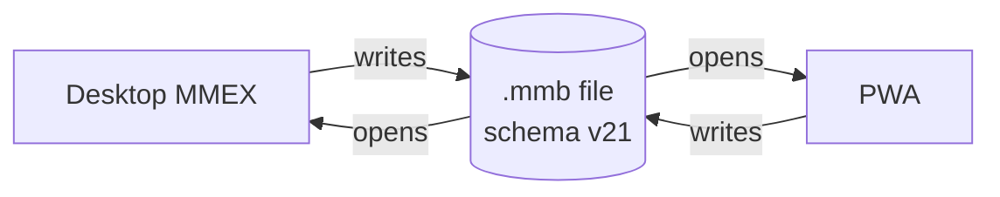

# Domain Data Conventions — Delta: Seed Normalization

**Change**: `fix-new-database-seeding`
**Capability**: `domain-data-conventions`
**Version**: 1.1.0
**Last Updated**: 2026-08-08

**Scope**: Adds the seed-normalization clause to the round-trip fidelity requirement: a newly created database's seed rows must match the desktop-generated form, with the DDL's translation markers stripped at creation. No other requirement changes.

## MODIFIED Requirements

### Requirement: MMB Round-Trip Fidelity

The application SHALL read and write the MoneyManagerEx `.mmb` SQLite database file such that the same file remains fully usable by desktop MoneyManagerEx and by this application, in both directions, without data loss.

- The database SHALL conform to upstream schema version 21 as reported by `PRAGMA user_version`, and new databases SHALL carry the `INFOTABLE_V1` row `INFONAME = 'DATAVERSION'` with value `3`.
- The application SHALL NOT create, drop, or alter any schema object (table, column, index, trigger, view, foreign key, or CHECK constraint) beyond what the vendored upstream DDL and incremental migrations define.
- A database created by this application SHALL be schema-identical to one created by desktop MoneyManagerEx at the same schema version.
- Seed rows of a newly created database SHALL match the desktop-generated form: the vendored DDL's `_tr_` translation markers SHALL be stripped from seeded values at creation, mirroring the upstream generator (`util/sqlite2cpp.py`).

*Caption: One file, two writers — fidelity means neither writer ever produces a file the other cannot fully use.*

Traceability: [mmex/database/tables.sql](../../../mmex/database/tables.sql) (authoritative DDL), [mmex/moneymanagerex/util/sqlite2cpp.py](../../../mmex/moneymanagerex/util/sqlite2cpp.py) (upstream marker stripping), [src/workers/sqlite.worker.ts](../../../src/workers/sqlite.worker.ts) (schema creation and migration from the vendored sources).

#### Scenario: Desktop file opens and returns unchanged in structure

- **WHEN** the application opens a database created by desktop MoneyManagerEx at schema version 21 and later persists it
- **THEN** the file SHALL still report `PRAGMA user_version` 21 and contain exactly the upstream schema objects
- **AND** desktop MoneyManagerEx SHALL be able to open it with all data intact

#### Scenario: New database matches upstream seeding

- **WHEN** the application creates a new database
- **THEN** the database SHALL contain the upstream schema and seed rows with translation markers stripped (for example category `Bills`, never `_tr_Bills`)
- **AND** `INFOTABLE_V1` SHALL contain `DATAVERSION` = `3`
