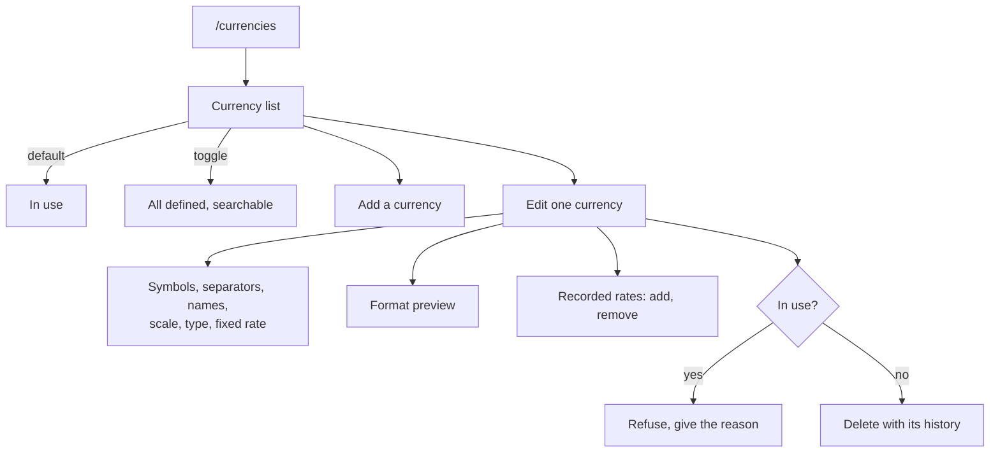

# Currency Management Surfaces — Design

**Change**: `currency-management-surfaces`
**Version**: 1.0.0
**Last Updated**: 2026-08-09

## Context

The domain layer covers this capability completely: [src/domain/repos/currency.ts](../../../src/domain/repos/currency.ts) reads and writes definitions and history, guards deletion behind `isInUse`, and resolves a day rate; [src/domain/rules/currency.ts](../../../src/domain/rules/currency.ts) derives precision from scale, formats and parses amounts, and implements the resolver including its earlier-row tie rule. Phase 1 exposed the toggle that decides whether history is consulted at all. What is missing is any way to see or change a currency — which is why the toggle currently has no observable effect.

## Goals / Non-Goals

**Goals**: the currencies a file actually uses are visible and correctable; conversion rates can be set, both fixed and per date; the formatting fields are editable with their effect visible.

**Non-Goals**: online rate retrieval; changing the base currency; assigning currencies to accounts; any conversion display outside this surface, which arrives with the phases that have amounts to convert.

## Decisions

### D1: The default list is what the file uses, not what it defines

A file carries 168 seeded currencies and typically uses one or two. Listing everything by default would bury them, so the surface lists the used set — referenced by an account or asset, plus the base currency — and offers the full set behind a toggle with search. This matches upstream's own used-only filter (operator decision 2026-08-09). *Alternative considered*: list all 168 with search only — rejected because the first thing a user sees would be almost entirely irrelevant.

### D2: Rate history is in scope, because otherwise Phase 1 shipped a dead switch

Nothing else can populate `CURRENCYHISTORY_V1`, and online retrieval is long-lived non-scope. Without manual entry the rate-history setting can be turned on and change nothing, which reads as a defect. Rates recorded here carry the manual update type, leaving the online marker free for a future source to use.

### D3: Editing is per currency, in a dialog over the list

The list is the surface's spine; editing one currency is a focused task that should not lose it. This is the responsive-hybrid presentation the operator settled on for editing — dialog at desktop width, full-page on mobile — applied where it fits naturally.

### D4: The base currency is read-only here, and its rate is pinned

The base currency's fixed rate is definitionally one, and the resolver already short-circuits it, so presenting an editable rate would invite a value that means nothing. Changing which currency is base stays in settings, where the consequence is already stated and confirmed — two entry points would mean two confirmation paths to keep in step.

### D5: The preview is part of the editor, not a separate feature

Scale and separators are hard to reason about abstractly: the difference between a scale of one hundred and one is invisible until an amount is rendered. Showing a representative amount as the fields change turns the precision rule into something the user can see, and costs one call into a rule function that already exists.

### D6: The surface reads through the repositories on entry

Same reasoning as the settings surface: synchronization can replace the file underneath the application, so a snapshot cached earlier can disagree with what is stored. Writes go through the repositories, which already emit atomic statements.

## Surface Structure

*Caption: One list, one editor, with history and deletion attached to the currency being edited.*

## Risk Assessment

| # | Risk | Likelihood | Impact | Mitigation |
|---|---|---|---|---|
| R1 | A user records rates while the history setting is off and sees no effect | High | Medium | The surface states that recorded rates are inactive while the setting is off, rather than letting the silence look like a bug |
| R2 | Editing separators or scale corrupts how existing amounts display | Medium | Medium | Formatting is presentation only — stored amounts are untouched — and the preview shows the effect before saving |
| R3 | The used-only default hides a currency the user is looking for | Medium | Low | The full set is one toggle away and searchable; D1 accepts this trade deliberately |
| R4 | A fixed rate edited on the base currency would be meaningless | Low | Medium | D4 pins it to one and makes it read-only |
| R5 | Deleting a currency silently discards its recorded rates | Low | Medium | The capability already requires the cascade; the surface states it before deleting |

## Open Questions

- None. The three decisions this phase turned on — whether history editing is in scope, how the list is scoped, and where the base currency changes — were resolved by the operator on 2026-08-09 and are recorded above.
