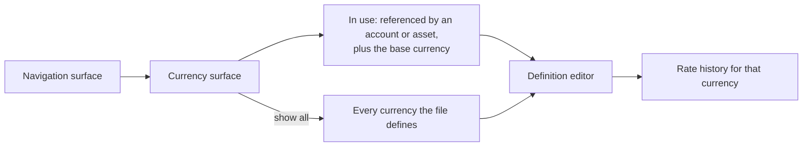

# Currency Management — Delta: Management Surfaces

**Change**: `currency-management-surfaces`
**Capability**: `currency-management`
**Version**: 1.1.0
**Last Updated**: 2026-08-09

**Scope**: Adds the user-facing half of this capability — the currency surface and its route, editing and adding definitions, the format preview, exchange-rate history management, base-currency indication, and deletion from the surface. The definition, precision, day-rate resolution and deletion rules already in force are unchanged and constrain everything here. Non-scope: fetching rates from an online source; changing the base currency, which `file-metadata-and-settings` owns; assigning a currency to an account, which `account-management` owns.

## ADDED Requirements

### Requirement: Currency Management Surface

The application SHALL provide a currency surface at its own route, reachable from the navigation surface, listing by default only the currencies this file uses and offering a way to reach the rest.

- A currency counts as used when an account or an asset references it, or when it is the base currency.
- The surface SHALL offer a way to show every currency the file defines, and to search that set by name or symbol.
- The route SHALL be declared by this capability, per the route registry rule `app-shell-navigation` establishes, and SHALL be subject to the database-readiness guard.

*Caption: The short list is the default; the full set stays one step away.*

Traceability: [src/pages/](../../../src/pages/), [src/router/index.ts](../../../src/router/index.ts), [src/domain/repos/currency.ts](../../../src/domain/repos/currency.ts).

#### Scenario: Only the currencies in use are listed by default

- **WHEN** the user opens the currency surface on a file where one currency is referenced by an account and another is the base currency
- **THEN** those two SHALL be listed
- **AND** currencies nothing references SHALL NOT be listed until the user asks to see all

#### Scenario: The full set is reachable and searchable

- **WHEN** the user chooses to show all currencies and searches by name or symbol
- **THEN** the matching currencies SHALL be listed regardless of whether anything references them

### Requirement: Editing and Adding Currency Definitions

The application SHALL let the user edit a currency's definition — prefix and suffix symbols, decimal and grouping separators, unit and cent names, scale, type, and fixed conversion rate — and SHALL let a new currency be added.

- Names and symbols SHALL remain unique case-insensitively, as the capability already requires; a conflicting edit or addition SHALL be refused with the reason.
- The type SHALL be persisted as exactly `Fiat` or `Crypto`.
- The base currency's fixed rate SHALL always be presented as `1` and SHALL NOT be editable, because every other rate is measured against it.

Traceability: [src/domain/repos/currency.ts](../../../src/domain/repos/currency.ts), [src/domain/rules/currency.ts](../../../src/domain/rules/currency.ts).

#### Scenario: A conflicting name is refused

- **WHEN** the user renames a currency to a name another currency already holds, in any letter case
- **THEN** the change SHALL be refused with the reason
- **AND** the stored definition SHALL be unchanged

#### Scenario: A currency outside the seeded set can be added

- **WHEN** the user adds a currency with a name and symbol nothing else uses
- **THEN** it SHALL be stored and available to be referenced

### Requirement: Format Preview

While a currency definition is being edited, the application SHALL show how a representative amount renders under the values currently entered.

- The preview SHALL reflect the scale, the separators and the symbols as edited, before anything is saved.
- Because precision follows the scale, changing the scale SHALL visibly change the number of decimal places shown.

Traceability: [src/domain/rules/currency.ts](../../../src/domain/rules/currency.ts).

#### Scenario: Changing the scale changes the preview

- **WHEN** the user changes a currency's scale from one hundred to one
- **THEN** the preview SHALL render the representative amount with no decimal places

### Requirement: Exchange Rate History Management

The application SHALL let the user record an exchange rate for a currency on a date, and remove a recorded rate.

- A rate SHALL be stored against the currency and the date, and recording a second rate for the same date SHALL replace the first rather than create a duplicate.
- Rates recorded this way SHALL be marked as manually recorded.
- History SHALL NOT be offered for the base currency, whose rate is always one.
- When the file's rate-history setting is off, the surface SHALL make clear that recorded rates are not being used, because conversion falls back to the fixed rate.

Traceability: [src/domain/repos/currency.ts](../../../src/domain/repos/currency.ts), [openspec/specs/file-metadata-and-settings/spec.md](../../../openspec/specs/file-metadata-and-settings/spec.md).

#### Scenario: A rate is recorded and used

- **WHEN** the user records a rate for a currency on a date and the file's rate-history setting is on
- **THEN** conversions for that date SHALL resolve to the recorded rate
- **AND** the rate SHALL be marked as manually recorded

#### Scenario: Recording twice for one date replaces rather than duplicates

- **WHEN** the user records a rate for a date that already has one
- **THEN** the stored rate for that date SHALL be the new value
- **AND** there SHALL be exactly one rate for that currency and date

#### Scenario: Recorded rates are shown as inactive while the setting is off

- **WHEN** the rate-history setting is off and the user views a currency's recorded rates
- **THEN** the surface SHALL indicate that they are not currently being used for conversion

### Requirement: Base Currency Indication

The currency surface SHALL show which currency is the base currency, and SHALL NOT offer to change it.

- Changing the base currency remains the responsibility of the settings surface, where the consequence is stated and confirmed.

Traceability: [openspec/specs/file-metadata-and-settings/spec.md](../../../openspec/specs/file-metadata-and-settings/spec.md).

#### Scenario: The base currency is identifiable but not changeable here

- **WHEN** the user views the currency surface
- **THEN** the base currency SHALL be distinguishable from the others
- **AND** the surface SHALL offer no control that changes which currency is the base

### Requirement: Currency Deletion From the Surface

The application SHALL offer to delete a currency only where the capability permits it, and SHALL explain the refusal otherwise.

- A currency referenced by an account or an asset, or serving as the base currency, SHALL NOT be deletable, and the reason SHALL be given.
- Deleting a currency SHALL remove its recorded rate history in the same operation, as the capability already requires.

Traceability: [src/domain/repos/currency.ts](../../../src/domain/repos/currency.ts).

#### Scenario: A currency in use cannot be deleted

- **WHEN** the user attempts to delete a currency an account references
- **THEN** the deletion SHALL be refused and the reason SHALL be given

#### Scenario: Deleting an unused currency takes its history

- **WHEN** the user deletes a currency nothing references
- **THEN** the currency and its recorded rates SHALL both be gone
