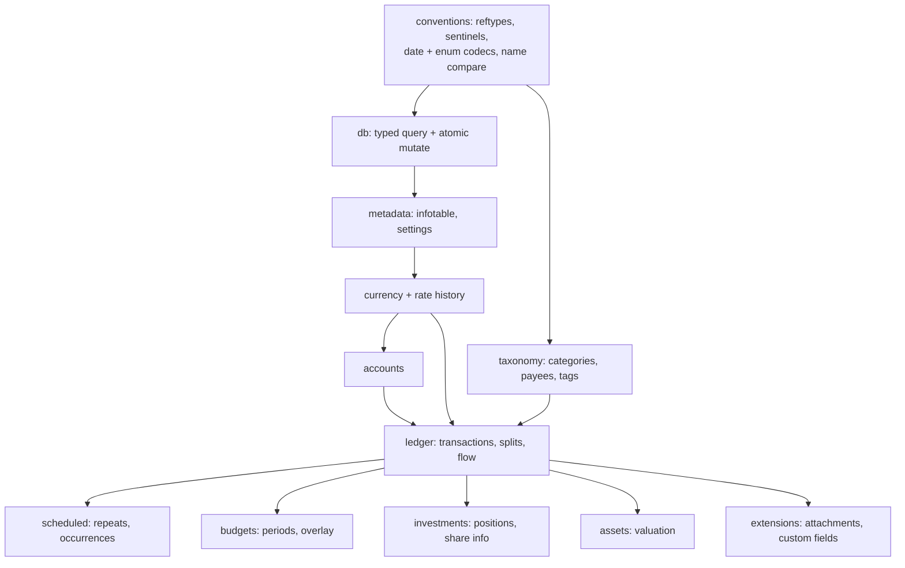

# Domain Data Layer — Design

**Change**: `domain-data-layer`
**Version**: 1.0.0
**Last Updated**: 2026-08-08

## Context

The archived baselines define what domain data means and how it must be computed, but the application reaches SQLite only through `dbClient.exec(sql, bind)`, which returns positional arrays. Building eleven capabilities' features on that primitive would scatter SQL, enum strings, and financial arithmetic across stores and components. This change inserts one typed layer between the worker client and everything above it.

## Goals / Non-Goals

**Goals**: typed records and repositories for all eleven capabilities; every financial rule implemented once as a pure, unit-testable function; conventions enforced centrally; multi-table operations atomic.

**Non-Goals**: any user interface, route, or Pinia store; reactivity or caching strategy (a later concern for feature changes); performance tuning beyond obvious indexed access.

## Decisions

### D1: Layer shape — records, repositories, rules

`src/domain/` holds one module per capability. Each exports: a `Record` type mirroring the table columns exactly (no renaming — round-trip fidelity is easier to audit when the type names the column), a repository object with query and mutation methods, and pure rule functions. Rules never touch the database: they take loaded records and return values or statement lists. *Alternative considered*: an ORM/active-record layer — rejected as a new dependency (the governed stack table would need amending) for a schema that must stay byte-compatible.

### D2: Read-then-emit-statements, applied atomically

Every multi-table operation is expressed as: query the records it needs, compute in TypeScript, emit a statement list, apply it in one transaction. This covers every operation the baselines require (cascading deletes, relocate/merge, occurrence execution, position and asset recomputation) without needing interactive transactions across the worker boundary, and it keeps the rule functions pure. *Alternative considered*: `BEGIN`/`COMMIT` issued as ordinary `exec` calls — rejected because nothing serializes concurrent callers on the single connection, and each such statement would also fire the sync mutation listener.

### D3: Two protocol additions, no infrastructure amendment

The worker gains an optional `rowMode` on `exec` (default unchanged, so existing callers are untouched) and an `exec-tx` message applying a statement list inside `db.transaction()`. The infrastructure baseline requires only that the main thread talk to the worker "exclusively through an asynchronous message-passing client that correlates requests to responses" — it enumerates no message types, so these additions need no delta.

### D4: Upstream C++ is the authority for arithmetic

Each rule cites the `Model_*.cpp` function it mirrors. Where the DDL comments and the C++ disagree (budget period names, account type order, REFTYPE strings), the C++ wins — as `domain-data-conventions` already requires. Deliberate fidelity details carried over: sells relieve the cost book at average cost; the asset change rate compounds continuously per day (`exp(±rate/36500 × days)`) regardless of the stored change mode; a self-transfer contributes zero flow but revalues an asset outright; rate ties favor the earlier history row.

### D5: Money stays in JavaScript numbers

Upstream stores amounts as SQLite `numeric` and computes in C++ `double`; matching that is what keeps derived caches byte-comparable with desktop. Currency `SCALE` drives display precision only. *Alternative considered*: a decimal library — rejected as a stack addition that would also diverge from desktop's rounding.

### D6: Dates as ISO strings, compared lexicographically

Timestamps are written combined (`YYYY-MM-DDTHH:MM:SS`) and parsed from either form, per the conventions. Because both forms are zero-padded ISO, ordering and range filtering work as string comparisons in SQL and in TypeScript — no timezone conversion is introduced anywhere, matching desktop's local-date semantics.

## Module Map

*Caption: Domain module dependencies — conventions and the typed database helper underpin every capability module.*

## Risk Assessment

| # | Risk | Likelihood | Impact | Mitigation |
|---|---|---|---|---|
| R1 | Floating-point drift makes derived caches differ from desktop's | Medium | Medium | Mirror the C++ operation order exactly in the cost-book and valuation walks; assert on realistic fixtures rather than exact long decimals |
| R2 | Statement lists grow large for wide cascades (deleting a busy account) | Low | Medium | Cascades emit set-based statements (`DELETE ... WHERE ... IN (SELECT ...)`) rather than one statement per row |
| R3 | A future feature bypasses the layer with raw SQL | Medium | Medium | The new capability makes the single access path normative; violations are reviewable |
| R4 | Object-row mode changes existing behavior | Low | High | The parameter is optional and defaults to today's array mode; existing tests guard it |
| R5 | Rule functions drift from upstream when the submodule is bumped | Low | Medium | Every rule cites its upstream function; submodule bumps already go through governed review |

## Open Questions

- None. The seven UX questions resolved on 2026-08-08 concern presentation and do not bind this layer; the phase-ordered feature changes consume their outcomes.
