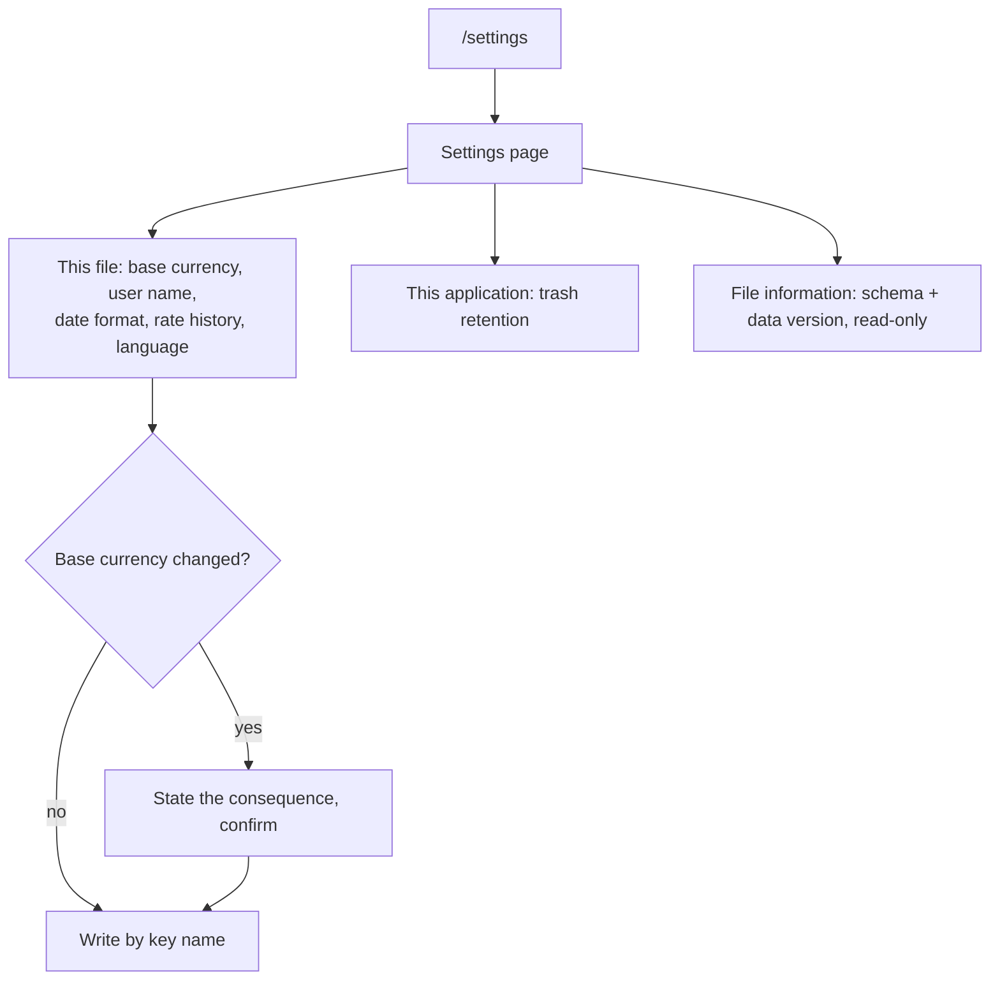

# File Metadata and Settings Surfaces — Design

**Change**: `file-metadata-and-settings-surfaces`
**Version**: 1.0.0
**Last Updated**: 2026-08-09

## Context

Everything below the surface exists already: `infoRepo`, `settingRepo` and `fileFacts` in [src/domain/repos/metadata.ts](../../../src/domain/repos/metadata.ts) read and write both stores by key name, and [src/domain/rules/metadata.ts](../../../src/domain/rules/metadata.ts) holds the key vocabulary, the placement rule and the upstream defaults. Phase 0 established how routes are declared and how the navigation surface is derived from them. What is missing is a page. This change is therefore small in mechanism and deliberate in scope: it decides which of the thirteen known keys are meaningful today, and leaves the rest to the phases that give them meaning.

## Goals / Non-Goals

**Goals**: a reachable, addressable settings surface; the file's own properties inspectable and editable; the base-currency change no longer silent; the locale choice remembered.

**Non-Goals**: settings whose features do not exist yet; theme or dark-mode selection; parity with the upstream options dialog; a home summary card — settings is not a financial summary, and the first card belongs to accounts in Phase 3.

## Decisions

### D1: Which keys this phase surfaces

Editable: base currency, user name, date format, use-currency-history, and the trash retention window. Read-only: schema version and data version. Deferred with their phases: budget deduct/override (Phase 7), share precision (Phase 9), asset compounding (Phase 10), financial-year start and budget days offset (Phase 7 and the reporting work that follows).

The test is whether the setting changes anything observable today. A budget option with no budgets is a control over nothing; presenting it would invite the user to configure behavior that does not exist. *Alternative considered*: surface all thirteen now, since the domain layer already types them — rejected for that reason (operator decision 2026-08-09).

### D2: A routed page, not a dialog

Settings gets `/settings` and a navigation entry. Phase 0's decision to make scopes URL-addressable applies directly, and a settings page is the web's own convention for this. The responsive-hybrid dialog decision the operator made on 2026-08-08 was about transaction editing, where a dialog keeps the register visible behind it; nothing here benefits from that.

### D3: Reads go to the database, not to a cached snapshot

The surface reads through the repositories on entry rather than trusting a store populated earlier. The database is a file that synchronization can replace underneath the application, so a cached copy can disagree with what is on disk. Writes go key by key through `infoRepo.setStatement` / `settingRepo.setStatement`, which is also what keeps unrecognized keys intact.

### D4: The base-currency warning is a confirmation, not a block

The operator chose to keep upstream's capability and add the warning. The dialog states the consequence in terms of what the user will see — figures converted against a different reference, including for past periods — rather than in terms of `BASECONVRATE`. It does not attempt to convert or migrate anything: upstream does not, and doing so would silently rewrite recorded amounts.

### D5: Locale is a file fact, with a session fallback

The operator chose upstream's placement, so `LOCALE` lives in `INFOTABLE_V1` and travels with the file through Drive synchronization. Two consequences are accepted deliberately: switching language writes to the database and therefore schedules a sync upload, and a device that syncs inherits the other device's language. The unavoidable wrinkle is that the shell's locale switcher is reachable on the initialization surface, where no database is open — so the choice applies to the session immediately and is flushed once the database reports ready.

### D6: An unsupported stored locale is tolerated, not corrected

A file written by a build with more locales must not lose its setting by being opened here. The application falls back for display and leaves the stored value alone, which is the same custody posture the capability already takes toward unknown keys.

## Surface Structure

*Caption: Grouping follows the store the value belongs to; only the base currency needs a gate.*

## Risk Assessment

| # | Risk | Likelihood | Impact | Mitigation |
|---|---|---|---|---|
| R1 | A form that saves everything at once rewrites keys the user never touched | Medium | High | Writes are per key through the repositories; a test asserts an unrecognized key survives an edit |
| R2 | Switching language now mutates the database, so it schedules a sync upload on every toggle | Certain | Low | Accepted with D5; the sync layer already debounces, and the write is one row |
| R3 | The rate-history toggle changes historical figures retroactively and looks like a bug | Medium | Medium | `currency-management` already specifies the retroactivity; the surface states what the toggle does rather than naming the key |
| R4 | Base currency changed by accident makes every figure wrong | Medium | High | D4's confirmation, with the consequence stated in the user's terms |
| R5 | Locale stored by another build is dropped when opened here | Low | Medium | D6 — fall back for display, leave the stored value alone |

## Open Questions

- None. The three decisions this phase turned on — which keys to surface, where the locale lives, and whether the base currency stays changeable — were resolved by the operator on 2026-08-09 and are recorded above.
