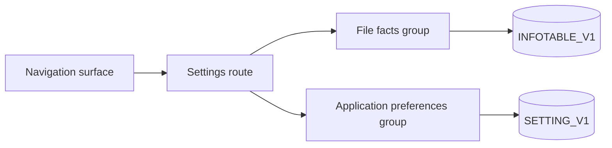

# File Metadata and Settings — Delta: Settings Surfaces

**Change**: `file-metadata-and-settings-surfaces`
**Capability**: `file-metadata-and-settings`
**Version**: 1.1.0
**Last Updated**: 2026-08-09

**Scope**: Adds the user-facing half of this capability — a settings surface and its route, editing file facts and application preferences, the base-currency change confirmation, persisting the active locale, and presenting file information. The custody and store-separation requirements already in force are unchanged and constrain everything here. Non-scope: settings owned by capabilities not yet implemented (budget options, share precision, asset compounding, financial-year and budget-offset keys), which arrive with their phases; theme selection, which `infrastructure-baseline` governs.

## ADDED Requirements

### Requirement: Settings Surface

The application SHALL provide a settings surface at its own route, reachable from the navigation surface, presenting what the file records about itself separately from what the application records about its own behavior.

- The route SHALL be declared by this capability, per the route registry rule `app-shell-navigation` establishes, and SHALL be subject to the database-readiness guard because everything it shows comes from the database.
- The two groups SHALL be distinguishable by the user, reflecting the store separation this capability already requires: facts describing the data file, and preferences describing the application.
- Every value the surface presents SHALL be read from the database rather than from a cached copy that could disagree with it.

*Caption: One surface, two groups, each writing to the store its meaning belongs to.*

Traceability: [src/pages/](../../../src/pages/), [src/router/index.ts](../../../src/router/index.ts), [src/domain/repos/metadata.ts](../../../src/domain/repos/metadata.ts).

#### Scenario: The settings surface is reachable and addressable

- **WHEN** the user chooses settings from the navigation surface
- **THEN** the application SHALL navigate to the settings route
- **AND** opening that route directly SHALL present the same surface

#### Scenario: Values shown are the values stored

- **WHEN** the settings surface is opened
- **THEN** each value it presents SHALL reflect what the database currently holds

### Requirement: Editing File Facts

The application SHALL let the user change the file facts it presents — the base currency, the user name, the date format, and whether exchange-rate history is used — and SHALL persist each by its key name.

- A change SHALL be written to `INFOTABLE_V1` addressed by `INFONAME`, never by row identifier, so no other fact is disturbed.
- Keys the surface does not present SHALL remain exactly as they were, as the capability's custody requirement already demands.
- Clearing an optional fact SHALL be distinguishable from never having set it.

Traceability: [src/domain/repos/metadata.ts](../../../src/domain/repos/metadata.ts), [src/domain/rules/metadata.ts](../../../src/domain/rules/metadata.ts).

#### Scenario: A fact is changed and nothing else moves

- **WHEN** the user changes the user name and saves
- **THEN** `INFOTABLE_V1` SHALL hold the new value under `USERNAME`
- **AND** every other row in that table SHALL be unchanged, including keys this build does not recognize

#### Scenario: Enabling rate history takes effect for conversions

- **WHEN** the user turns the currency-history setting on
- **THEN** subsequent conversions SHALL resolve rates from history as `currency-management` defines
- **AND** the stored fact SHALL reflect the new state

### Requirement: Base Currency Change Confirmation

Changing the base currency SHALL be presented with its consequence stated and SHALL require explicit confirmation before it is written.

- The consequence SHALL be described plainly: the base currency is what every conversion is measured against, so changing it changes converted figures throughout the database, including for periods already recorded.
- Declining the confirmation SHALL leave the stored base currency untouched.
- The change SHALL remain available regardless of how much data the file already contains, matching upstream, which permits it (operator decision 2026-08-09).

Traceability: [src/domain/repos/currency.ts](../../../src/domain/repos/currency.ts), [openspec/specs/currency-management/spec.md](../../../openspec/specs/currency-management/spec.md).

#### Scenario: The consequence is stated before the change

- **WHEN** the user selects a different base currency
- **THEN** the application SHALL present the effect on existing converted figures and ask for confirmation
- **AND** SHALL write the new base currency only once confirmed

#### Scenario: Declining leaves the file alone

- **WHEN** the user declines the confirmation
- **THEN** the stored base currency SHALL be unchanged

### Requirement: Editing Application Preferences

The application SHALL let the user change the preferences it presents, beginning with the trash retention window, and SHALL persist each to `SETTING_V1` addressed by `SETTINGNAME`.

- The retention window SHALL be presented with its meaning: how long a deleted transaction stays recoverable before it is destroyed, and that zero means deletion is immediate.
- A preference SHALL never be written to the file-facts store, nor a fact to the preferences store.

Traceability: [src/domain/rules/metadata.ts](../../../src/domain/rules/metadata.ts), [openspec/specs/transaction-ledger/spec.md](../../../openspec/specs/transaction-ledger/spec.md).

#### Scenario: Retention window is changed

- **WHEN** the user sets the retention window to a different number of days
- **THEN** `SETTING_V1` SHALL hold the new value under its key
- **AND** subsequent purging SHALL use it, per `transaction-ledger`

#### Scenario: A preference never lands in the file-facts store

- **WHEN** any preference the surface presents is saved
- **THEN** the write SHALL target `SETTING_V1` and SHALL NOT create or modify a row in `INFOTABLE_V1`

### Requirement: Active Locale Persistence

The application SHALL persist the user's chosen display locale as a file fact under the upstream `LOCALE` key, and SHALL restore it when the database is opened.

- Choosing a locale SHALL take effect immediately, whether chosen from the settings surface or from the shell.
- When no database is open — during initialization, for example — the choice SHALL apply to the current session and SHALL be persisted once a database becomes available.
- A stored locale the application does not support SHALL be ignored in favor of the fallback locale, and SHALL NOT be overwritten.

Traceability: [src/locales/](../../../src/locales/), [src/App.vue](../../../src/App.vue), [src/domain/rules/metadata.ts](../../../src/domain/rules/metadata.ts).

#### Scenario: The chosen locale survives a reload

- **WHEN** the user switches locale and later reopens the application against the same database
- **THEN** the application SHALL start in the stored locale

#### Scenario: Switching before a database is open

- **WHEN** the user switches locale while the database is still being initialized
- **THEN** the interface SHALL change immediately
- **AND** the choice SHALL be written once the database is ready

#### Scenario: An unsupported stored locale is tolerated

- **WHEN** the stored locale names a locale this build does not provide
- **THEN** the application SHALL present the fallback locale
- **AND** SHALL leave the stored value in place

### Requirement: File Information Presentation

The settings surface SHALL present the identifying properties of the open database read-only: its schema version and its data version.

- These SHALL be presented as translated, human-readable text rather than raw diagnostic output.
- They SHALL NOT be editable, because they describe the file's format rather than the user's choices.

Traceability: [src/stores/database-store.ts](../../../src/stores/database-store.ts), [src/domain/repos/metadata.ts](../../../src/domain/repos/metadata.ts).

#### Scenario: File information is shown and cannot be edited

- **WHEN** the user opens the settings surface
- **THEN** the schema version and data version of the open database SHALL be presented
- **AND** neither SHALL offer a means of changing it
