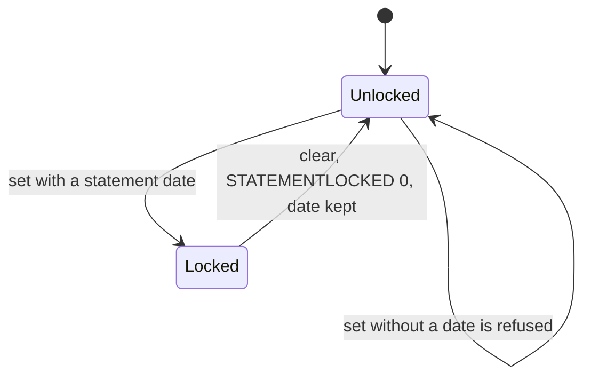
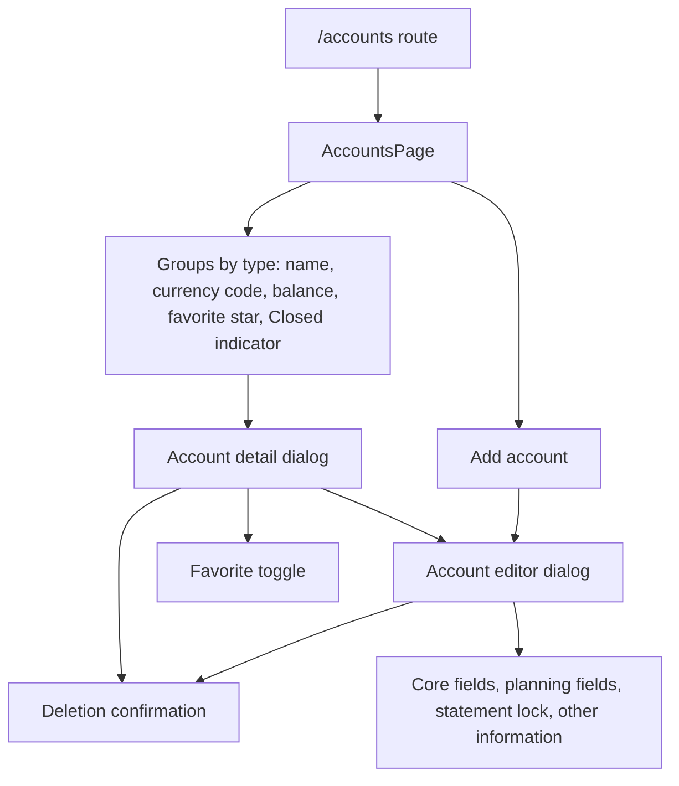
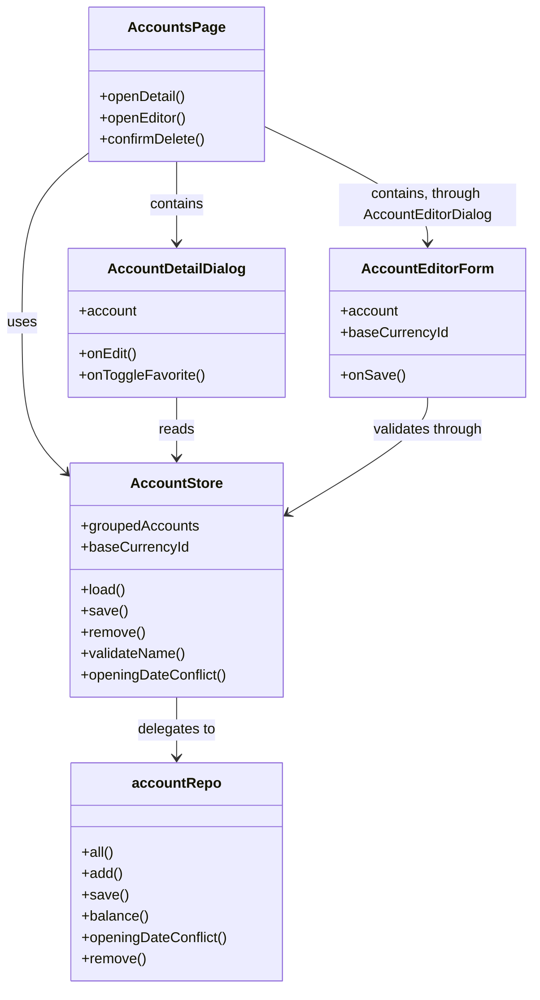
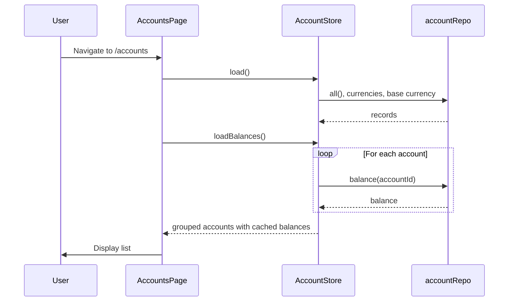

# Account Management Surfaces — Design

**Change**: `account-management-surfaces`
**Version**: 1.1.0
**Last Updated**: 2026-10-02

Related artifacts: [proposal.md](./proposal.md), [specs/account-management/spec.md](./specs/account-management/spec.md), [tasks.md](./tasks.md). Governed by [AGENTS.md](../../../../AGENTS.md).

## Context

The domain layer for `account-management` reads and writes `ACCOUNTLIST_V1` through `accountRepo` in [src/domain/repos/account.ts](../../../../src/domain/repos/account.ts). Its methods are `all()`, `get()`, `findByName()`, the statement builders `addStatement()` and `updateStatement()`, the executing `add()` and `save()` (added by this change, finding F1), `openingDateConflict()` (added by this change), `balance()`, and `remove()` with the full cascade. [src/domain/rules/account.ts](../../../../src/domain/rules/account.ts) defines the eight account types, the two status values, the balance computation, the favorite encoding and the securities-holding helper; this change adds desktop's tree order, grouping by type, and the type-change restrictions. Phase 0 established how routes are declared and how the navigation surface derives from them. Phases 1 and 2 provided the base currency and the currency list the binding field needs. This change follows `file-metadata-and-settings-surfaces` and `currency-management-surfaces`: a store over the repositories, a routed page, and dialogs for detail and editing.

## Goals / Non-Goals

**Goals**: a reachable accounts surface; account records inspectable and editable, including every field desktop's account dialog edits; account creation with desktop's defaults; the type-change and opening-date rules desktop enforces; balances per the capability definition; statement-lock management; deletion with cascade disclosure.

**Non-Goals**: desktop's Favorites group and All/Favorites/Open/Closed view filters (deferred, operator decision 2026-10-02); account reconciliation; transfers between accounts; investment, share and asset records; bulk account operations; account import and export.

## Decisions

### D1: The list groups accounts by type, as desktop's tree does

Every account in `ACCOUNTLIST_V1` is listed, grouped by type in desktop's tree order (Checking, Credit Card, Cash, Loan, Term, Investment, Shares, Asset; `ACCOUNT_IMG_TABLE` in `mmframe.cpp`). Within a group, the order is the repository's `ORDER BY ACCOUNTNAME`, which the column's `NOCASE` collation makes case-insensitive, exactly as desktop's `Model_Account::all(COL_ACCOUNTNAME)` orders it. The store does not re-sort, so the database stays the single source of the order. Operator decision 2026-10-02.

*Alternatives considered*: a flat alphabetical list, rejected because it diverges from desktop's primary organization. Full parity, with the Favorites group and the view filters, deferred to a later change to keep this one bounded. Listing only Open accounts, rejected because Closed accounts still hold data the user may need. User-initiated reordering persisted as a preference, dropped by the operator on 2026-10-02 (finding F13): it was never built, and desktop offers no account reordering.

### D2: A routed page at `/accounts`, with the detail and editor as dialogs

Accounts get their own route and navigation entry, per the route registry rule. The detail and the editor are dialogs over the list: dialog at desktop width, full page on mobile, as the currency surface does. The detail has no route of its own. Operator decision 2026-10-02, following the currency surface's precedent.

*Alternative considered*: `/accounts/:id` for the detail, rejected because it widens the change and the currency surface set the dialog precedent.

### D3: The surface reads through the repositories on entry

Synchronization can replace the file underneath the application, so a cached copy can disagree with what is stored. The page reads accounts, currencies and the base currency on entry; every write goes through `accountRepo` and is followed by a fresh read.

*Alternative considered*: keeping a long-lived copy in the store, rejected for the staleness above.

### D4: One form for creation, with desktop's defaults

The creation form presents every editable field. A new account starts as desktop's new-account wizard creates one (`wizard_newaccount.cpp`): favorite, in the base currency, with balance `0`, opened today. With no base currency nothing is preselected, as desktop's "Select Currency" button shows. If the editor opens before the page has read the currencies, the base currency is applied when it arrives. Operator decision 2026-10-02.

The name is trimmed before it is checked and stored, as desktop's dialog trims it. Required fields, the currency reference, the name's uniqueness and the opening-date rule are all checked at save time and reported on the field concerned. The save button is never merely disabled, so a refused save always says why.

*Alternatives considered*: a multi-step wizard, rejected because one form suffices. A disabled save button, rejected because the user then sees no reason (finding F17).

### D5: The planning fields are offered for every type

`CREDITLIMIT`, `MINIMUMBALANCE`, `INTERESTRATE`, `PAYMENTDUEDATE` and `MINIMUMPAYMENT` are shown and editable for every type, as desktop's Credit tab is. The scheduled-transaction execution guard reads `MINIMUMBALANCE` and `CREDITLIMIT` on any account. Operator decision 2026-10-02.

*Alternative considered*: these fields only for Credit Card, Loan and Term, rejected because it left the guard unconfigurable on other types and diverged from desktop.

### D6: Balances are cached and refreshed after every write

`accountRepo.balance()` computes a balance with `accountBalance()` from the rules layer. The store caches each result, and every save and removal recomputes all balances. The list and the detail both read the cache, so what they show matches what was just written.

*Alternative considered*: computing on every display, rejected because the list and the detail would each recompute the same balance.

### D7: Statement lock follows desktop's stored form

Setting a lock requires a statement date. Clearing it stores `STATEMENTLOCKED` as `0` and keeps `STATEMENTDATE`, as desktop's dialog writes them; the kept date has no effect while unlocked. The lock is shown in the detail and edited in the editor. Operator decision 2026-10-02.

The lock moves between two states:

*Caption: Setting needs a date; clearing keeps it.*

*Alternative considered*: clearing to NULL and erasing the date, rejected as a divergence from desktop's stored form.

### D8: Deletion requires confirmation with cascade disclosure

Before deletion, a confirmation lists what will be deleted: the account, its transactions, its scheduled transactions, and, for an Investment or Shares account, its stock positions. Dependent records do not refuse the deletion: desktop confirms and then cascades (`mmGUIFrame::OnDeleteAccount` calling `Model_Account::remove`). On success the detail and the editor close onto the list. A failure is shown on the page.

*Alternative considered*: refusing deletion while dependants exist, rejected by the operator on 2026-10-02 (finding F4) as contradicting the baseline cascade and diverging from desktop.

### D9: Favorite is a toggle on the detail, shown in the list

The favorite state (`FAVORITEACCT` as `TRUE` or `FALSE`) is toggled from the detail through `isFavorite` and `encodeFavorite` in the rules layer. The list shows a labelled star. The detail reads its account from the store by ID, so the new state shows at once.

*Alternative considered*: a toggle on each list entry too, rejected because one place to change it is enough and the spec requires only the detail.

### D10: A store over the repositories holds the surface's state

The store holds accounts, currencies, the base currency, cached balances, loading state and errors. It delegates every read and write to the repositories and holds no business rules of its own; grouping and type restrictions live in the rules layer.

*Alternative considered*: components calling the repositories directly, rejected for consistency with the currency and settings surfaces.

### D11: Type change in the editor, with desktop's restrictions

An existing account's type is chosen in the editor, without a confirmation step. A Shares account keeps its type, and no account may become Investment unless it already is one: desktop's `OnChangeAccountType` never offers a Shares account, and never offers Investment as a target. Because the planning fields no longer vary by type (D5), a type change no longer hides any field, so the earlier warning had nothing left to warn about. Operator decision 2026-10-02.

*Alternatives considered*: a read-only type, as desktop's edit dialog has, with no change offered in this phase, rejected as less useful. Unrestricted change, rejected for the data-integrity risk of an account becoming Investment, or a Shares account changing type.

### D12: Opening-date rule as desktop enforces it

The initial date may not be in the future. For an existing account, it may not come after its earliest transaction, stock purchase or scheduled transaction, each checked as desktop's `mmNewAcctDialog::OnOk` does, with a strict "earlier than" comparison. Files from desktop already hold such records, so the rule is needed before this application can create them. Operator decision 2026-10-02.

*Alternative considered*: deferring the rule to a later phase, rejected because files from desktop already contain dependent records.

### D13: Every field desktop's dialog edits is editable

Besides the core fields, the editor offers desktop's six free-text fields: `ACCOUNTNUM`, `HELDAT`, `WEBSITE`, `CONTACTINFO`, `ACCESSINFO` and `NOTES`. `ACCESSINFO` is plain text in the file, as it is for desktop. Operator decision 2026-10-02.

*Alternative considered*: only `ACCOUNTNUM` and `NOTES`, rejected as a divergence from desktop.

### D14: Types and statuses are translated for display only

Type and status are shown by their names in the user's language, as desktop does with `wxGetTranslation`. The zh-TW names are desktop's own (`mmex/moneymanagerex/po/zh_TW.po`). The stored values stay the upstream strings.

*Alternative considered*: showing the stored English strings, rejected because zh-TW users of desktop see translated names.

## Surface Structure

The page lists the groups. An entry opens the detail; the detail opens the editor and the deletion confirmation.

*Caption: Page and dialog structure for account management.*

## Component Architecture

Components reach data only through the store; the store reaches it only through the repositories.

*Caption: Component and data flow for account management.*

## Data Flow

On entry the page loads the records first, then the balances, so the list appears before every balance is known.

*Caption: Initial load sequence; each write repeats load() and loadBalances().*

## Route Registration

The route `/accounts` is registered in [src/router/index.ts](../../../../src/router/index.ts) with:
- `name: 'accounts'`
- `component: () => import('../pages/AccountsPage.vue')`
- `meta.nav: { labelKey: 'menu.accounts', icon: 'mdi-bank', order: 20 }`, placing it between home and currencies
- `meta.capability: 'account-management'`

## New Files

| File | Purpose |
|------|---------|
| `src/pages/AccountsPage.vue` | Accounts page: grouped list, add action, deletion confirmation, action errors |
| `src/components/account/AccountDetailDialog.vue` | Account detail: every field, live balance, statement lock, favorite toggle, edit and delete entry points |
| `src/components/account/AccountEditorDialog.vue` | Responsive dialog hosting the editor, full page on mobile |
| `src/components/account/AccountEditorForm.vue` | Editor fields, desktop defaults, type restrictions, save-time validation |
| `src/components/account/account-labels.ts` | Catalog keys for the translated type and status names |
| `src/stores/account-store.ts` | UI state over the repositories |
| `src/__tests__/account-store.spec.ts`, `src/__tests__/AccountsPage.spec.ts`, `src/__tests__/AccountEditorForm.spec.ts` | Unit tests for the store, the page and the editor |
| `e2e/accounts.spec.ts` | End-to-end smoke test over real SQLite in OPFS (task 13.7) |

The list and the detail are not separate `AccountList` and `AccountDetail` components: the list lives in `AccountsPage.vue` and the detail is a dialog, so the class names in the Component Architecture diagram are roles, not files.

## Existing Files Modified

| File | Change |
|------|--------|
| `src/router/index.ts` | Add `/accounts` route with navigation metadata |
| `src/domain/repos/account.ts` | Add executing `add()` and `save()` (finding F1) and `openingDateConflict()` |
| `src/domain/rules/account.ts` | Add `ACCOUNT_TREE_ORDER`, `groupByType()` and `typeChangeOptions()` |
| `src/locales/en-US.json`, `src/locales/zh-TW.json` | Add `menu.accounts`, the `account.*` strings including type names, and `common.edit`, `common.notSet` and `common.close`; each locale is a single catalog |
| `src/__tests__/router.spec.ts` | Cover the `/accounts` route |

## Risk Assessment

| # | Risk | Likelihood | Impact | Mitigation |
|---|------|------------|--------|------------|
| R1 | Account name uniqueness misses edge cases | Medium | High | Trim the name, then use `accountRepo.findByName()`, which matches case-insensitively; check again at save time; test letter-case and whitespace variants |
| R2 | Balance computation is slow with many accounts and transactions | Low | Medium | Accepted for this phase: one ledger read per account, repeated after each write. The list renders before balances arrive. A grouped aggregate query is the remedy if it becomes slow |
| R3 | Fields shown for the wrong account type | Low | Medium | The planning fields are shown for every type (D5) and type choices come from one rules function; unit tests cover every type |
| R4 | Deletion cascade misses some dependent records | Low | High | Reuse `accountRepo.remove()`, which implements the baseline cascade in one batch; a test asserts transactions, scheduled rows and stock rows are deleted |
| R5 | Statement lock date is stored but not enforced | Medium | Medium | Enforcement belongs to `transaction-ledger` per the baseline; its repository test covers refusing an edit to a frozen row. This change stores and shows the lock |
| R6 | Favorite toggle does not persist correctly | Low | Medium | Use `encodeFavorite()` and `isFavorite()` from the rules layer; tests cover the stored text and the detail's display |
| R7 | Currency binding allows a currency the file lacks | Low | High | Populate the selector from `currencyRepo.all()`, check membership at save time, and never fall back to a guessed ID |
| R8 | The surface diverges from desktop UX without the operator knowing | Medium | Medium | Every divergence found by the 2026-10-02 review was put to the operator and recorded as a dated decision (D1, D2, D4, D5, D7, D11, D12, D13) |

## Open Questions

None. The operator settled the open UX questions on 2026-10-02; see the dated decisions above.
