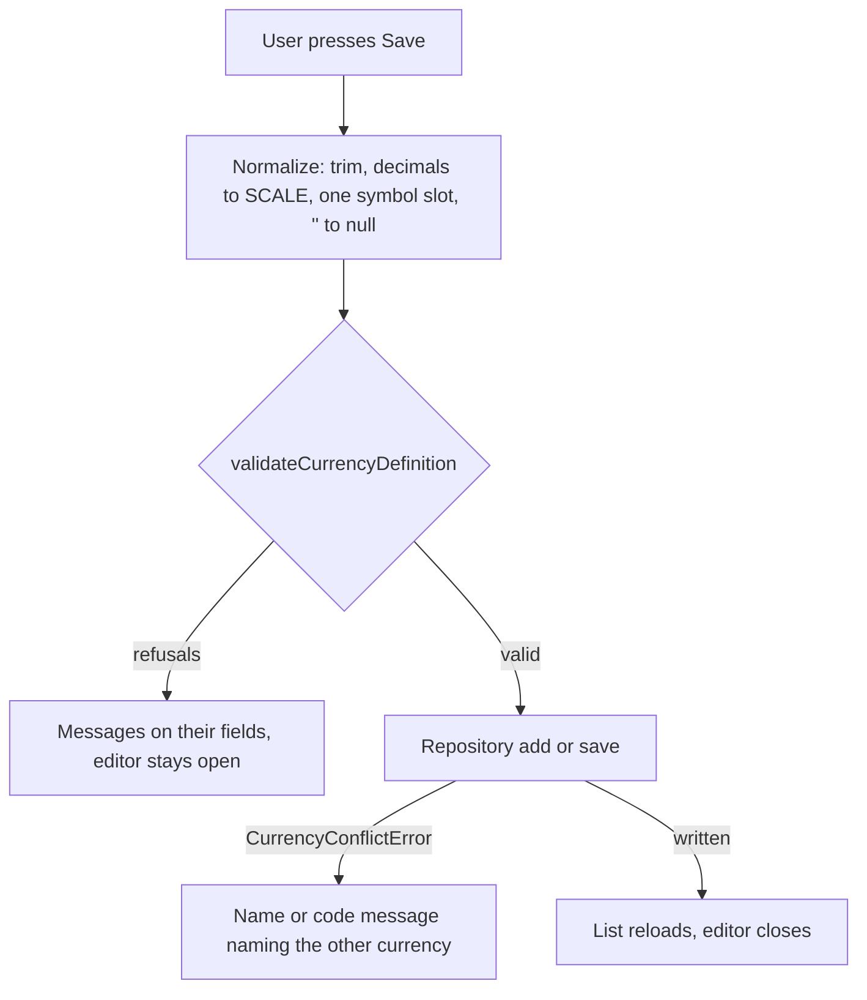

# Currency Management Fidelity — Design

**Change**: `currency-management-fidelity`
**Version**: 1.0.0
**Last Updated**: 2026-10-02

Related artifacts: [proposal.md](./proposal.md), [specs/currency-management/spec.md](./specs/currency-management/spec.md), [tasks.md](./tasks.md). Governed by [AGENTS.md](../../../../AGENTS.md).

## Context

See proposal.md, Why. The currency surface exists: [src/pages/CurrenciesPage.vue](../../../../src/pages/CurrenciesPage.vue) lists and opens, [src/components/currency/CurrencyEditorForm.vue](../../../../src/components/currency/CurrencyEditorForm.vue) edits a definition and its rate history, [src/stores/currency-store.ts](../../../../src/stores/currency-store.ts) holds the list, the used set and the history, and [src/domain/repos/currency.ts](../../../../src/domain/repos/currency.ts) writes through `db.mutate`. Its writes reach the database; what it lacks is any validation, desktop's field shape, desktop's list and deletion behavior, and translated refusals. The archived design recorded one false upstream claim, that the used-only default "matches upstream's own filter"; desktop's `SHOW_HIDDEN_CURRENCIES` defaults to showing all. The account and settings surfaces, reviewed and corrected earlier on 2026-10-02, carry the patterns reused here: save-time validation with a message per field, `''` normalized before a write, typed refusals the surface translates, a confirmation dialog before a destructive action, and an error banner on the page.

## Goals / Non-Goals

**Goals:** every definition and rate the surface stores is one desktop accepts; the editor, list, history and deletion behave as desktop's Currency Manager does; every message comes from the catalogs; tests drive the real inputs and assert what is written.

**Non-Goals:** desktop's offer to purge orphaned history when history is turned off; the history grid's source column and six-decimal display; online rates; changing the base currency (owned by `file-metadata-and-settings`).

## Decisions

### D1: Deletion is gated and confirmed as desktop gates and confirms it

Desktop enables Remove only when `!Model_Account::is_used(currency)` and asks "Do you want to delete the selected currency?" before deleting. The editor's Delete control is disabled, with a translated reason, when the store says the currency is the base or is used; otherwise it opens a confirmation stating that the rate history goes with it, reusing the page-level confirmation pattern of the account surface. The repository's refusal becomes a typed error carrying the reason (`base`, `accounts`, `assets`), which the page translates. Operator decision 2026-10-02.

*Alternatives considered*: keeping the control enabled and refusing after the click, rejected as a divergence from desktop and a worse experience. Removing the gate in favor of the confirmation alone, rejected because the capability forbids deleting a currency in use.

### D2: "In use" stays stricter than desktop

Desktop's `Model_Account::is_used` counts only accounts whose status is not Closed, so a currency a closed account still references can be deleted, leaving that account's `CURRENCYID` dangling. The capability's baseline already counts any account or asset, and the base currency. That is kept, as a deliberate divergence recorded here. Operator decision 2026-10-02.

*Alternative considered*: matching desktop, rejected for the dangling reference and because it would require amending the baseline.

### D3: The editor takes desktop's field shape

Desktop's currency dialog offers decimal places 0 through 9 (stored as `pow10`), one symbol with a Prefix/Suffix radio, decimal character from Dot and Comma, grouping character from None, Dot, Comma and Space, and a code of at most 12 characters. The editor presents the same fields, so an invalid value cannot be entered from the keyboard; what remains to validate at save time is emptiness, uniqueness, the separator rule and the rate. Operator decision 2026-10-02.

Stored values outside these shapes exist, because the earlier editor allowed them, and desktop files may hold both symbols. They are shown as desktop shows them: decimal places as the integer part of `log10(SCALE)`; the prefix when both symbols are set; an out-of-set separator as the current choice. Saving normalizes to desktop's shape, exactly as saving in desktop's dialog would.

*Alternative considered*: keeping the raw fields and refusing invalid values at save time, rejected because the user would have to know desktop's rules to get past the refusals.

### D4: The list scope is read from and written to `SHOW_HIDDEN_CURRENCIES`

Desktop defaults the Currency Manager to showing all currencies and persists the "Show all" box in `INFOTABLE_V1` under `SHOW_HIDDEN_CURRENCIES`. The store reads that key on load (absent reads as true) and writes it when the toggle changes, through `infoRepo`, so the two applications show the same scope for the same file. The key is added to the rules layer's `INFO_KEY` as a file fact. Operator decision 2026-10-02.

*Alternative considered*: keeping the used-only default and a session-only toggle, rejected because the archived rationale for it was false and the preference desktop stores would be ignored.

### D5: The rate column and the editor follow the history setting

Desktop titles the column "Last Rate" when history is on and shows the latest recorded rate, "Fixed Rate" otherwise, and prefills the editor's rate from `getLastRate`. The repository gains one query returning each currency's latest rate, so the list does not issue a query per row; the editor prefills from the loaded history. Operator decision 2026-10-02.

*Alternative considered*: always showing `BASECONVRATE`, rejected because with history on it shows a value conversion does not use.

### D6: The history panel is hidden when history is off

Desktop hides the history panel entirely when history is off, and separately offers to purge orphaned rows. The editor hides the panel and shows one line saying recorded rates are not in use; the purge offer is out of scope. Operator decision 2026-10-02.

*Alternative considered*: the current panel with an "inactive" badge, rejected for consistency with desktop.

### D7: Negative amounts render as desktop renders them

Desktop's `toString` formats the signed number and `toCurrency` then prepends the prefix, giving `$-80.00`; it also treats a magnitude below `1e-10` as zero. `formatAmount` moves the sign after the prefix and applies the tolerance, and `precisionFromScale` truncates instead of rounding `log10`, as desktop does. The account surface renders balances through the same function and inherits the change; its tests assert only the presence of a minus sign. Operator decision 2026-10-02.

*Alternative considered*: the conventional `-$80.00`, rejected because desktop and the PWA would show the same file differently.

### D8: Currency types are translated for display only

`Fiat` and `Crypto` are shown by catalog keys, as account types are since the account surface review; the stored values stay the upstream strings.

*Alternative considered*: showing the raw stored strings, rejected for consistency with the account surface.

### D9: Refusals are typed in the repository and translated on the surface

`currencyRepo` throws `CurrencyConflictError` (`field: 'name' | 'symbol'`, with the colliding currency) and `CurrencyInUseError` (`reason: 'base' | 'accounts' | 'assets'`) instead of English strings; the store rethrows; the page and the editor map them to catalog keys. The editor's own refusals (empty fields, separators, rate) are computed from a pure validation function in the rules layer that returns messages keyed by field.

*Alternative considered*: translating inside the repository, rejected because the domain layer has no access to the catalogs and should not.

### D10: Validation lives in the rules layer and runs at save time

A pure `validateCurrencyDefinition(draft)` in [src/domain/rules/currency.ts](../../../../src/domain/rules/currency.ts) returns the per-field refusals desktop's `OnOk` applies: empty name or code, code over 12 characters, grouping equal to decimal with decimals, non-positive rate. The editor normalizes the draft (trim, `''` to null for optionals, `SCALE` from decimal places, one symbol slot) before validating, and emits only a valid, normalized definition. The Save button stays enabled so a refusal is always explained, as the account editor does since its review.

*Caption: Save-time validation and the two places a refusal can come from.*

*Alternative considered*: validating on every keystroke, rejected because desktop validates on OK and a half-typed value would flash errors.

### D11: History entry is validated and its failures are shown

The rate field is parsed with `Number()`; an empty, non-numeric or negative value is refused on the field (desktop rejects `dPrice < 0`, allowing `0`). The page's history handlers catch and show failures in the editor's error area, and the entry fields are cleared only after the store confirms the write.

*Alternative considered*: disabling Add until valid, rejected because the current disabled button already let `''` through once the field had been touched.

## Risks / Trade-offs

| # | Risk | Likelihood | Impact | Mitigation |
|---|------|------------|--------|------------|
| R1 | Normalizing a stored definition on save surprises a user who did not touch that field | Medium | Low | The editor shows the normalized reading before save (decimal places, prefix) and the preview reflects it; the behavior is desktop's own |
| R2 | The sign placement change alters account balances' appearance without an account-surface test catching a regression | Low | Low | `formatAmount` is covered by its own tests for prefix, suffix and tolerance; the account tests assert a minus sign is present, which still holds |
| R3 | The latest-rate query is wrong for a currency with two rates on one day | Low | Medium | The schema's `UNIQUE(CURRENCYID, CURRDATE)` forbids two rates on one day; a test covers two dates |
| R4 | `SHOW_HIDDEN_CURRENCIES` written as `1`/`0` is misread by desktop | Low | Medium | Desktop's `Model_Infotable::getBool` accepts `1`/`0` as well as `TRUE`/`FALSE`; the settings surface already writes `USECURRENCYHISTORY` the same way |
| R5 | Hiding the history panel hides orphaned rows the user would want to clean up | Medium | Low | Out of scope by decision D6; the rows are untouched and desktop offers the purge |
| R6 | A conflict message names a currency by a name the user cannot see in a filtered list | Low | Low | The message carries both the name and the code of the colliding currency |
| R7 | Rewriting the editor regresses the base-currency handling (rate pinned to 1, no history) | Low | High | The existing tests for the base badge, the pinned rate and the absent history panel are kept and must pass |

## Migration Plan

No schema change. Stored definitions are not rewritten on open; a definition the earlier editor stored with an invalid shape is normalized only when the user saves it, and the editor shows what it will become. Rollback is a code rollback.

## Open Questions

None. The operator settled the eight questions on 2026-10-02; see D1 to D8.
