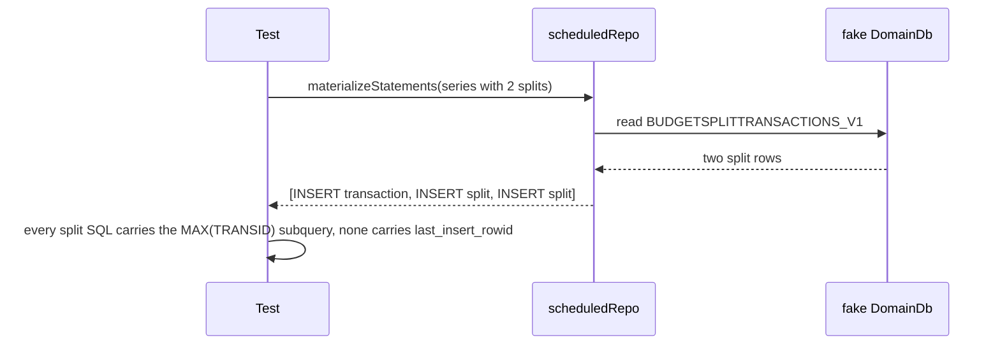

# Domain Write Fixes — Design

**Change**: `domain-write-fixes`
**Version**: 1.1.0
**Last Updated**: 2026-10-02

Related artifacts: [proposal.md](./proposal.md), [specs/scheduled-transactions/spec.md](./specs/scheduled-transactions/spec.md), [specs/investment-tracking/spec.md](./specs/investment-tracking/spec.md), [tasks.md](./tasks.md). Governed by [AGENTS.md](../../../../AGENTS.md).

## Context

See proposal.md, Why. Both repositories build statement lists that `db.mutate` runs in one transaction inside the worker (`exec-tx`). The repositories cannot read a generated key between statements of one batch, which is what the split insert tried to do with `last_insert_rowid()`.

## Goals / Non-Goals

**Goals:** split lines always belong to the transaction created with them; a trade's cash transaction is always insertable.

**Non-Goals:** any change to how series advance, to the trade amount rules, or to the surfaces that will call these paths.

## Decisions

### D1: The split inserts select the new transaction's key from the table, in the same transaction

SQLite assigns a new `INTEGER PRIMARY KEY` as one more than the largest key present (`AUTOINCREMENT` is not declared, so the only exception is a table whose largest key is already the maximum 64-bit integer). Within the single transaction `db.mutate` runs, no other write can intervene, so `(SELECT MAX(TRANSID) FROM CHECKINGACCOUNT_V1)` evaluated by each split insert is the key the transaction insert just received, no matter how many splits follow.

*Alternatives considered*: `last_insert_rowid()`, which is what failed, because every insert in the batch moves it. Two batches, reading the key between them, rejected because the operation would no longer be one logical operation and a failure between the two would leave a transaction without its splits. A temporary table holding the key, rejected as heavier than the subquery for no gain.

### D2: The trade's payee defaults to the upstream `-1` sentinel

Desktop never writes `NULL` into `PAYEEID`; "no payee" is `-1` throughout, and the column is `NOT NULL`. The repository writes the given payee or `-1`.

*Alternative considered*: refusing a trade without a payee, rejected because desktop's share-transaction panel does not require one and the ledger specification's "a non-transfer SHALL reference a payee" is owned by the ledger surface, not by the trade recorder.

### D3: The tests assert the statement batch each repository emits (revised 2026-10-02)

The first version of this decision called for running the statements against the project's SQLite WebAssembly build in memory. Three probes failed under Node: the package ships no Node entry (`sqlite3-node.mjs` is absent), the subpath is not exported, and importing the browser bundle by file URL throws before it can be initialized. Risk R1 materialized, and the tests take its fallback: they call `scheduledRepo.materializeStatements` and `stockRepo.recordTrade` against a fake `DomainDb` that records the batch, and assert the property that failed.

- Scheduled: no split insert mentions `last_insert_rowid`, and every split insert carries `(SELECT MAX(TRANSID) FROM CHECKINGACCOUNT_V1)` — the two facts that together mean every split lands on the transaction inserted first in the same batch (D1).
- Investment: the `PAYEEID` bound by the ledger insert is `-1` when no payee is given and the given payee otherwise, read by column position so a reordering of the insert's column list cannot pass by accident.

*Caption: The linkage is asserted on the statements, because SQLite itself cannot run in the unit-test process.*

*Alternative considered*: asserting on the SQL text alone was first rejected because the text was "correct-looking" when the defect was introduced; it is accepted now with two guards — the test states the failing property by name (no `last_insert_rowid` after the first insert), and the SQLite key-assignment rule the fix relies on is stated in the code comment and in D1 so a reader can check it against SQLite's documentation. Observing the rows in a real database remains possible in the browser (Playwright, Chromium) once a surface materializes a series; to be noted in the capability map's standing items at archive (task 4.2).

## Risks / Trade-offs

| # | Risk | Likelihood | Impact | Mitigation |
|---|------|------------|--------|------------|
| R1 | The SQLite WebAssembly build does not load under Node in Vitest | Materialized | Low | Three probes failed (no Node entry, subpath not exported, file-URL import throws); the tests assert the statements' shape, see D3 |
| R2 | A table whose largest `TRANSID` is the 64-bit maximum makes `MAX()` wrong | Negligible | High | Not reachable in a real file; noted in the code comment |
| R3 | `-1` as payee for a non-transfer conflicts with the ledger surface's own rule later | Low | Low | The ledger surface decides whether to require a payee at entry; the repository only never writes `NULL` |

## Migration Plan

No schema change; no stored data to repair, because neither path has had a surface.

## Open Questions

None.
