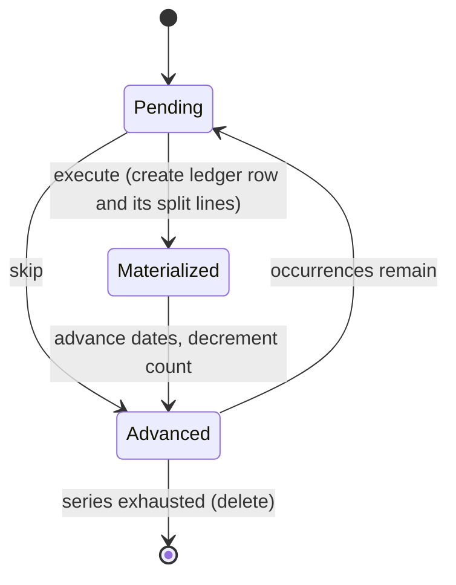

# Scheduled Transactions — Delta: Split Linkage on Execute

**Change**: `domain-write-fixes`
**Capability**: `scheduled-transactions`
**Version**: 1.1.0
**Last Updated**: 2026-10-02

Governed by [AGENTS.md](../../../AGENTS.md). Links are written relative to where this file is promoted, `openspec/specs/scheduled-transactions/spec.md`.

**Scope**: Makes explicit that every split line converted on execute belongs to the transaction created in that same operation. Nothing else in the requirement changes.

## MODIFIED Requirements

### Requirement: Series Advancement on Execute or Skip

When the user executes or skips an occurrence, the application SHALL mutate the series exactly as upstream does — the operation is not idempotent.

- Executing SHALL materialize a ledger transaction from the series template (including converting the series' split lines to ledger split lines); skipping SHALL NOT.
- Every converted split line SHALL reference the transaction materialized in the same operation, however many split lines the series carries; no split line SHALL reference any other row.
- Both operations SHALL then advance `TRANSDATE` and `NEXTOCCURRENCEDATE` by one period and decrement a positive `NUMOCCURRENCES` greater than one.
- A series SHALL be deleted (with its split lines and extension rows) when exhausted: type Once, or a countable series whose remaining count reaches zero.
- Types `11` and `12` (In n Days/Months) SHALL convert to Once after firing, preserving the auto-execute multiplexer, with `NUMOCCURRENCES` set to `-1`.

*Caption: One occurrence's lifecycle — execute and skip both advance the series; only execute writes to the ledger.*

Traceability: [mmex/moneymanagerex/src/model/Model_Billsdeposits.cpp](../../../mmex/moneymanagerex/src/model/Model_Billsdeposits.cpp) (`completeBDInSeries`), [mmex/moneymanagerex/src/fusedtransaction.cpp](../../../mmex/moneymanagerex/src/fusedtransaction.cpp) (`execute_bill`, `execute_splits`), [src/domain/repos/scheduled.ts](../../../src/domain/repos/scheduled.ts).

#### Scenario: Countdown reaches zero

- **WHEN** the user executes the final occurrence of a monthly series with `NUMOCCURRENCES` `1`
- **THEN** a ledger transaction SHALL be created
- **AND** the series and its split lines SHALL be deleted

#### Scenario: Skip advances without writing

- **WHEN** the user skips an occurrence
- **THEN** no ledger transaction SHALL be created
- **AND** both series dates SHALL advance by one period

#### Scenario: Every split line lands on the new transaction

- **WHEN** the user executes an occurrence of a series that carries two split lines
- **THEN** exactly one ledger transaction SHALL be created
- **AND** both resulting split lines SHALL reference that transaction's identifier
