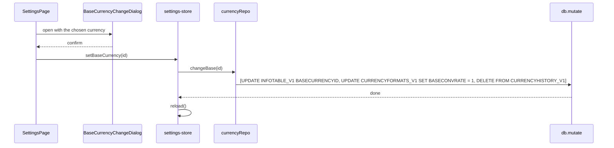

# File Metadata and Settings Fidelity — Design

**Change**: `file-metadata-and-settings-fidelity`
**Version**: 1.0.0
**Last Updated**: 2026-10-02

Related artifacts: [proposal.md](./proposal.md), [specs/file-metadata-and-settings/spec.md](./specs/file-metadata-and-settings/spec.md), [specs/currency-management/spec.md](./specs/currency-management/spec.md), [tasks.md](./tasks.md). Governed by [AGENTS.md](../../../../AGENTS.md).

## Context

See proposal.md, Why. The settings surface exists ([src/pages/SettingsPage.vue](../../../../src/pages/SettingsPage.vue), [src/stores/settings-store.ts](../../../../src/stores/settings-store.ts), [src/components/settings/BaseCurrencyChangeDialog.vue](../../../../src/components/settings/BaseCurrencyChangeDialog.vue)) and its writes reach the database through `infoRepo.set` and `settingRepo.set` in [src/domain/repos/metadata.ts](../../../../src/domain/repos/metadata.ts), which upsert by key name. What this change corrects is which keys are written, which values are allowed, and how the surface behaves when a write fails. The archived design of the earlier surface recorded two upstream claims that were false: that desktop does not migrate anything on a base-currency change (it resets every rate and deletes history), and that `LOCALE` is where upstream keeps the display language (it is the amount-formatting locale). Both are corrected below. The account surface, reviewed on 2026-10-02, already carries the patterns this change reuses: an error banner on the page, per-field validation at save time, and drafts restored from the store.

## Goals / Non-Goals

**Goals:** every value the settings surface writes is one desktop reads with the same meaning; a stored value desktop wrote is never damaged; a failed write is visible; the one value the earlier surface corrupted is repaired once.

**Non-Goals:** the currency surface's own defects (next change, `currency-management-fidelity`); desktop's batched options dialog; exposing further file facts desktop's Options show; browser-local preferences.

## Decisions

### D1: The display language is a preference under `SETTING_V1.LANGUAGE`, in desktop's canonical form

Desktop reads its UI language from `SETTING_V1` under `LANGUAGE` (`option.cpp` `getLanguageID`, `constants.cpp` `LANGUAGE_PARAMETER`), either as a wxLanguage number or as a canonical name such as `zh_TW`. The PWA writes the canonical name, which desktop also accepts, and maps it to its own `zh-TW` tag on read. This also satisfies Store Separation, which places presentation preferences in `SETTING_V1`. Operator decision 2026-10-02.

*Alternatives considered*: keeping `INFOTABLE_V1.LOCALE`, rejected because desktop reads it as a `std::locale` name for amount formatting and a value like `zh-TW` makes its Options dialog unsaveable on macOS and Linux. Browser-local storage, rejected because the choice would not follow the file to another device.

### D2: The `LOCALE` the earlier surface wrote is repaired once, then never touched

Only the earlier settings surface writes `en-US` or `zh-TW` into `LOCALE`; desktop writes `std::locale` names such as `de_DE.UTF-8` or leaves it blank. So a `LOCALE` holding exactly one of the PWA's two tags is known damage. When `LANGUAGE` is absent and `LOCALE` holds such a tag, the application starts in that language, writes it under `LANGUAGE`, and sets `LOCALE` to the empty string, which desktop treats as "derive the format from the currency settings". Any other `LOCALE` is left alone, as Unknown Key Preservation requires. Operator decision 2026-10-02.

*Alternatives considered*: reading the value but leaving it, rejected because the damage to desktop's Options dialog would persist. Ignoring it, rejected because the user would lose a choice they made and the damage would persist.

### D3: The date format is a choice from desktop's mask list, with a rendered sample

Desktop accepts only the masks in `g_date_formats_map` (`util.cpp`) and offers them in a choice with a sample. The PWA offers the same list, each shown as today's date rendered in that mask, and writes the mask. A stored value outside the list is shown as stored and not rewritten until the user picks one, so a value another tool wrote is not silently replaced. Operator decision 2026-10-02.

*Alternatives considered*: free text with validation against the list, rejected because the user would have to know the `%` syntax. Free text as before, rejected because it writes values desktop renders literally.

### D4: A base-currency change performs desktop's reset, owned by `currency-management`

Desktop's `SetBaseCurrency` (`maincurrencydialog.cpp`) warns that historical rates will be deleted, sets the pointer, resets every `BASECONVRATE` to 1 and deletes every history row. The rule touches `CURRENCYFORMATS_V1` and `CURRENCYHISTORY_V1`, which `currency-management` owns, so the delta adds the rule there and the settings surface calls one repository method that emits all statements in one `db.mutate` batch (the worker runs a batch as one transaction). The confirmation dialog's text changes to state the reset. Operator decision 2026-10-02.

*Caption: One batch carries the pointer and the reset, so no partial state is observable.*

*Alternatives considered*: writing the pointer only with an honest warning that stored rates need re-entry, rejected because every conversion would silently be wrong until the user noticed. Converting stored rates arithmetically into the new base, rejected because desktop does not and the two applications would then disagree.

### D5: `USECURRENCYHISTORY` defaults to on, and the wizard writes it

Desktop reads an absent key as `true` (`option.cpp`). The repository's default flips to `true`, and the new-file wizard writes `USECURRENCYHISTORY = 1` so new files no longer depend on a default at all. Operator decision 2026-10-02.

*Alternative considered*: keeping `false`, rejected because the same file would convert differently in the two applications.

### D6: The base-currency picker reads `CURRENCYFORMATS_V1`

The picker's options come from `currencyRepo.all()`, labelled `CURRENCY_SYMBOL — CURRENCYNAME` as the currency surface labels them, and the committed selection is resolved by `CURRENCYID` against that list. The bundled `currencies.json` remains the wizard's picker data for a file that has no rows yet.

*Alternative considered*: keeping the bundled list, rejected because it cannot know what the currency surface added or removed and would write a dangling `BASECURRENCYID`.

### D7: Failures are shown on the page and fields are restored from the store

Every write handler on the page catches, shows the message in a page-level banner (the pattern of `AccountsPage.vue`), and re-syncs its draft from the store, so the field never shows a value the file does not hold. The language field is derived from the active i18n locale rather than held as a one-time draft, so the shell's switcher and the page agree.

*Alternative considered*: letting the store's `error` carry write failures, rejected because `load()` clears it and the page shows it only in place of the whole surface.

### D8: Per-field save stays; desktop's batched dialog is not adopted

Desktop's Options dialog saves every field on OK and discards on Cancel. The web convention for a settings page is to save each field as it changes, with the destructive change (the base currency) behind its own confirmation. The operator kept per-field save on 2026-10-02, with the divergence recorded here.

*Alternative considered*: a Save/Cancel pair over the whole page, rejected as a larger redesign with no correctness gain once each field validates and reports on its own.

### D9: Retention is bounded as desktop's control is, and an empty entry is a refusal

Desktop's control allows 0 through 999 days (`optionsettingsmisc.cpp`). The page refuses an empty, non-numeric or out-of-range entry with a message on the field and restores the stored value; it never coerces an empty entry to 0, which would mean "destroy deleted transactions immediately".

*Alternative considered*: clamping into range, rejected because a clamped value is still not what the user typed.

### D10: Absent file information is shown as not set

`DATAVERSION` is shown only when stored; otherwise the surface shows "Not set". The default `3` remains what the wizard writes, not what the surface displays. Operator decision 2026-10-02.

## Risks / Trade-offs

| # | Risk | Likelihood | Impact | Mitigation |
|---|------|------------|--------|------------|
| R1 | The repair in D2 misfires on a `LOCALE` desktop wrote | Low | High | The repair triggers only on the exact strings `en-US` and `zh-TW`, which are not `std::locale` names; a test covers `de_DE.UTF-8`, an empty value, and an absent row |
| R2 | The base-change batch is partially applied | Low | High | All statements go through one `db.mutate`, which the worker wraps in a transaction; a test asserts the three statements share one batch |
| R3 | The mask list drifts from desktop's | Low | Medium | The list is copied verbatim from `util.cpp` with a comment naming the source; a test asserts its length and a few members |
| R4 | A user who relied on the PWA's `false` history default sees converted figures change | Medium | Low | The default only applies when the key is absent; the change is recorded in the proposal as **BREAKING** and the toggle shows the effective state |
| R5 | Rendering today's date in a mask differs from desktop for `%Mon` or `%w` | Medium | Low | The sample is presentation only; the stored mask is what matters. The renderer covers desktop's tokens (`%d %m %y %Y %Mon %w`) with a test per token |
| R6 | The language flush on readiness writes `LANGUAGE` before the one-time repair reads `LOCALE` | Low | Medium | The repair runs inside the same readiness sync, before any pending choice is flushed; a test orders them |
| R7 | The settings page and the currency page cache the currency list separately | Medium | Low | Both read `currencyRepo.all()` on entry (design D3 of the earlier surface); the settings store reloads after a base change |

## Migration Plan

No schema change. Existing files: the first open after this change performs the D2 repair when it applies, and nothing else. Rollback is a code rollback; a repaired file is valid for both the old PWA (which reads `LOCALE`, now empty, and falls back) and desktop.

## Open Questions

None. The operator settled language placement, date-format domain, base-change reset, history default, per-field save, the `LOCALE` repair and the absent-`DATAVERSION` display on 2026-10-02.
