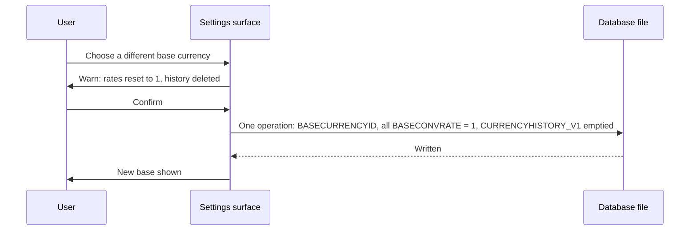

# Currency Management — Delta: Base Currency Change

**Change**: `file-metadata-and-settings-fidelity`
**Capability**: `currency-management`
**Version**: 1.2.0
**Last Updated**: 2026-10-02

Governed by [AGENTS.md](../../../AGENTS.md). Links are written relative to where this file is promoted, `openspec/specs/currency-management/spec.md`.

**Scope**: Adds to Requirement "Base Currency" what a change of base does to the tables this capability owns, as desktop does it. The settings surface (`file-metadata-and-settings`) offers and confirms the change; this capability owns the rule. Nothing else in the capability changes.

## MODIFIED Requirements

### Requirement: Base Currency

The application SHALL treat the currency referenced by the `BASECURRENCYID` file fact as the base currency for all cross-currency aggregation.

- The base currency's conversion rate SHALL always be `1`.
- Every database SHALL have a base currency once initialized; changing it is a user action, never an implicit side effect.
- A change of base currency SHALL, in one logical operation, set `BASECURRENCYID` to the chosen currency, set every row's `BASECONVRATE` in `CURRENCYFORMATS_V1` to `1`, and delete every row of `CURRENCYHISTORY_V1`, because every stored rate is denominated in the old base. This is what desktop does when its base currency changes (operator decision 2026-10-02).
- The surface offering the change SHALL warn, before anything is written, that historical rates will be deleted.

*Caption: A base-currency change rewrites every rate with the pointer, as desktop does.*

Traceability: [mmex/moneymanagerex/src/model/Model_Currency.cpp](../../../mmex/moneymanagerex/src/model/Model_Currency.cpp), [mmex/moneymanagerex/src/maincurrencydialog.cpp](../../../mmex/moneymanagerex/src/maincurrencydialog.cpp) (`SetBaseCurrency`), [src/domain/repos/currency.ts](../../../src/domain/repos/currency.ts), [src/data/currencies.json](../../../src/data/currencies.json) (initialization picker data).

#### Scenario: Base currency rate is unity

- **WHEN** the application resolves a conversion rate for the base currency on any date
- **THEN** the rate SHALL be `1`

#### Scenario: Changing the base resets every rate

- **WHEN** the file holds a currency with `BASECONVRATE` `0.9` and two rows of rate history, and the user confirms a change of base currency
- **THEN** `BASECURRENCYID` SHALL reference the chosen currency, every `BASECONVRATE` SHALL be `1`, and `CURRENCYHISTORY_V1` SHALL hold no rows
- **AND** no partial state SHALL be observable: either all of it is written or none of it

#### Scenario: Nothing is written before confirmation

- **WHEN** the user chooses a different base currency and declines the warning
- **THEN** `BASECURRENCYID`, every `BASECONVRATE` and `CURRENCYHISTORY_V1` SHALL be unchanged
