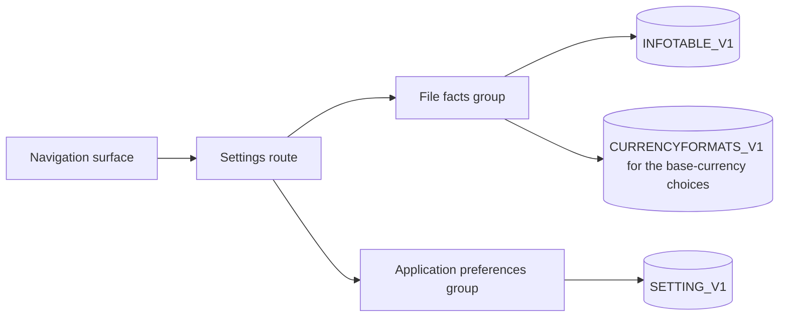
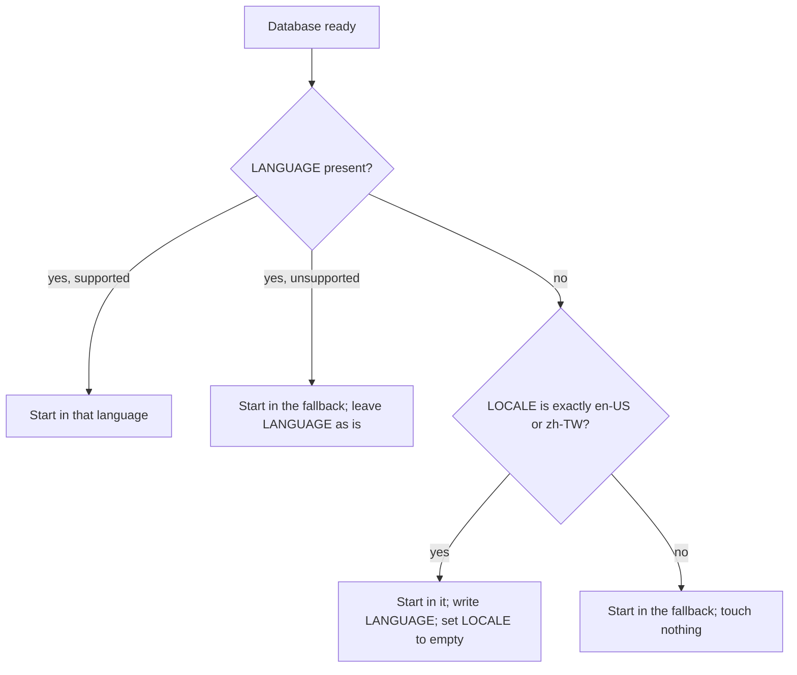

# File Metadata and Settings — Delta: Desktop Fidelity

**Change**: `file-metadata-and-settings-fidelity`
**Capability**: `file-metadata-and-settings`
**Version**: 1.2.0
**Last Updated**: 2026-10-02

Governed by [AGENTS.md](../../../AGENTS.md). Related change artifacts: proposal.md, design.md and tasks.md in this change's directory. Links are written relative to where this file is promoted, `openspec/specs/file-metadata-and-settings/spec.md`.

**Scope**: Corrects the settings surface so that every value it writes is one desktop MoneyManagerEx reads with the same meaning: the display language moves to the key and store desktop uses, the date format is restricted to desktop's masks, a base-currency change carries desktop's reset, the rate-history default matches desktop, the base-currency picker reads the file, retention is bounded, and failures are shown. Each divergence from desktop was put to the operator on 2026-10-02 under the UX divergence protocol; the decisions are recorded in design.md. Unchanged: Store Separation, Unknown Key Preservation, the custody requirements and Schema Fidelity.

## MODIFIED Requirements

### Requirement: Settings Surface

The application SHALL provide a settings surface at its own route, reachable from the navigation surface, presenting what the file records about itself separately from what the application records about its own behavior.

- The route SHALL be declared by this capability, per the route registry rule `app-shell-navigation` establishes, and SHALL be subject to the database-readiness guard because everything it shows comes from the database.
- The two groups SHALL be distinguishable by the user, reflecting the store separation this capability already requires: facts describing the data file, and preferences describing the application.
- Every value the surface presents SHALL be read from the database rather than from a cached copy that could disagree with it. The base-currency choices SHALL be the rows of `CURRENCYFORMATS_V1`, each labelled by its `CURRENCY_SYMBOL` and `CURRENCYNAME`; no bundled currency list SHALL stand in for the file's.
- Each field SHALL be saved on its own as it is changed (operator decision 2026-10-02: the web convention for a settings page, kept over desktop's batched OK/Cancel dialog).
- When a write fails, the surface SHALL show the failure and SHALL restore the field from the stored value, so the surface never shows a value the file does not hold.

*Caption: One surface, two groups, each reading and writing the store its meaning belongs to.*

Traceability: [src/pages/SettingsPage.vue](../../../src/pages/SettingsPage.vue), [src/stores/settings-store.ts](../../../src/stores/settings-store.ts), [src/router/index.ts](../../../src/router/index.ts), [src/domain/repos/metadata.ts](../../../src/domain/repos/metadata.ts), [src/domain/repos/currency.ts](../../../src/domain/repos/currency.ts).

#### Scenario: The settings surface is reachable and addressable

- **WHEN** the user chooses settings from the navigation surface
- **THEN** the application SHALL navigate to the settings route
- **AND** opening that route directly SHALL present the same surface

#### Scenario: Values shown are the values stored

- **WHEN** the settings surface is opened
- **THEN** each value it presents SHALL reflect what the database currently holds

#### Scenario: The base-currency choices are the file's currencies

- **WHEN** the file holds a currency that was added after the file was created, and lacks one that the bundled list contains
- **THEN** the added currency SHALL be offered as a base-currency choice
- **AND** the missing one SHALL NOT be offered

#### Scenario: A failed write is shown and the field restored

- **WHEN** the database refuses a write from the settings surface
- **THEN** the surface SHALL show the failure
- **AND** the field SHALL show the stored value again

### Requirement: Editing File Facts

The application SHALL let the user change the file facts it presents — the base currency, the user name, the date format, and whether exchange-rate history is used — and SHALL persist each by its key name.

- A change SHALL be written to `INFOTABLE_V1` addressed by `INFONAME`, never by row identifier, so no other fact is disturbed.
- Keys the surface does not present SHALL remain exactly as they were, as the capability's custody requirement already demands.
- Clearing the user name SHALL store the empty string under `USERNAME`.
- The date format SHALL be chosen from the masks desktop defines, shown with today's date rendered in each mask. The masks are:

  `%d %Mon %Y`, `%d %Mon %y`, `%d-%Mon-%Y`, `%d-%Mon-%y`, `%d %Mon'%y`, `%d %m %y`, `%d %m %Y`, `%d,%m,%y`, `%d.%m.%y`, `%d.%m.%Y`, `%d.%m'%Y`, `%d,%m,%Y`, `%d/%m %Y`, `%d/%m/%y`, `%d/%m/%Y`, `%d/%m'%y`, `%d/%m'%Y`, `%d-%m-%y`, `%d-%m-%Y`, `%w %d %Mon'%y`, `%m.%d.%y`, `%m.%d.%Y`, `%m/%d/%y`, `%m/%d/%Y`, `%m/%d'%y`, `%m/%d'%Y`, `%m-%d-%y`, `%m-%d-%Y`, `%y/%m/%d`, `%y-%m-%d`, `%Y %m %d`, `%Y.%m.%d`, `%Y/%m/%d`, `%Y%d%m`, `%Y%m%d`, `%Y-%m-%d`.

- A value outside that list SHALL NOT be written. A stored value outside the list SHALL be shown as stored and left untouched until the user chooses a mask.
- Changing the base currency SHALL follow Requirement "Base Currency Change Confirmation" and SHALL perform what `currency-management` Requirement "Base Currency" defines for a change of base.

Traceability: [mmex/moneymanagerex/src/util.cpp](../../../mmex/moneymanagerex/src/util.cpp) (`g_date_formats_map`), [mmex/moneymanagerex/src/optionsettingsgeneral.cpp](../../../mmex/moneymanagerex/src/optionsettingsgeneral.cpp) (the date-format choice and its sample), [src/domain/rules/metadata.ts](../../../src/domain/rules/metadata.ts), [src/domain/repos/metadata.ts](../../../src/domain/repos/metadata.ts), [src/pages/SettingsPage.vue](../../../src/pages/SettingsPage.vue).

#### Scenario: A fact is changed and nothing else moves

- **WHEN** the user changes the user name and saves
- **THEN** `INFOTABLE_V1` SHALL hold the new value under `USERNAME`
- **AND** every other row in that table SHALL be unchanged, including keys this build does not recognize

#### Scenario: Enabling rate history takes effect for conversions

- **WHEN** the user turns the currency-history setting on
- **THEN** subsequent conversions SHALL resolve rates from history as `currency-management` defines
- **AND** the stored fact SHALL reflect the new state

#### Scenario: A date format is chosen from desktop's masks

- **WHEN** the user chooses the format shown as today's date in day/month/year order with slashes
- **THEN** `INFOTABLE_V1` SHALL hold `%d/%m/%Y` under `DATEFORMAT`

#### Scenario: A stored format outside the list is preserved

- **WHEN** the file holds `YYYY-MM-DD` under `DATEFORMAT`
- **THEN** the surface SHALL show that value as stored
- **AND** SHALL NOT write `DATEFORMAT` until the user chooses a mask

### Requirement: Base Currency Change Confirmation

Changing the base currency SHALL be presented with its consequence stated and SHALL require explicit confirmation before anything is written.

- The consequence SHALL be stated as desktop states it: every currency's conversion rate is reset to 1 and all historical rates are deleted, so converted figures throughout the database change, including for periods already recorded.
- Declining the confirmation SHALL leave the stored base currency untouched and SHALL show the stored base currency as the selection again.
- Confirming SHALL perform the change as `currency-management` Requirement "Base Currency" defines, as one logical operation.
- The change SHALL remain available regardless of how much data the file already contains.

Traceability: [mmex/moneymanagerex/src/maincurrencydialog.cpp](../../../mmex/moneymanagerex/src/maincurrencydialog.cpp) (`SetBaseCurrency`), [mmex/moneymanagerex/src/optionsettingsgeneral.cpp](../../../mmex/moneymanagerex/src/optionsettingsgeneral.cpp) (the warning), [src/components/settings/BaseCurrencyChangeDialog.vue](../../../src/components/settings/BaseCurrencyChangeDialog.vue), [src/pages/SettingsPage.vue](../../../src/pages/SettingsPage.vue), [src/stores/settings-store.ts](../../../src/stores/settings-store.ts).

#### Scenario: The consequence is stated before the change

- **WHEN** the user selects a different base currency
- **THEN** the application SHALL state that conversion rates will be reset and historical rates deleted, and ask for confirmation
- **AND** SHALL write nothing until confirmed

#### Scenario: Declining leaves the file alone

- **WHEN** the user declines the confirmation
- **THEN** the stored base currency SHALL be unchanged
- **AND** the selection SHALL show the stored base currency

#### Scenario: Confirming performs the full change

- **WHEN** the user confirms a change of base currency
- **THEN** `BASECURRENCYID` SHALL reference the chosen currency, every `BASECONVRATE` SHALL be 1 and `CURRENCYHISTORY_V1` SHALL be empty
- **AND** all of it SHALL happen in one logical operation

### Requirement: Editing Application Preferences

The application SHALL let the user change the preferences it presents, beginning with the trash retention window, and SHALL persist each to `SETTING_V1` addressed by `SETTINGNAME`.

- The retention window SHALL be presented with its meaning: how long a deleted transaction stays recoverable before it is destroyed, and that zero means deletion is immediate.
- The retention window SHALL accept whole numbers of days from 0 through 999, the range desktop's control allows. An empty, non-numeric or out-of-range entry SHALL be refused with a message, nothing SHALL be written, and the field SHALL show the stored value again.
- A preference SHALL never be written to the file-facts store, nor a fact to the preferences store.

Traceability: [mmex/moneymanagerex/src/optionsettingsmisc.cpp](../../../mmex/moneymanagerex/src/optionsettingsmisc.cpp) (the retention control and its range), [src/domain/rules/metadata.ts](../../../src/domain/rules/metadata.ts), [src/stores/settings-store.ts](../../../src/stores/settings-store.ts), [openspec/specs/transaction-ledger/spec.md](../../../openspec/specs/transaction-ledger/spec.md).

#### Scenario: Retention window is changed

- **WHEN** the user sets the retention window to a different number of days within range
- **THEN** `SETTING_V1` SHALL hold the new value under its key
- **AND** subsequent purging SHALL use it, per `transaction-ledger`

#### Scenario: An empty retention entry is refused

- **WHEN** the user clears the retention field and leaves it
- **THEN** nothing SHALL be written
- **AND** the field SHALL show the stored value with a message that a number of days is required

#### Scenario: A preference never lands in the file-facts store

- **WHEN** any preference the surface presents is saved
- **THEN** the write SHALL target `SETTING_V1` and SHALL NOT create or modify a row in `INFOTABLE_V1`

### Requirement: Active Locale Persistence

The application SHALL persist the user's chosen display language as an application preference under the `LANGUAGE` key of `SETTING_V1`, in the canonical form desktop uses, and SHALL restore it when the database is opened.

- The stored form SHALL be desktop's canonical language name: `en_US` for the `en-US` locale and `zh_TW` for `zh-TW`. Reading SHALL accept that form and map it back to the locale.
- Choosing a language SHALL take effect immediately, whether chosen from the settings surface or from the shell, and the settings surface SHALL show the language the shell is using.
- When no database is open — during initialization, for example — the choice SHALL apply to the current session and SHALL be persisted once a database becomes available.
- A stored `LANGUAGE` the application does not support SHALL be ignored in favor of the fallback locale, and SHALL NOT be overwritten.
- The application SHALL NOT write `INFOTABLE_V1.LOCALE`, which desktop reads as the system locale for amount formatting, except in the one case below.
- When `LANGUAGE` is absent and `LOCALE` holds exactly `en-US` or `zh-TW`, a value only the earlier settings surface could have written, the application SHALL start in that language, write it under `LANGUAGE`, and set `LOCALE` to the empty string, which desktop reads as "derive the format from the currency settings". Any other `LOCALE` value SHALL be left untouched.

*Caption: How the language is resolved on open, including the one-time repair of a LOCALE the earlier surface wrote.*

Traceability: [mmex/moneymanagerex/src/option.cpp](../../../mmex/moneymanagerex/src/option.cpp) (`getLanguageID`, `setLocaleName`), [mmex/moneymanagerex/src/constants.cpp](../../../mmex/moneymanagerex/src/constants.cpp) (`LANGUAGE_PARAMETER`), [mmex/moneymanagerex/src/optionsettingsgeneral.cpp](../../../mmex/moneymanagerex/src/optionsettingsgeneral.cpp) (the locale field under Currency), [src/domain/rules/metadata.ts](../../../src/domain/rules/metadata.ts), [src/stores/settings-store.ts](../../../src/stores/settings-store.ts), [src/i18n.ts](../../../src/i18n.ts), [src/App.vue](../../../src/App.vue).

#### Scenario: The chosen locale survives a reload

- **WHEN** the user switches to `zh-TW` and later reopens the application against the same database
- **THEN** `SETTING_V1` SHALL hold `zh_TW` under `LANGUAGE`
- **AND** the application SHALL start in `zh-TW`

#### Scenario: Switching before a database is open

- **WHEN** the user switches language while the database is still being initialized
- **THEN** the interface SHALL change immediately
- **AND** the choice SHALL be written under `LANGUAGE` once the database is ready

#### Scenario: An unsupported stored locale is tolerated

- **WHEN** the stored `LANGUAGE` names a language this build does not provide
- **THEN** the application SHALL present the fallback locale
- **AND** SHALL leave the stored value in place

#### Scenario: Switching language leaves the formatting locale alone

- **WHEN** the file holds `de_DE.UTF-8` under `LOCALE` and the user switches language
- **THEN** `LOCALE` SHALL still hold `de_DE.UTF-8`

#### Scenario: A language the earlier surface wrote into LOCALE is repaired once

- **WHEN** the file holds no `LANGUAGE` and holds `zh-TW` under `LOCALE`
- **THEN** the application SHALL start in `zh-TW`, write `zh_TW` under `LANGUAGE`, and set `LOCALE` to the empty string

### Requirement: Well-Known File Facts

When the application creates a database or maintains file facts, it SHALL honor the upstream well-known keys.

- `DATAVERSION` SHALL be `3` for new databases and SHALL NOT be rewritten on open.
- `BASECURRENCYID` SHALL reference a row in `CURRENCYFORMATS_V1`; its consumption is governed by `currency-management`.
- `USERNAME`, `DATEFORMAT`, and financial-year start keys SHALL be read and written under their upstream names.
- `USECURRENCYHISTORY` SHALL read as on when the key is absent, as desktop reads it, and a new database SHALL hold it explicitly as `1`.

Traceability: [mmex/database/tables.sql](../../../mmex/database/tables.sql) (seed row `DATAVERSION` = `3`), [mmex/moneymanagerex/src/option.cpp](../../../mmex/moneymanagerex/src/option.cpp) (`getBool("USECURRENCYHISTORY", true)`), [src/domain/repos/metadata.ts](../../../src/domain/repos/metadata.ts), [src/stores/database-store.ts](../../../src/stores/database-store.ts).

#### Scenario: New database seeds the well-known facts

- **WHEN** the application creates a new database with a chosen base currency and optional user name
- **THEN** `INFOTABLE_V1` SHALL contain `DATAVERSION` = `3`, a `BASECURRENCYID` referencing the chosen currency, `USECURRENCYHISTORY` = `1`, and the user name when provided

#### Scenario: An absent history key reads as on

- **WHEN** a database holds no `USECURRENCYHISTORY` row
- **THEN** the application SHALL treat exchange-rate history as in use
- **AND** SHALL NOT write the key until the user changes the setting

### Requirement: File Information Presentation

The settings surface SHALL present the identifying properties of the open database read-only: its schema version and its data version.

- These SHALL be presented as translated text rather than raw diagnostic output.
- They SHALL NOT be editable, because they describe the file's format rather than the user's choices.
- A property the file does not hold SHALL be shown as not set; a default SHALL NOT be shown in its place.

Traceability: [src/stores/database-store.ts](../../../src/stores/database-store.ts), [src/stores/settings-store.ts](../../../src/stores/settings-store.ts), [src/domain/repos/metadata.ts](../../../src/domain/repos/metadata.ts), [src/pages/SettingsPage.vue](../../../src/pages/SettingsPage.vue).

#### Scenario: File information is shown and cannot be edited

- **WHEN** the settings surface is opened on a database whose `DATAVERSION` is `3`
- **THEN** the data version `3` and the schema version SHALL be shown
- **AND** neither SHALL be editable

#### Scenario: A missing data version is shown as not set

- **WHEN** the database holds no `DATAVERSION` row
- **THEN** the surface SHALL show the data version as not set
