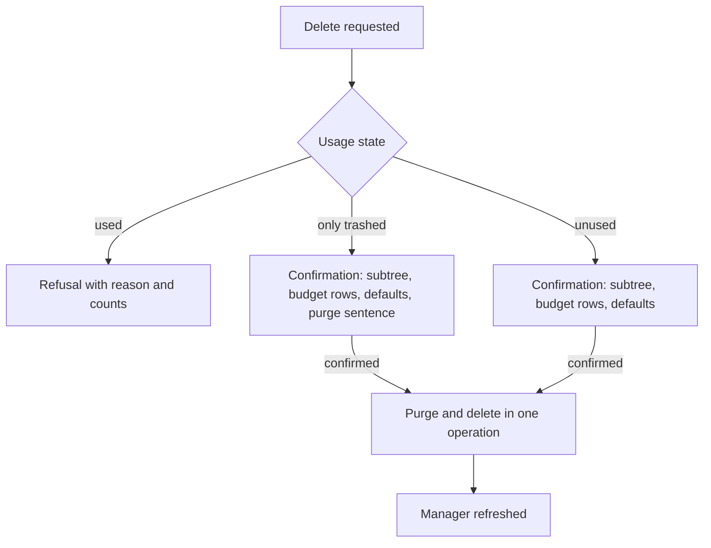
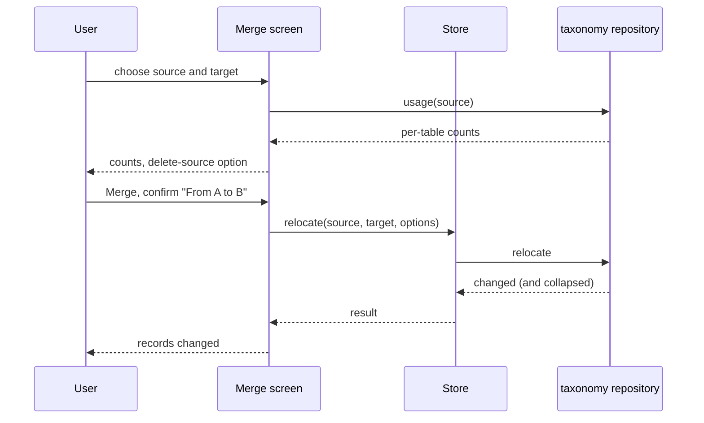

# Transaction Taxonomy — Delta: Management Surfaces

**Change**: `transaction-taxonomy-surfaces`
**Capability**: `transaction-taxonomy`
**Version**: 1.2.0
**Last Updated**: 2026-10-02

Governed by [AGENTS.md](../../../AGENTS.md). Links are written relative to where this file is promoted, `openspec/specs/transaction-taxonomy/spec.md`.

**Scope**: Adds the category, payee and tag managers and the three merge screens — desktop MoneyManagerEx's Category Manager, Payee Manager, Tag Manager and Tools → Merge dialogs. Every behavior they invoke is already specified by the 1.1.0 requirements (names, visibility, usage-guarded deletion, relocate and merge, show-hidden preferences); these requirements state how the surfaces present and confirm it. Operator decisions of 2026-10-02 (recorded in the design of `transaction-taxonomy-fidelity`) are cited where the surfaces deliberately differ from desktop.

## ADDED Requirements

### Requirement: Taxonomy Surface Routes

The application SHALL provide a category manager at `/categories`, a payee manager at `/payees` and a tag manager at `/tags`, each reachable from the navigation surface.

- The three routes SHALL be declared by this capability, per the route registry rule `app-shell-navigation` establishes, and SHALL be subject to the database-readiness guard.
- Editors, pickers, confirmations and merge screens SHALL be presented over their manager without routes of their own, as the account and currency surfaces do.

Traceability: desktop reaches the managers from the Tools menu ([mmex/moneymanagerex/src/mmframe.cpp](../../../mmex/moneymanagerex/src/mmframe.cpp)). Implementation: [src/router/index.ts](../../../src/router/index.ts), [src/pages/CategoriesPage.vue](../../../src/pages/CategoriesPage.vue), [src/pages/PayeesPage.vue](../../../src/pages/PayeesPage.vue), [src/pages/TagsPage.vue](../../../src/pages/TagsPage.vue).

#### Scenario: The managers are reachable

- **WHEN** the user navigates to `/categories`, `/payees` or `/tags` on a ready database
- **THEN** the corresponding manager SHALL be displayed

#### Scenario: The managers appear in navigation

- **WHEN** the navigation surface is shown
- **THEN** entries for categories, payees and tags SHALL be present
- **AND** selecting one SHALL navigate to its route

### Requirement: Category Manager Display

The category manager SHALL present the categories as the tree they form, with a search, a show-hidden toggle and the actions desktop's Category Manager offers.

- The tree SHALL show every root category with its subtree beneath it; expand-all and collapse-all SHALL be offered.
- The search SHALL match case-insensitively on a substring of the category's full name (root to leaf, joined with the file's delimiter), and a matching category SHALL be shown with its ancestors.
- Hidden categories SHALL be shown only while the show-hidden toggle is on; the toggle's initial state SHALL be the stored `SHOW_HIDDEN_CATEGS` preference (absent → on) and changing it SHALL write the preference. A hidden category that is shown SHALL be visibly marked as hidden.
- The selection SHALL offer New (a child of the selected category, or a top-level category when nothing is selected), Edit, Delete, Merge, Move to…, and Hide or Unhide according to the selection's state.

Traceability: [mmex/moneymanagerex/src/categdialog.cpp](../../../mmex/moneymanagerex/src/categdialog.cpp) (tree, search mask over `full_name`, "Show All" bound to `SHOW_HIDDEN_CATEGS`, buttons and context menu). Implementation: [src/pages/CategoriesPage.vue](../../../src/pages/CategoriesPage.vue), [src/stores/category-store.ts](../../../src/stores/category-store.ts).

#### Scenario: Search matches the full path

- **WHEN** the user types `snack` while `Food` has the subcategory `Snacks`
- **THEN** `Snacks` SHALL be shown under `Food`
- **AND** unrelated roots SHALL NOT be shown

#### Scenario: Hidden categories follow the preference

- **WHEN** the file stores `SHOW_HIDDEN_CATEGS` as false and the category `Old` is hidden
- **THEN** `Old` SHALL NOT be shown until the user turns the toggle on
- **AND** turning the toggle on SHALL store `SHOW_HIDDEN_CATEGS` as true and show `Old` marked as hidden

### Requirement: Category Creation, Renaming and Moving

The category manager SHALL let the user create, rename and move categories within the rules of Requirement "Category Tree Structure", presenting each refusal with its reason.

- Creation SHALL ask for a name and create the category under the selected parent, or at the top level; the new category SHALL be visible even under a hidden parent.
- Renaming SHALL offer the current name for editing; a rename that changes only letter case SHALL succeed.
- Moving SHALL present a picker of possible parents — every visible category that is not the category itself or one of its descendants, plus the top level — and SHALL confirm the move, stating the old and new parent, before it runs (operator decision 2026-10-02: a picker and a confirmation, not drag-and-drop).
- A refused name (empty, containing `:`, or duplicate among the new siblings) SHALL be reported next to the entry with desktop's reason, and nothing SHALL be written.

Traceability: [mmex/moneymanagerex/src/categdialog.cpp](../../../mmex/moneymanagerex/src/categdialog.cpp) (`OnAdd`, `OnEdit`, the colon and duplicate messages, drag-and-drop reparenting that the picker replaces). Implementation: [src/pages/CategoriesPage.vue](../../../src/pages/CategoriesPage.vue), [src/components/category/](../../../src/components/category/).

#### Scenario: A duplicate sibling is refused at the entry

- **WHEN** the user creates `food` under a parent that already has `Food`
- **THEN** the entry SHALL show that a category with this name already exists for the parent
- **AND** no category SHALL be created

#### Scenario: A move is confirmed and performed

- **WHEN** the user moves `Snacks` from `Food` to the top level through the picker and confirms
- **THEN** `Snacks` SHALL be shown as a root category afterwards

#### Scenario: A cyclic move is not offered

- **WHEN** the user opens the move picker for `Food`, which has the subcategory `Snacks`
- **THEN** neither `Food` nor `Snacks` SHALL be offered as the new parent

### Requirement: Category Visibility Actions

The category manager SHALL let the user hide and unhide categories per Requirement "Visibility via Active Flags".

- Hide and Unhide SHALL apply to the selected category and its whole subtree in one operation.
- An "Unhide all" action SHALL be offered that makes every category visible (operator decision 2026-10-02).

Traceability: [mmex/moneymanagerex/src/categdialog.cpp](../../../mmex/moneymanagerex/src/categdialog.cpp) (`MENU_ITEM_HIDE`, `MENU_ITEM_UNHIDE` over `sub_tree`). Implementation: [src/pages/CategoriesPage.vue](../../../src/pages/CategoriesPage.vue), [src/domain/repos/taxonomy.ts](../../../src/domain/repos/taxonomy.ts).

#### Scenario: Hiding takes the subtree

- **WHEN** the user hides `Food`, which has the subcategories `Groceries` and `Snacks`
- **THEN** all three SHALL be marked hidden and SHALL disappear while the show-hidden toggle is off

### Requirement: Category Deletion from the Surface

The category manager SHALL delete categories per Requirement "Usage-Guarded Deletion", always after a confirmation that states what goes.

- The confirmation SHALL name the category, list the subcategories deleted with it, and state that budget rows of the subtree are deleted and payee defaults pointing into it are cleared (operator decision 2026-10-02: always confirm; desktop confirms only the purge case).
- When only trashed transactions reference the category or its subtree, the confirmation SHALL additionally carry desktop's statement that deleted transactions exist and will be purged; confirming SHALL purge them with the deletion.
- When the category is used, the action SHALL be refused with desktop's reason ("Category in use" or "Subcategory in use", with the tip to merge) and the live reference counts; nothing SHALL be written.
- A failed deletion SHALL be reported on the manager and the category SHALL remain listed.

*Caption: Deletion from the category manager — refuse, confirm with purge, or confirm.*

Traceability: [mmex/moneymanagerex/src/categdialog.cpp](../../../mmex/moneymanagerex/src/categdialog.cpp) (`mmDoDeleteSelectedCategory`, `showCategDialogDeleteError`). Implementation: [src/pages/CategoriesPage.vue](../../../src/pages/CategoriesPage.vue), [src/stores/category-store.ts](../../../src/stores/category-store.ts).

#### Scenario: Deletion with subtree is confirmed

- **WHEN** the user deletes the unused category `Food`, which has the subcategory `Snacks`
- **THEN** the confirmation SHALL list `Snacks`
- **AND** confirming SHALL remove both and refresh the tree

#### Scenario: Purge is disclosed

- **WHEN** the user deletes a category referenced only by trashed transactions
- **THEN** the confirmation SHALL state that the deleted transactions will be purged
- **AND** confirming SHALL remove the transactions and the category in one operation

#### Scenario: Live use is refused on the surface

- **WHEN** the user deletes a category whose subcategory is referenced by a live transaction
- **THEN** the manager SHALL show that the subcategory is in use, with the count, and offer the merge tip
- **AND** the category SHALL remain

### Requirement: Payee Manager Display

The payee manager SHALL list payees with desktop's columns, a search, a show-hidden toggle, and a selection the actions apply to.

- The columns SHALL be Name, Hidden, the default category titled "Default Category" or "Last Used Category" according to the default-category mode, Reference (`NUMBER`), Website, Notes, Match Pattern (the patterns joined by a space) and Used.
- Used SHALL be the number of live transactions plus the number of scheduled series referencing the payee, read in one query for the whole list.
- The search SHALL match case-insensitively on a substring of the name.
- Hidden payees SHALL be shown only while the show-hidden toggle is on; the toggle's initial state SHALL be the stored `SHOW_HIDDEN_PAYEES` preference (absent → on) and changing it SHALL write the preference. A hidden payee that is shown SHALL be visibly marked.
- On a narrow viewport the list SHALL present each payee as a card carrying the same fields, per the responsive-hybrid stance (operator decision 2026-08-08).
- One or many payees SHALL be selectable; the actions of Requirement "Payee Selection Actions" apply to the selection.

Traceability: [mmex/moneymanagerex/src/payeedialog.cpp](../../../mmex/moneymanagerex/src/payeedialog.cpp) (columns, the usage pass over live transactions and series, `FilterPayees`, `SHOW_HIDDEN_PAYEES`). Implementation: [src/pages/PayeesPage.vue](../../../src/pages/PayeesPage.vue), [src/stores/payee-store.ts](../../../src/stores/payee-store.ts), [src/domain/repos/taxonomy.ts](../../../src/domain/repos/taxonomy.ts) (bulk usage counts).

#### Scenario: The default-category column follows the mode

- **WHEN** the file's `TRANSACTION_CATEGORY_NONE` is absent or `1`
- **THEN** the column SHALL be titled "Last Used Category"
- **AND** with `3` it SHALL be titled "Default Category"

#### Scenario: Used counts live transactions and series

- **WHEN** a payee is referenced by two live transactions, one trashed transaction and one scheduled series
- **THEN** its Used cell SHALL show `3`

### Requirement: Payee Editing

The payee manager SHALL create and edit payees with desktop's fields, within Requirements "Payee Records" and "Payee Pattern Custody".

- The editor SHALL carry Payee (name), Hidden, the default category (titled per the mode) with a category picker that offers visible categories and keeps a hidden current value, Reference, Website, Notes, and the match patterns as an editable list of lines.
- Saving SHALL refuse an empty name, a duplicate name, an invalid website and an invalid `regex:` pattern, each reported next to its field with desktop's wording; nothing SHALL be written on a refusal.
- Saving a payee whose other fields changed SHALL leave `PATTERN` untouched unless the pattern list was edited.

Traceability: [mmex/moneymanagerex/src/payeedialog.cpp](../../../mmex/moneymanagerex/src/payeedialog.cpp) (`mmEditPayeeDialog`). Implementation: [src/components/payee/](../../../src/components/payee/), [src/stores/payee-store.ts](../../../src/stores/payee-store.ts).

#### Scenario: An invalid website is reported at its field

- **WHEN** the user saves a payee whose website is `not a url`
- **THEN** the website field SHALL show "Please enter a valid URL"
- **AND** nothing SHALL be written

#### Scenario: Patterns are edited as lines

- **WHEN** the user adds the line `regex:^AMZN` to a payee with the pattern `AMAZON*` and saves
- **THEN** the stored `PATTERN` SHALL be the object with `"0": "AMAZON*"` and `"1": "regex:^AMZN"`

### Requirement: Payee Selection Actions

The payee manager SHALL offer desktop's selection actions over one or many selected payees, each as one operation.

- Hide Selected and Show Selected SHALL set the hidden state of every selected payee.
- Define Category SHALL set the default category of every selected payee to a category chosen from a picker; Remove Category SHALL clear it (`-1`).
- Remove SHALL delete the selected payees per Requirement "Payee Deletion from the Surface".
- Merge Payee SHALL open the merge screen with the selected payee as the source (single selection).

Traceability: [mmex/moneymanagerex/src/payeedialog.cpp](../../../mmex/moneymanagerex/src/payeedialog.cpp) (`OnItemRightClick` menu: Hide Selected, Show Selected, Remove, Define Category, Remove Category, Merge Payee). Implementation: [src/pages/PayeesPage.vue](../../../src/pages/PayeesPage.vue), [src/domain/repos/taxonomy.ts](../../../src/domain/repos/taxonomy.ts) (`setHiddenStatements`, `setDefaultCategoryStatements`, `removeMany`).

#### Scenario: A default category is defined for a selection

- **WHEN** the user selects three payees, chooses Define Category and picks `Food`
- **THEN** all three SHALL show `Food` as their default category afterwards

### Requirement: Payee Deletion from the Surface

The payee manager SHALL delete payees per Requirement "Usage-Guarded Deletion", always after a confirmation.

- The confirmation SHALL name the payees to be deleted; when any of them is referenced only by trashed transactions it SHALL carry desktop's purge statement, and confirming SHALL purge those transactions with the deletion.
- A used payee SHALL be refused with desktop's reason ("Payee in use") and the counts; in a multi-selection the deletable payees SHALL be deleted and the refused ones reported by name.
- A failed deletion SHALL be reported on the manager.

Traceability: [mmex/moneymanagerex/src/payeedialog.cpp](../../../mmex/moneymanagerex/src/payeedialog.cpp) (`OnDeletePayee`). Implementation: [src/pages/PayeesPage.vue](../../../src/pages/PayeesPage.vue), [src/stores/payee-store.ts](../../../src/stores/payee-store.ts).

#### Scenario: A mixed selection is partly deleted

- **WHEN** the user deletes a selection of one used and one unused payee and confirms
- **THEN** the unused payee SHALL be removed
- **AND** the manager SHALL report that the used payee was kept, with its counts

### Requirement: Tag Manager Display

The tag manager SHALL list tags with a search, a usage count, and the actions desktop's Tag Manager offers.

- Each tag SHALL show its name and the number of live transactions, split lines, scheduled series and series split lines carrying it, read in one query for the whole list (operator decision 2026-10-02: counts in the manager).
- The search SHALL match case-insensitively on a substring of the name.
- One or many tags SHALL be selectable; Add, Edit (single selection), Delete and Merge (single selection) SHALL be offered. No hide action SHALL exist, because tags are never hidden.

Traceability: [mmex/moneymanagerex/src/tagdialog.cpp](../../../mmex/moneymanagerex/src/tagdialog.cpp) (list with check selection, search, Add, Edit, Delete). Implementation: [src/pages/TagsPage.vue](../../../src/pages/TagsPage.vue), [src/stores/tag-store.ts](../../../src/stores/tag-store.ts).

#### Scenario: Tags list their use

- **WHEN** the tag `travel` is carried by two live transactions and one split line of a trashed transaction
- **THEN** its count SHALL show `2`

### Requirement: Tag Creation and Renaming

The tag manager SHALL create and rename tags within Requirement "Tags and Polymorphic Tag Links", presenting each refusal with desktop's reason.

- Creation and renaming SHALL ask for a name; a space, the names `&` and `|`, an empty name and a duplicate SHALL be reported next to the entry with desktop's wording, and nothing SHALL be written.

Traceability: [mmex/moneymanagerex/src/tagdialog.cpp](../../../mmex/moneymanagerex/src/tagdialog.cpp) (`OnAdd`, `OnEdit`, `validateName`). Implementation: [src/pages/TagsPage.vue](../../../src/pages/TagsPage.vue), [src/components/tag/](../../../src/components/tag/).

#### Scenario: A reserved name is refused at the entry

- **WHEN** the user creates a tag named `summer trip`
- **THEN** the entry SHALL show desktop's message that the space character is not allowed in a tag name
- **AND** no tag SHALL be created

### Requirement: Tag Deletion from the Surface

The tag manager SHALL delete the selected tags per Requirement "Usage-Guarded Deletion", always after a confirmation.

- The confirmation SHALL name the tags; when any is referenced only by trashed transactions it SHALL carry desktop's purge statement for that tag, and confirming SHALL purge those transactions with the deletion.
- A used tag SHALL be refused with desktop's reason ("Tag 'name' in use"); in a multi-selection the deletable tags SHALL be deleted and the refused ones reported by name, as desktop continues past them.

Traceability: [mmex/moneymanagerex/src/tagdialog.cpp](../../../mmex/moneymanagerex/src/tagdialog.cpp) (`OnDelete`). Implementation: [src/pages/TagsPage.vue](../../../src/pages/TagsPage.vue), [src/stores/tag-store.ts](../../../src/stores/tag-store.ts).

#### Scenario: Deleting a used tag is refused by name

- **WHEN** the user deletes a selection containing the used tag `travel`
- **THEN** the manager SHALL report "Tag 'travel' in use"
- **AND** `travel` SHALL remain

### Requirement: Merge Screens

Each manager SHALL offer a merge screen performing Requirement "Relocate and Merge" for its kind, presenting desktop's Merge dialog.

- The source list SHALL offer only used entities; the target list SHALL offer only visible entities other than the source (operator decision 2026-10-02).
- Before merging, the screen SHALL show desktop's per-table counts for the source: transactions, split transactions, scheduled transactions, scheduled split transactions, and for categories also default payee category and budget.
- A "Delete source after merge" option SHALL be offered, off by default; for a category with subcategories it SHALL be unavailable with desktop's note.
- Merge SHALL be confirmed with "From <source> to <target>"; afterwards the screen SHALL report the number of records changed, and for tags also the number of links collapsed.
- A refusal (same entity, hidden target) SHALL be shown on the screen and nothing SHALL be written.

*Caption: The merge screen shows what will change, confirms, and reports what changed.*

Traceability: [mmex/moneymanagerex/src/relocatecategorydialog.cpp](../../../mmex/moneymanagerex/src/relocatecategorydialog.cpp), [mmex/moneymanagerex/src/relocatepayeedialog.cpp](../../../mmex/moneymanagerex/src/relocatepayeedialog.cpp), [mmex/moneymanagerex/src/relocatetagdialog.cpp](../../../mmex/moneymanagerex/src/relocatetagdialog.cpp). Implementation: [src/components/taxonomy/MergeDialog.vue](../../../src/components/taxonomy/MergeDialog.vue), the three stores.

#### Scenario: Counts are shown before the merge

- **WHEN** the user picks a source category referenced by two transactions, one split line and one budget row
- **THEN** the screen SHALL show those counts before the merge runs

#### Scenario: The merge reports what changed

- **WHEN** the user confirms merging payee `A` into `B` while `A` is referenced by three records
- **THEN** the screen SHALL report three records changed
- **AND** `A` SHALL remain listed unless the delete-source option was on

### Requirement: Refusal Presentation

Every refusal the taxonomy repository raises SHALL be presented in the user's language on the surface that caused it, never as a raw error.

- Name refusals (empty, colon, space, reserved, duplicate) SHALL appear at the entry field with desktop's wording.
- In-use refusals SHALL name the kind and show the live counts per table; the purge case SHALL become a confirmation, not a refusal.
- Merge refusals (same entity, hidden target, source has children) and payee validation refusals (name, website, pattern with its line) SHALL appear on the screen or at the field they concern.
- A write that fails in the database SHALL be reported on the manager with the entity unchanged in the list.

Traceability: the typed errors of [src/domain/repos/taxonomy.ts](../../../src/domain/repos/taxonomy.ts) (`TaxonomyNameError`, `TaxonomyInUseError`, `TaxonomyMergeError`, `PayeeValidationError`); the message strings of [mmex/moneymanagerex/src/categdialog.cpp](../../../mmex/moneymanagerex/src/categdialog.cpp), [mmex/moneymanagerex/src/payeedialog.cpp](../../../mmex/moneymanagerex/src/payeedialog.cpp), [mmex/moneymanagerex/src/tagdialog.cpp](../../../mmex/moneymanagerex/src/tagdialog.cpp). Implementation: [src/locales/](../../../src/locales/), the three pages.

#### Scenario: A refusal is translated

- **WHEN** the user's language is Traditional Chinese and a tag name is refused for containing a space
- **THEN** the message SHALL be shown in Traditional Chinese
- **AND** no reason code SHALL reach the user
