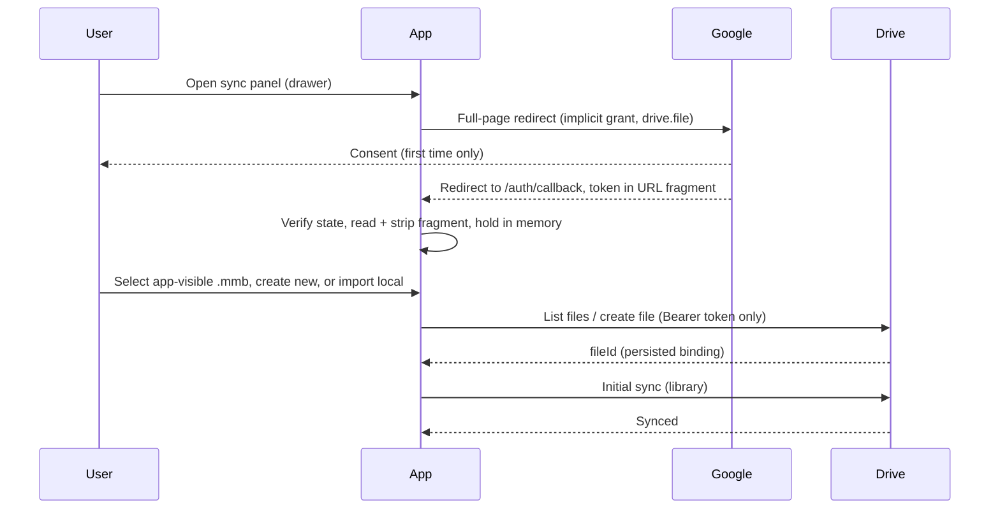
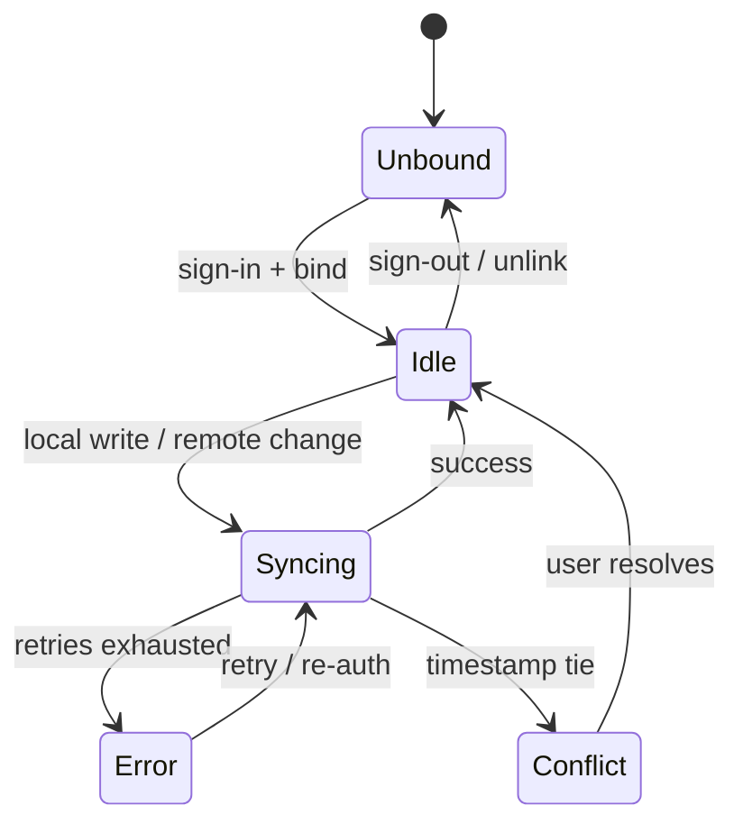

# Cloud File Sync — Delta: New Capability

**Change**: `cloud-file-sync`
**Capability**: `cloud-file-sync`
**Version**: 1.1.0
**Last Updated**: 2026-07-18

**Scope**: Optional Google sign-in, Drive file binding, bidirectional synchronization of the client-side database file, conflict resolution, and sync-status presentation. This capability builds on the infrastructure governed by `infrastructure-baseline` (OPFS persistence, cross-origin isolation, the `opfs-cloud-file` governed component) and does not alter database schema or financial logic.

## ADDED Requirements

### Requirement: Optional Google Sign-In

The application SHALL offer Google sign-in as an optional feature that enables cloud synchronization, and SHALL remain fully functional without it.

- Sign-in SHALL be initiated explicitly by the user from the sync surface; no application feature other than cloud sync SHALL require it.
- Authorization SHALL use the minimal `drive.file` scope, granting access only to files this application created.
- The access token SHALL be held in memory only — never persisted to storage — and expiry SHALL be handled by first attempting renewal without user interaction (which MAY involve a same-tab navigation round-trip), falling back to an explicit re-authentication prompt when non-interactive renewal fails.
- Signing out SHALL revoke the in-memory session, stop synchronization, and leave the local database untouched.

The sign-in, binding, and first-sync flow:

*Caption: Sign-in through first sync — the token stays in memory; only the file binding persists.*

Traceability: [src/App.vue](../../../src/App.vue), [src/locales/](../../../src/locales/), [.env.example](../../../.env.example).

#### Scenario: User signs in from the sync surface

- **WHEN** the user initiates Google sign-in from the sync surface and completes consent
- **THEN** the application SHALL hold an access token scoped to `drive.file` in memory
- **AND** no token material SHALL be written to any persistent storage

#### Scenario: Application works without signing in

- **WHEN** a user never signs in
- **THEN** every non-sync feature SHALL behave exactly as before this capability existed

#### Scenario: User signs out

- **WHEN** a signed-in user signs out
- **THEN** the in-memory token SHALL be discarded, synchronization SHALL stop, and the local database SHALL remain intact

### Requirement: Drive File Binding

The application SHALL let a signed-in user bind the local database to exactly one Google Drive file — by selecting an app-visible database file, creating a new one, or importing a local file — and SHALL let the user sever that binding.

- File selection SHALL use an application-rendered file browser backed by the authenticated Drive file listing. No third-party picker service SHALL be embedded, and no credential beyond the user's access token SHALL be required for selection.
- The listing covers files this application created under its own OAuth client — which holds across devices, so a database created on one device is selectable on another. Files the application did not create are outside the `drive.file` grant; they SHALL be brought into sync via local import: the user opens the file from local storage, it replaces the local database through the existing initialization flow, and the application creates its own Drive copy.
- The binding (file identifier) SHALL persist across sessions; the access token SHALL NOT.
- Severing the binding SHALL stop synchronization and leave both the local and the remote file intact.

Traceability: [.env.example](../../../.env.example) (`VITE_GOOGLE_CLIENT_ID` is the sole Google credential), [src/stores/database-store.ts](../../../src/stores/database-store.ts) (import reuses the initialization flow).

#### Scenario: Bind to an app-visible Drive database

- **WHEN** a signed-in user selects a `.mmb` file from the application's Drive file browser
- **THEN** the application SHALL persist that file's identifier as the sync binding
- **AND** synchronization SHALL begin against that file

#### Scenario: Database created on another device is selectable

- **WHEN** the user signs in on a second device where the application created a Drive database from the first device
- **THEN** the file browser SHALL list that database and binding to it SHALL succeed

#### Scenario: Import a pre-existing database file

- **WHEN** the user imports a `.mmb` file from local storage
- **THEN** the application SHALL replace the local database with it and reinitialize database state before further use
- **AND** the imported database SHALL then be bindable to Drive by creating a new app-owned Drive file

#### Scenario: Create a new Drive database file

- **WHEN** a signed-in user chooses to create a new Drive file
- **THEN** the application SHALL create it on Drive, persist its identifier, and upload the current local database as its initial content

#### Scenario: Sever the binding

- **WHEN** the user unlinks the Drive file
- **THEN** synchronization SHALL stop and neither the local nor the remote file SHALL be modified or deleted

### Requirement: Bidirectional Database Synchronization

While signed in and bound, the application SHALL keep the local database and the bound Drive file synchronized in both directions using the governed sync component's semantics.

- Local database writes SHALL trigger upload, debounced so bursts of writes coalesce.
- Remote changes SHALL be detected by polling and downloaded; after a remote download replaces the local file, the application SHALL reload its database state before further use.
- When both sides changed, the newer modification timestamp SHALL win automatically; only a timestamp tie SHALL escalate to manual resolution.
- Synchronization failures SHALL retry with exponential backoff per the governed component; authorization failures (401) SHALL NOT retry but SHALL prompt re-authentication.

Sync engine states:

*Caption: Sync lifecycle — conflicts and errors are explicit states the user can see and act on, never silent.*

Traceability: [src/workers/db-client.ts](../../../src/workers/db-client.ts), [src/stores/database-store.ts](../../../src/stores/database-store.ts).

#### Scenario: Local write is uploaded

- **WHEN** the user modifies the database and the debounce window elapses
- **THEN** the application SHALL upload the database to the bound Drive file
- **AND** the sync status SHALL pass through syncing to synced

#### Scenario: Remote change is downloaded

- **WHEN** polling detects that the bound Drive file changed remotely
- **THEN** the application SHALL download it, replace the local database file, and reload database state before accepting further queries

#### Scenario: Authorization expires mid-session

- **WHEN** a sync operation fails with an authorization error
- **THEN** the application SHALL NOT retry blindly but SHALL surface a re-authentication prompt, and SHALL resume synchronization after successful re-authentication

### Requirement: Manual Conflict Resolution

When the sync component reports a conflict requiring manual resolution, the application SHALL present a blocking decision surface and SHALL NOT overwrite either side until the user decides.

- The decision surface SHALL show both sides' modification timestamps and content checksums, and SHALL offer exactly two resolutions: keep the local version or keep the remote version.
- The dialog SHALL be dismissible only by choosing a resolution; synchronization SHALL pause while undecided.

Traceability: [src/components/database/](../../../src/components/database/) (conflict dialog joins the existing database dialog family).

#### Scenario: Timestamp tie escalates to the user

- **WHEN** the sync component reports a conflict with equal local and remote timestamps
- **THEN** the application SHALL present a blocking dialog showing both timestamps and checksums
- **AND** SHALL apply only the version the user chooses, uploading or downloading accordingly

### Requirement: Sync Status Presentation

The application SHALL make the current synchronization state visible at all times while a binding exists, following the Material Design conventions of the governed component library.

- The states unbound, idle/synced, syncing, error, and conflict SHALL each be visually distinguishable.
- Errors SHALL present an actionable message (retry, or re-authenticate for authorization failures) rather than a bare failure.
- All new interface surfaces in this capability SHALL be built from the governed component library's Material Design components and SHALL follow its interaction patterns (dialogs for blocking decisions, non-blocking notifications for transient outcomes, persistent indicators for ongoing state).
- All user-facing strings SHALL be externalized to the locale catalogs in both supported locales.

Traceability: [src/App.vue](../../../src/App.vue), [src/locales/en-US.json](../../../src/locales/en-US.json), [src/locales/zh-TW.json](../../../src/locales/zh-TW.json).

#### Scenario: Status is visible during sync

- **WHEN** a synchronization is in progress
- **THEN** a persistent Material indicator SHALL show the syncing state, transitioning to a synced indication on success

#### Scenario: Error offers an action

- **WHEN** synchronization enters the error state
- **THEN** the presented message SHALL name the failure class and offer the applicable action (retry, or re-authenticate)

#### Scenario: Strings are localized

- **WHEN** the user switches the active locale
- **THEN** every sync-related string SHALL render in the selected locale
