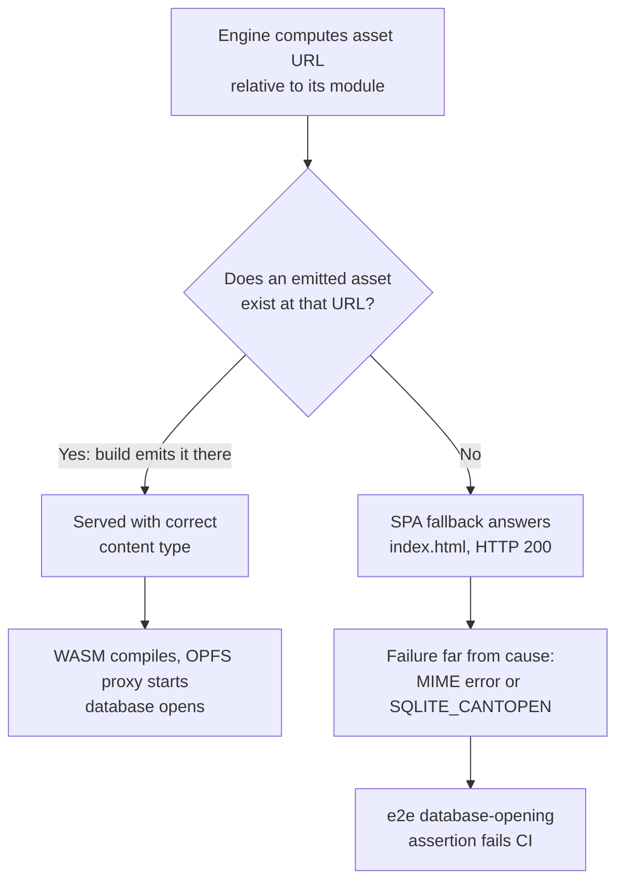

# Infrastructure Baseline — Delta: WASM Asset Resolution

**Change**: `fix-wasm-path-resolution`
**Capability**: `infrastructure-baseline`
**Version**: 1.0.0
**Last Updated**: 2026-07-18

## ADDED Requirements

### Requirement: Production Binary Asset Resolution

Runtime-fetched binary assets (WebAssembly modules and worker scripts) SHALL be resolved through the build system, so that every environment loads exactly the artifact the build emitted. Implicit, location-relative resolution SHALL NOT be relied upon, because content hashing renames emitted assets and the single-page-application fallback masks missing paths with a successful HTML response instead of a failure.

- Every URL the embedded SQL engine requests at runtime (its WebAssembly binary and its OPFS helper worker) SHALL correspond to a real asset emitted by the build, in every environment: development server, preview server, and deployed host.
- Runtime-fetched assets that are addressed by fixed names SHALL be served with content-correct caching: the service worker SHALL precache them with content-based revisions, so an upgraded dependency can never pair a new bundle with a stale cached binary.
- The end-to-end suite SHALL assert, against a built artifact, that the browsing context is cross-origin isolated and that a database actually opens — so a regression in asset resolution, isolation headers, or engine initialization fails continuous integration instead of shipping.

*Caption: The engine's URL computation cannot be overridden, so the build must guarantee a real asset exists at every URL it computes — and the end-to-end assertion turns any regression into a CI failure instead of a shipped defect.*

Traceability: [src/workers/sqlite.worker.ts](../../../../../src/workers/sqlite.worker.ts), [e2e/vue.spec.ts](../../../../../e2e/vue.spec.ts), [vite.config.ts](../../../../../vite.config.ts).

#### Scenario: Database opens in a built artifact

- **WHEN** the end-to-end suite runs against a preview of the production build
- **THEN** `window.crossOriginIsolated` SHALL evaluate to `true`
- **AND** the database SHALL initialize to the point that the application leaves its loading state (the new-database wizard or the ready state appears)

#### Scenario: Engine asset requests are answered by real assets

- **WHEN** the built worker fetches the SQL engine's WebAssembly binary and its OPFS helper worker
- **THEN** each request SHALL be answered by an emitted asset with the correct content type
- **AND** no engine asset request SHALL be answered by the single-page-application fallback

#### Scenario: Resolution regression is caught before deployment

- **WHEN** a change reintroduces implicit script-directory WASM resolution
- **THEN** the end-to-end database-opening assertion SHALL fail in continuous integration
- **AND** the deploy job SHALL be unreachable
