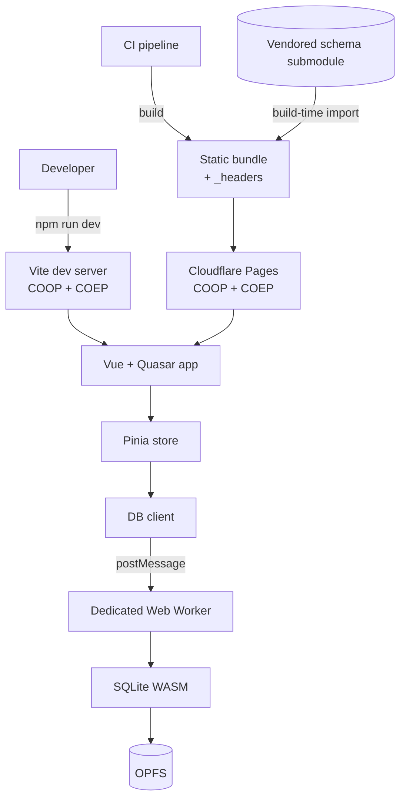

# Infrastructure Baseline — Design

**Change**: `infrastructure-baseline`
**Version**: 1.0.0
**Last Updated**: 2026-07-16

Related artifacts: [proposal.md](./proposal.md) (motivation), [specs/infrastructure-baseline/spec.md](./specs/infrastructure-baseline/spec.md) (requirements), [tasks.md](./tasks.md) (implementation steps). Governed by [AGENTS.md](../../AGENTS.md).

## Context

`mmex-pwa` ports the MoneyManagerEx desktop application (C++/wxWidgets, vendored under `mmex/`) to a browser-native Progressive Web App. The defining architectural constraint is that the application is **client-only**: there is no backend. The user's financial database is a real SQLite database compiled to WebAssembly, executed in a dedicated Web Worker, and persisted in the browser's origin-private file system (OPFS). Optional Google Drive sync moves that file to and from the cloud.

That single constraint drives most of the infrastructure:

- SQLite-WASM's OPFS backend depends on `SharedArrayBuffer`, which browsers expose **only in cross-origin isolated contexts**. Cross-origin isolation requires `COOP: same-origin` plus a `COEP` value on the response serving the document. This is currently configured on the dev server only — it is not a preference, it is a precondition, and it must hold in production too.
- The database schema is not ours to invent; it is vendored from the upstream `moneymanagerex/database` repository as a pinned git submodule and consumed at build time.

The current state of the repository:

- **Present and healthy**: Vue 3 + Quasar + TypeScript (strict) on Vite; PWA via Workbox; SQLite-WASM worker with `PRAGMA user_version` migrations; Pinia/vue-router/vue-i18n; ESLint (flat) + Prettier + EditorConfig; Vitest and Playwright configured.
- **Missing**: any specification governing the above; pre-commit enforcement; CI beyond unit tests; a deployment target of any kind; exact runtime pinning; a committed `.env.example`; a customized PWA manifest.

`openspec/specs/` is empty. This change writes the first capability spec.

*Caption: System architecture — both the dev server and the production host must supply cross-origin isolation for the persistence layer to function.*

## Goals / Non-Goals

**Goals:**

- Establish `infrastructure-baseline` as the first governed capability, recording the current stack as the managed baseline so future tool changes require an explicit, reviewable OpenSpec change.
- Make cross-origin isolation an explicit, environment-independent requirement rather than an undocumented dev-server detail.
- Close the identified best-practice gaps by specifying them normatively: runtime pinning, pre-commit gate, full CI gate, deployment, secrets documentation, PWA manifest.
- Give contributors one authoritative document answering "what does this project need in order to build, test, and ship?"

**Non-Goals:**

- Specifying **any** application or business logic — accounts, transactions, budgets, reports, financial rules, or the semantics of the vendored database schema. Those belong to future capability specs.
- Implementing the gap-closing work. This change produces the specification and the task list; implementation happens under `/opsx:apply`.
- Redesigning the existing, working stack. The current choices are ratified, not relitigated.
- Specifying the Google Drive sync feature itself (only the infrastructure it depends on: the `VITE_*` configuration contract and COEP compatibility).

## Decisions

### D1: One capability, not several

`infrastructure-baseline` is a single capability covering runtime through deployment.

**Rationale**: These concerns share one rationale chain (client-only SQLite-WASM → cross-origin isolation → hosting choice → CI that verifies it). Splitting into `build-system`, `quality-gates`, and `deployment` would scatter that chain across files and invite drift, and the request was explicitly for *one* infrastructure baseline spec.
**Alternatives considered**: Multiple capabilities per concern — rejected as premature decomposition for a spec with no consumers yet. Revisit if the spec exceeds a comfortable review size.

### D2: Capability-level requirements plus a governed stack table

Requirement bodies state the *capability* ("an embedded SQL engine compiled to WebAssembly, executed off the main thread"); a single `Requirement: Governed Technology Stack Baseline` carries a table naming the concrete components and versions.

**Rationale**: [AGENTS.md](../../AGENTS.md) mandates implementation-agnostic specs (WHAT, not HOW), while the operator explicitly requires the spec to name the tech stack. This structure satisfies both without a documented deviation: the requirements remain portable, and the table gives verifiable traceability and a change-control point. Crucially, it makes stack changes *reviewable* — swapping a bundler now requires amending a normative table, not just editing a config file.
**Alternatives considered**: (a) Naming tools directly inside each requirement — most verifiable but conflicts with AGENTS.md and would have required operator-approved deviation. (b) Relegating tools to a non-normative appendix — most agnostic, but the stack would not be governed at all, defeating the purpose. The operator selected this middle path.

### D3: Cloudflare Pages as the deployment target

**Rationale**: The deciding factor is COOP/COEP. Cross-origin isolation requires setting custom response headers, and the candidates differ sharply on this:

| Host | Custom headers | Verdict |
|---|---|---|
| **Cloudflare Pages** | Native, via a `_headers` file in build output | **Selected** — headers are a first-class, in-repo artifact |
| GitHub Pages | **Not supported** | Rejected — would force a `coi-serviceworker` shim, adding a fragile moving part to a hard precondition |
| Vercel / Netlify | Supported (`vercel.json` / `netlify.toml`) | Viable alternative; no decisive advantage |

Cloudflare Pages also offers a generous static-hosting free tier and a clean CI deploy path. The `_headers` file lives in the repository, so the isolation contract is version-controlled and reviewable alongside the code that depends on it.
**Trade-off**: Introduces a new external account dependency. Mitigated by the fact that the requirement is written at the capability level ("the deployed site SHALL emit the isolation headers"), so migrating hosts later would change `tasks.md` and one config file, not the spec's intent.

### D4: Defense in depth — pre-commit gate *and* CI gate

Both a `pre-commit` hook and a full CI pipeline are specified.

**Rationale**: They serve different purposes. The hook gives fast local feedback and keeps shared history clean; CI is the authoritative, unbypassable gate (hooks can be skipped with `--no-verify`). Specifying only CI wastes contributor time on trivial round-trips; specifying only hooks leaves the merge gate unenforced.
**Trade-off**: Hook latency. Mitigated by scoping the hook to *staged files* where the tooling allows, and by leaving the expensive suites (e2e, full build) to CI only.

### D5: COEP `require-corp` **or** `credentialless`

`Requirement: Cross-Origin Isolation` accepts either COEP value.

**Rationale**: `require-corp` is the stricter, better-supported choice and is what the dev server uses today. However, it requires every cross-origin subresource to opt in via CORP/CORS — and this project intends to integrate Google Sign-In and Google Drive, whose endpoints and popups are cross-origin and may not cooperate. `credentialless` relaxes this by sending such requests without credentials while preserving isolation. Because the OAuth integration is not yet wired up, pinning one value now would be guessing. Specifying the *outcome* (`crossOriginIsolated === true`) and permitting either mechanism keeps the requirement verifiable while leaving the implementation room to resolve the Google interaction empirically.
**Alternatives considered**: Mandating `require-corp` — rejected as premature; it could force a spec amendment the moment Drive sync lands.

### D6: Build artifacts are produced by CI, never committed

**Rationale**: A committed build directory diverges silently from source and makes reviews noisy. Making CI the sole producer of deployed bundles guarantees that what ships is what passed the gate. The repository is compliant today — `dist/` exists locally but is correctly gitignored and untracked — so this requirement preserves the status quo rather than correcting it, and guards against regression once a deployment pipeline exists and the temptation to hand-publish appears.

### D7: Schema stays vendored via pinned submodules

**Rationale**: The upstream `moneymanagerex/database` repository is the source of truth for `tables.sql` and the incremental migrations. Vendoring by pinned submodule (rather than copying) makes upstream drift an explicit, reviewable pointer bump and keeps provenance auditable. The cost is that submodule initialization becomes a hard prerequisite for any build — which is precisely why the spec requires CI and local setup to initialize submodules, and requires a clear failure when they are absent.

## Risks / Trade-offs

- **COEP breaks Google Sign-In / Drive sync** → Likelihood: medium. Impact: high (blocks the cloud-sync feature). Mitigation: D5 permits `credentialless`; `tasks.md` requires verifying the OAuth flow under isolation *before* the Drive integration is built, so the constraint is discovered early rather than during feature work.
- **`vue-i18n` is a pre-release (`^12.0.0-alpha.3`)** → Likelihood: medium. Impact: medium (API churn, unpatched defects). Mitigation: recorded in the governed stack table so the exposure is visible; `tasks.md` includes evaluating a move to the latest stable line.
- **E2E tests in CI increase pipeline time and flakiness** → Likelihood: medium. Impact: low-medium. Mitigation: Playwright is already configured with CI-aware retries and single-worker execution; keep the e2e suite thin and reserve it for critical paths.
- **Cross-origin isolation regresses silently in a new environment** → Likelihood: low. Impact: high (persistence fails wholesale). Mitigation: the spec requires a runtime diagnostic when `crossOriginIsolated` is false, and requires CI/e2e to exercise a preview build, so a header regression surfaces as a test failure rather than a user-facing mystery.
- **Cloudflare account dependency** → Likelihood: low. Impact: low. Mitigation: requirement written at capability level (D3); host migration would not require a spec change.
- **Spec/implementation drift over time** → Likelihood: medium. Impact: medium. Mitigation: the governed stack table is verifiable against `package.json`, making drift a mechanical check that can later be automated in CI.

## Migration Plan

The specification describes a target state; the repository partially meets it today. Sequencing in [tasks.md](./tasks.md) is ordered so each phase is independently valuable and low-risk:

1. **Ratify** (no code change) — accept the spec; the already-compliant requirements are satisfied on merge.
2. **Local hygiene** — runtime version file, `.env.example`, PWA manifest and title, remove committed build output. Low risk, no behavior change.
3. **Gates** — pre-commit hook, then extend CI to lint + type-check + unit + e2e + build. Ordering matters: fix any existing violations *before* the gate is enforced, or the first PR after enforcement fails for unrelated reasons.
4. **Deploy** — Cloudflare Pages project, `_headers`, SPA fallback, CI deploy from the default branch; verify `crossOriginIsolated === true` and a successful database open on the deployed URL.

**Rollback**: Each phase is an independent commit. The deployment phase is the only one with external state; rolling back means disabling the CI deploy step — the application continues to work locally and no user data is affected (all data is client-side by construction).

## Open Questions

These do not block the specification but require operator input before or during implementation:

1. **README CI badge branch** — the badge targets `master`, but the repository's active branch is `main` (remote: `gjchentw/mmex-pwa`). Confirm `main` is the intended default branch; the badge is currently broken and the CI deploy trigger depends on the answer.
2. **Google OAuth client id variable name** — commit history references adding a Google Client ID to `.env.example`, but no such file was ever committed and no `import.meta.env.VITE_*` consumer exists yet. `VITE_GOOGLE_CLIENT_ID` is assumed; confirm the final name when the Drive integration lands.
3. **Cloudflare project provisioning** — who owns the account/project, and should preview deployments be enabled for pull requests (they would also need the `_headers` file, which they get automatically as part of the build output).
