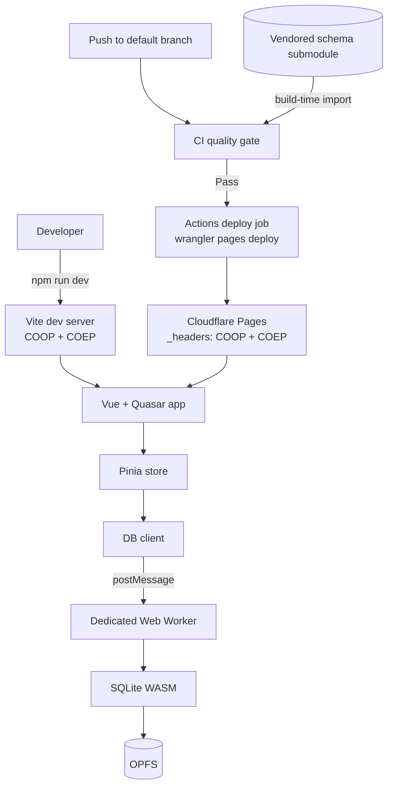

# Infrastructure Baseline — Design

**Change**: `infrastructure-baseline`
**Version**: 1.1.0
**Last Updated**: 2026-07-18

Related artifacts: [proposal.md](./proposal.md) (motivation), [specs/infrastructure-baseline/spec.md](./specs/infrastructure-baseline/spec.md) (requirements), [tasks.md](./tasks.md) (implementation steps). Governed by [AGENTS.md](../../AGENTS.md).

## Context

`mmex-pwa` ports the MoneyManagerEx desktop application (C++/wxWidgets, vendored under `mmex/`) to a browser-native Progressive Web App. The defining architectural constraint is that the application is **client-only**: there is no backend. The user's financial database is a real SQLite database compiled to WebAssembly, executed in a dedicated Web Worker, and persisted in the browser's origin-private file system (OPFS). Optional Google Drive sync moves that file to and from the cloud.

That single constraint drives most of the infrastructure:

- SQLite-WASM's OPFS backend depends on `SharedArrayBuffer`, which browsers expose **only in cross-origin isolated contexts**. Cross-origin isolation requires `COOP: same-origin` plus a `COEP` value on the response serving the document. This is currently configured on the dev server only — it is not a preference, it is a precondition, and it must hold in production too.
- The database schema is not ours to invent; it is vendored from the upstream `moneymanagerex/database` repository as a pinned git submodule and consumed at build time.

The current state of the repository:

- **Present and healthy**: Vue 3 + Quasar + TypeScript (strict) on Vite; PWA via Workbox; SQLite-WASM worker with `PRAGMA user_version` migrations; Pinia/vue-router/vue-i18n; ESLint (flat) + Prettier + EditorConfig; Vitest and Playwright configured.
- **Missing**: any specification governing the above; pre-commit enforcement; CI beyond unit tests; a deployment target of any kind; exact runtime pinning; a committed `.env.example`; a customized PWA manifest.

`openspec/specs/` is empty. This change writes the first capability spec.

*Caption: System architecture — both the dev server and the production host must supply cross-origin isolation for the persistence layer to function. CI both gates and publishes, so a red gate cannot reach Cloudflare.*

## Goals / Non-Goals

**Goals:**

- Establish `infrastructure-baseline` as the first governed capability, recording the current stack as the managed baseline so future tool changes require an explicit, reviewable OpenSpec change.
- Make cross-origin isolation an explicit, environment-independent requirement rather than an undocumented dev-server detail.
- Close the identified best-practice gaps by specifying them normatively: runtime pinning, pre-commit gate, full CI gate, deployment, secrets documentation, PWA manifest.
- Give contributors one authoritative document answering "what does this project need in order to build, test, and ship?"

**Non-Goals:**

- Specifying **any** application or business logic — accounts, transactions, budgets, reports, financial rules, or the semantics of the vendored database schema. Those belong to future capability specs.
- Implementing the gap-closing work. This change produces the specification and the task list; implementation happens under `/opsx:apply`.
- Redesigning the existing, working stack. The current choices are ratified, not relitigated.
- Specifying the Google Drive sync feature itself (only the infrastructure it depends on: the `VITE_*` configuration contract and COEP compatibility).

## Decisions

### D1: One capability, not several

`infrastructure-baseline` is a single capability covering runtime through deployment.

**Rationale**: These concerns share one rationale chain (client-only SQLite-WASM → cross-origin isolation → hosting choice → CI that verifies it). Splitting into `build-system`, `quality-gates`, and `deployment` would scatter that chain across files and invite drift, and the request was explicitly for *one* infrastructure baseline spec.
**Alternatives considered**: Multiple capabilities per concern — rejected as premature decomposition for a spec with no consumers yet. Revisit if the spec exceeds a comfortable review size.

### D2: Capability-level requirements plus a governed stack table

Requirement bodies state the *capability* ("an embedded SQL engine compiled to WebAssembly, executed off the main thread"); a single `Requirement: Governed Technology Stack Baseline` carries a table naming the concrete components and versions.

**Rationale**: [AGENTS.md](../../AGENTS.md) mandates implementation-agnostic specs (WHAT, not HOW), while the operator explicitly requires the spec to name the tech stack. This structure satisfies both without a documented deviation: the requirements remain portable, and the table gives verifiable traceability and a change-control point. Crucially, it makes stack changes *reviewable* — swapping a bundler now requires amending a normative table, not just editing a config file.
**Alternatives considered**: (a) Naming tools directly inside each requirement — most verifiable but conflicts with AGENTS.md and would have required operator-approved deviation. (b) Relegating tools to a non-normative appendix — most agnostic, but the stack would not be governed at all, defeating the purpose. The operator selected this middle path.

### D3: Cloudflare Pages as the deployment target

**Rationale**: The deciding factor is COOP/COEP. Cross-origin isolation requires setting custom response headers, and the candidates differ sharply on this:

| Host | Custom headers | Verdict |
|---|---|---|
| **Cloudflare Pages** | Native, via a `_headers` file in build output | **Selected** — headers are a first-class, in-repo artifact |
| GitHub Pages | **Not supported** | Rejected — would force a `coi-serviceworker` shim, adding a fragile moving part to a hard precondition |
| Vercel / Netlify | Supported (`vercel.json` / `netlify.toml`) | Viable alternative; no decisive advantage |

Cloudflare Pages also offers a generous static-hosting free tier and a scriptable publish path (`wrangler pages deploy`) that lets CI own the deployment (see D6). The `_headers` file lives in the repository and travels with the build output, so the isolation contract is version-controlled and reviewable alongside the code that depends on it.
**Trade-off**: Introduces a new external account dependency. Mitigated by the fact that the requirement is written at the capability level ("the deployed site SHALL emit the isolation headers"), so migrating hosts later would change `tasks.md` and one config file, not the spec's intent.

### D4: Defense in depth — pre-commit gate *and* CI gate

Both a `pre-commit` hook and a full CI pipeline are specified.

**Rationale**: They serve different purposes. The hook gives fast local feedback and keeps shared history clean; CI is the authoritative, unbypassable gate (hooks can be skipped with `--no-verify`). Specifying only CI wastes contributor time on trivial round-trips; specifying only hooks leaves the merge gate unenforced.
**Trade-off**: Hook latency. Mitigated by scoping the hook to *staged files* where the tooling allows, and by leaving the expensive suites (e2e, full build) to CI only.

### D5: COEP `require-corp` **or** `credentialless`

`Requirement: Cross-Origin Isolation` accepts either COEP value.

**Rationale**: `require-corp` is the stricter, better-supported choice and is what the dev server uses today. However, it requires every cross-origin subresource to opt in via CORP/CORS — and this project intends to integrate Google Sign-In and Google Drive, whose endpoints and popups are cross-origin and may not cooperate. `credentialless` relaxes this by sending such requests without credentials while preserving isolation. Because the OAuth integration is not yet wired up, pinning one value now would be guessing. Specifying the *outcome* (`crossOriginIsolated === true`) and permitting either mechanism keeps the requirement verifiable while leaving the implementation room to resolve the Google interaction empirically.
**Alternatives considered**: Mandating `require-corp` — rejected as premature; it could force a spec amendment the moment Drive sync lands.

### D6: GitHub Actions builds, gates, and publishes; the gate is structural

Deployment uses a GitHub Actions job that runs `wrangler pages deploy`, with the deploy job declaring `needs:` on every quality-gate job. Cloudflare's own git integration is deliberately **not** connected.

**Rationale**: This makes the quality gate *structural* rather than procedural. A failing lint, type-check, unit, or e2e stage does not merely discourage deployment — it makes the deploy job unreachable in the dependency graph. The pipeline is also the sole artifact producer, so what ships is byte-for-byte what the gate verified, rather than a second build that could differ.

**Why not Cloudflare's git integration** (evaluated and rejected): connecting the repository to Cloudflare Pages is simpler to set up and yields free pull-request previews, but Cloudflare would build *independently* of GitHub Actions — with no knowledge of whether the gate passed. It publishes whatever lands on the default branch. Under that model the gate can only be preserved indirectly, via branch protection requiring a passing run before merge, which (a) makes the gate contingent on a repository setting that an administrator can bypass, and (b) forces a pull-request workflow onto a repository whose established practice is committing directly to `main`. The Actions approach imposes neither constraint: direct pushes to `main` remain safe, because the gate runs on the push itself and the deploy cannot execute unless it passes.

**Trade-offs accepted**: a Cloudflare API token and account id must be stored as repository secrets and rotated periodically; `wrangler` becomes a pipeline dependency; and pull-request previews are not provided (see D8).

**Alternatives considered**: (a) Cloudflare git integration — rejected above. (b) Two workflows with `workflow_run` chaining — rejected: `workflow_run` is indirect, harder to debug, and provides no stronger guarantee than `needs:` within one workflow.

### D6a: Build artifacts are never committed

**Rationale**: A committed build directory diverges silently from source and makes reviews noisy. With the pipeline as sole producer, a committed `dist/` would be dead weight that no longer corresponds to what ships. The repository is compliant today — `dist/` exists locally but is gitignored and untracked — so this requirement guards against regression rather than correcting a defect.

### D7a: The gate must not repair its own input

Quality-gate commands in the pipeline are non-mutating. The repository's existing `lint` script is `eslint . --fix --cache`, which auto-repairs violations; a gate invoking it would silently fix problems and report success, verifying nothing. A separate non-fixing command is therefore introduced for the pipeline, leaving the auto-fixing script for local developer use.

### D7b: Linting is scoped to first-party source

`eslint.config.ts` ignores only `dist`, `dist-ssr`, and `coverage`. It does not ignore `mmex/`, so ESLint currently walks the vendored MoneyManagerEx submodules and reports **939 errors** in upstream code the project does not own — against 23 in first-party `src/`. Worse, because the `lint` script passes `--fix`, running it would *rewrite files inside the submodules*, dirtying them and corrupting the provenance that D7 depends on. The vendored tree is therefore excluded from linting, which is both a correctness fix and the difference between a gate that is actionable and one that is noise.

### D7: Schema stays vendored via pinned submodules

**Rationale**: The upstream `moneymanagerex/database` repository is the source of truth for `tables.sql` and the incremental migrations. Vendoring by pinned submodule (rather than copying) makes upstream drift an explicit, reviewable pointer bump and keeps provenance auditable. The cost is that submodule initialization becomes a hard prerequisite for any build — which is precisely why the spec requires CI and local setup to initialize submodules, and requires a clear failure when they are absent.

### D8: Production-only deployment; no pull-request previews

**Rationale**: Operator decision. The repository's working practice is committing directly to `main`, so pull requests are rare and previews would seldom trigger. Skipping them keeps the deploy job a single conditional stage and keeps the Cloudflare token off pull-request runs entirely — notably, previews for fork-originated pull requests could not work anyway, since GitHub withholds secrets from them.

**Trade-off**: cross-origin isolation and the Google OAuth interaction can only be verified against production rather than before merge. This is materially mitigated by D9: the preview server now carries the same isolation headers, so the e2e suite exercises an isolated context inside the gate.

### D9: Cross-origin isolation belongs to every served environment, including preview

`vite.config.ts` sets COOP/COEP under `server` only. Vite reads preview-server headers from a *separate* `preview` section, so `vite preview` currently serves **no** isolation headers — and `playwright.config.ts` runs the e2e suite against `npm run preview` on CI. Adding e2e to the gate without fixing this would fail every persistence-touching test, because `crossOriginIsolated` would be false and `SharedArrayBuffer` unavailable.

This is why `Requirement: Cross-Origin Isolation` is written to bind *every* environment that serves the application rather than naming the dev server: the dev/preview split is exactly the kind of gap an environment-specific requirement would have permitted. The fix mirrors the headers into `preview`, which additionally makes the e2e suite a genuine check on isolation.

### D10: The governed engine set is Chromium-only, until the suite earns more

The e2e suite runs on Chromium alone; Firefox and WebKit are removed from the project matrix.

**Rationale**: The current suite asserts routing and rendered text — assertions that never diverge across engines — so running them three times was cost without signal. The spec previously said "the governed browser engines" without defining the term (an undefined term, which the authoring rules prohibit); this decision defines it and records it in the governed stack table, making any future engine-set change an explicit OpenSpec amendment. The usual compromise — Chromium on pull requests, all engines on the default branch — buys nothing here because the workflow pushes directly to `main`.

**The binding return condition**: when task 5.3 lands and the suite starts asserting `crossOriginIsolated`, `SharedArrayBuffer`, and a real OPFS database open, engine behavior *does* diverge — and **WebKit comes back first**. iOS mandates WebKit for every browser, so WebKit is not "one of three engines"; it is 100% of iOS. A finance PWA whose storage layer is untested on the only engine iOS allows would be discovered broken by an iOS user rather than by CI. This condition is written into the spec's Automated Testing Toolchain requirement, not just here.

**Trade-off accepted**: until 5.3, engine-specific regressions (in practice: WebKit OPFS quirks) are invisible to CI. Mitigated by the fact that the persistence layer is not e2e-asserted on any engine yet — the exposure window is bounded by 5.3 itself.

### D11: Raise the runtime floor to Node 24 (Active LTS)

The `engines` range moves from `^20.19.0 || >=22.12.0` to `>=24.0.0`, and the pinned runtime (`.nvmrc`, and therefore CI) moves from 22.12.0 to the latest v24 release.

**Rationale**: Three facts, verified against the official Node.js release schedule on 2026-07-18:

- **Node 20 reached end-of-life on 2026-04-30**, yet the `engines` range still advertised support for it — the governed baseline was formally endorsing a dead runtime. The Runtime row's package cell is `n/a`, so the automated drift check does not cover it; the staleness survived on eyeball-audit alone (see the hardening task this motivates).
- **Node 24 has been Active LTS since 2025-10-28** (codename Krypton, maintained until 2028-04-30). Node 22 entered maintenance in 2025-10. Node 26 is Current and does not reach LTS until 2026-10.
- **Nothing blocks it**: a scan of all 463 packages in the dependency tree that declare `engines.node` found zero that exclude Node 24, so the `engine-strict` install cannot fail on the floor raise.

**Why this is low-risk**: the application runs entirely in the browser; Node is toolchain-only (build, tests, CI, deploy upload). The shipped bundle does not change. Every surface Node touches is behind the quality gate, which re-verifies under the new runtime.

**Why a floor (`>=24.0.0`) rather than a caret**: development machines already run ahead of CI (Node 26 locally vs 22 in CI today), and Node 26 becomes LTS in 2026-10. A floor accepts newer majors without another spec amendment, while `.nvmrc` keeps CI deterministic. The cost — contributors on Node 22 are hard-blocked by `engine-strict` — is zero in practice for a single-developer repository whose one machine runs 26.

**Alternatives considered**: (a) pin bump only (`.nvmrc` → 24, `engines` untouched) — rejected because it leaves the EOL v20 endorsement in place; (b) jump to Node 26 — rejected: not LTS until 2026-10; the floor form makes that a `.nvmrc`-only follow-up when the time comes.

## Risks / Trade-offs

- **COEP breaks Google Sign-In / Drive sync** → Likelihood: medium. Impact: high (blocks the cloud-sync feature). Mitigation: D5 permits `credentialless`; `tasks.md` requires verifying the OAuth flow under isolation *before* the Drive integration is built, so the constraint is discovered early rather than during feature work.
- ~~**`vue-i18n` is a pre-release (`^12.0.0-alpha.3`)**~~ → **RESOLVED** by the task 7.1 evaluation, which found the situation was worse than a pre-release risk and fixed P1 in the process:
  - The project depended on `unplugin-vue-i18n` (unscoped) — a **lookalike third-party package**, not the official Intlify plugin. It was last published 2023-12, names no repository, and ships an opt-in MySQL loader (`mysql` client in a Vite i18n plugin). No evidence of malicious behavior — the MySQL path is behind a `mysqlConfig` option this project never set — but it is abandoned and unrelated to Intlify. The official package is **`@intlify/unplugin-vue-i18n`** (`github.com/intlify/bundle-tools`).
  - `vue-i18n` v12 has **zero stable releases** (four alphas only); the latest stable line is v11.
  - Both were replaced: `vue-i18n@^11.4.6` + `@intlify/unplugin-vue-i18n@^11.2.4`. Empirical result: the production build now renders translated strings ("Initializing database..." instead of the raw key `database.probing`) — **P1 fixed** — and the e2e suite passes against the preview build on Chromium. The abandoned plugin's precompilation silently no-opping against the v12-alpha ABI was the P1 root cause, as suspected.
  - Residual lesson: the lookalike survived because nothing verified package identity. The stack-drift check (task 7.2) closes the version half of this; provenance (registry/repository) checking is a possible future extension.
- **E2E tests in CI increase pipeline time and flakiness** → Likelihood: medium. Impact: low-medium. Mitigation: Playwright is already configured with CI-aware retries and single-worker execution; keep the e2e suite thin and reserve it for critical paths.
- **Cross-origin isolation regresses silently in a new environment** → Likelihood: low. Impact: high (persistence fails wholesale). Mitigation: the spec requires a runtime diagnostic when `crossOriginIsolated` is false, and requires CI/e2e to exercise a preview build, so a header regression surfaces as a test failure rather than a user-facing mystery.
- **Cloudflare API token leakage or expiry** → Likelihood: low. Impact: medium (a leaked token permits unauthorized deploys; an expired one silently breaks CD). This is the cost of D6's structural gate. Mitigation: scope the token to Pages:Edit on the single project, store it only as a repository secret, and rotate it periodically. Note the deploy job runs only on the default branch, so pull requests — including from forks — never receive the secret.
- **`_headers` not applied, silently disabling isolation** → Likelihood: medium (it is a plain text file with no schema validation; a typo fails open, not loud). Impact: high (persistence breaks in production only). Mitigation: verification of `crossOriginIsolated` on the deployed URL is a required task, and the e2e assertion runs against the preview server which now carries the same headers.
- **Cloudflare account dependency** → Likelihood: low. Impact: low. Mitigation: requirement written at capability level (D3); host migration would not require a spec change.
- **Spec/implementation drift over time** → Likelihood: medium. Impact: medium. Mitigation: the governed stack table is verifiable against `package.json`, making drift a mechanical check that can later be automated in CI.

## Migration Plan

The specification describes a target state; the repository partially meets it today. Sequencing in [tasks.md](./tasks.md) is ordered so each phase is independently valuable and low-risk:

1. **Ratify** (no code change) — accept the spec; the already-compliant requirements are satisfied on merge.
2. **Local hygiene** — runtime version file, `.env.example`, PWA manifest and title, remove committed build output. Low risk, no behavior change.
3. **Gates** — scope linting to first-party source (D7b), clear the resulting 23 first-party violations, add a non-mutating lint command (D7a), then extend CI to lint + type-check + unit + build + e2e. Ordering matters: the violations must be cleared *before* the gate is enforced, or the very next push fails for reasons unrelated to its content.
4. **Deploy** — add `_headers` and SPA fallback, then the Actions deploy job gated by `needs:`; verify `crossOriginIsolated === true` and a successful database open against the deployed URL.

**Rollback**: Each phase is an independent commit. The deployment phase is the only one with external state; rolling back means reverting the default branch to a known-good commit, which re-runs the gate and redeploys, or revoking the API token to halt deploys entirely. The application continues to work locally and no user data is affected — all data is client-side by construction, so a bad deploy cannot corrupt anyone's database.

## Open Questions

Resolved by operator decision:

- ~~**README CI badge branch**~~ — Resolved factually: the remote has no `master` branch at all (only `main` and several topic branches), so the badge's `?branch=master` is simply broken. Fix to `main` (task 1.2).
- ~~**Google OAuth variables**~~ — Resolved: `.env.example` enumerates `VITE_GOOGLE_CLIENT_ID`, `VITE_GOOGLE_API_KEY`, and `VITE_GOOGLE_APP_ID` (full Google Picker configuration), so the Drive integration will not require a follow-up spec amendment for configuration.
- ~~**Deployment mechanism**~~ — Resolved: GitHub Actions runs the quality gate and publishes via `wrangler pages deploy`, with the deploy job gated by `needs:` (D6). Cloudflare's git integration is deliberately not connected. Production-only; no previews (D8). This supersedes an earlier decision to use the git integration, which was reversed because it made the gate contingent on branch protection and would have forced a pull-request workflow.
- ~~**Default-branch workflow**~~ — Resolved by D6: direct pushes to `main` remain safe, because the gate runs on the push and the deploy job cannot execute unless it passes. No branch protection or pull-request workflow is required.

Outstanding:

0. **The application does not work in a production build.** Verified empirically while implementing the pipeline, against `vite preview` with cross-origin isolation confirmed active (`crossOriginIsolated === true`). All three defects are pre-existing and reproduce without any change from this work. They block the e2e gate and deployment — not because the pipeline is incomplete, but because the app itself fails:

   - ~~**P1 — i18n renders raw keys in production.**~~ **FIXED.** The built app displayed `database.probing` and `database.dbStatus` rather than their translated strings, while `vite dev` rendered correctly. Root cause: the project depended on a lookalike, abandoned `unplugin-vue-i18n` package (not the official `@intlify/unplugin-vue-i18n`) whose precompilation silently no-opped against `vue-i18n@12.0.0-alpha`. Replacing both with the official plugin and the stable v11 line fixed the production rendering, verified against a preview build; the e2e suite now passes on Chromium. See the resolved risk entry above for the full account.
   - **P2 — SQLite WASM path resolution is broken in production.** The built worker requests the unhashed `/assets/sqlite3.wasm`, but the emitted asset is content-hashed (`sqlite3-<hash>.wasm`). The unhashed request does not 404: the SPA fallback serves `index.html`, so `WebAssembly.compile` fails with `Incorrect response MIME type. Expected 'application/wasm'`. **The database cannot open in a production build.** Upstream WIP branches already target this: `copilot/fix-hashed-wasm-url-request`, `copilot/fix-sqlite-wasm-path-resolution`.
   - **P3 — COEP blocks the Quasar CDN logo.** `src/App.vue` loads `https://cdn.quasar.dev/logo-v2/svg/logo-mono-white.svg`, which `require-corp` blocks (`ERR_BLOCKED_BY_RESPONSE.NotSameOriginAfterDefaultedToSameOriginByCoep`). This is the D5 risk, now observed rather than predicted. Fix by self-hosting the asset, or by adopting COEP `credentialless`.

   These are application/build defects and therefore outside this capability's scope. They warrant their own change.

   **Operator decision — deploy is enabled ahead of P2.** Deployment ships despite P2, by explicit decision, so the deployed site's database does not open. The reasoning: the app has no users, so the cost of publishing a broken build is zero, while the benefit is real — it proves the pipeline end to end and verifies that `_headers` actually delivers cross-origin isolation on Cloudflare, which `Requirement: Deployment and Hosting` demands be verified and which cannot be checked any other way. The deployed URL is a pipeline smoke test, not a product. (An earlier note here said P1 kept the e2e gate disabled; P1 is now fixed and the e2e job is enabled on the governed Chromium engine, wired into the deploy `needs:` chain.)

1. ~~**Cloudflare provisioning**~~ — Resolved 2026-07-18: the operator provisioned the project and secrets; the pipeline deploys, and production serves at https://mmex.beerops.dev/ (custom domain) with cross-origin isolation verified live.
2. **COEP value** — `require-corp` is used, mirroring the dev server. Whether it survives the Google Sign-In / Drive integration is unresolved and is deliberately scheduled for empirical validation before that feature is built (tasks 5.1–5.2). Switching to `credentialless` requires editing two files and no spec change.
3. **Base-currency defect (out of scope, reported for the record)** — `initNewDb` in `src/stores/database-store.ts` assigns the user's selected `currencyId` to an unused variable and inserts `{ currencies: [] }`, so the chosen base currency is silently discarded. This surfaced because it triggers a lint error that the gate would block on. The unused assignment is removed to clear the gate — a behaviour-preserving change that does **not** fix the underlying defect, which lies in application logic and is outside this capability's scope. It warrants its own change.
