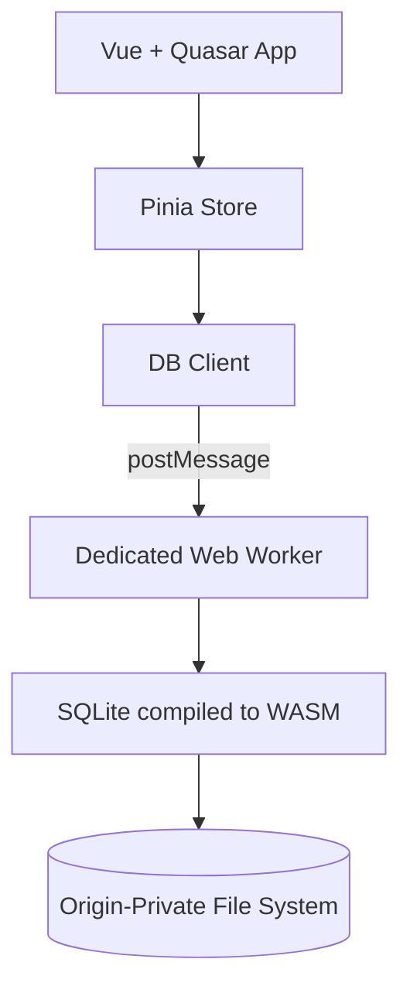
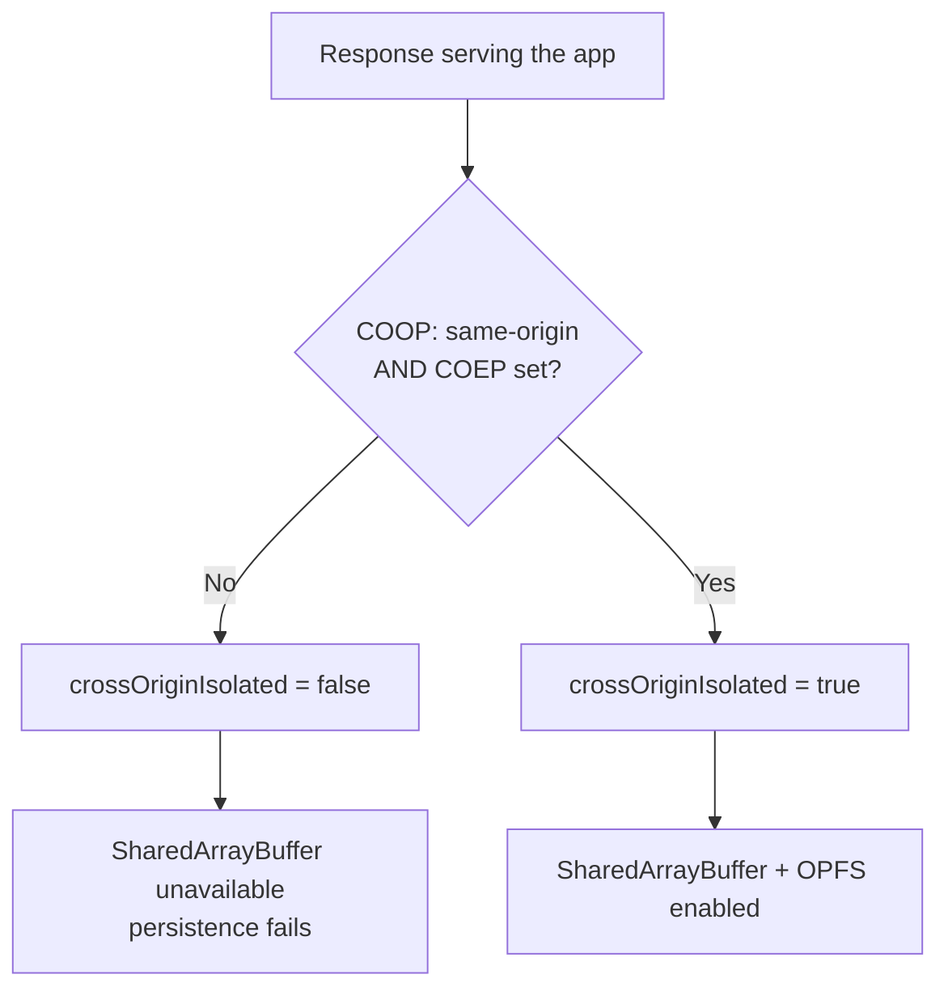
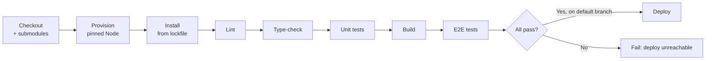
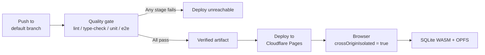

# Infrastructure Baseline Specification

**Capability**: `infrastructure-baseline`
**Version**: 1.0.0
**Last Updated**: 2026-07-16

**Scope**: This specification governs the development and deployment infrastructure of the project ONLY — runtime, package management, frontend framework, build system, data-persistence infrastructure, cross-origin isolation, quality tooling, testing, quality gates, hosting, configuration, and source provenance. It does NOT govern application or business logic (accounts, transactions, reports, financial rules, or database schema semantics); those are reserved for future capability specifications.

**Governing rules**: All content complies with [AGENTS.md](../../../../AGENTS.md). Traceability paths are relative to the repository root.

**Terminology**:
- **Governed component**: a technology listed in the governed stack table of `Requirement: Governed Technology Stack Baseline`.
- **Cross-origin isolated**: a browsing context in which `window.crossOriginIsolated === true`.
- **Quality gate**: an automated check that blocks an action (commit, merge, or deploy) on failure.

## ADDED Requirements

### Requirement: Governed Technology Stack Baseline

The project SHALL build on the governed technology stack recorded in the table below. Each entry names the concrete component that implements a capability-level requirement of this specification. Adding, removing, or changing the major version of any governed component SHALL require an OpenSpec change that updates this table first.

| Concern | Governed component | Version constraint |
|---|---|---|
| Runtime | Node.js | `^20.19.0 \|\| >=22.12.0` |
| Package manager | npm (with committed lockfile) | bundled with Node |
| UI framework | Vue | `^3.5.22` |
| Component library | Quasar | `^2.18.6` |
| Language | TypeScript (strict) | `~5.9.0` |
| Build system | Vite | `^7.1.11` |
| PWA/service worker | vite-plugin-pwa (Workbox) | `^1.1.0` |
| State management | Pinia | `^3.0.3` |
| Routing | vue-router | `^4.6.3` |
| Internationalization | vue-i18n + @intlify/unplugin-vue-i18n | `^11.4.6` / `^11.2.4` |
| Embedded SQL engine | @sqlite.org/sqlite-wasm | `^3.51.1-build1` |
| Cloud file sync | opfs-cloud-file | `^0.1.4` |
| CSS preprocessor | sass-embedded | `^1.93.3` |
| Icon set | @quasar/extras (MDI v7) | `^1.17.0` |
| Linter | ESLint (flat config) | `^9.37.0` |
| Formatter | Prettier | `3.6.2` |
| Unit test runner | Vitest + jsdom | `^3.2.4` |
| E2E test runner | @playwright/test | `^1.56.1` |
| Type checker | vue-tsc | `^3.1.1` |
| Hosting | Cloudflare Pages | n/a |

Traceability: [package.json](../../../../../package.json), [.gitmodules](../../../../../.gitmodules).

#### Scenario: Governed stack matches the dependency manifest

- **WHEN** an auditor compares this table against `package.json`
- **THEN** every governed component SHALL be present with a version satisfying the recorded constraint

#### Scenario: Introducing an ungoverned infrastructure component

- **WHEN** a contributor proposes adding a framework, bundler, test runner, or persistence engine that is absent from this table
- **THEN** the proposal SHALL be rejected until an OpenSpec change amends this specification to record the component

### Requirement: Runtime and Package Management Baseline

The project SHALL declare a supported runtime version range, SHALL pin an exact local runtime version, and SHALL use a single package manager with a committed lockfile so that every environment resolves an identical dependency tree.

- The dependency manifest SHALL declare the supported range via an `engines` field.
- The repository SHALL contain a runtime version file (`.nvmrc` or `.node-version`) whose value satisfies the declared `engines` range.
- The lockfile SHALL be committed, and reproducible installs SHALL use a lockfile-respecting install command.

Traceability: [package.json](../../../../../package.json), [package-lock.json](../../../../../package-lock.json).

#### Scenario: Contributor provisions a fresh clone

- **WHEN** a contributor clones the repository and runs the version-manager command that reads the runtime version file
- **THEN** the pinned runtime version SHALL be selected, and it SHALL satisfy the `engines` range
- **AND** a lockfile-respecting install SHALL complete without modifying the lockfile

#### Scenario: Runtime version file drifts from the engines range

- **WHEN** the runtime version file specifies a version outside the declared `engines` range
- **THEN** the continuous integration quality gate SHALL fail

### Requirement: Frontend Application Framework Baseline

The application SHALL be built as a single-page application using a component-based reactive UI framework paired with a component library, authored in a statically typed language under strict type-checking, and distributed as ECMAScript modules.

- All application source files SHALL be type-checked in strict mode with no per-file suppression of strictness.
- Single-file components SHALL declare their script blocks as typed.
- Application state SHALL be managed by the governed state-management library; navigation SHALL be managed by the governed router.

Traceability: [src/main.ts](../../../../../src/main.ts), [tsconfig.app.json](../../../../../tsconfig.app.json), [src/router/index.ts](../../../../../src/router/index.ts), [src/stores/](../../../../../src/stores/).

#### Scenario: Strict type-checking is enforced

- **WHEN** the type-check command runs against the repository
- **THEN** it SHALL complete with zero errors under strict mode

#### Scenario: Untyped component script is introduced

- **WHEN** a single-file component declares a script block without type annotation support
- **THEN** the lint quality gate SHALL report a violation

### Requirement: Build System Baseline

The project SHALL use a single governed build system that produces an optimized static bundle, and SHALL configure it to support the project's WebAssembly and Web Worker requirements.

- The build system SHALL expose a path alias for the application source root.
- The build system SHALL exclude the embedded SQL engine from dependency pre-bundling so its WebAssembly asset resolves correctly.
- Web Workers SHALL be authored as module workers resolved by the build system.
- A production build SHALL be reproducible from a clean checkout with no manual steps beyond installing dependencies and providing environment variables.

Traceability: [vite.config.ts](../../../../../vite.config.ts).

#### Scenario: Production build succeeds from a clean checkout

- **WHEN** the production build command runs after a lockfile-respecting install and submodule initialization
- **THEN** a static bundle SHALL be emitted containing the application, the service worker, the WebAssembly asset, and the worker script

#### Scenario: WebAssembly engine is pre-bundled by mistake

- **WHEN** the embedded SQL engine is removed from the pre-bundling exclusion list
- **THEN** the build or the runtime WebAssembly resolution SHALL fail, and the continuous integration quality gate SHALL block the change

### Requirement: Progressive Web App and Offline Baseline

The application SHALL be distributable as an installable Progressive Web App with a generated service worker, and SHALL publish a customized web application manifest that identifies the product.

- The service worker SHALL be generated at build time by the governed PWA plugin and SHALL precache the application shell, the WebAssembly asset, and the worker script.
- The service worker SHALL clean up outdated caches and SHALL serve the application shell for navigation requests.
- The web application manifest SHALL declare a product-specific name, short name, description, theme color, background color, and a complete icon set. Plugin default values SHALL NOT be shipped.
- The manifest theme color SHALL match the application's primary brand color.
- The document title SHALL be product-specific and SHALL NOT retain the build-tool default.

Traceability: [vite.config.ts](../../../../../vite.config.ts), [index.html](../../../../../index.html), [public/](../../../../../public/).

#### Scenario: Build emits an installable PWA

- **WHEN** the production build completes
- **THEN** a web application manifest and a service worker SHALL be present in the build output
- **AND** the manifest SHALL declare a product-specific name and an icon set sufficient for installation

#### Scenario: Application is loaded without network connectivity

- **WHEN** a user opens the installed application after a prior successful visit and the network is unavailable
- **THEN** the precached application shell SHALL load and the application SHALL reach an interactive state

#### Scenario: Manifest retains plugin defaults

- **WHEN** the emitted manifest theme color or name equals the PWA plugin's default value
- **THEN** the continuous integration quality gate SHALL fail

### Requirement: Client-Side Data Persistence Infrastructure

The application SHALL persist data entirely on the client using an embedded SQL engine compiled to WebAssembly, executed off the main thread, and stored in the browser's origin-private file system. This requirement governs the persistence *infrastructure* only; it does NOT define any table semantics or business rules.

- The embedded SQL engine SHALL execute inside a dedicated Web Worker so that database work never blocks the main thread.
- The main thread SHALL communicate with the worker exclusively through an asynchronous message-passing client that correlates requests to responses.
- Database files SHALL be persisted in the origin-private file system (OPFS).
- Schema version state SHALL be tracked by the engine's native schema-version mechanism, and migrations SHALL be applied incrementally from the vendored schema source.

*Caption: Client-side persistence infrastructure — all database work is isolated off the main thread and persisted in OPFS.*

Traceability: [src/workers/sqlite.worker.ts](../../../../../src/workers/sqlite.worker.ts), [src/workers/db-client.ts](../../../../../src/workers/db-client.ts), [src/stores/database-store.ts](../../../../../src/stores/database-store.ts).

#### Scenario: Database is opened off the main thread

- **WHEN** the application initializes the database
- **THEN** the embedded SQL engine SHALL be instantiated inside the dedicated Web Worker
- **AND** the main thread SHALL receive the result asynchronously without blocking

#### Scenario: Database survives a page reload

- **WHEN** data is written and the browsing context is reloaded
- **THEN** the persisted database SHALL be reopened from OPFS with the previously written data intact

#### Scenario: Schema version is applied incrementally

- **WHEN** a database is opened whose recorded schema version is lower than the latest vendored migration
- **THEN** the outstanding migrations SHALL be applied in ascending order and the recorded schema version SHALL be updated to the latest

### Requirement: Cross-Origin Isolation

Every environment that serves the application — local development, preview, continuous integration, and production — SHALL make the application cross-origin isolated, because the embedded SQL engine and OPFS depend on `SharedArrayBuffer`.

- Responses serving the application document SHALL include `Cross-Origin-Opener-Policy: same-origin`.
- Responses serving the application document SHALL include a `Cross-Origin-Embedder-Policy` value that establishes isolation (`require-corp` or `credentialless`).
- The application SHALL verify isolation at runtime and SHALL surface an actionable error when it is absent, rather than failing opaquely.

*Caption: Cross-origin isolation is a hard precondition for the persistence layer in every environment.*

Traceability: [vite.config.ts](../../../../../vite.config.ts).

#### Scenario: Development server serves an isolated context

- **WHEN** a contributor loads the application from the development server
- **THEN** the response SHALL carry the COOP and COEP headers
- **AND** `window.crossOriginIsolated` SHALL evaluate to `true`

#### Scenario: Production deployment serves an isolated context

- **WHEN** the deployed production application is loaded
- **THEN** `window.crossOriginIsolated` SHALL evaluate to `true`
- **AND** the persistence layer SHALL open a database successfully

#### Scenario: Isolation headers are absent

- **WHEN** the application loads in a context where `window.crossOriginIsolated` is `false`
- **THEN** the application SHALL present an explicit diagnostic identifying missing cross-origin isolation as the cause

### Requirement: Internationalization Infrastructure

The application SHALL externalize all user-facing strings into locale message catalogs resolved through the governed internationalization library, and SHALL support runtime locale switching.

- The internationalization library SHALL be configured in Composition API mode.
- Message catalogs SHALL reside in a single dedicated source directory and SHALL be compiled at build time.
- The project SHALL provide at least `en-US` and `zh-TW` catalogs, and SHALL declare a fallback locale.
- Message catalogs SHALL be type-augmented so that missing keys are detectable by the type checker.

Traceability: [src/main.ts](../../../../../src/main.ts), [src/locales/](../../../../../src/locales/), [src/i18n.d.ts](../../../../../src/i18n.d.ts).

#### Scenario: User switches the active locale

- **WHEN** a user selects a different supported locale
- **THEN** user-facing strings SHALL re-render in the selected locale without a page reload

#### Scenario: A key is missing from a catalog

- **WHEN** a locale catalog omits a key present in the fallback catalog
- **THEN** the fallback locale's value SHALL be rendered and the omission SHALL be reportable by the type checker

### Requirement: Styling and Theming Infrastructure

The application SHALL derive its visual presentation from the governed component library's stylesheet and a single centralized brand palette, compiled through the governed CSS preprocessor.

- The brand palette SHALL be defined in exactly one location and SHALL be the single source of truth for brand colors.
- Iconography SHALL be provided by the governed icon set.
- Layout and spacing SHALL prefer the component library's utilities over ad-hoc custom CSS.

Traceability: [src/main.ts](../../../../../src/main.ts).

#### Scenario: Brand color is changed

- **WHEN** a maintainer changes the primary brand color in the centralized palette
- **THEN** the change SHALL propagate to all component-library-themed surfaces without further edits

### Requirement: Code Quality and Formatting Toolchain

The repository SHALL enforce a single linting configuration, a single formatting configuration, and strict type-checking, with formatting authority separated from linting authority to avoid conflicting rules.

- Linting SHALL use the governed linter's flat configuration, covering the framework, language, unit-test, and end-to-end-test file sets.
- Formatting SHALL be owned exclusively by the governed formatter; the linter SHALL disable rules that conflict with it.
- Editor-agnostic whitespace conventions SHALL be declared in an `.editorconfig` file consistent with the formatter's settings.
- Lint, format-check, and type-check SHALL each be runnable as a discrete command.

Traceability: [eslint.config.ts](../../../../../eslint.config.ts), [.prettierrc.json](../../../../../.prettierrc.json), [.editorconfig](../../../../../.editorconfig).

#### Scenario: Repository passes the quality toolchain

- **WHEN** the lint and type-check commands run against a clean checkout
- **THEN** both SHALL complete with zero errors

#### Scenario: Formatter and linter disagree

- **WHEN** a formatting-related lint rule contradicts the formatter's output
- **THEN** the configuration SHALL be corrected so the formatter's output is authoritative

### Requirement: Automated Testing Toolchain

The project SHALL maintain automated unit tests and end-to-end tests, each runnable as a discrete command, with the two suites kept mutually exclusive.

- Unit tests SHALL execute in a simulated DOM environment using the governed unit runner and the governed component-testing utilities.
- The unit runner SHALL reuse the build system's resolution configuration so that aliases and plugins behave identically to production.
- The unit test scope SHALL exclude the end-to-end directory.
- End-to-end tests SHALL run against the governed browser engines and SHALL run against a preview build in continuous integration.
- Test files SHALL follow a single naming and placement convention.

Traceability: [vitest.config.ts](../../../../../vitest.config.ts), [playwright.config.ts](../../../../../playwright.config.ts), [src/__tests__/](../../../../../src/__tests__/), [e2e/](../../../../../e2e/).

#### Scenario: Test suites run independently

- **WHEN** the unit test command runs
- **THEN** only unit tests SHALL execute and no end-to-end test SHALL be collected

#### Scenario: End-to-end tests run in continuous integration

- **WHEN** the end-to-end suite runs in continuous integration
- **THEN** it SHALL start a preview server, execute against the governed browser engines headlessly, and report results

### Requirement: Pre-Commit Quality Gate

The repository SHALL enforce an automated pre-commit quality gate so that defects are caught before they reach shared history.

- A git hook SHALL run on `pre-commit` and SHALL be provisioned automatically on dependency install.
- The hook SHALL lint and format-check the staged files and SHALL run the type checker.
- The hook SHALL block the commit when any check fails.
- The gate SHALL operate on staged files where the tooling supports it, to keep commit latency acceptable.

#### Scenario: Commit containing a lint violation

- **WHEN** a contributor commits a staged file that violates a lint rule
- **THEN** the pre-commit hook SHALL fail and the commit SHALL be rejected

#### Scenario: Hook provisioning on a fresh clone

- **WHEN** a contributor completes a dependency install on a fresh clone
- **THEN** the pre-commit hook SHALL be installed without any additional manual step

### Requirement: Continuous Integration Quality Gate

Continuous integration SHALL verify every push and pull request through a complete quality gate, and SHALL block merges on failure.

- The pipeline SHALL check out the repository together with its vendored submodules.
- The pipeline SHALL provision the pinned runtime version and perform a lockfile-respecting install.
- The pipeline SHALL run, at minimum: lint, type-check, unit tests, end-to-end tests, and a production build.
- Any failing stage SHALL fail the pipeline and block the merge.
- Quality-gate commands SHALL be non-mutating: the pipeline SHALL verify the code as committed, and SHALL NOT auto-fix or reformat it. A gate that repairs its own input cannot report a failure.
- Linting SHALL be scoped to first-party source. Vendored submodule contents SHALL be excluded from linting and formatting, since they are upstream-owned and modifying them would corrupt the provenance guaranteed by `Requirement: Vendored Source Provenance`.

*Caption: The continuous integration quality gate and the deploy stage it gates. The deploy stage depends on every gate stage, so failure makes publishing impossible rather than merely inadvisable.*

Traceability: [.github/workflows/](../../../../../.github/workflows/).

#### Scenario: Pull request fails a quality stage

- **WHEN** a pull request introduces a lint error, a type error, or a failing test
- **THEN** the pipeline SHALL fail and the pull request SHALL be blocked from merging

#### Scenario: Submodules are required by the build

- **WHEN** the pipeline checks out the repository
- **THEN** the vendored schema submodule SHALL be populated before the build runs, so that schema imports resolve

### Requirement: Deployment and Hosting

The application SHALL be deployed as a static site to Cloudflare Pages by the continuous integration pipeline, configured to preserve cross-origin isolation and single-page-application routing.

- Deployment SHALL be performed by the continuous integration pipeline, triggered only by a push to the default branch. No contributor workstation SHALL publish to production.
- The deploy stage SHALL declare a dependency on every quality-gate stage, so that a failing gate makes deployment **unreachable** rather than merely discouraged. Gating SHALL NOT rely on branch protection or reviewer discipline.
- The deployed bundle SHALL be the exact artifact that passed the quality gate, not a rebuild.
- The deployed site SHALL emit the cross-origin isolation headers defined in `Requirement: Cross-Origin Isolation`, configured via a `_headers` file carried in the build output.
- The host SHALL serve the application shell for unmatched navigation paths so that client-side routing resolves.
- Build-time environment variables SHALL be supplied to the pipeline from the repository's secret store.
- Build artifacts SHALL NOT be committed to version control; the pipeline SHALL be the sole producer of the deployed bundle.

*Caption: Deployment path — the deploy stage depends on the gate, so a red pipeline physically cannot publish. The artifact deployed is the one the gate verified.*

#### Scenario: Deployed site preserves cross-origin isolation

- **WHEN** the production URL is requested
- **THEN** the response SHALL include the COOP and COEP headers
- **AND** the persistence layer SHALL initialize successfully

#### Scenario: Deep link is requested directly

- **WHEN** a user requests an application route directly rather than navigating from the root
- **THEN** the host SHALL serve the application shell and the client-side router SHALL resolve the route

#### Scenario: Build output is committed

- **WHEN** a commit adds build output to version control
- **THEN** the change SHALL be rejected, as the pipeline is the sole producer of deployed artifacts

#### Scenario: Quality gate fails on the default branch

- **WHEN** a push to the default branch fails any quality-gate stage
- **THEN** the deploy stage SHALL NOT execute, and the previously deployed version SHALL remain live

#### Scenario: Change is pushed to a non-default branch

- **WHEN** a push or pull request targets any branch other than the default branch
- **THEN** the quality gate SHALL run and report status
- **AND** the deploy stage SHALL NOT execute

### Requirement: Configuration and Secrets Management

The project SHALL document every environment variable it requires and SHALL keep secret values out of version control.

- The repository SHALL contain a committed `.env.example` enumerating every required variable with a non-secret placeholder value and an explanatory comment.
- Client-exposed variables SHALL use the build system's public prefix (`VITE_`), and contributors SHALL treat every such value as publicly readable.
- Real environment files SHALL be excluded from version control.
- A missing required variable SHALL produce an explicit, actionable failure rather than a silent misbehavior.

#### Scenario: Contributor configures a fresh clone

- **WHEN** a contributor copies `.env.example` to their local environment file and supplies values
- **THEN** the development server SHALL start with the configuration resolved

#### Scenario: A required variable is undeclared

- **WHEN** a new required environment variable is introduced without being added to `.env.example`
- **THEN** the change SHALL be rejected

#### Scenario: A secret is committed

- **WHEN** a commit adds a populated environment file or a secret literal
- **THEN** the change SHALL be rejected and the secret SHALL be rotated

### Requirement: Vendored Source Provenance

Upstream MoneyManagerEx sources SHALL be vendored as pinned git submodules, and SHALL be the single source of truth for the database schema consumed at build time.

- The upstream schema repository and the upstream desktop application repository SHALL each be referenced as a git submodule pinned to a specific commit or tag.
- The build SHALL import the schema and its incremental migrations from the vendored submodule rather than from a copy maintained in this repository.
- Local setup and continuous integration SHALL both initialize submodules before building.
- Advancing a submodule pointer SHALL be an explicit, reviewable commit.

Traceability: [.gitmodules](../../../../../.gitmodules).

#### Scenario: Fresh clone without submodule initialization

- **WHEN** the build runs on a clone whose submodules were never initialized
- **THEN** the build SHALL fail with an error identifying the missing vendored schema

#### Scenario: Upstream schema is advanced

- **WHEN** a maintainer advances the vendored schema submodule to a newer upstream tag
- **THEN** the new pointer SHALL appear as an explicit change in review
- **AND** the continuous integration quality gate SHALL re-verify the build and tests against it
