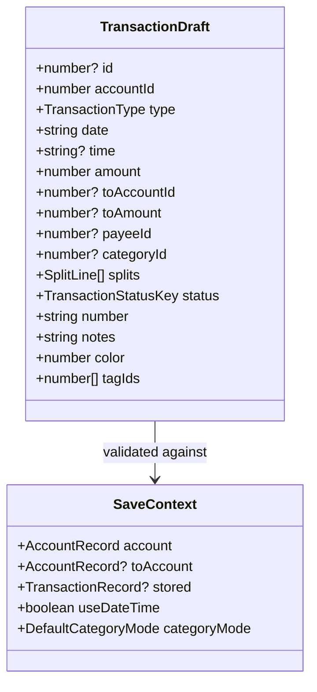
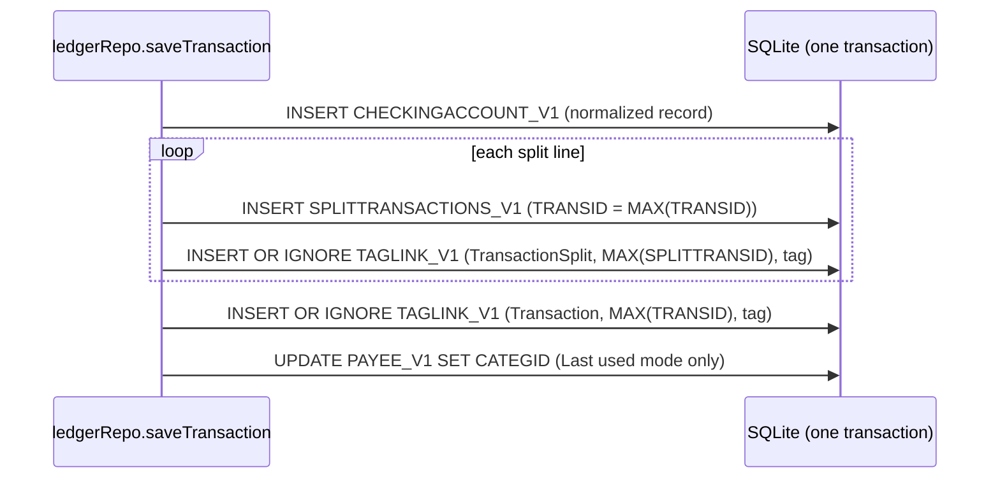

# Transaction Ledger Fidelity — Design

**Change**: `transaction-ledger-fidelity`
**Version**: 1.0.0
**Last Updated**: 2026-10-05

Related artifacts: [proposal.md](./proposal.md), [specs/transaction-ledger/spec.md](./specs/transaction-ledger/spec.md), [tasks.md](./tasks.md). Governed by [AGENTS.md](../../../AGENTS.md).

## Context

See proposal.md, Why. The ledger domain is [src/domain/rules/ledger.ts](../../../src/domain/rules/ledger.ts) (pure rules: codecs, `accountFlow`, `splitsBalance`, `isStatementLocked`, `isPurgeable`) and [src/domain/repos/ledger.ts](../../../src/domain/repos/ledger.ts) (`list`, `get`, `splitsFor`, `assertEditable`, `saveStatement`, `addStatement`, `replaceSplitsStatements`, `softDeleteStatement`, `restoreStatement`, `hardDeleteStatements`, `remove`, `purgeExpired`). `db.mutate` runs a statement batch in one SQLite transaction; a key generated inside a batch is reachable only as `(SELECT MAX(key) FROM table)` (the rule recorded in `domain-write-fixes` D1). Callers today: the scheduled repository (`addStatement` on execute), the investment repository (`addStatement` for a trade), the account repository (`hardDeleteStatements`, `list` for balances), the taxonomy repository (`hardDeleteStatements` for the purge), the budget repository (`list`, `splitsFor`), and tests. No store, page or route touches a transaction.

Desktop sources re-read on 2026-10-05, cited by the decisions below: [transdialog.cpp](../../../mmex/moneymanagerex/src/transdialog.cpp) (`ValidateData` 670–818, `OnOk` 1207–1299), [Model_Checking.cpp](../../../mmex/moneymanagerex/src/model/Model_Checking.cpp) (`remove` 96–111, `save` 113–120, `account_flow` 213–228, `is_locked` 268–285, `getEmptyData` 515–546, `foreignTransactionAsTransfer` 654–657), [mmchecking_list.cpp](../../../mmex/moneymanagerex/src/mmchecking_list.cpp) (`onDeleteTransaction` 1128–1200, `onRestoreTransaction` 1202–1254, `onMarkTransaction` 1504–1541, `checkTransactionLocked` 2215–2232), [mmframe.cpp](../../../mmex/moneymanagerex/src/mmframe.cpp) (`autocleanDeletedTransactions` 4108–4133), [Model_Translink.cpp](../../../mmex/moneymanagerex/src/model/Model_Translink.cpp) (`RemoveTranslinkEntry` 160–177), [Model_Taglink.cpp](../../../mmex/moneymanagerex/src/model/Model_Taglink.cpp) (`update` 83–133), [splittransactionsdialog.cpp](../../../mmex/moneymanagerex/src/splittransactionsdialog.cpp) (`OnOk` 400–425), [option.cpp](../../../mmex/moneymanagerex/src/option.cpp) (501–541), [Model_Category.cpp](../../../mmex/moneymanagerex/src/model/Model_Category.cpp) (`getCategoryStats` 334), [accountdialog.cpp](../../../mmex/moneymanagerex/src/accountdialog.cpp) (the opening-date check 526–531).

Two audit claims were withdrawn on checking: desktop's opening-date check counts trashed transactions too, so [src/domain/repos/account.ts](../../../src/domain/repos/account.ts) `openingDateConflict` already matches and is not changed; and desktop's lock looks at the owning account only, which is what `assertEditable` already does.

## Operator decisions

For this change, every rule follows desktop, with the recorded exceptions in D6 (stamping) and D9 (purge cadence, decided 2026-08-08). No new decision was needed.

For the two surface changes that follow, collected on 2026-10-03 and 2026-10-05 so later proposals can cite them:

| # | Decision | Date | Desktop? |
|---|---|---|---|
| S1 | Two surface changes: first the register (`/accounts/:id`, `/transactions`), the entry dialog and the trash (`/trash`) with restore and permanent delete; then duplicate, move to another account, and multi-selection mark and delete | 2026-10-03 | — |
| S2 | The register's search box filters the rows as the user types, matching the fields desktop's search matches (a number matches an amount exactly); the running balance still counts every row | 2026-10-03 | divergence: desktop jumps to the next match |
| S3 | Scheduled projections in the register belong to Phase 6 | 2026-10-03 | — |
| S4 | Date-range presets (`CHECKING_RANGE_DEFAULT`) plus From/To; the advanced filter is a later change | 2026-10-03 | yes, partial |
| S5 | Column visibility and sort are remembered per device, not in the file; the column set and the default sort (Date, then ID, ascending) are desktop's | 2026-10-03 | divergence: desktop keeps `LIST_TRANS*` in the file |
| S6 | The date-range choice is read from and written to `INFOTABLE` under desktop's keys and JSON (`CHECK_FILTER_DEDICATED_<id>`, `CHECK_FILTER_ALL`), honoring `USE_PER_ACCOUNT_FILTER`; default All | 2026-10-03 | yes |
| S7 | The register reads and honors desktop's display preferences with desktop's defaults (`SPECIAL_COLOR_RECONCILED_TRANSACTIONS`, `DO_NOT_COLOR_FUTURE_TRANSACTIONS`, `IGNORE_FUTURE_TRANSACTIONS`, `TRANSACTION_USE_DATE_TIME`, `TRANSACTION_TREAT_DATE_AS_SN`, per-transaction `COLOR`); no settings surface for them yet | 2026-10-03 | yes |
| S8 | On narrow screens the register is a list of cards; a table on wide ones | 2026-10-03 | appearance |
| S9 | The amount field has no calculator | 2026-10-05 | divergence |
| S10 | Attachments and custom fields are not in the Phase 5 entry dialog (Phase 8); the register still marks rows that carry attachments | 2026-10-05 | deferral |
| S11 | Keyboard: R, U, F, D, V set the status, Delete deletes, Enter edits; F9 and Ctrl+digit are omitted | 2026-10-05 | partial |
| S12 | `Investment` and `Shares` accounts are listed with the labels Buy, Sell, Revalue; status changes and deletion are available, creating and editing wait for Phase 9; linked rows are never duplicated or moved | 2026-10-05 | yes |

## Goals / Non-Goals

**Goals:** a saved transaction is byte-for-byte what desktop's entry dialog would store; refusals and confirmations are typed; the statement lock, the update stamp, the trash lifecycle and linked-position recomputation behave as desktop's; the retention purge runs; every changed function has a test that failed first.

**Non-Goals:** any surface; the entry-default lookups for the payee and the transfer category (the readers are here, the lookups are written with the entry dialog); duplicate, move, paste; editing a linked transaction's share detail (Phase 9); the budget actuals (Phase 7); repairing stored `NULL` deletion times in bulk.

## Decisions

### D1: A draft is validated, normalized, then composed into one batch

*Caption: The surface submits a draft; the repository loads the context the rules need.*

Pure rules in [src/domain/rules/ledger.ts](../../../src/domain/rules/ledger.ts): `validateTransaction(draft, context)` returns the list of refusals in desktop's order; `normalizeTransaction(draft, context)` returns the record to store — `TOACCOUNTID -1` and `TOTRANSAMOUNT = TRANSAMOUNT` for a non-transfer (a stored linked row keeps its `TOACCOUNTID`), `PAYEEID -1` and `TOTRANSAMOUNT = toAmount ?? amount` for a transfer, `CATEGID -1` and the split total as the amount for two or more split lines, a single split line collapsed, `COLOR` clamped, `TRANSDATE` as `date + 'T' + (useDateTime ? time : '00:00:00')`, the status as its key, `DELETEDTIME ''`. `confirmationsFor(draft, context, balance)` returns the applicable conditions. The repository's `saveTransaction(draft, options)` loads the context, refuses, stops, or writes.

*Alternatives rejected*: validating in the surface only, which is how the taxonomy defects arose — rules that no repository enforced; letting callers build `TransactionRecord` values, which is how `PAYEEID NULL` was written by the investment repository.

### D2: Refusals, lock refusals and confirmations are three typed errors

`LedgerValidationError { refusals: Array<{ field: 'amount' | 'toAmount' | 'account' | 'date' | 'category' | 'payee' | 'toAccount' | 'splits'; reason }> }`, `LedgerLockedError { transactionIds: number[]; statementDate: string }`, and `LedgerConfirmationRequired { conditions: Array<'lockedPeriod' | 'accountLimit' | 'differentCurrencies'>; statementDate?: string }`, on the pattern of the taxonomy errors. `saveTransaction` takes `acknowledged: readonly condition[]`; the surface shows desktop's prompt for each reported condition and calls again with it acknowledged.

*Alternative rejected*: boolean flags such as `force`, which would let one acknowledgement silently cover a condition the user never saw.

### D3: The batch for a new transaction keys its children by `MAX(TRANSID)`

The insert comes first; split inserts and tag-link inserts that follow reference `(SELECT MAX(TRANSID) FROM CHECKINGACCOUNT_V1)`, and each split's tag links reference `(SELECT MAX(SPLITTRANSID) FROM SPLITTRANSACTIONS_V1)` right after their row — the same SQLite rule as `domain-write-fixes` D1 and `transaction-taxonomy-fidelity` D8. The split builder is generalized to take the parent key as either a bound id or that expression; the scheduled repository's materialization uses it instead of its own copy.

*Caption: A new transaction, its split lines, every tag link and the payee default are one batch.*

### D4: The stamp moves only on a real change, decided by comparison with the stored row

For an edit the repository loads the stored record, its split lines with their tags, and its tag ids. `transactionChanged(stored, next)` compares every column but `LASTUPDATEDTIME` (numbers by value, `NULL` and the empty string alike for text, since both applications read them alike). The update statement carries `LASTUPDATEDTIME` when the record changed, when `splitSetChanged` reports a change — now including each line's tag set — or when the tag set changed; otherwise the stamp is not written at all. A save that changes nothing still writes the unchanged columns, which is harmless and keeps the batch shape constant.

*Alternative rejected*: stamping every save, the current behavior, which makes a synchronization peer treat every opened-and-closed transaction as modified.

### D5: The statement lock is hard for stored rows and a confirmation for dates being entered

`saveTransaction` on an existing id refuses with `LedgerLockedError` when the *stored* row is locked — desktop refuses to open such a row for editing. The locked-period confirmation of D2 covers the *saved* account and date, so it catches a new row and an unlocked row moved into the period. `setStatus(ids, status)`, `remove(ids)` and `purge(ids)` partition their ids into processable and locked, act on the first, and return `{ changed | removed, skippedLocked }`; when every id is locked they throw `LedgerLockedError`, which is the single-row refusal the existing scenario states. `restore(ids)` and `purgeExpired` do not consult the lock. Only `ACCOUNTID`'s account is consulted.

*Alternative rejected*: refusing a multi-row operation when any row is locked; desktop processes the rest and warns about the locked ones.

### D6: What stamps, and the one desktop side effect not reproduced

Insert stamps. A changed record stamps unless it is in the trash before or after (desktop's `save`). A changed split set stamps; a changed tag set — the transaction's or a split line's — stamps. Soft delete and restore do not. A status change stamps the rows it changes.

Desktop also stamps every save of a transaction whose split lines carry tags, because it recreates the split rows and then finds "no existing links" for the new row ids. That is a by-product of its implementation, not a rule a user or a peer relies on, and reproducing it would defeat the scenario "Unchanged splits do not stamp" that the 1.1.0 specification already carries. It is not reproduced (the precedent is the case-only rename of 2026-10-02, operator decision 18); recorded here for the operator to overrule.

### D7: Deleting, restoring and purging fold the position recomputation into the same batch

Before the batch, the repository reads the `TRANSLINK_V1` rows of the affected transactions. For each linked stock or asset it asks the owning repository for recomputation statements over the *post-state*: `stockRepo.recomputeStatements(stockId, { now, overrides })` and `assetRepo.recomputeStatements(assetId, { overrides })`, where `overrides` maps a transaction id to its state after the operation — trashed, live again, or absent. The resulting `UPDATE` rides in the same batch as the delete, restore or purge, which is the convention [src/domain/repos/investment.ts](../../../src/domain/repos/investment.ts) already states ("folded into whichever operation invalidated them") and what `investment-tracking` requires. Desktop reaches the same stored values in a second step.

*Alternative rejected*: recomputing in a second batch after the mutation, which leaves a stale cache in the file if the application stops between the two, and which a synchronization could upload.

### D8: A live row's `DELETEDTIME` is written as the empty string

New rows and restores write `''`, as desktop does; the live predicate stays `COALESCE(DELETEDTIME, '') = ''`, so rows holding `NULL` — written by this application before this change, or by desktop before its soft-delete migration — read as live. Nothing rewrites them in bulk; they become `''` when next saved, exactly as in desktop. The scheduled and investment repositories stop passing `DELETEDTIME: null` because they go through the normalized write path.

### D9: The purge cutoff is a timestamp comparison, and a maintenance store runs it

`isPurgeable(transaction, retentionDays, now)` becomes `DELETEDTIME <= formatUtcTimestamp(now − retentionDays days)` — desktop's `LESS_OR_EQUAL` on the combined string — instead of a whole-day count that purged a day late. `purgeExpired` folds the D7 recomputations into its batch.

`src/stores/maintenance-store.ts` exposes `maybePurge(now)`: it runs when the database store is ready and the sync store's status is `unbound` or `idle`, and at most once per calendar day, remembering the day per device (`localStorage`, falling back to memory). When rows were purged it calls the sync store's `notifyLocalWrite()` so the change is uploaded. [src/App.vue](../../../src/App.vue) watches readiness and the sync status and calls it. The cadence is the operator's decision of 2026-08-08 (desktop purges at every open; a PWA opens the database every session and would race synchronization).

*Alternative rejected*: remembering the last purge day in the file, which would write to the file on days when nothing is purged.

### D10: The linkage sentinels get a predicate, and the flow function is left alone

`isForeignAsTransfer(transaction)` returns true for a linked row whose `TOACCOUNTID` is `32702` or equals its `ACCOUNTID` — desktop's `foreignTransactionAsTransfer`. `accountFlow` is unchanged; the comment on `FOREIGN_SENTINEL` that says "ignore for accounting" is corrected. No aggregation in this application consumes the predicate yet except the budget actuals, which are out of scope (proposal.md); the predicate and its tests are what Phase 7 and the reports will use.

### D11: Entry defaults are file facts plus two pure rules

`SETTING_KEY` gains `transactionDateDefault`, `transactionStatusDefault` (`TRANSACTION_STATUS_RECONCILED`), `transactionPayeeDefault` (`TRANSACTION_PAYEE_NONE`), `transactionTransferCategoryDefault` (`TRANSACTION_CATEGORY_TRANSFER_NONE`) and `transactionUseDateTime`; `fileFacts` reads each with desktop's default, the boolean through `parseSettingBoolean`. `defaultTransactionDate(mode, accountTransactions, now)` and `defaultStatusKey(index)` are pure rules in the ledger module. The payee and transfer-category lookups need the entry dialog's context and are written with it.

### D12: The status is read through `statusKey` everywhere

`reconciledBalance` in [src/domain/rules/account.ts](../../../src/domain/rules/account.ts) calls `reconciledFlow` instead of comparing `STATUS === 'R'`.

### D13: Tests

Rule tests for validation (each refusal, desktop's order), normalization (each sentinel, the split collapse, the time part, the colour clamp), confirmations, `transactionChanged`, `isPurgeable` at the boundary second, `isForeignAsTransfer`, the default date and status, and the reconciled balance on a stored display name. Repository tests against a fake `DomainDb` (the pattern of [taxonomy-repo.spec.ts](../../../src/__tests__/domain/taxonomy-repo.spec.ts)): the batch of a new transaction with splits and tags (order, `MAX()` keys, bound values), an edit that changes nothing (no `LASTUPDATEDTIME` in the update), an edit that changes a tag (stamp), the lock on edit, status, delete and purge with skipped rows, restore writing `''` without a lock check, delete and restore folding the position update, the purge at the cutoff, the payee default under Last used. A store test for the maintenance guard (ready, settled, once a day). Each is written to fail on the current code first, and the red result is recorded in tasks.md. Real SQLite coverage comes with the surfaces' Chromium specs, including the split-tags check the capability map leaves open.

## Risks / Trade-offs

| # | Risk | Likelihood | Impact | Mitigation |
|---|------|------------|--------|------------|
| R1 | `MAX(TRANSID)` or `MAX(SPLITTRANSID)` is not the row just inserted | Negligible | High | No `AUTOINCREMENT`, one transaction per batch, each child statement directly follows its parent insert; tests assert the order and the key expressions |
| R2 | The comparison in D4 misses a difference and a real change is not stamped | Low | Medium | Column-by-column test over every `TransactionRecord` field; `NULL` and `''` are equal only for text columns |
| R3 | Folding the recomputation (D7) computes from the wrong post-state | Medium | Medium | The owning repositories apply the overrides to the rows they already load; tests assert the position values for delete, restore and purge against the same fixtures the existing recomputation tests use |
| R4 | The purge runs while a synchronization is in flight | Low | Medium | Runs only when the sync status is `unbound` or `idle`; the day is recorded only after the purge succeeds |
| R5 | The breaking repository API misses a caller | Low | Low | `vue-tsc` over the three calling repositories and the tests; `grep` for `saveStatement`, `addStatement`, `restoreStatement` recorded in tasks.md |
| R6 | Statement-shape tests cannot observe SQLite's behavior | Medium | Medium | The surfaces' Chromium specs exercise the same batches against real SQLite through the development seed route |
| R7 | Not reproducing desktop's tagged-split stamp (D6) hides a change from a desktop peer | Negligible | Low | Nothing changed in the record; recorded for the operator |
| R8 | Rows that stored `PAYEEID`, `TOACCOUNTID` or `TOTRANSAMOUNT` as `NULL` exist in files this application wrote | Low | Low | Readers already treat `NULL` as the sentinel (`isNone`); the next save through the normalized path writes desktop's values |

## Migration Plan

No schema change and no bulk rewrite. The repository API changes land with their three callers in the same commit. The maintenance store starts purging on the first ready-and-settled day after deployment; nothing else changes for a user, since no surface exists.

## Open Questions

None that change the specification or the tasks. D6's non-reproduced desktop side effect and D7's same-batch recomputation are recorded for the operator's review of this proposal.
