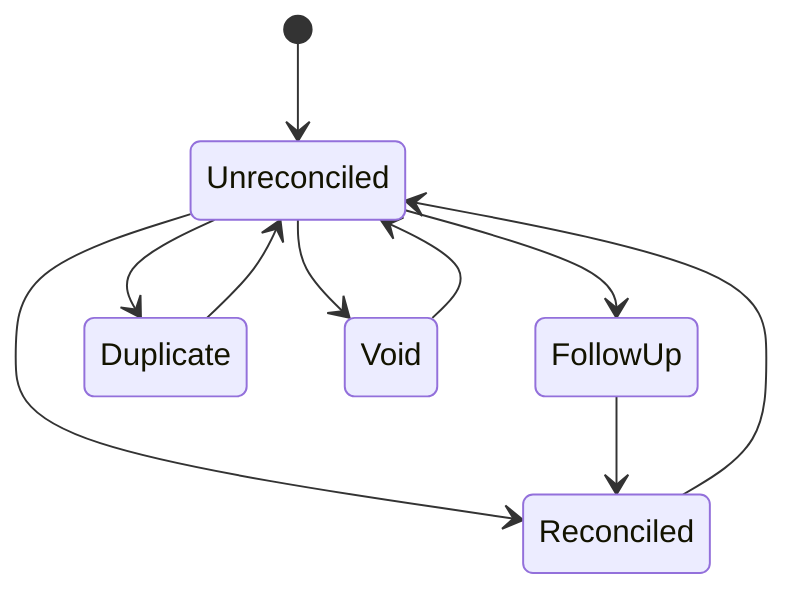
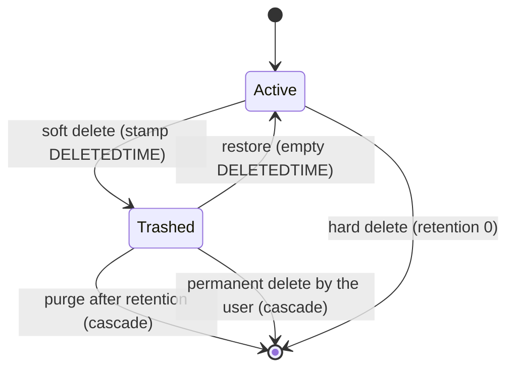
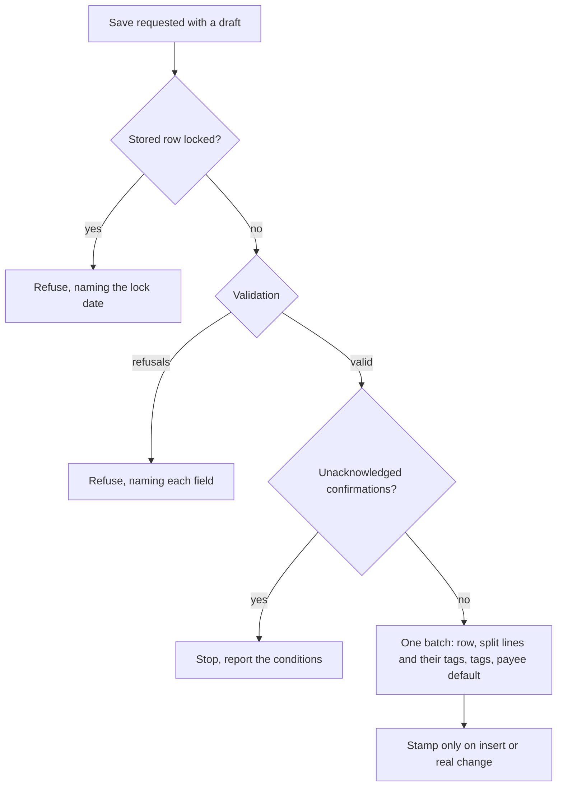

# Transaction Ledger — Delta: Desktop Fidelity

**Change**: `transaction-ledger-fidelity`
**Capability**: `transaction-ledger`
**Version**: 1.2.0
**Last Updated**: 2026-10-05

Governed by [AGENTS.md](../../../AGENTS.md). Links are written relative to where this file is promoted, `openspec/specs/transaction-ledger/spec.md`.

**Scope**: Brings the ledger's rules to desktop MoneyManagerEx fidelity before any register surface is built: what a saved transaction carries, what is refused and what is only confirmed, when the update stamp moves, where the statement lock applies, what deletion, restore and purge do to linked positions, and what the linkage sentinels exclude. "Account Flow and Balance Contribution" is unchanged — it was already desktop's `account_flow`. Each rule was re-read in the desktop source on 2026-10-05.

## MODIFIED Requirements

### Requirement: Schema Fidelity for Ledger Tables

The application SHALL persist `CHECKINGACCOUNT_V1` and `SPLITTRANSACTIONS_V1` in conformance with `domain-data-conventions`.

- Transaction status SHALL be persisted as a single-letter key: empty string (unreconciled), `R` (reconciled), `V` (void), `F` (follow up), `D` (duplicate) — not as display names.
- Transaction dates SHALL be written in the combined form `YYYY-MM-DDTHH:MM:SS`; date-only values from older files SHALL be readable. The time part SHALL be `00:00:00` unless the file's `SETTING_V1.TRANSACTION_USE_DATE_TIME` preference is on, in which case it SHALL be the entered time.
- `COLOR` SHALL be an integer from `1` to `7`, or `-1` meaning unset; any other entered value SHALL be stored as `-1`. The vestigial `FOLLOWUPID` column SHALL be preserved.
- `DELETEDTIME` of a live transaction SHALL be written as the empty string, as desktop writes it; `NULL` and the empty string SHALL both read as live.

Traceability: [mmex/database/tables.sql](../../../mmex/database/tables.sql), [mmex/moneymanagerex/src/model/Model_Checking.cpp](../../../mmex/moneymanagerex/src/model/Model_Checking.cpp) (`STATUS_CHOICES`), [mmex/moneymanagerex/src/transdialog.cpp](../../../mmex/moneymanagerex/src/transdialog.cpp) (`OnOk` writes `FormatISOCombined`; `ValidateData` clamps the colour), [mmex/moneymanagerex/src/mmchecking_list.cpp](../../../mmex/moneymanagerex/src/mmchecking_list.cpp) (restore clears `DELETEDTIME` to the empty string), [src/domain/rules/ledger.ts](../../../src/domain/rules/ledger.ts), [src/domain/repos/ledger.ts](../../../src/domain/repos/ledger.ts).

#### Scenario: Status keys round-trip

- **WHEN** the application persists a reconciled transaction
- **THEN** the stored `STATUS` SHALL be exactly `R`
- **AND** desktop MoneyManagerEx SHALL display it as reconciled

#### Scenario: A live row stores an empty deletion time

- **WHEN** the application writes a new transaction, or restores a trashed one
- **THEN** the stored `DELETEDTIME` SHALL be the empty string, not `NULL`

#### Scenario: The time part defaults to midnight

- **WHEN** the application saves a transaction dated `2026-08-09` while `TRANSACTION_USE_DATE_TIME` is absent
- **THEN** the stored `TRANSDATE` SHALL be `2026-08-09T00:00:00`

### Requirement: Transaction Types

The application SHALL persist the transaction type as exactly `Withdrawal`, `Deposit`, or `Transfer`, with per-type field obligations and desktop's values in the columns a type does not use.

- A `Withdrawal` or `Deposit` SHALL reference a payee in `PAYEEID`, SHALL store `TOTRANSAMOUNT` equal to `TRANSAMOUNT`, and SHALL store `TOACCOUNTID` `-1` — unless the row is a linked ("foreign") transaction, whose `TOACCOUNTID` is preserved per Requirement "Foreign Transaction Linkage Representation".
- A `Transfer` SHALL reference its destination account in `TOACCOUNTID`, SHALL store `PAYEEID` `-1`, and SHALL store in `TOTRANSAMOUNT` the amount received by the destination: the second amount when one is entered, otherwise `TRANSAMOUNT`.
- None of `TOACCOUNTID`, `PAYEEID`, `CATEGID` and `TOTRANSAMOUNT` SHALL be written as `NULL`.
- When a surface lists the transactions of an `Investment` or `Shares` account, it SHALL label the three types `Buy`, `Sell`, and `Revalue`; the persisted value SHALL remain the canonical string.

Traceability: [mmex/moneymanagerex/src/model/Model_Checking.h](../../../mmex/moneymanagerex/src/model/Model_Checking.h), [mmex/moneymanagerex/src/model/Model_Checking.cpp](../../../mmex/moneymanagerex/src/model/Model_Checking.cpp) (`TYPE_CHOICES`), [mmex/moneymanagerex/src/transdialog.cpp](../../../mmex/moneymanagerex/src/transdialog.cpp) (`ValidateData`: the values written per type), [src/domain/rules/ledger.ts](../../../src/domain/rules/ledger.ts).

#### Scenario: Trade alias is display-only

- **WHEN** a buy is recorded in a shares account
- **THEN** the persisted `TRANSCODE` SHALL be `Withdrawal`

#### Scenario: A withdrawal stores desktop's unused-column values

- **WHEN** the application saves a withdrawal of `80` to the payee `Shop`
- **THEN** the stored `TOACCOUNTID` SHALL be `-1` and the stored `TOTRANSAMOUNT` SHALL be `80`

#### Scenario: A transfer stores no payee

- **WHEN** the application saves a transfer of `100` with a second amount of `92`
- **THEN** the stored `PAYEEID` SHALL be `-1`, `TRANSAMOUNT` SHALL be `100` and `TOTRANSAMOUNT` SHALL be `92`

### Requirement: Transaction Status Lifecycle

The application SHALL support the five transaction statuses, freely changeable by the user except where the statement lock forbids it, and SHALL accept either the stored key or the upstream display name when interpreting external data.

- Every reader of the status — the flow function, the reconciled flow, the reconciled balance, and every aggregate — SHALL resolve the stored value through that one interpretation, so a stored display name counts exactly as its key.
- Changing the status of one or many transactions SHALL write the key to each transaction whose status differs, SHALL set `LASTUPDATEDTIME` on each live transaction it changes, and SHALL leave a transaction whose status already matches untouched.
- A transaction that the statement lock covers SHALL be skipped by a status change, and the operation SHALL report which transactions it skipped.

*Caption: Statuses are user-managed annotations; Void additionally removes the row from all monetary aggregation.*

Traceability: [mmex/moneymanagerex/src/model/Model_Checking.cpp](../../../mmex/moneymanagerex/src/model/Model_Checking.cpp) (`status_id` accepts key or name; `account_recflow`), [mmex/moneymanagerex/src/mmchecking_list.cpp](../../../mmex/moneymanagerex/src/mmchecking_list.cpp) (`onMarkTransaction` skips rows on or before a locked statement date), [src/domain/rules/ledger.ts](../../../src/domain/rules/ledger.ts), [src/domain/rules/account.ts](../../../src/domain/rules/account.ts), [src/domain/repos/ledger.ts](../../../src/domain/repos/ledger.ts).

#### Scenario: Void removes monetary effect

- **WHEN** the user voids a withdrawal
- **THEN** the account's computed balance SHALL rise by the withdrawal amount
- **AND** the row SHALL remain visible as void

#### Scenario: Locked rows are skipped when marking

- **WHEN** the user marks two transactions reconciled and one of them is dated before its locked account's statement date
- **THEN** the other transaction SHALL become reconciled
- **AND** the operation SHALL report the locked transaction as skipped, its status unchanged

#### Scenario: A stored display name counts as its key

- **WHEN** a file stores the status `Reconciled` instead of `R` on a deposit of `50`
- **THEN** the account's reconciled balance SHALL include the `50`

### Requirement: Split Transactions

The application SHALL support splitting a transaction into category lines (`SPLITTRANSACTIONS_V1`), whose presence makes the parent's `CATEGID` non-authoritative.

- When one or more split rows exist, aggregation by category SHALL use the split rows and ignore the parent's `CATEGID`.
- A transaction saved with two or more split lines SHALL store `CATEGID` `-1`, and its `TRANSAMOUNT` SHALL be the sum of its split amounts. A single split line SHALL be saved as a plain transaction carrying that line's category and amount, with no split row.
- Split amounts SHALL sum to the transaction amount. A single line's amount SHALL be allowed to be negative; the total SHALL NOT be negative.
- A `Transfer` SHALL NOT carry split lines.
- Each split line SHALL be able to carry its own notes and tags (`TransactionSplit` reference type).
- Replacing a transaction's split lines SHALL, in one logical operation, remove the tag links of the split rows being removed, write the new split rows, and attach each new row's tags to it; no tag link SHALL be left pointing at a removed split row, and no tag given with a line SHALL be lost by the replacement.
- When the replacement changes the set of split lines — a different count, or any category, amount, note or tag set that differs — the transaction's `LASTUPDATEDTIME` SHALL be set to the time of the replacement; an unchanged set SHALL NOT stamp it. (Desktop stamps every save of a transaction whose split lines carry tags, a side effect of recreating the rows; that side effect is not reproduced.)

Traceability: [mmex/moneymanagerex/src/model/Model_Splittransaction.h](../../../mmex/moneymanagerex/src/model/Model_Splittransaction.h), [mmex/moneymanagerex/src/model/Model_Splittransaction.cpp](../../../mmex/moneymanagerex/src/model/Model_Splittransaction.cpp) (`update` compares the set and stamps; `remove` deletes the row's tag links), [mmex/moneymanagerex/src/splittransactionsdialog.cpp](../../../mmex/moneymanagerex/src/splittransactionsdialog.cpp) (the total is checked, lines without a category are dropped), [mmex/moneymanagerex/src/transdialog.cpp](../../../mmex/moneymanagerex/src/transdialog.cpp) (the amount follows the split total, one split collapses, transfers have no split button, tags re-attached to the new rows), [src/domain/rules/ledger.ts](../../../src/domain/rules/ledger.ts), [src/domain/repos/ledger.ts](../../../src/domain/repos/ledger.ts).

#### Scenario: Splits shadow the parent category

- **WHEN** a transaction with parent category `X` carries split rows for categories `Y` and `Z`
- **THEN** category aggregation SHALL count the split amounts under `Y` and `Z` and nothing under `X`

#### Scenario: Split sum is validated

- **WHEN** the user edits split lines so their sum differs from the transaction amount
- **THEN** the application SHALL NOT persist the mismatch

#### Scenario: Split tags survive an edit

- **WHEN** the user edits a transaction whose first split line carries the tag `travel` and saves with that line unchanged
- **THEN** the saved first split line SHALL carry `travel`
- **AND** no tag link SHALL reference a split row that no longer exists

#### Scenario: Unchanged splits do not stamp

- **WHEN** the user saves a transaction whose split lines are identical to the stored ones
- **THEN** the transaction's `LASTUPDATEDTIME` SHALL be unchanged by the split replacement

#### Scenario: A split transaction stores the sentinel category and the total

- **WHEN** the application saves a withdrawal split into `60` under `Food` and `40` under `Bills`
- **THEN** the stored `CATEGID` SHALL be `-1` and the stored `TRANSAMOUNT` SHALL be `100`

#### Scenario: One split line is a plain transaction

- **WHEN** the application saves a withdrawal whose only split line is `60` under `Food`
- **THEN** the transaction SHALL be stored with category `Food`, amount `60`, and no split row

#### Scenario: A transfer with splits is refused

- **WHEN** the application is asked to save a transfer carrying split lines
- **THEN** the save SHALL be refused naming the split lines

### Requirement: Foreign Transaction Linkage Representation

The application SHALL preserve and honor the upstream representation of ledger rows linked to stocks and assets.

- A `Deposit` or `Withdrawal` whose `TOACCOUNTID` is greater than zero denotes a linked ("foreign") transaction; the link itself is a `TRANSLINK_V1` row whose `LINKTYPE` is exactly `Asset` or `Stock`.
- The sentinel `TOACCOUNTID` values `32701` (treat as income or expense) and `32702` (treat as a transfer) SHALL be preserved verbatim. They SHALL NOT change the row's account flow: a linked row moves its account's balance as any `Deposit` or `Withdrawal` does.
- A linked row whose `TOACCOUNTID` is `32702`, or equals its own `ACCOUNTID`, SHALL be excluded from every income and expense aggregation — category statistics, summaries, reports and forecasts; a linked row carrying `32701` SHALL be aggregated as income or expense. One predicate SHALL decide this for every aggregation.
- Editing rules for linked rows are owned by `investment-tracking` and `asset-tracking`.

Traceability: [mmex/moneymanagerex/src/model/Model_Translink.h](../../../mmex/moneymanagerex/src/model/Model_Translink.h) (`AS_INCOME_EXPENSE`, `AS_TRANSFER`), [mmex/moneymanagerex/src/model/Model_Checking.cpp](../../../mmex/moneymanagerex/src/model/Model_Checking.cpp) (`account_flow` ignores the sentinels; `foreignTransactionAsTransfer`), [mmex/moneymanagerex/src/model/Model_Category.cpp](../../../mmex/moneymanagerex/src/model/Model_Category.cpp) (`getCategoryStats` skips such rows), [src/domain/rules/ledger.ts](../../../src/domain/rules/ledger.ts).

#### Scenario: Sentinels survive a round-trip

- **WHEN** a desktop-created share transaction with `TOACCOUNTID` `32702` is opened, displayed, and persisted
- **THEN** the stored value SHALL still be `32702`
- **AND** the row SHALL contribute to its account's flow and SHALL be excluded from income and expense aggregation

#### Scenario: An income-or-expense linked row is aggregated

- **WHEN** a linked withdrawal carries `TOACCOUNTID` `32701`
- **THEN** it SHALL count in its category's expense total

### Requirement: Soft Delete, Trash, and Retention

The application SHALL soft-delete ledger transactions by stamping `DELETEDTIME` (ISO combined, UTC), keep them restorable, and purge them after the retention window.

- Soft-deleted rows SHALL be excluded from every aggregate, report, and export, and SHALL be visible only in a dedicated trash context. A soft delete SHALL leave the transaction's split rows, tag links, attachment rows and custom field data in place, so a restore brings them back.
- Deleting SHALL hard-delete instead of trashing when the retention setting is `0`; deleting a transaction that is already in the trash SHALL hard-delete it.
- Restore SHALL set `DELETEDTIME` to the empty string.
- Deleting, restoring, hard-deleting and purging a transaction linked to a stock or an asset SHALL recompute and persist that position in the same logical operation.
- A hard delete SHALL cascade to the transaction's split rows and their tag links, its own tag links, its attachment rows and custom field data, and its share detail and link rows (`SHAREINFO_V1`, `TRANSLINK_V1`).
- Purge SHALL hard-delete the trashed rows whose `DELETEDTIME` is at or before the current UTC time minus `DELETED_TRANS_RETAIN_DAYS` days (default `30`). Purge SHALL run when the database is ready and synchronization has settled (or no sync binding exists), at most once per calendar day (operator decision 2026-08-08).
- A transaction covered by the statement lock SHALL NOT be deleted or hard-deleted by the user (Requirement "Statement Lock Enforcement"); restore and the retention purge are not subject to the lock.
- `LASTUPDATEDTIME` SHALL be stamped only when a save actually changes the record, and SHALL NOT be stamped by soft-delete or restore operations.

*Caption: Transaction trash lifecycle — only CHECKINGACCOUNT_V1 has soft delete; every other table deletes hard. Each transition recomputes a linked position.*

Traceability: [mmex/moneymanagerex/src/model/Model_Checking.cpp](../../../mmex/moneymanagerex/src/model/Model_Checking.cpp) (`remove`, `save`), [mmex/moneymanagerex/src/mmchecking_list.cpp](../../../mmex/moneymanagerex/src/mmchecking_list.cpp) (`onDeleteTransaction`, `onRestoreTransaction`, the position updates after each), [mmex/moneymanagerex/src/model/Model_Translink.cpp](../../../mmex/moneymanagerex/src/model/Model_Translink.cpp) (`RemoveTranslinkEntry` removes the share entry and recomputes), [mmex/moneymanagerex/src/mmframe.cpp](../../../mmex/moneymanagerex/src/mmframe.cpp) (`autocleanDeletedTransactions`, the cutoff), [mmex/database/incremental_upgrade/database_version_16.sql](../../../mmex/database/incremental_upgrade/database_version_16.sql), [src/domain/repos/ledger.ts](../../../src/domain/repos/ledger.ts), [src/stores/maintenance-store.ts](../../../src/stores/maintenance-store.ts).

#### Scenario: Purge cascades extension rows

- **WHEN** a trashed transaction older than the retention window is purged
- **THEN** its split rows, tag links, attachment rows, and custom field data SHALL be removed with it

#### Scenario: Restore recomputes linked positions

- **WHEN** the user restores a trashed transaction linked to a stock position
- **THEN** the stock position's cached fields SHALL be recomputed and persisted per `investment-tracking`

#### Scenario: Delete recomputes linked positions

- **WHEN** the user deletes a transaction linked to a stock position
- **THEN** the stock position's cached fields SHALL be recomputed without that transaction and persisted in the same logical operation

#### Scenario: The cutoff is the retention period

- **WHEN** the retention is `30` days and a transaction was trashed exactly thirty days ago to the second
- **THEN** the purge SHALL remove it

#### Scenario: Trashed rows keep their decorations

- **WHEN** the user deletes a transaction carrying tags and split lines while the retention is `30`, then restores it
- **THEN** the transaction SHALL carry the same tags and split lines as before

### Requirement: Statement Lock Enforcement

When an account is statement-locked, the application SHALL treat its stored transactions dated on or before the statement date as read-only: no edit, no status change, no deletion.

- The lock is the lock of the transaction's own account (`ACCOUNTID`); the lock of a transfer's destination account SHALL NOT apply.
- Editing a locked transaction SHALL be refused, naming the lock date.
- In an operation over many transactions — a status change, a deletion, a permanent deletion from the trash — locked transactions SHALL be skipped, the others processed, and the skipped ones reported.
- Restoring a trashed transaction and the retention purge SHALL NOT be subject to the lock.
- Saving a new transaction, or moving an unlocked transaction, onto a date on or before the lock date is not refused; it requires the confirmation of Requirement "Transaction Entry Confirmations".

Traceability: [mmex/moneymanagerex/src/model/Model_Checking.cpp](../../../mmex/moneymanagerex/src/model/Model_Checking.cpp) (`is_locked`, the owning account only), [mmex/moneymanagerex/src/mmchecking_list.cpp](../../../mmex/moneymanagerex/src/mmchecking_list.cpp) (`checkTransactionLocked` on edit, delete and move; `onMarkTransaction`; restore unchecked), [mmex/moneymanagerex/src/transdialog.cpp](../../../mmex/moneymanagerex/src/transdialog.cpp) (`ValidateData`: "Lock transaction to date … Do you want to continue?"), [src/domain/rules/ledger.ts](../../../src/domain/rules/ledger.ts), [src/domain/repos/ledger.ts](../../../src/domain/repos/ledger.ts).

#### Scenario: Locked transaction cannot be deleted

- **WHEN** the user attempts to delete a transaction dated before a locked account's statement date
- **THEN** the operation SHALL be refused

#### Scenario: Locked rows are skipped in a multi-row deletion

- **WHEN** the user deletes three transactions and one is dated before its locked account's statement date
- **THEN** the other two SHALL be deleted
- **AND** the locked one SHALL be reported as skipped and SHALL remain

#### Scenario: The destination account's lock does not apply

- **WHEN** the user edits a transfer whose source account is unlocked and whose destination account is locked past the transfer's date
- **THEN** the edit SHALL be accepted

#### Scenario: A trashed row inside the locked period is restorable

- **WHEN** the user restores a trashed transaction dated before its locked account's statement date
- **THEN** the restore SHALL proceed

### Requirement: Ledger Extension Hooks

Ledger records SHALL participate in the polymorphic extension mechanisms using reference type `Transaction` for whole transactions and `TransactionSplit` for split lines.

- Tags are governed by `transaction-taxonomy`; attachments and custom fields by `record-extensions`.
- Saving a transaction's tags SHALL replace the set of its tag links with the given set; when the set changed, the transaction's `LASTUPDATEDTIME` SHALL be set to the time of the save, and an unchanged set SHALL NOT stamp it.
- Removing a transaction (hard delete or purge) SHALL remove its extension rows, per `domain-data-conventions`; a soft delete SHALL leave them in place.

Traceability: [mmex/moneymanagerex/src/model/Model.cpp](../../../mmex/moneymanagerex/src/model/Model.cpp), [mmex/moneymanagerex/src/model/Model_Taglink.cpp](../../../mmex/moneymanagerex/src/model/Model_Taglink.cpp) (`update` replaces the links and calls `updateTimestamp` when the set changed), [src/domain/repos/ledger.ts](../../../src/domain/repos/ledger.ts).

#### Scenario: Extensions follow their transaction

- **WHEN** a transaction carrying tags, attachments, and custom field values is hard-deleted
- **THEN** all of those extension rows SHALL be removed in the same logical operation

#### Scenario: Changing tags stamps the transaction

- **WHEN** the user adds the tag `travel` to a stored transaction and saves with nothing else changed
- **THEN** the transaction's `LASTUPDATEDTIME` SHALL be the time of the save

#### Scenario: Unchanged tags do not stamp

- **WHEN** the user saves a stored transaction with the same tags and nothing else changed
- **THEN** the transaction's `LASTUPDATEDTIME` SHALL be unchanged

## ADDED Requirements

### Requirement: Transaction Entry Validation

The application SHALL refuse to save a transaction that desktop's entry dialog would refuse, naming the field at fault, and SHALL write nothing when it refuses.

- The amount SHALL NOT be negative; zero SHALL be accepted. A transfer's second amount, when entered, SHALL NOT be negative.
- The account SHALL exist, and the transaction's date SHALL NOT be earlier than the account's opening date; a transaction dated on the opening date SHALL be accepted.
- A transaction without split lines SHALL carry an existing category, whatever its type.
- A `Withdrawal` or `Deposit` SHALL carry an existing payee.
- A `Transfer` SHALL carry an existing destination account different from its account, and its date SHALL NOT be earlier than the destination account's opening date.
- Split lines SHALL satisfy Requirement "Split Transactions": none on a transfer, a category on each line, a total that is not negative.

Traceability: [mmex/moneymanagerex/src/transdialog.cpp](../../../mmex/moneymanagerex/src/transdialog.cpp) (`ValidateData`: the checks in this order, with the messages "Invalid value", "The opening date for the account is later than the date of this transaction", "Please specify which account the transfer is going to."), [mmex/moneymanagerex/src/mmTextCtrl.cpp](../../../mmex/moneymanagerex/src/mmTextCtrl.cpp) (`checkValue`: only a negative amount is rejected), [mmex/moneymanagerex/src/splittransactionsdialog.cpp](../../../mmex/moneymanagerex/src/splittransactionsdialog.cpp), [src/domain/rules/ledger.ts](../../../src/domain/rules/ledger.ts).

#### Scenario: A transfer to the same account is refused

- **WHEN** the application is asked to save a transfer whose destination account is its own account
- **THEN** the save SHALL be refused naming the destination account
- **AND** nothing SHALL be written

#### Scenario: A category is required for a transfer too

- **WHEN** the application is asked to save a transfer without a category
- **THEN** the save SHALL be refused naming the category

#### Scenario: A date before the opening date is refused

- **WHEN** the application is asked to save a withdrawal dated the day before its account's opening date
- **THEN** the save SHALL be refused naming the date
- **AND** the same withdrawal dated on the opening date SHALL be accepted

#### Scenario: A zero amount is accepted

- **WHEN** the application is asked to save a deposit of `0` with a payee and a category
- **THEN** the save SHALL be accepted

### Requirement: Transaction Entry Confirmations

The application SHALL distinguish the conditions desktop asks the user to confirm from the conditions it refuses: each SHALL stop the save until it is acknowledged, and SHALL let the save proceed once acknowledged.

- **Locked period**: the transaction's account is statement-locked and the transaction's date is on or before the statement date.
- **Account limit**: the transaction is new, is a `Withdrawal` or a `Transfer`, is not void, and the account's balance less the amount would fall below a non-zero `MINIMUMBALANCE` or below the negative of a non-zero `CREDITLIMIT`.
- **Different currencies**: the transaction is a `Transfer` between accounts of different currencies and no second amount was entered.
- A save SHALL report every unacknowledged condition that applies, and SHALL write nothing until all of them are acknowledged.

Traceability: [mmex/moneymanagerex/src/transdialog.cpp](../../../mmex/moneymanagerex/src/transdialog.cpp) (`ValidateData`: "Lock transaction to date: %s … Do you want to continue?", "The transaction will exceed the account limit."; `OnOk`: "The two accounts have different currencies, but no advanced transaction is defined. Is this correct?"), [src/domain/rules/ledger.ts](../../../src/domain/rules/ledger.ts), [src/domain/rules/account.ts](../../../src/domain/rules/account.ts) (`breachesFloor`), [src/domain/repos/ledger.ts](../../../src/domain/repos/ledger.ts).

#### Scenario: A new transaction inside the locked period is confirmed, not refused

- **WHEN** the application is asked to save a new withdrawal dated before its locked account's statement date, without an acknowledgement
- **THEN** the save SHALL stop and report the locked-period condition with the lock date
- **AND** the same save with the acknowledgement SHALL be written

#### Scenario: An edit is not checked against the account limit

- **WHEN** the user edits a stored withdrawal on an account whose minimum balance is already breached
- **THEN** the save SHALL NOT report the account-limit condition

#### Scenario: A cross-currency transfer without a second amount is confirmed

- **WHEN** the application is asked to save a transfer from a `USD` account to a `EUR` account with one amount only
- **THEN** the save SHALL stop and report the different-currencies condition

### Requirement: Transaction Save Operation

Saving a transaction SHALL be one logical operation that writes the transaction, its split lines with their tags, and its own tags, and that leaves the record as desktop's entry dialog leaves it.

- A new transaction SHALL be inserted with `LASTUPDATEDTIME` set to the time of the save.
- An edited transaction SHALL have `LASTUPDATEDTIME` set only when the saved record differs from the stored one in any column other than `LASTUPDATEDTIME`, or when its split set or tag set changed; a save that changes nothing SHALL leave the stamp as it was.
- When the default-category mode is Last used and the transaction is a `Withdrawal` or `Deposit`, the save SHALL set its payee's default category to the transaction's category — `-1` for a split transaction — unless that category is hidden (`transaction-taxonomy`, Requirement "Payee Records").
- Validation (Requirement "Transaction Entry Validation") and confirmations (Requirement "Transaction Entry Confirmations") SHALL be decided before anything is written.

*Caption: A save is refused, stopped for confirmation, or written whole.*

Traceability: [mmex/moneymanagerex/src/transdialog.cpp](../../../mmex/moneymanagerex/src/transdialog.cpp) (`OnOk`: the record, the split lines, their tags, the transaction's tags; `ValidateData`: the payee's category under Last used), [mmex/moneymanagerex/src/model/Model_Checking.cpp](../../../mmex/moneymanagerex/src/model/Model_Checking.cpp) (`save` stamps on insert or when the record differs and is not deleted), [src/domain/repos/ledger.ts](../../../src/domain/repos/ledger.ts).

#### Scenario: A save that changes nothing does not stamp

- **WHEN** the user opens a stored transaction and saves it without a change
- **THEN** its `LASTUPDATEDTIME` SHALL be unchanged

#### Scenario: A change stamps

- **WHEN** the user changes the notes of a stored transaction and saves
- **THEN** its `LASTUPDATEDTIME` SHALL be the time of the save

#### Scenario: Last used updates the payee

- **WHEN** the default-category mode is Last used and the user saves a withdrawal to the payee `Shop` under the visible category `Food`
- **THEN** `Shop`'s default category SHALL be `Food` afterwards, written in the same operation

#### Scenario: A new transaction and its split tags are one operation

- **WHEN** the user saves a new withdrawal with two split lines, the first tagged `travel`
- **THEN** the transaction, both split rows and the tag link on the first split row SHALL be written together
- **AND** the tag link SHALL reference the first new split row

### Requirement: Transaction Entry Defaults

The application SHALL read desktop's entry-default preferences from `SETTING_V1` under desktop's names and with desktop's defaults, and SHALL derive a new transaction's defaults from them.

- `TRANSACTION_DATE_DEFAULT`: `0` (the default) means today; `1` means the date of the account's latest live transaction, as source or destination, that is not later than now, or today when there is none.
- `TRANSACTION_STATUS_RECONCILED`: the position of the default status in the order Unreconciled, Reconciled, Void, Follow Up, Duplicate (`0` to `4`); an absent or unrecognized value means `0`.
- `TRANSACTION_PAYEE_NONE`: `0` (the default) no payee; `1` the payee the account last used on a transaction that is not a transfer; `2` the payee named `Unknown`.
- `TRANSACTION_CATEGORY_TRANSFER_NONE`: `0` no category for a new transfer; `1` (the default) the category of the last transfer, unless it is hidden. The default category of a `Withdrawal` or `Deposit` is governed by `transaction-taxonomy`, Requirement "Payee Records".
- `TRANSACTION_USE_DATE_TIME`: desktop's boolean (`TRUE` or `FALSE`), absent meaning off; when off, transactions carry no entered time.
- A new transaction's type SHALL default to `Withdrawal`.

Traceability: [mmex/moneymanagerex/src/option.cpp](../../../mmex/moneymanagerex/src/option.cpp) (the five keys and their defaults), [mmex/moneymanagerex/src/option.h](../../../mmex/moneymanagerex/src/option.h) (`USAGE_TYPE`), [mmex/moneymanagerex/src/model/Model_Checking.cpp](../../../mmex/moneymanagerex/src/model/Model_Checking.cpp) (`getEmptyData`: the default date, status and type), [mmex/moneymanagerex/src/transdialog.cpp](../../../mmex/moneymanagerex/src/transdialog.cpp) (the default payee and transfer category), [src/domain/rules/metadata.ts](../../../src/domain/rules/metadata.ts), [src/domain/repos/metadata.ts](../../../src/domain/repos/metadata.ts), [src/domain/rules/ledger.ts](../../../src/domain/rules/ledger.ts).

#### Scenario: The default date is today unless the preference says last used

- **WHEN** `TRANSACTION_DATE_DEFAULT` is absent
- **THEN** a new transaction's default date SHALL be today
- **AND** with the value `1`, on an account whose latest live transaction is dated `2026-08-09`, it SHALL be `2026-08-09`

#### Scenario: A future-dated or trashed transaction does not set the default date

- **WHEN** `TRANSACTION_DATE_DEFAULT` is `1` and the account's only later transactions are dated in the future or are in the trash
- **THEN** they SHALL NOT be used as the default date

#### Scenario: The default status follows the preference

- **WHEN** `TRANSACTION_STATUS_RECONCILED` is `1`
- **THEN** a new transaction's default status SHALL be Reconciled, stored as `R`
