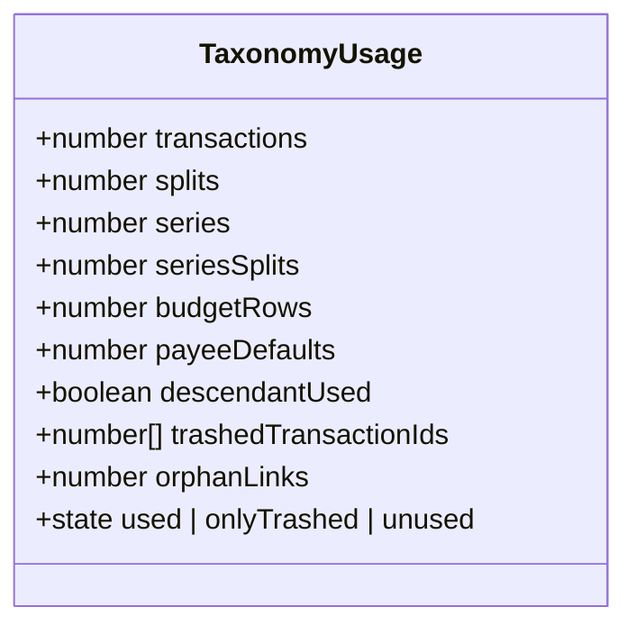
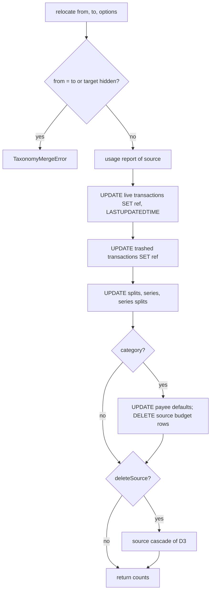
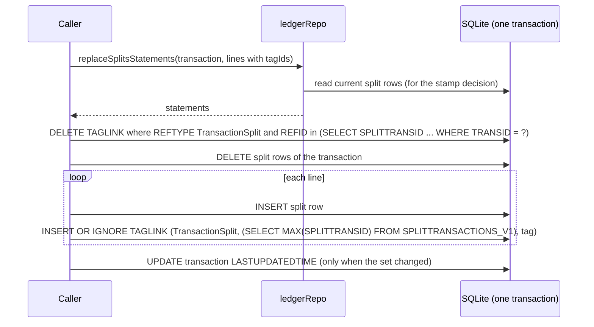

# Transaction Taxonomy Fidelity — Design

**Change**: `transaction-taxonomy-fidelity`
**Version**: 1.1.0
**Last Updated**: 2026-10-02

Related artifacts: [proposal.md](./proposal.md), [specs/transaction-taxonomy/spec.md](./specs/transaction-taxonomy/spec.md), [specs/record-extensions/spec.md](./specs/record-extensions/spec.md), [specs/domain-data-conventions/spec.md](./specs/domain-data-conventions/spec.md), [specs/transaction-ledger/spec.md](./specs/transaction-ledger/spec.md), [specs/scheduled-transactions/spec.md](./specs/scheduled-transactions/spec.md), [tasks.md](./tasks.md). Governed by [AGENTS.md](../../../AGENTS.md).

## Context

See proposal.md, Why. The taxonomy domain is [src/domain/rules/taxonomy.ts](../../../src/domain/rules/taxonomy.ts) (pure rules) and [src/domain/repos/taxonomy.ts](../../../src/domain/repos/taxonomy.ts) (statement builders and operations over `db.query`/`db.mutate`); `db.mutate` runs a statement batch in one SQLite transaction inside the worker, and no key generated by one statement can be read by the repository before the batch ends. No surface calls the taxonomy repository today, and no repository test exists for it. Split lines are owned by [src/domain/repos/ledger.ts](../../../src/domain/repos/ledger.ts) and [src/domain/repos/scheduled.ts](../../../src/domain/repos/scheduled.ts); extension cleanup is `extensionCleanupStatements` in [src/domain/repos/extensions.ts](../../../src/domain/repos/extensions.ts).

Every behavior below was verified against the desktop source on 2026-10-02: [categdialog.cpp](../../../mmex/moneymanagerex/src/categdialog.cpp) (name check 347, delete 494–560, hide 752–763), [tagdialog.cpp](../../../mmex/moneymanagerex/src/tagdialog.cpp) (names 181–191, delete 296–320), [Model_Category.cpp](../../../mmex/moneymanagerex/src/model/Model_Category.cpp) (`is_used` 196–225, `full_name` 141–159), [Model_Payee.cpp](../../../mmex/moneymanagerex/src/model/Model_Payee.cpp) (`is_used` 157–168), [Model_Tag.cpp](../../../mmex/moneymanagerex/src/model/Model_Tag.cpp) (`is_used` 63–93), [relocatecategorydialog.cpp](../../../mmex/moneymanagerex/src/relocatecategorydialog.cpp) (150–215), [relocatepayeedialog.cpp](../../../mmex/moneymanagerex/src/relocatepayeedialog.cpp) (162–182), [relocatetagdialog.cpp](../../../mmex/moneymanagerex/src/relocatetagdialog.cpp) (163–211), [payeedialog.cpp](../../../mmex/moneymanagerex/src/payeedialog.cpp) (200, 224–240), [primitive.cpp](../../../mmex/moneymanagerex/src/primitive.cpp) (`isValidURI` 83–88), [Model_Checking.cpp](../../../mmex/moneymanagerex/src/model/Model_Checking.cpp) (stamp 115–118), [Model_Splittransaction.cpp](../../../mmex/moneymanagerex/src/model/Model_Splittransaction.cpp) (`update` 83–131, `remove` 53–58), [option.h](../../../mmex/moneymanagerex/src/option.h) (`USAGE_TYPE` 34) and [option.cpp](../../../mmex/moneymanagerex/src/option.cpp) (511).

## Operator decisions (2026-10-02)

Recorded here so later changes can cite them. The surface-only ones (3, 8, 17 picker, 24, 27) bind the Phase 4 and 5 surface changes, not this one.

| # | Decision | Desktop? |
|---|---|---|
| 1 | "Used" = live transactions, their splits, scheduled series, their splits; trashed rows do not count | yes |
| 2 | Referenced only by trashed rows: confirm, purge those transactions, delete | yes |
| 3 | Always confirm deletion, listing subcategories that go too | divergence, consistent with the account and currency surfaces |
| 4 | Merge stamps `LASTUPDATEDTIME` on re-pointed transactions; "delete source after merge" off by default, unavailable for a category with children | yes |
| 5 | Category delete removes unused subcategories, clears payee defaults in the subtree to `-1`, deletes the subtree's budget rows | stricter: desktop orphans the budget rows |
| 6 | Category merge deletes the source's budget rows | yes |
| 7 | Tag merge collapses duplicates and reports moved and collapsed | divergence: desktop has no defined outcome |
| 8 | Merge UI: per-table counts before, hidden excluded as target, source list = used only, result count after | yes |
| 9 | Name folding is ASCII-only (`COLLATE NOCASE`) | yes |
| 10 | Show-hidden in `SETTING_V1.SHOW_HIDDEN_CATEGS` / `SHOW_HIDDEN_PAYEES`, absent = on | yes |
| 11 | Hidden not selectable for new records; an edited record keeps its current one | yes |
| 12 | Hide and unhide cascade to the subtree; "unhide all" offered; a new child under a hidden parent is visible | yes |
| 13 | Tag names: not empty, no space, not `&` or `|`; category names: not empty, no `:` | yes |
| 14 | Tags are never hidden | yes |
| 15 | Links from scheduled series or splits always block tag deletion; orphan links do not | yes (the `else return 1` branch and the fall-through) |
| 16 | A record's tags ordered by name; manager search case-insensitive substring; category search over full paths | yes |
| 17 | Move to top level allowed and confirmed; picker, no drag-and-drop | divergence in mechanism |
| 18 | Case-only rename allowed | divergence: desktop refuses by accident |
| 19 | `CATEG_DELIMITER` read, absent → `:`; editing deferred | yes |
| 20 | Seed-category localization: own change later | — |
| 21 | PATTERN in desktop's object format, full editing, `regex:` validated best-effort | yes |
| 22 | Payee merge does not relocate attachments; delete-source removes the rows | yes |
| 23 | Payee: empty name refused, invalid website refused, `NUMBER` labelled Reference | yes |
| 24 | Bulk actions in the Phase 4 surfaces | yes |
| 25 | Default-category mode: None / Last used (default) / Unused → `Unknown` / Default, in `TRANSACTION_CATEGORY_NONE` | yes |
| 26 | Hidden payee reachable by exact name; new name asks to create; prefill only for new, non-split entries whose category is not hidden | yes |
| 27 | Tag entry as chips; space or Enter ends a tag; new name confirmed | appearance divergence |
| 28 | Phase 4 tag scope: manager and merge with counts | — |

Also decided during planning on 2026-10-02: split-level tags survive an edit, done in this change (D8). The question put to the operator said desktop preserves split row ids; that was wrong — desktop also replaces the rows and re-attaches the tags from the dialog — and is corrected here; the chosen outcome is desktop's outcome.

## Goals / Non-Goals

**Goals:** every taxonomy mutation leaves the file as desktop would leave it, or as the operator decided it should differ; every refusal is typed so a surface can translate it; every repository function has a test; split replacement loses no tag and leaves no orphan link.

**Non-Goals:** surfaces and their confirmations (Change C); the transaction-entry behaviors that consume the default-category mode or select hidden payees (Phase 5), including creating the `Unknown` category; executing patterns; editing `CATEG_DELIMITER`; search ordering of managers (surface); the materialization of a series' split tags onto ledger splits (not asked for; unchanged).

## Decisions

### D1: Refusals are typed in the repository and translated on the surface

Four error classes in [src/domain/repos/taxonomy.ts](../../../src/domain/repos/taxonomy.ts), on the pattern of `CurrencyConflictError` and `CurrencyInUseError` in [src/domain/repos/currency.ts](../../../src/domain/repos/currency.ts): `TaxonomyNameError { kind: 'category' | 'payee' | 'tag'; reason: 'empty' | 'colon' | 'space' | 'reserved' | 'duplicate' }`, `TaxonomyInUseError { kind; usage: TaxonomyUsage }`, `TaxonomyMergeError { reason: 'sameEntity' | 'hiddenTarget' | 'sourceHasChildren' }`, `PayeeValidationError { field: 'name' | 'website' | 'pattern'; index?: number }`. Messages in English for logs; the surfaces map `reason`/`field` to catalog keys.

*Alternatives rejected*: plain `Error` with message text, which the current code throws and no surface can translate; returning result unions from every function, which would force every caller to branch and does not match the repositories already shipped.

### D2: Usage is a structured report, and "used" is computed as desktop computes it

*Caption: One report shape for categories, payees and tags; fields that do not apply are zero.*

- `transactions` and `splits` count only rows whose transaction has `DELETEDTIME` empty (`IS NULL OR = ''`, as the ledger stores it); `trashedTransactionIds` lists the others, so the purge of D4 knows what to remove. Split references resolve to their transaction for the live test, as `Model_Category::is_used` does.
- `series` and `seriesSplits` count every row — desktop never trashes a series.
- For a category, `descendantUsed` is the recursion over `categorySubtree`; `budgetRows` and `payeeDefaults` are reported for the merge screen but never make the entity used (decision 1).
- For a tag, `orphanLinks` counts links whose record no longer exists; they never make the tag used (decision 15) and are deleted with the tag. `state` (a field, computed when the report is built) reproduces desktop's `is_used` tri-state: `used` when any live or series reference exists, `onlyTrashed` when only trashed transactions reference it, `unused` otherwise.

*Alternative rejected*: the current `usageCount(): number`, which cannot distinguish a live reference from a trashed one and cannot feed the merge screen's per-table counts (decision 8).

### D3: Deletion refuses `used`, purges `onlyTrashed` on an explicit flag, and composes the cascade in one batch

`remove(id, { purgeTrashed })`: `used` → `TaxonomyInUseError`; `onlyTrashed` without the flag → `TaxonomyInUseError` whose `usage.state()` tells the surface to ask for the purge confirmation (decision 2); otherwise one batch: the hard-delete statements for every trashed transaction (D4), then the entity's own cascade. The surface owns the confirmation dialogs (decision 3); the repository never asks.

Category cascade order within the batch: `DELETE FROM BUDGETTABLE_V1 WHERE CATEGID IN (subtree + self)`, `UPDATE PAYEE_V1 SET CATEGID = -1 WHERE CATEGID IN (...)`, `DELETE FROM CATEGORY_V1 WHERE CATEGID IN (...)` (decision 5; desktop's `mmDoDeleteSelectedCategory` does the first two differently — it leaves the budget rows and clears payee defaults only for the category itself). Payee cascade: `extensionCleanupStatements(REFTYPE.payee, [id])` then the row. Tag cascade: `DELETE FROM TAGLINK_V1 WHERE TAGID = ?` (only orphan links remain at this point) then the row.

`removeMany(ids, { purgeTrashed })` evaluates each id and returns `{ removed: number[]; refused: Array<{ id; usage }> }`, deleting the removable ones in one batch — desktop's tag manager behaves this way for a multi-selection (continue past the used ones).

*Alternative rejected*: refusing the whole bulk deletion when one entity is used, which would make the common "delete the unused ones" gesture fail.

### D4: Purging trashed transactions reuses the ledger's hard-delete statements

The ledger repository already exposes the hard-delete batch for a list of transaction ids as `ledgerRepo.hardDeleteStatements` — split ids, `Transaction` and `TransactionSplit` extension cleanup, split rows, share and link rows, transaction rows ([src/domain/repos/ledger.ts](../../../src/domain/repos/ledger.ts)). It is spliced unchanged into the taxonomy batch, so the purge triggered by a category deletion is byte-for-byte the purge the ledger performs on retention expiry.

*Alternative rejected*: a second hard-delete implementation in the taxonomy repository, which would drift from the ledger's cascade rules.

### D5: Relocation re-points in two updates per transaction table, stamps only live rows, and deletes budget rows

*Caption: One batch, counts taken from the usage report before it runs.*

- Desktop stamps `LASTUPDATEDTIME` when it saves a live row and leaves a trashed row's stamp alone (`Model_Checking::save`, 115–118). Relocation therefore issues `UPDATE CHECKINGACCOUNT_V1 SET CATEGID = ?, LASTUPDATEDTIME = ? WHERE CATEGID = ? AND COALESCE(DELETEDTIME, '') = ''` — the ledger's own live predicate — and a second update without the stamp for the rest (`NOT (...)`). Split rows carry no stamp; their transaction is stamped through the same live-row rule only when the transaction itself is re-pointed — desktop's `relocatecategorydialog` saves split rows through `Model_Splittransaction::save`, which does not touch the transaction, so neither does this.
- Budget rows of the source category are deleted, not re-pointed (decision 6; desktop 205–209), and counted as changed.
- `deleteSource` composes the D3 cascade after the updates; for a category with children it is refused with `TaxonomyMergeError('sourceHasChildren')` (decision 4; desktop removes the source only when `sub_category(...).empty()`). For a payee the cascade removes attachment rows and custom field data; the merge itself never touches `ATTACHMENT_V1` (decision 22).
- The return value is `{ changed: number; byTable: Partial<Record<Table, number>> }` so the surface can show both the pre-merge counts (from `usage`) and the post-merge total (decision 8).

*Alternatives rejected*: a single update per table with the stamp, which would stamp trashed rows desktop leaves alone; re-pointing budget rows, which duplicates `(BUDGETYEARID, CATEGID)` and is the C1 defect.

### D6: Tag merge collapses collisions and counts them, and does not stamp

Before the batch: `SELECT COUNT(*) FROM TAGLINK_V1 s JOIN TAGLINK_V1 t ON t.REFTYPE = s.REFTYPE AND t.REFID = s.REFID AND t.TAGID = ? WHERE s.TAGID = ?` gives the collapsed count; moved = source links − collapsed. The batch: `UPDATE OR IGNORE TAGLINK_V1 SET TAGID = ? WHERE TAGID = ?` (the unique index on `(REFTYPE, REFID, TAGID)` makes the collisions no-ops), then `DELETE FROM TAGLINK_V1 WHERE TAGID = ?` removes the collapsed ones. Source = target is refused before anything runs (C2). A tag merge changes link rows, not transaction rows, so no transaction is stamped — consistent with desktop's `relocatetagdialog`, which saves links through `Model_Taglink::save` without touching `CHECKINGACCOUNT_V1`.

*Alternative rejected*: desktop's literal `save(taglinks)` with the changed `TAGID`, whose outcome on a collision is undefined (decision 7 records the divergence).

### D7: Visibility — cascade for categories, nothing for tags, and the preferences live in `SETTING_V1`

- `categoryRepo.setHiddenStatements(id, hidden)` updates the category and every id in `categorySubtree` (decision 12, desktop 752–763). `payeeRepo.setHiddenStatements(ids, hidden)` updates the given payees (also the bulk builder of decision 24).
- `addStatement` for a category writes `ACTIVE 1` regardless of the parent's state (decision 12, desktop 367).
- Tags: `tagRepo.addStatement` and `renameStatement` always write `ACTIVE 1`; the rules layer's `isHidden` is documented and typed for categories and payees only, and no tag path calls it; a stored `0` is read as visible by never consulting it (decision 14). No migration rewrites stored tag rows.
- `SETTING_KEY.showHiddenCategories = 'SHOW_HIDDEN_CATEGS'`, `SETTING_KEY.showHiddenPayees = 'SHOW_HIDDEN_PAYEES'`, read through `fileFacts` with absent → `true`, written only by the surfaces' toggles with desktop's `TRUE`/`FALSE` strings (decision 10; the same shape as `SHOW_HIDDEN_CURRENCIES`, which lives in `INFOTABLE` because desktop puts it there).

*Alternative rejected*: a `hidden` concept for tags with a migration to `ACTIVE 1`, which would rewrite rows desktop never writes.

### D8: Split replacement writes the new rows and their tag links in one batch, keyed by `MAX()`

*Caption: Each row's tag links are written right after the row, while MAX(SPLITTRANSID) is still that row's key.*

- The lines gain an optional `tagIds: readonly number[]`. The statement builder becomes asynchronous because it reads the current rows to decide the stamp (desktop's content comparison, `Model_Splittransaction::update` 88–110: a different count, or any row with no content-identical counterpart, stamps). The scheduled variant does the same without a stamp (`BILLSDEPOSITS_V1` has no such column) using `BUDGETSPLITTRANSACTIONS_V1` and `RecurringTransactionSplit`.
- `MAX(SPLITTRANSID)` is the key the preceding insert received, for the reason recorded in `domain-write-fixes` D1: no `AUTOINCREMENT`, one transaction, nothing else writes between the two statements.
- The three places that delete series split rows without cleaning their links — series removal, `removeMany`, and account removal — add a `TAGLINK_V1` delete for `RecurringTransactionSplit` whose ids come from a subquery on `BUDGETSPLITTRANSACTIONS_V1` inside the batch, so the synchronous builders (`removeStatements`, which `advanceStatements` calls) stay synchronous (C4; revised 2026-10-02 from "read before the batch"). Splits carry only tag links in desktop, so no attachment or custom-field cleanup is emitted for them. The ledger's hard delete already does this for `TransactionSplit`.

*Alternatives rejected*: preserving split row ids with a diff-based update — desktop does not, and the editor would have to carry ids; attaching tags in a second batch after reading the new ids — a failure between the batches would leave untagged rows.

### D9: Payee pattern codec and validation

- `parsePayeePatterns(payee)` accepts a JSON object (values taken in ascending numeric key order) or a JSON array; anything else yields `[]`. `serializePayeePatterns(patterns)` drops blank entries after trimming and writes `JSON.stringify(object, null, 4)`, which for a flat string object matches rapidjson's `PrettyWriter` output byte for byte (four-space indent, one key per line).
- `validatePayeePatterns(patterns)` returns the first `regex:` entry whose remainder does not compile with `new RegExp(remainder, 'i')`, as `PayeeValidationError { field: 'pattern', index }` (desktop compiles with `wxRE_ICASE | wxRE_EXTENDED`; R1 records the dialect difference).
- `payeeRepo.updateStatement` writes `PATTERN` only when the caller passes patterns; editing other fields never touches it (the existing scenario).

*Alternative rejected*: storing the legacy array form, which desktop's reader would ignore.

### D10: Website validation ports desktop's regular expression

`isValidWebsite(value)`: empty → valid; otherwise `trim().toLowerCase()` must match `^(?:https?:\/\/)?[\w.-]+(?:\.[\w.-]+)+[\w\-._~:/?#[\]@!$&'()*+,;=.]+$`, the pattern of `isValidURI` transcribed with JavaScript escapes. R2 records that `\w` is ASCII-only in JavaScript where wxWidgets may match letters beyond ASCII.

*Alternative rejected*: the `URL` constructor, which accepts `mailto:` and rejects a bare host, neither of which desktop does.

### D11: Default-category mode and category delimiter are file facts

`SETTING_KEY.transactionCategoryNone = 'TRANSACTION_CATEGORY_NONE'` read as `DEFAULT_CATEGORY_MODE` (`none 0`, `lastUsed 1`, `unused 2`, `default 3`; absent or unknown → `lastUsed`, desktop's `getInt(..., LASTUSED)`); `INFO_KEY.categoryDelimiter = 'CATEG_DELIMITER'` read with absent → `:`. `categoryFullName` keeps its delimiter parameter; the surfaces pass `await fileFacts.categoryDelimiter()`. The behaviors that consume the mode are Phase 5's; this change makes the fact readable and specified.

### D12: Bulk builders are statement arrays composed from the single-entity builders

`payeeRepo.setHiddenStatements(ids, hidden)`, `payeeRepo.setDefaultCategoryStatements(ids, categoryId | -1)`, and `removeMany` of D3 for categories, payees and tags. They exist so Change C can run one batch per gesture (decision 24); they add no rule of their own.

### D13: Tests assert the statement batch against a fake `DomainDb`, plus pure rule tests

The SQLite WebAssembly build cannot be initialized under Node (`domain-write-fixes`, D3), so repository tests use the fake `DomainDb` pattern of [src/__tests__/domain/scheduled-repo.spec.ts](../../../src/__tests__/domain/scheduled-repo.spec.ts): the fake answers the repository's reads from fixtures and records every batch; tests assert statement order, SQL semantics (table, columns, the `DELETEDTIME` predicate, the `MAX()` key expression, `OR IGNORE`) and bound values. Rule tests cover names, folding, the pattern codec round-trip on a desktop-shaped value, the URL port on desktop's accepted and refused examples, and the mode codec. Every test is written to fail on the current code first; the red result is recorded in tasks.md.

## Risks / Trade-offs

| # | Risk | Likelihood | Impact | Mitigation |
|---|------|------------|--------|------------|
| R1 | A `regex:` pattern valid under wx extended syntax is refused by JavaScript, or the reverse | Medium | Low | Validation only, never execution; the pattern is still stored verbatim when valid; recorded in the spec and here, with the known cases listed in [taxonomy-rules.spec.ts](../../../src/__tests__/domain/taxonomy-rules.spec.ts) (`refuses a regex: pattern that does not compile`: a lookbehind and `\\d` are accepted here and refused by POSIX extended syntax); a desktop user who hits it can edit the pattern in desktop |
| R2 | `\w` in the website pattern is ASCII-only in JavaScript; an internationalized host desktop accepts is refused | Low | Low | Recorded; the surface shows the field; the value can be stored through desktop |
| R3 | `MAX(SPLITTRANSID)` is not the just-inserted key | Negligible | High | Same conditions as `domain-write-fixes` D1: no `AUTOINCREMENT`, one transaction per batch, nothing writes in between; the tests assert the key expression follows each insert |
| R4 | Collapsed-link count computed before the batch differs from what `UPDATE OR IGNORE` collapses | Negligible | Low | One worker, one transaction; the count query and the batch see the same rows |
| R5 | ASCII-only folding lets two names that were duplicates under full folding both exist | Low | Low | Exactly desktop's view of the file; no data repaired; `namesEqual` has one implementation for every capability |
| R6 | Statement-shape tests cannot observe what SQLite does with the statements | Medium | Medium | Tests state each semantic by name (predicate, key expression, `OR IGNORE`); Change C's Chromium end-to-end tests exercise the same batches against real SQLite |
| R7 | The repository's API changes break a caller | Low | Low | No caller exists outside tests (grep verified 2026-10-02); `vue-tsc` catches any that appears |
| R8 | Purging through a taxonomy deletion hard-deletes transactions the user did not look at | Low | High | Only `onlyTrashed` references qualify; the repository refuses without the explicit `purgeTrashed` flag, which the surface sets only after desktop's confirmation text (decision 2) |

## Migration Plan

No schema change and no stored data repaired. The `namesEqual` change takes effect on the next comparison. No surface is affected because none calls the changed functions; the account and currency surfaces compare names through `namesEqual` and keep working with ASCII folding.

## Open Questions

None. The one question raised during planning (split tags) was decided on 2026-10-02 and is D8.
