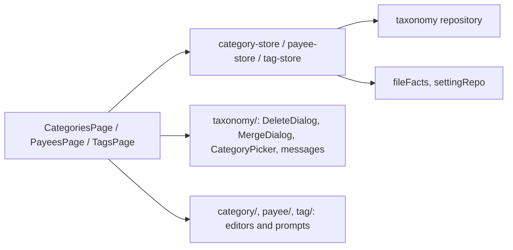
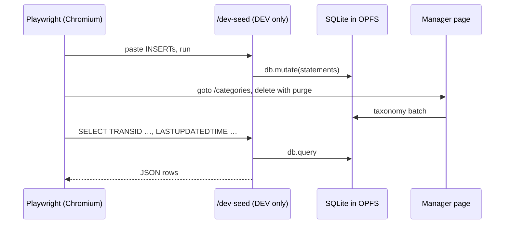

# Transaction Taxonomy Surfaces — Design

**Change**: `transaction-taxonomy-surfaces`
**Version**: 1.0.0
**Last Updated**: 2026-10-02

Related artifacts: [proposal.md](./proposal.md), [specs/transaction-taxonomy/spec.md](./specs/transaction-taxonomy/spec.md), [tasks.md](./tasks.md). Governed by [AGENTS.md](../../../AGENTS.md).

## Context

See proposal.md, Why. The surfaces sit on the repository the archived change left: [src/domain/repos/taxonomy.ts](../../../src/domain/repos/taxonomy.ts) exposes typed refusals (`TaxonomyNameError`, `TaxonomyInUseError` with a `TaxonomyUsage` whose `state` is `used | onlyTrashed | unused`, `TaxonomyMergeError`, `PayeeValidationError`), statement builders, `usage`, `remove(id, { purgeTrashed })`, `removeMany`, `relocate(from, to, { deleteSource, now })`, and the payee bulk builders; [src/domain/repos/metadata.ts](../../../src/domain/repos/metadata.ts) reads the show-hidden preferences, the default-category mode and the delimiter, and `encodeSettingBoolean` writes desktop's `TRUE`/`FALSE`.

The surfaces already shipped set the conventions, surveyed on 2026-10-02: routes carry `meta.nav { labelKey, icon, order }` and `meta.capability` in [src/router/index.ts](../../../src/router/index.ts) (orders 10, 20, 30, 90 taken), the drawer is built from that metadata, and [src/__tests__/router.spec.ts](../../../src/__tests__/router.spec.ts) asserts each destination; pages are a `q-page` with a header, a `q-list`, a `q-banner` for a failed write (`<entity>-action-error`), an inline `q-dialog` confirmation, and a local `describe(err)` mapping typed errors to catalog keys; stores are Pinia setup stores that `load()` with one `Promise.all`, filter in the store, and reload after every write, letting typed errors reach the page; editors are a dialog wrapper around a separate form component (a portal renders nothing under test) validated by a rules-layer function, with refusals shown per field; test ids are `<entity>-<thing>`; the two catalogs [src/locales/en-US.json](../../../src/locales/en-US.json) and [src/locales/zh-TW.json](../../../src/locales/zh-TW.json) must keep identical key sets ([shell-localization.spec.ts](../../../src/__tests__/shell-localization.spec.ts)); end-to-end specs under [e2e/](../../../e2e/) open the database through the UI, navigate by `page.goto`, and verify through the UI after a reload. There is no shared confirm dialog, error mapper or picker today. The SQLite WebAssembly build runs only in the browser; WebKit on the development machine cannot open OPFS (F31), so end-to-end runs are Chromium.

## Goals / Non-Goals

**Goals:** the three managers and three merge screens as desktop presents them, within the archived rules; every refusal translated; every destructive action confirmed as the operator decided; the domain batches exercised against real SQLite in Chromium; no domain behavior changed.

**Non-Goals:** editing split lines or transactions (no ledger surface exists; the split-tags check waits for it); the transaction-entry behaviors of decisions 25 to 27; an attachment manager; seed-category localization; any route that scopes a collection view (the managers are whole-collection views, so the scoped-route rule does not apply).

## Decisions

### D1: Three routes with navigation metadata, orders 40, 50, 60

`/categories` (`menu.categories`, `mdi-file-tree`, 40), `/payees` (`menu.payees`, `mdi-account-group-outline`, 50), `/tags` (`menu.tags`, `mdi-tag-multiple-outline`, 60), each `capability: 'transaction-taxonomy'`, non-public so the readiness guard applies. [router.spec.ts](../../../src/__tests__/router.spec.ts) gains one "offers the X destination" case per route in the existing shape. Desktop reaches the managers through the Tools menu; the drawer is this application's equivalent.

*Alternative rejected*: one `/taxonomy` route with tabs, which would hide three destinations behind one navigation entry and break the one-route-per-destination shape the other surfaces follow.

### D2: Pages, stores and dialogs follow the shipped conventions

Each manager is a page plus a setup store plus dialog components, exactly as currencies and accounts: `load()` over one `Promise.all`, filtering in the store, reload after a write, typed errors propagated to the page, `q-banner` for a failed write, `data-testid="<entity>-<thing>"`, rows carrying `data-<entity>-id`. Where three managers need the same piece, it becomes a shared component under [src/components/taxonomy/](../../../src/components/taxonomy/) (D5, D6, D7, D12) — the third use is what justifies the abstraction.

*Caption: Three pages over three stores, sharing the pieces all three need.*

### D3: The category tree is a `q-tree` filtered on full names

Nodes are built from `categoryRepo.all()` with `categoryFullName(id, categories, delimiter)` for the search and the labels; `delimiter` comes from `fileFacts.categoryDelimiter()`. The search uses `q-tree`'s `filter` with a `filter-method` that tests the full name case-insensitively, which keeps a matching node's ancestors visible — the spec's "shown with its ancestors". Expand-all and collapse-all call the tree's methods; selection is the tree's `selected` model; a hidden node carries a muted class and an eye-off icon. Hidden nodes are included in the node set only while the toggle is on, so the filter never surfaces them by accident.

*Alternative rejected*: a flat `q-list` of full names, which loses the tree desktop shows and the expand/collapse gestures.

### D4: The show-hidden toggles write desktop's `TRUE`/`FALSE` to `SETTING_V1`

`category-store.setShowHidden(value)` and `payee-store.setShowHidden(value)` set the state, then `settingRepo.set(SETTING_KEY.showHiddenCategories | showHiddenPayees, encodeSettingBoolean(value))`; the initial state is `fileFacts.showHiddenCategories()` / `showHiddenPayees()`. Writing `TRUE`/`FALSE` rather than `1`/`0` is what lets desktop's strict `Model_Setting::getBool` read the choice back (spec Show-Hidden Preferences, 1.1.0).

*Alternative rejected*: `encodeBooleanValue` (`1`/`0`), which the currency surface uses for an `INFOTABLE` key; desktop would read it as the default and ignore the user's choice.

### D5: One confirmation dialog for the three deletions

`TaxonomyDeleteDialog.vue` takes a title, the names being deleted, consequence lines (subcategories, budget rows, cleared defaults, attachment rows), a `purge` flag that adds desktop's two purge sentences, and emits `confirm`/`cancel`. The page decides the lines from the usage report: `state === 'used'` never reaches the dialog (it is a refusal, D6); `onlyTrashed` sets `purge`. The confirmation is always shown (operator decision 3), and `purgeTrashed: true` is passed to the repository only after it.

*Alternative rejected*: three inline dialogs as the earlier surfaces wrote them; the purge sentence, the consequence list and the multi-selection naming would be written three times.

### D6: One mapping from typed refusals to catalog keys

`src/components/taxonomy/taxonomy-messages.ts` exports `describeTaxonomyError(err, t): string | null`: `TaxonomyNameError` → `taxonomy.name.<reason>` with the kind's label; `TaxonomyInUseError` → `taxonomy.inUse.<kind>` with the counts (`transactions`, `splits`, `series`, `seriesSplits`) and, for categories, the merge tip; `TaxonomyMergeError` → `taxonomy.merge.<reason>`; `PayeeValidationError` → `payee.invalid.<field>` with the line number for a pattern. Pages call it from their `describe(err)` and fall back to the generic write-failed banner. The strings are desktop's, translated in both catalogs.

### D7: One merge screen for the three kinds

`MergeDialog.vue` takes a `kind`, the option lists, and callbacks the store provides: `usageOf(id)` for the counts, `relocate(from, to, options)`. Source options are the entities whose bulk usage count (D9) is greater than zero; target options are visible entities other than the source. The counts panel lists desktop's lines for the kind ("Records found in transactions: n", …); the delete-source checkbox is disabled with desktop's note when the source is a category with children (the store knows the tree). Merge asks "From <source> to <target>" and, on success, shows "<n> records changed" — and "<m> links collapsed" for tags. Refusals surface through D6 on the dialog.

*Alternative rejected*: a merge button inside each editor; desktop keeps merge as its own dialog with its own counts, and the operator asked for the counts before and after (decision 8).

### D8: The payee list is a table on wide screens and cards on narrow ones; the tag list is a check list

The payee manager uses `q-table` with desktop's eight columns, `selection="multiple"`, and `grid` mode under `$q.screen.lt.md`, where each card carries the same fields — the responsive-hybrid stance of 2026-08-08 applied to a list for the first time, justified by eight columns and a multi-selection (decision 24). The selection actions sit in a toolbar above the table and are disabled without a selection. The tag manager is a `q-list` with a checkbox per row, the name, and the count; Edit and Merge require exactly one checked tag. The category manager needs no table.

*Alternative rejected*: a `q-list` for payees as the other surfaces use, which cannot carry eight columns or a multi-selection legibly.

### D9: Bulk live-use counts are one query per repository

`categoryRepo.usageCounts()`, `payeeRepo.usageCounts()` and `tagRepo.usageCounts()` return `Map<id, number>` from one statement each: for payees, live transactions grouped by `PAYEEID` plus series grouped by `PAYEEID` (desktop's `m_payeeUsage` pass); for tags, links joined to a live transaction, a live split's transaction, an existing series or an existing series split, grouped by `TAGID`; for categories, direct references of the same four kinds grouped by `CATEGID` (the merge screen's "used only" source list). The per-entity `usage(id)` stays the authority for deletion and the merge counts; the bulk query only feeds list columns and the source list. Both use the ledger's live predicate `COALESCE(DELETEDTIME, '') = ''`.

*Alternative rejected*: calling `usage(id)` per row, N+1 queries on every load of a file with hundreds of payees.

### D10: End-to-end seeding and observation through a development-only route

No surface can create transactions, split lines, tag links or budget rows yet, and the Chromium checks need them. A development-only page at `/dev-seed` (`DevSeedPage.vue`, `capability: 'infrastructure-baseline'`, non-public) offers a statements box that runs through `db.mutate` and a query box that shows `db.query` results as JSON. It is added inside the existing `import.meta.env.DEV` spread in the route table, which keeps it out of production bundles entirely — the `/coep-probe` precedent, and what `app-shell-navigation` requires of development routes. End-to-end specs seed by pasting SQL, drive the managers through the UI, then read rows back (`LASTUPDATEDTIME`, `TAGLINK_V1`, `BUDGETTABLE_V1`, purged `TRANSID`s) through the query box. The page is not a user-facing destination and has no navigation entry.

*Caption: The seam seeds and observes; the behavior under test runs through the real surface and the real database.*

*Alternatives rejected*: a committed `.mmb` fixture built by a Python script (a new toolchain dependency and binary fixtures that cannot be reviewed); asserting through the UI alone (cannot observe `LASTUPDATEDTIME`, purged rows or link rows); a `window` global exposed in development (less visible than a route, and outside the route governance).

### D11: Patterns are edited as lines in a text area

The payee editor shows the patterns one per line; the codec drops blank lines and renumbers (archived D9). A `regex:` refusal names the line (index + 1). Desktop's grid of rows is not reproduced; the stored result is identical.

### D12: One category picker for every place a category is chosen

`CategoryPicker.vue` is a `q-select` over full names (file delimiter), offering visible categories plus the current value when it is hidden (spec Visibility: an edited record keeps its current one), with an optional exclusion set — the category itself and its subtree for Move to…, the source for a merge target. Used by Move to…, the payee editor's default category, Define Category over a selection, and the category merge target.

### D13: Tests

Unit: router cases; catalog parity; `taxonomy-messages` mapping every reason; `TaxonomyDeleteDialog` (lines, purge sentence, emits); `MergeDialog` (source/target filtering, counts, delete-source disabled, result text); `CategoryPicker` (exclusions, hidden current value); the three stores against a fake `DomainDb` (load, filter, tree, `setShowHidden` writes `TRUE`/`FALSE`, actions delegate to the repository with the right options); the three forms (validation per field, test ids). Component tests locate Quasar controls through `vm.$attrs['data-testid']` and drive blur with `focusin`/`focusout` plus a timer, as the currency tests do. End-to-end (Chromium): one spec per manager, seeded through D10, verifying list, search, toggle persistence across reload, create/rename, delete with purge (rows gone), merge (stamp set, budget rows gone, links collapsed), bulk actions, and refusal text.

## Risks / Trade-offs

| # | Risk | Likelihood | Impact | Mitigation |
|---|------|------------|--------|------------|
| R1 | `q-tree` filtering does not keep ancestors visible as assumed | Low | Medium | Component test for the "Search matches the full path" scenario before the page is built; fall back to a custom filtered node set |
| R2 | `q-table` grid mode on a phone is hard to read with eight fields | Medium | Low | Card template shows name, category, Used first and folds the rest; checked in Chromium at phone width |
| R3 | The development route leaks into a production bundle | Low | High | Same `import.meta.env.DEV` spread as `/coep-probe`; task verifies `dist/` contains no `DevSeedPage` chunk after `npm run build` |
| R4 | Bulk count queries are slow on a large file | Low | Low | One `GROUP BY` pass per table, run once per load |
| R5 | Traditional Chinese wording of desktop's messages drifts from desktop's own `zh_TW.po` | Medium | Low | Translations taken from `mmex/moneymanagerex/po/zh_TW.po` where the string exists; the operator reviews the rest |
| R6 | A partly refused bulk deletion confuses the user | Medium | Low | The result names every kept entity with its reason, as desktop's per-item messages do |
| R7 | WebKit cannot run the end-to-end specs (F31) | Certain on this machine | Low | Chromium only, recorded as before |
| R8 | OPFS state bleeds between end-to-end specs | Medium | Medium | Each spec seeds distinct names and cleans up what it created; the existing specs already tolerate a pre-existing database |

## Migration Plan

No schema change; no stored data affected. The routes appear in the drawer on the next load; nothing is written until the user acts.

## Open Questions

None. Every UX question was decided on 2026-10-02 and is cited in the spec delta.
