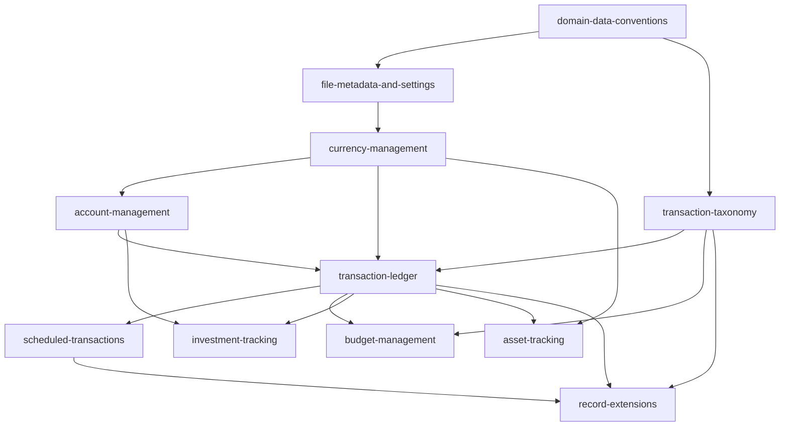

# Domain Capability Map

**Version**: 1.0.0
**Last Updated**: 2026-08-08

The living roadmap for the MoneyManagerEx PWA remake's domain capabilities. Established by change `domain-model-baseline`; future implementation changes cite this map and update the status column as they land. Governed by [AGENTS.md](../AGENTS.md).

## Capability Roster

| Capability | Owned tables | Status |
|---|---|---|
| `domain-data-conventions` | (cross-cutting, no tables) | Baseline established |
| `file-metadata-and-settings` | `INFOTABLE_V1`, `SETTING_V1`, `REPORT_V1` (custody), `USAGE_V1` (custody) | Baseline established |
| `currency-management` | `CURRENCYFORMATS_V1`, `CURRENCYHISTORY_V1` | Baseline established |
| `account-management` | `ACCOUNTLIST_V1` | Baseline established |
| `transaction-taxonomy` | `CATEGORY_V1`, `PAYEE_V1`, `TAG_V1`, `TAGLINK_V1` | Baseline established |
| `transaction-ledger` | `CHECKINGACCOUNT_V1`, `SPLITTRANSACTIONS_V1` | Baseline established |
| `scheduled-transactions` | `BILLSDEPOSITS_V1`, `BUDGETSPLITTRANSACTIONS_V1` | Baseline established |
| `budget-management` | `BUDGETYEAR_V1`, `BUDGETTABLE_V1` | Baseline established |
| `investment-tracking` | `STOCK_V1`, `STOCKHISTORY_V1`, `SHAREINFO_V1`, `TRANSLINK_V1` (stock side) | Baseline established |
| `asset-tracking` | `ASSETS_V1`, `TRANSLINK_V1` (asset side) | Baseline established |
| `record-extensions` | `ATTACHMENT_V1`, `CUSTOMFIELD_V1`, `CUSTOMFIELDDATA_V1` | Baseline established |

"Baseline established" means the capability's data semantics, custody duties, and conditional behavioral rules are normative; no user-facing feature is implied. Feature requirements are ADDed by each domain's implementation change.

## Dependency Graph

*Caption: Capability prerequisites — implement a capability only after its prerequisites have features to build on.*

## Implementation Phase Order

| Phase | Delivers | Capability |
|---|---|---|
| 0 | Application shell, home route, navigation governance | new `app-shell-navigation` (spec with its first implementation change) |
| 1 | File metadata and settings surfaces | `file-metadata-and-settings` |
| 2 | Currency management | `currency-management` |
| 3 | Accounts | `account-management` |
| 4 | Categories, payees, tags | `transaction-taxonomy` |
| 5 | Transaction register | `transaction-ledger` |
| 6 | Scheduled transactions | `scheduled-transactions` |
| 7 | Budgets | `budget-management` |
| 8 | Custom fields; attachment metadata (read-only stance — binaries never managed, operator decision 2026-08-08) | `record-extensions` |
| 9 | Stocks | `investment-tracking` |
| 10 | Assets | `asset-tracking` |

## Long-Lived Non-Scope

Deferred until proposed by their own changes: reports engine and `REPORT_V1` execution, import/export (QIF/CSV/XML/OFX/JSON), the transaction filter language, homepage dashboard widgets, bulk edit, online quote/rate fetching, telemetry writing, desktop webapp-sync parity.

## Standing Constraints

- Full bidirectional `.mmb` compatibility (operator decision 2026-08-08) — normative home: `domain-data-conventions`, Requirement: MMB Round-Trip Fidelity.
- UX divergence protocol (operator instruction 2026-08-08) — desktop UX is never specified silently; UX-entangled rules are escalated to the operator. The seven baseline UX questions are all resolved (2026-08-08) in `domain-model-baseline` design.md Open Questions: daily post-sync purge/auto-execute cadence, banner-and-badge scheduling prompts, URL-routed register scopes, no UDFC columns, read-only attachment stance, responsive-hybrid edit forms, summary-card home. Newly discovered UX entanglements in future changes are still escalated before their requirements are finalized.
