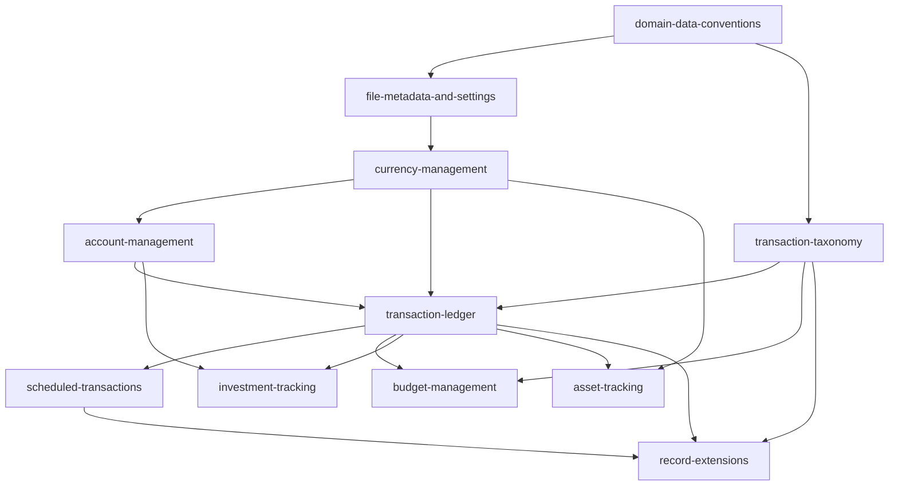

# Domain Capability Map

**Version**: 1.10.0
**Last Updated**: 2026-10-02

The living roadmap for the MoneyManagerEx PWA remake's domain capabilities. Established by change `domain-model-baseline`; future implementation changes cite this map and update the status column as they land. Governed by [AGENTS.md](../../AGENTS.md).

## Capability Roster

| Capability | Owned tables | Status |
|---|---|---|
| `app-shell-navigation` | (no tables — shell and routing) | Phase 0 delivered |
| `domain-data-access` | (no tables — access architecture) | Delivered with the domain layer |
| `domain-data-conventions` | (cross-cutting, no tables) | Baseline established; name folding made ASCII-only by `transaction-taxonomy-fidelity`, archived 2026-10-02 |
| `file-metadata-and-settings` | `INFOTABLE_V1`, `SETTING_V1`, `REPORT_V1` (custody), `USAGE_V1` (custody) | Phase 1 delivered |
| `currency-management` | `CURRENCYFORMATS_V1`, `CURRENCYHISTORY_V1` | Phase 2 delivered |
| `account-management` | `ACCOUNTLIST_V1` | Phase 3 delivered |
| `transaction-taxonomy` | `CATEGORY_V1`, `PAYEE_V1`, `TAG_V1`, `TAGLINK_V1` | Baseline established; domain and specification brought to desktop fidelity by `transaction-taxonomy-fidelity`, archived 2026-10-02; surfaces delivered by `transaction-taxonomy-surfaces`, archived 2026-10-03 |
| `transaction-ledger` | `CHECKINGACCOUNT_V1`, `SPLITTRANSACTIONS_V1` | Baseline established; split replacement keeps tags and stamps, `transaction-taxonomy-fidelity`, archived 2026-10-02 |
| `scheduled-transactions` | `BILLSDEPOSITS_V1`, `BUDGETSPLITTRANSACTIONS_V1` | Baseline established; split linkage on execute fixed by `domain-write-fixes`, archived 2026-10-02; series split replacement and cleanup specified by `transaction-taxonomy-fidelity`, archived 2026-10-02 |
| `budget-management` | `BUDGETYEAR_V1`, `BUDGETTABLE_V1` | Baseline established |
| `investment-tracking` | `STOCK_V1`, `STOCKHISTORY_V1`, `SHAREINFO_V1`, `TRANSLINK_V1` (stock side) | Baseline established; payee sentinel on trades fixed by `domain-write-fixes`, archived 2026-10-02 |
| `asset-tracking` | `ASSETS_V1`, `TRANSLINK_V1` (asset side) | Baseline established |
| `record-extensions` | `ATTACHMENT_V1`, `CUSTOMFIELD_V1`, `CUSTOMFIELDDATA_V1` | Baseline established; attachment rows stay on a merged source, `transaction-taxonomy-fidelity`, archived 2026-10-02 |

"Baseline established" means the capability's data semantics, custody duties, and conditional behavioral rules are normative; no user-facing feature is implied. Feature requirements are ADDed by each domain's implementation change.

## Dependency Graph

*Caption: Capability prerequisites — implement a capability only after its prerequisites have features to build on.*

## Implementation Phase Order

| Phase | Delivers | Capability |
|---|---|---|
| 0 | Application shell, home route, navigation governance — **delivered 2026-08-09** | `app-shell-navigation` |
| 1 | File metadata and settings surfaces — **delivered 2026-08-09**; brought to desktop fidelity by `file-metadata-and-settings-fidelity`, archived 2026-10-02 | `file-metadata-and-settings` |
| 2 | Currency management — **delivered 2026-08-09**; brought to desktop fidelity by `currency-management-fidelity`, archived 2026-10-02 | `currency-management` |
| 3 | Accounts — **delivered 2026-10-02** | `account-management` |
| 4 | Categories, payees, tags — **delivered 2026-10-03** (`transaction-taxonomy-surfaces`, operator approval 2026-10-03); domain and specification brought to desktop fidelity by `transaction-taxonomy-fidelity`, archived 2026-10-02 | `transaction-taxonomy` |
| 5 | Transaction register | `transaction-ledger` |
| 6 | Scheduled transactions | `scheduled-transactions` |
| 7 | Budgets | `budget-management` |
| 8 | Custom fields; attachment metadata (read-only stance — binaries never managed, operator decision 2026-08-08) | `record-extensions` |
| 9 | Stocks | `investment-tracking` |
| 10 | Assets | `asset-tracking` |

## Long-Lived Non-Scope

Deferred until proposed by their own changes: reports engine and `REPORT_V1` execution, import/export (QIF/CSV/XML/OFX/JSON), the transaction filter language, homepage dashboard widgets, bulk edit, online quote/rate fetching, telemetry writing, desktop webapp-sync parity.

## Standing Constraints

- Full bidirectional `.mmb` compatibility (operator decision 2026-08-08) — normative home: `domain-data-conventions`, Requirement: MMB Round-Trip Fidelity.
- UX divergence protocol (operator instruction 2026-08-08) — desktop UX is never specified silently; UX-entangled rules are escalated to the operator. The seven baseline UX questions are all resolved (2026-08-08) in `domain-model-baseline` design.md Open Questions: daily post-sync purge/auto-execute cadence, banner-and-badge scheduling prompts, URL-routed register scopes, no UDFC columns, read-only attachment stance, responsive-hybrid edit forms, summary-card home. Newly discovered UX entanglements in future changes are still escalated before their requirements are finalized. The 2026-10-02 reviews of Phases 1 to 3 found divergences that had not been escalated; each was put to the operator and is recorded, dated, in the design of the change that resolved it (`account-management-surfaces`, `file-metadata-and-settings-fidelity`, `currency-management-fidelity`).
- Row-level observation of the scheduled split linkage (`domain-write-fixes`, design D3, archived 2026-10-02) — the unit tests assert the statement batch because the SQLite WebAssembly build cannot load under Node; the Phase 6 surface that materializes a series SHALL add a Chromium end-to-end check that both split rows of a two-split series carry the new transaction's `TRANSID`. The taxonomy batches of `transaction-taxonomy-fidelity` (archived 2026-10-02, design D13) were exercised against real SQLite in Chromium by `transaction-taxonomy-surfaces` on 2026-10-03 — deletion with purge, merge with stamping and budget-row deletion, tag merge collapsing a duplicate link — through a development-only seed route (its design D10); what remains open is the split replacement with tags, which the Phase 5 ledger surface, the first to replace split lines, SHALL check.
- Seed-category localization (operator decision 20, 2026-10-02) — desktop writes the seed category names in the UI language at file creation; this application writes them in English. Its own change, after the Phase 4 surfaces; not part of `transaction-taxonomy-fidelity`.
- Transaction-entry behaviors specified ahead of their surfaces (operator decisions 25 to 27, 2026-10-02) — the default-category mode (`TRANSACTION_CATEGORY_NONE`), exact-name selection of hidden payees and categories, and tag entry as chips are specified in `transaction-taxonomy` 1.1.0 (Payee Records, Visibility via Active Flags) and recorded in the design of `transaction-taxonomy-fidelity`; the Phase 5 and 6 surface changes implement them and SHALL cite those decisions.
