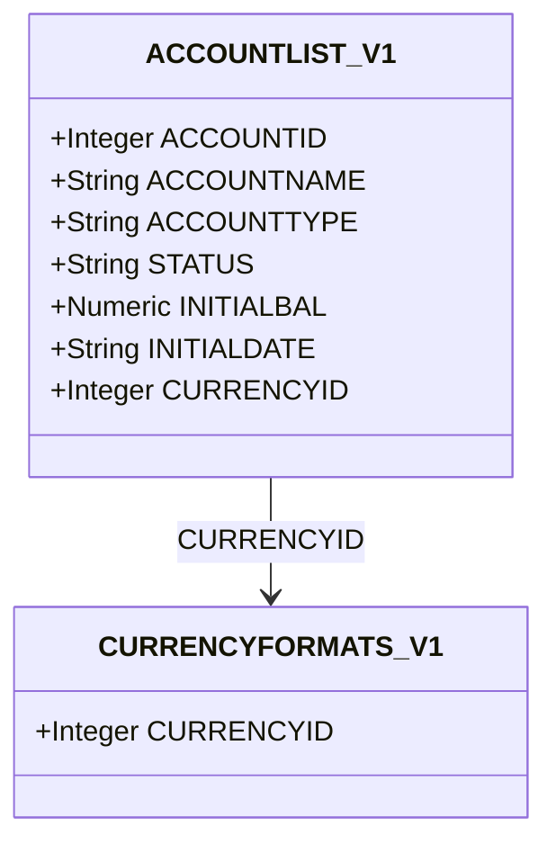
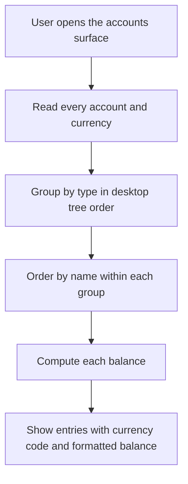
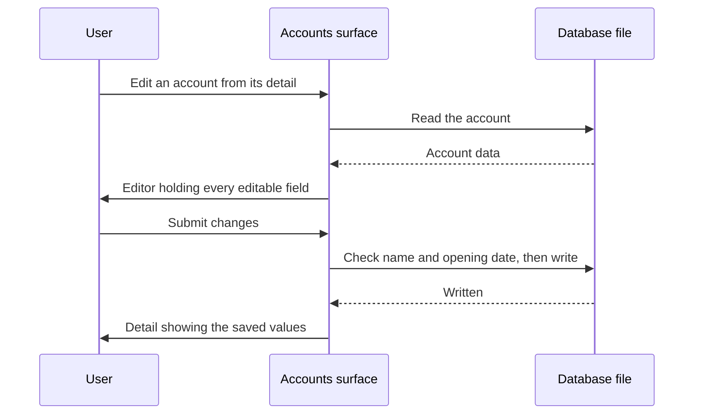
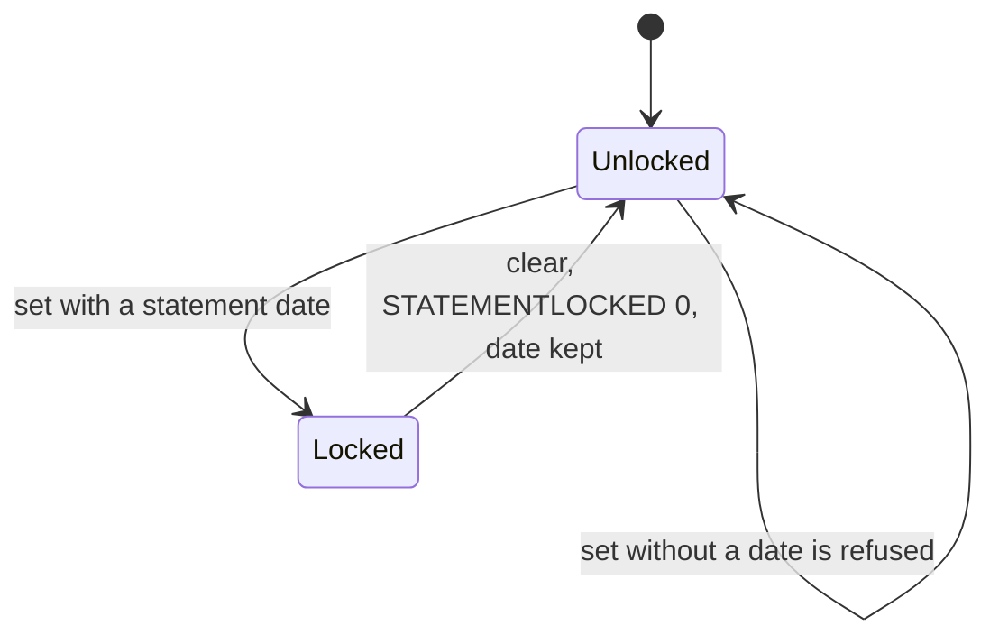
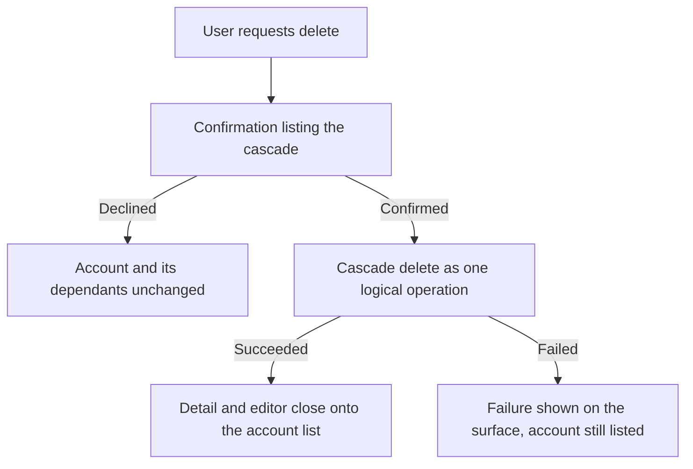

# account-management Specification

**Capability**: `account-management`
**Version**: 1.1.0
**Last Updated**: 2026-10-02

## Purpose

Account records (`ACCOUNTLIST_V1`): the eight account types, status, currency binding, initial balance, the account balance definition, statement-lock and credit/loan fields, and deletion cascades, and the surface through which accounts are listed, created, edited and deleted, with desktop MoneyManagerEx's account rules (type-change restrictions, new-account defaults, the opening-date rule). Non-scope: the transaction flow function and statement-lock enforcement (`transaction-ledger`); investment valuation (`investment-tracking`); asset valuation (`asset-tracking`); desktop's Favorites group and account view filters, deferred to a later change. All rules inherit `domain-data-conventions`.

## Requirements

### Requirement: Schema Fidelity for the Account Table

The application SHALL persist `ACCOUNTLIST_V1` in conformance with `domain-data-conventions`.

- Account names SHALL be unique case-insensitively.
- `FAVORITEACCT` SHALL be persisted as the text `TRUE` or `FALSE`.

Traceability: [mmex/database/tables.sql](../../../mmex/database/tables.sql), [mmex/moneymanagerex/src/model/Model_Account.h](../../../mmex/moneymanagerex/src/model/Model_Account.h).

#### Scenario: Account rows round-trip

- **WHEN** a desktop-created database with accounts of every type is opened and persisted
- **THEN** all account rows the user did not edit SHALL be unchanged

### Requirement: Account Types

The application SHALL persist the account type as exactly one of the upstream strings: `Cash`, `Checking`, `Credit Card`, `Loan`, `Term`, `Investment`, `Asset`, `Shares`.

- The upstream C++ enum order differs from the DDL comment order; the C++ header is authoritative for any ordinal use.
- The type determines which domain an account participates in: `Investment` and `Shares` accounts host stock positions (`investment-tracking`); all types participate in the ledger.

*Caption: The account record and its sole outbound reference — every account is denominated in one currency.*

Traceability: [mmex/moneymanagerex/src/model/Model_Account.h](../../../mmex/moneymanagerex/src/model/Model_Account.h).

#### Scenario: Type strings persist verbatim

- **WHEN** the user creates a credit-card account
- **THEN** the persisted `ACCOUNTTYPE` SHALL be exactly `Credit Card`

### Requirement: Account Status

The application SHALL persist account status as exactly `Open` or `Closed`, and SHALL treat an unrecognized stored status as `Closed` when reading.

Traceability: [mmex/moneymanagerex/src/model/Model_Account.h](../../../mmex/moneymanagerex/src/model/Model_Account.h).

#### Scenario: Unknown status reads as closed

- **WHEN** the application reads an account whose status column holds an unrecognized value
- **THEN** the account SHALL be treated as `Closed` without rewriting the stored value

### Requirement: Currency Binding

Every account SHALL reference a currency, and amounts on an account SHALL be interpreted in that currency.

Traceability: [mmex/database/tables.sql](../../../mmex/database/tables.sql).

#### Scenario: Account creation requires a currency

- **WHEN** the user creates an account
- **THEN** the persisted row SHALL reference an existing `CURRENCYFORMATS_V1` row

### Requirement: Account Balance Definition

When the application computes an account's balance, it SHALL compute `INITIALBAL` plus the sum of the account flow of every transaction touching the account, where the flow function is defined by `transaction-ledger`.

- `INITIALDATE` records the account's opening date; computations bounded by date SHALL NOT include transactions before it is meaningful to do so per the consuming feature.
- For `Investment` and `Shares` accounts, market and invested values are additionally defined by `investment-tracking`.

Traceability: [mmex/moneymanagerex/src/model/Model_Account.cpp](../../../mmex/moneymanagerex/src/model/Model_Account.cpp) (`balance`).

#### Scenario: Balance is initial balance plus flows

- **WHEN** the application computes the balance of an account with initial balance `100` and transactions whose flows sum to `-30`
- **THEN** the reported balance SHALL be `70`

### Requirement: Statement Lock Declaration

The application SHALL persist the statement-lock fields (`STATEMENTLOCKED`, `STATEMENTDATE`) with upstream semantics: when locked, transactions on the account dated on or before the statement date are read-only.

- Enforcement of the read-only rule on ledger rows is owned by `transaction-ledger`.

Traceability: [mmex/moneymanagerex/src/model/Model_Account.h](../../../mmex/moneymanagerex/src/model/Model_Account.h).

#### Scenario: Lock fields round-trip

- **WHEN** a desktop-created database contains an account with a statement lock
- **THEN** the lock state and date SHALL be preserved and honored by any editing feature

### Requirement: Credit and Loan Fields

The application SHALL persist the credit/loan planning fields (`CREDITLIMIT`, `MINIMUMBALANCE`, `INTERESTRATE`, `PAYMENTDUEDATE`, `MINIMUMPAYMENT`) with upstream meaning.

- `MINIMUMBALANCE` and `CREDITLIMIT` feed the scheduled-transaction execution guard defined in `scheduled-transactions`.

Traceability: [mmex/database/incremental_upgrade/database_version_7.sql](../../../mmex/database/incremental_upgrade/database_version_7.sql) (introduction of these columns).

#### Scenario: Planning fields are preserved and editable

- **WHEN** the user edits an account's credit limit
- **THEN** only that field SHALL change and all other planning fields SHALL be preserved

### Requirement: Account Deletion Cascade

When the application deletes an account, it SHALL cascade per the owning capabilities: the account's transactions (including their splits and polymorphic rows), its scheduled transactions, and its stock positions are removed in the same logical operation.

Traceability: [mmex/moneymanagerex/src/model/Model_Account.cpp](../../../mmex/moneymanagerex/src/model/Model_Account.cpp) (`remove`).

#### Scenario: Deleting an account leaves no orphans

- **WHEN** the user deletes an account that has transactions, scheduled transactions, and stock positions
- **THEN** all of those dependent records SHALL be removed
- **AND** no reference to the deleted account SHALL remain in any owned table

### Requirement: Accounts Surface Route

The application SHALL provide an accounts surface at the route `/accounts`, reachable from the navigation surface.

- The route SHALL be declared by this capability, per the route registry rule `app-shell-navigation` establishes, and SHALL be subject to the database-readiness guard.
- The account detail and the account editor SHALL be presented over the accounts surface, without routes of their own (operator decision 2026-10-02, following the currency surface).

Traceability: [src/router/index.ts](../../../src/router/index.ts), [src/pages/AccountsPage.vue](../../../src/pages/AccountsPage.vue).

#### Scenario: Accounts route is reachable

- **WHEN** the user navigates to `/accounts` on a ready database
- **THEN** the accounts surface SHALL be displayed

#### Scenario: Accounts route appears in navigation

- **WHEN** the navigation surface is shown
- **THEN** an "Accounts" entry SHALL be present
- **AND** selecting it SHALL navigate to `/accounts`

### Requirement: Account List Display

The accounts surface SHALL list every account persisted in `ACCOUNTLIST_V1`, grouped by account type as desktop's navigation tree groups them.

- Groups SHALL appear in desktop's tree order: Checking, Credit Card, Cash, Loan, Term, Investment, Shares, Asset. A type no account has SHALL NOT be shown as a group.
- Each group heading SHALL name its account type in the user's language. The stored type SHALL remain the upstream string.
- Within a group, accounts SHALL be ordered by name, case-insensitively, as the `ACCOUNTNAME` column's `NOCASE` collation orders them.
- Each entry SHALL show the account name, the currency code (the `CURRENCY_SYMBOL` of the account's currency), and the current balance per Requirement "Account Balance Definition", formatted per Requirement "Balance Display Formatting".
- A Closed account SHALL carry a Closed indicator. An entry without one is Open.

*Caption: The list reads the file on entry, groups as desktop does, then fills in balances.*

Traceability: [mmex/moneymanagerex/src/mmframe.cpp](../../../mmex/moneymanagerex/src/mmframe.cpp) (`ACCOUNT_IMG_TABLE`, `Model_Account::all(COL_ACCOUNTNAME)`), [src/domain/rules/account.ts](../../../src/domain/rules/account.ts), [src/pages/AccountsPage.vue](../../../src/pages/AccountsPage.vue).

#### Scenario: All accounts are listed

- **WHEN** the user opens the accounts surface
- **THEN** every account in `ACCOUNTLIST_V1` SHALL appear in the list, Closed accounts included

#### Scenario: Accounts are grouped by type

- **WHEN** the file holds a Cash account, a Credit Card account and a Checking account
- **THEN** the group headings SHALL read Checking, Credit Card and Cash, in that order

#### Scenario: The currency code is shown

- **WHEN** an account uses the currency whose `CURRENCY_SYMBOL` is `EUR`
- **THEN** its entry SHALL show `EUR`

#### Scenario: Balance is computed correctly

- **WHEN** an account has initial balance `1000` and transactions whose flows sum to `-250`
- **THEN** the displayed balance SHALL be `750` formatted in the account's currency

#### Scenario: Closed accounts are distinguished

- **WHEN** the list contains an Open account and a Closed account
- **THEN** only the Closed account SHALL carry the Closed indicator

### Requirement: Account Creation

The application SHALL allow users to create accounts through the accounts surface.

- The creation form SHALL present the account name, the account type (one of the eight upstream strings), the currency (a `CURRENCYFORMATS_V1` row), the initial balance and the initial date, together with the fields Requirement "Account Editing" lists.
- A new account SHALL start with desktop's defaults: favorite (`FAVORITEACCT` `TRUE`), the file's base currency, initial balance `0`, and today's date as initial date. When the file has no base currency, no currency SHALL be preselected.
- The account name, type, currency, initial balance and initial date are required. A creation missing one of them SHALL be refused with a message naming the missing field.
- The account name SHALL be stored without leading or trailing whitespace, and SHALL be unique case-insensitively among account names.
- The currency SHALL be one the file defines; any other reference SHALL be refused.
- On successful creation, the user SHALL be returned to the account list with the new account visible.

Traceability: [mmex/moneymanagerex/src/wizard_newaccount.cpp](../../../mmex/moneymanagerex/src/wizard_newaccount.cpp) (defaults), [mmex/moneymanagerex/src/accountdialog.cpp](../../../mmex/moneymanagerex/src/accountdialog.cpp) (name trimming), [src/components/account/AccountEditorForm.vue](../../../src/components/account/AccountEditorForm.vue), [src/domain/repos/account.ts](../../../src/domain/repos/account.ts).

#### Scenario: User creates a checking account

- **WHEN** the user fills in name "My Checking", type "Checking", currency "USD", initial balance "1000" and initial date "2026-01-01"
- **AND** submits the form
- **THEN** a new account SHALL be persisted with those values
- **AND** the user SHALL be returned to the account list showing the new account

#### Scenario: A new account starts with desktop's defaults

- **WHEN** the user opens the creation form on a file whose base currency is USD
- **THEN** the form SHALL hold favorite on, currency USD, initial balance `0` and today's date

#### Scenario: Duplicate account name is rejected

- **WHEN** the user attempts to create an account with a name that differs only by letter case from an existing account
- **THEN** the creation SHALL be refused with a message saying another account has the name
- **AND** no account SHALL be created

#### Scenario: Missing required field prevents creation

- **WHEN** the user clears the initial balance and submits the form
- **THEN** the creation SHALL be refused
- **AND** a message SHALL say the initial balance is required

#### Scenario: Surrounding spaces are removed from the name

- **WHEN** the user enters the name "  Travel Fund  " and submits the form
- **THEN** the account SHALL be stored with the name "Travel Fund"

### Requirement: Account Editing

The application SHALL allow users to edit existing accounts through the accounts surface.

- Editable fields SHALL be: account name, account type (per Requirement "Account Type Change"), status, currency, initial balance, initial date (per Requirement "Opening Date Rule"), favorite flag, the planning fields (per Requirement "Account Planning Fields"), the statement-lock fields (per Requirement "Statement Lock Management"), and the free-text fields desktop edits: `ACCOUNTNUM`, `HELDAT`, `WEBSITE`, `CONTACTINFO`, `ACCESSINFO` and `NOTES`.
- The type and status SHALL be offered by their names in the user's language. The stored values SHALL remain the upstream strings.
- The account name SHALL follow the trimming and uniqueness rules of Requirement "Account Creation", against every other account.
- An optional number or date left empty SHALL be stored as NULL, never as empty text.
- On successful edit, the user SHALL be returned to the account detail, which SHALL show the saved values without being reopened.

*Caption: An edit returns to a detail that already shows what was written.*

Traceability: [mmex/moneymanagerex/src/accountdialog.cpp](../../../mmex/moneymanagerex/src/accountdialog.cpp), [src/components/account/AccountEditorForm.vue](../../../src/components/account/AccountEditorForm.vue), [src/pages/AccountsPage.vue](../../../src/pages/AccountsPage.vue).

#### Scenario: User changes account name

- **WHEN** the user edits an account's name from "Old Name" to "New Name"
- **AND** no other account has that name, in any letter case
- **THEN** the account name SHALL be updated

#### Scenario: The detail shows the edit

- **WHEN** the user saves an edit started from the account detail
- **THEN** the detail SHALL show the new values without being closed and reopened

#### Scenario: A cleared optional number is stored empty

- **WHEN** the user clears an account's credit limit and saves
- **THEN** `CREDITLIMIT` SHALL be stored as NULL

### Requirement: Account Type Change

The application SHALL allow an existing account's type to be changed in the editor, with the restrictions desktop applies, and without a confirmation step.

- A Shares account SHALL keep its type.
- No account SHALL take the type Investment unless it already has it.
- A new account SHALL be creatable with any of the eight types.

Traceability: [mmex/moneymanagerex/src/mmframe.cpp](../../../mmex/moneymanagerex/src/mmframe.cpp) (`mmGUIFrame::OnChangeAccountType`), [mmex/moneymanagerex/src/model/Model_Account.cpp](../../../mmex/moneymanagerex/src/model/Model_Account.cpp) (`all_checking_account_names`), [src/domain/rules/account.ts](../../../src/domain/rules/account.ts).

#### Scenario: Type change takes effect without a warning

- **WHEN** the user changes a Checking account's type to Credit Card and saves
- **THEN** the account SHALL be stored as Credit Card
- **AND** no confirmation SHALL have been asked

#### Scenario: Investment is not offered as a new type

- **WHEN** the user edits a Checking account
- **THEN** the type choices SHALL NOT include Investment

#### Scenario: A Shares account keeps its type

- **WHEN** the user edits a Shares account
- **THEN** Shares SHALL be the only type offered

### Requirement: Account Planning Fields

The credit and loan planning fields (`CREDITLIMIT`, `MINIMUMBALANCE`, `INTERESTRATE`, `PAYMENTDUEDATE`, `MINIMUMPAYMENT`) SHALL be shown and editable for every account type, as desktop's Credit tab is.

- They SHALL be offered regardless of type because the scheduled-transaction execution guard reads `MINIMUMBALANCE` and `CREDITLIMIT` on any account (Requirement "Credit and Loan Fields").

Traceability: [mmex/moneymanagerex/src/accountdialog.cpp](../../../mmex/moneymanagerex/src/accountdialog.cpp) (Credit tab), [src/components/account/AccountEditorForm.vue](../../../src/components/account/AccountEditorForm.vue), [src/components/account/AccountDetailDialog.vue](../../../src/components/account/AccountDetailDialog.vue).

#### Scenario: Planning fields appear for every type

- **WHEN** the user creates or edits a Cash account
- **THEN** the credit limit, minimum balance, interest rate, payment due date and minimum payment fields SHALL be visible

### Requirement: Opening Date Rule

The application SHALL refuse an account's initial date when desktop would.

- The initial date SHALL NOT be later than today.
- For an existing account, the initial date SHALL NOT be later than the date of any transaction it is the source or destination of, any stock purchase held in it, or any scheduled transaction it is the source or destination of. A record dated on the initial date itself SHALL be allowed.
- A refused date SHALL be reported with a message naming the kind of record it conflicts with.

Traceability: [mmex/moneymanagerex/src/accountdialog.cpp](../../../mmex/moneymanagerex/src/accountdialog.cpp) (`mmNewAcctDialog::OnOk`), [src/domain/repos/account.ts](../../../src/domain/repos/account.ts).

#### Scenario: A future opening date is refused

- **WHEN** the user sets an initial date later than today and saves
- **THEN** the save SHALL be refused with a message that the opening date cannot be in the future

#### Scenario: An opening date after a transaction is refused

- **WHEN** an account has a transaction dated 2026-02-01
- **AND** the user sets its initial date to 2026-03-01 and saves
- **THEN** the save SHALL be refused with a message that transactions exist before that date

#### Scenario: A record on the opening date is allowed

- **WHEN** an account's only transaction is dated 2026-03-01
- **AND** the user sets its initial date to 2026-03-01 and saves
- **THEN** the save SHALL proceed

### Requirement: Statement Lock Management

The application SHALL show an account's statement lock in the account detail, and SHALL allow the lock to be set and cleared in the account editor reached from it.

- When the lock is active, the detail SHALL show the statement date and an indication that transactions on or before it are read-only.
- Setting the lock SHALL require a statement date. A lock without one SHALL be refused with a message on the statement-date field.
- Clearing the lock SHALL store `STATEMENTLOCKED` as `0` and SHALL keep `STATEMENTDATE`, as desktop does. The kept date has no effect while the lock is clear.
- The lock SHALL conform to Requirement "Statement Lock Declaration".

*Caption: The lock needs a date to be set; clearing it keeps the date, as desktop does.*

Traceability: [mmex/moneymanagerex/src/accountdialog.cpp](../../../mmex/moneymanagerex/src/accountdialog.cpp) (statement fields in `mmNewAcctDialog::OnOk`), [src/components/account/AccountEditorForm.vue](../../../src/components/account/AccountEditorForm.vue), [src/components/account/AccountDetailDialog.vue](../../../src/components/account/AccountDetailDialog.vue).

#### Scenario: User sets statement lock

- **WHEN** the user sets a statement lock with date "2026-07-31" on an account
- **THEN** the lock state and date SHALL be persisted
- **AND** the account detail SHALL display the lock indicator and the date

#### Scenario: A lock without a date is refused

- **WHEN** the user sets the lock without a statement date and saves
- **THEN** the save SHALL be refused with a message that the statement date is required

#### Scenario: User clears statement lock

- **WHEN** the user clears the statement lock of an account locked at "2026-07-31"
- **THEN** `STATEMENTLOCKED` SHALL be stored as `0` and `STATEMENTDATE` SHALL remain "2026-07-31"
- **AND** the account detail SHALL show the account as unlocked

### Requirement: Account Deletion from Surface

The application SHALL allow users to delete accounts from the accounts surface, subject to Requirement "Account Deletion Cascade".

- The delete action SHALL be offered on the account detail and in the account editor.
- Before deletion, a confirmation SHALL list what will be deleted: the account itself, all its transactions, its scheduled transactions, and, for an Investment or Shares account, its stock positions.
- Dependent records SHALL NOT refuse the deletion. Once confirmed, they SHALL be removed with the account as a single logical operation.
- On successful deletion, the account detail and editor SHALL close and the user SHALL be returned to the account list, with the deleted account no longer visible.
- A failed deletion SHALL be reported on the accounts surface, and the account SHALL remain listed.

Traceability: desktop confirms and then cascades, with no refusal path: [mmex/moneymanagerex/src/mmframe.cpp](../../../mmex/moneymanagerex/src/mmframe.cpp) (`mmGUIFrame::OnDeleteAccount`, which calls `Model_Account::remove`). Implementation: [src/pages/AccountsPage.vue](../../../src/pages/AccountsPage.vue), [src/domain/repos/account.ts](../../../src/domain/repos/account.ts).

*Caption: Account deletion with cascade disclosure.*

#### Scenario: Deletion cascades when dependants exist

- **WHEN** the user deletes an account that has transactions, scheduled transactions or stock positions
- **AND** confirms the deletion
- **THEN** the account and every one of those dependent records SHALL be removed in one logical operation
- **AND** the user SHALL be returned to the account list

#### Scenario: Deletion succeeds when no dependencies

- **WHEN** the user deletes an account with no transactions, scheduled transactions or stock positions
- **AND** confirms the deletion
- **THEN** the account SHALL be removed
- **AND** the account detail SHALL be closed and the account list shown

#### Scenario: A failed deletion is reported

- **WHEN** the database refuses the deletion
- **THEN** the failure SHALL be shown on the accounts surface
- **AND** the account SHALL remain listed

### Requirement: Favorite Account Indication

The application SHALL allow users to mark accounts as favorites through the accounts surface.

- The `FAVORITEACCT` field SHALL be persisted as the text `TRUE` or `FALSE`, per Requirement "Schema Fidelity for the Account Table".
- A favorite account SHALL carry a star indicator in the list, with an accessible name.
- The favorite state SHALL be toggleable from the account detail, which SHALL show the new state as soon as it is written.
- A failed toggle SHALL be reported on the accounts surface.

Traceability: [src/components/account/AccountDetailDialog.vue](../../../src/components/account/AccountDetailDialog.vue), [src/pages/AccountsPage.vue](../../../src/pages/AccountsPage.vue), [src/domain/rules/account.ts](../../../src/domain/rules/account.ts).

#### Scenario: User marks account as favorite

- **WHEN** the user toggles the favorite state of an account in its detail
- **THEN** the `FAVORITEACCT` field SHALL be updated to `TRUE` or `FALSE` accordingly
- **AND** the detail SHALL show the new state without being reopened

#### Scenario: Favorite accounts are highlighted

- **WHEN** the account list is displayed
- **THEN** each account whose `FAVORITEACCT` is `TRUE` SHALL carry a star indicator
- **AND** no other account SHALL carry it

### Requirement: Balance Display Formatting

The balance displayed for each account SHALL be formatted with the formatting rules `currency-management` defines for the account's currency.

- The balance value SHALL be computed per Requirement "Account Balance Definition".
- The formatted display SHALL use the currency's prefix or suffix symbol, decimal separator, grouping separator and scale.
- A negative balance SHALL be shown with a minus sign.

Traceability: [src/domain/rules/currency.ts](../../../src/domain/rules/currency.ts) (`formatAmount`), [src/pages/AccountsPage.vue](../../../src/pages/AccountsPage.vue).

#### Scenario: Balance formatted with currency symbols

- **WHEN** an account uses currency USD with prefix symbol "$"
- **AND** has a balance of 1500.50
- **THEN** the displayed balance SHALL be "$1,500.50"

#### Scenario: Negative balance is indicated

- **WHEN** an account has a balance of -80
- **THEN** the displayed balance SHALL include a minus sign
