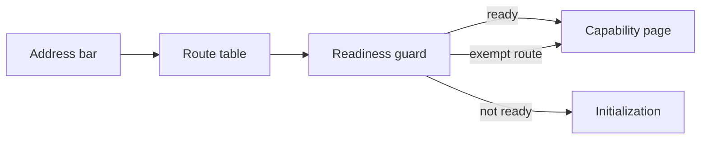

# app-shell-navigation Specification

**Capability**: `app-shell-navigation`
**Version**: 1.0.0
**Last Updated**: 2026-08-09

## Purpose

The persistent application shell and how the user moves through it — route registry governance, the database-readiness guard and its exemptions, the home summary surface, navigation that reflects the current location, unmatched-route handling, and localization of shell text. Non-scope: any domain page or register (each is added by its own phase's change); the content of summary cards beyond the frame; the router, i18n and PWA *mechanics*, which `infrastructure-baseline` owns; database and sync drawer behavior, which `cloud-file-sync` owns.

## Requirements
### Requirement: Route Registry Governance

Every route the application serves SHALL belong to a capability that declares it, and the route table SHALL be the single place routes are registered.

- A change that adds a user-facing destination SHALL add the corresponding route requirement to its own capability specification; no route may exist that no specification accounts for.
- Routes serving a scoped view of a collection SHALL encode that scope in the path rather than in application state, so the view is linkable, bookmarkable and restorable (operator decision 2026-08-08).
- Development-only routes SHALL be excluded from production builds.

*Caption: Every destination reaches its page through the one governed route table.*

Traceability: [src/router/index.ts](../../../src/router/index.ts), [openspec/designs/domain-capability-map.md](../../../openspec/designs/domain-capability-map.md).

#### Scenario: A scoped view is reachable by its own address

- **WHEN** a capability adds a view scoped to one record or one subset of a collection
- **THEN** that view SHALL have its own route path
- **AND** opening that path directly SHALL restore the same view

#### Scenario: Development routes stay out of production

- **WHEN** the application is built for production
- **THEN** development-only routes SHALL be absent from the route table

### Requirement: Database Readiness Guard

Navigation SHALL be gated on the database being ready: a request for any route that needs data SHALL be redirected to the initialization surface until the database reports ready.

- The initialization surface and the authentication redirect terminal SHALL be exempt, because the first exists to reach readiness and the second must consume its response before the database is probed.
- Once the database is ready, a guarded route SHALL be served normally.
- The requested destination SHALL be preserved across initialization and resumed once the database is ready, so that opening a deep link on a cold start arrives where it was aimed. A preserved destination that is not an in-application path SHALL be discarded in favour of the home surface.
- The initialization surface SHALL NOT be a destination in its own right: reaching readiness while on it SHALL move the user on, whether readiness came from completing setup or from opening an existing database.

Traceability: [src/router/index.ts](../../../src/router/index.ts), [src/stores/database-store.ts](../../../src/stores/database-store.ts), [src/pages/DatabaseInitPage.vue](../../../src/pages/DatabaseInitPage.vue).

#### Scenario: A data route is deferred until the database is ready

- **WHEN** the user opens a guarded route while the database is not ready
- **THEN** the application SHALL redirect to the initialization surface

#### Scenario: The authentication terminal is never deferred

- **WHEN** the authentication provider redirects back to the application before the database has been probed
- **THEN** the redirect terminal SHALL render without being sent to the initialization surface

#### Scenario: A deep link survives initialization

- **WHEN** the user opens a deep link on a cold start, is sent to the initialization surface, and the database becomes ready
- **THEN** the application SHALL resume the originally requested destination

#### Scenario: A destination outside the application is refused

- **WHEN** a preserved destination points anywhere other than an in-application path
- **THEN** the application SHALL send the user to the home surface instead

#### Scenario: Readiness moves the user off the initialization surface

- **WHEN** the database becomes ready while the initialization surface is showing and no destination was preserved
- **THEN** the application SHALL move the user to the home surface

### Requirement: Persistent Application Shell

The application SHALL present a persistent shell around every routed page: a header identifying the application and the database state, a navigation surface, the database and synchronization surface, and the page region itself.

- The shell SHALL remain mounted across navigation so that moving between destinations does not rebuild it.
- The shell SHALL adapt to the viewport, remaining usable at mobile widths (operator decision 2026-08-08, responsive-hybrid presentation).

Traceability: [src/App.vue](../../../src/App.vue).

#### Scenario: The shell survives navigation

- **WHEN** the user moves from one destination to another
- **THEN** the header, navigation and database surfaces SHALL persist and only the page region SHALL change

### Requirement: Home Summary Surface

The root path SHALL resolve to a home surface that summarizes the database as a set of cards, to which capabilities contribute as they are implemented.

- The home surface SHALL be reachable at the root path and SHALL be the destination a ready database lands on.
- With no card contributed, the home SHALL present a first-run empty state that explains the database is ready and points to what to do next, rather than rendering nothing.
- Cards SHALL be composed so that a later capability can contribute one without altering the surface itself (operator decision 2026-08-08, progressively extended summary cards).

Traceability: [src/pages/](../../../src/pages/), [src/components/](../../../src/components/).

#### Scenario: A ready database lands on the home surface

- **WHEN** the database is ready and the user opens the root path
- **THEN** the home summary surface SHALL render

#### Scenario: The home explains itself before any card exists

- **WHEN** the home surface has no contributed card to show
- **THEN** it SHALL present an empty state describing the state of the database and the next action
- **AND** it SHALL NOT render a blank region

### Requirement: Navigation Reflects Location

The navigation surface SHALL be driven by the current route: it SHALL indicate which destination is active and SHALL change the address when the user chooses a destination.

- Every navigation entry SHALL correspond to a declared route; no entry may point at a path the route table does not serve.
- Activating an entry SHALL navigate rather than mutate internal view state.

Traceability: [src/App.vue](../../../src/App.vue), [src/router/index.ts](../../../src/router/index.ts).

#### Scenario: The active destination is indicated

- **WHEN** the user is on a destination that appears in the navigation surface
- **THEN** that entry SHALL be shown as active

#### Scenario: Navigation entries always resolve

- **WHEN** the navigation surface offers an entry
- **THEN** choosing it SHALL resolve to a served route, never to an unmatched path

### Requirement: Unmatched Route Handling

A path the route table does not serve SHALL resolve to a not-found surface offering a way back, rather than rendering an empty page region.

Traceability: [src/router/index.ts](../../../src/router/index.ts), [src/pages/](../../../src/pages/).

#### Scenario: An unknown path is explained

- **WHEN** the user opens a path no route serves
- **THEN** the application SHALL present a not-found surface
- **AND** that surface SHALL offer navigation back to the home surface

### Requirement: Localized Shell Text

Every string the shell displays SHALL come from the translation catalogs, in each supported locale.

- This includes the application title, navigation labels, the database status line, and the empty and not-found surfaces.
- Database and synchronization states SHALL be presented as translated text, not as internal state identifiers.
- Raw diagnostic output SHALL NOT be displayed as shell content.

Traceability: [src/locales/](../../../src/locales/), [src/App.vue](../../../src/App.vue).

#### Scenario: Switching locale translates the shell

- **WHEN** the user switches the display locale
- **THEN** the title, navigation labels and database status SHALL all render in the chosen locale

#### Scenario: State identifiers never reach the user

- **WHEN** the database is in any of its lifecycle states
- **THEN** the shell SHALL show a translated description of that state, not the internal identifier

