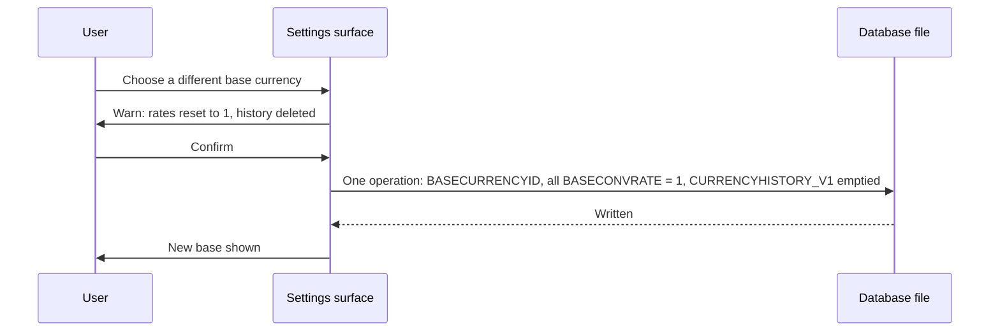
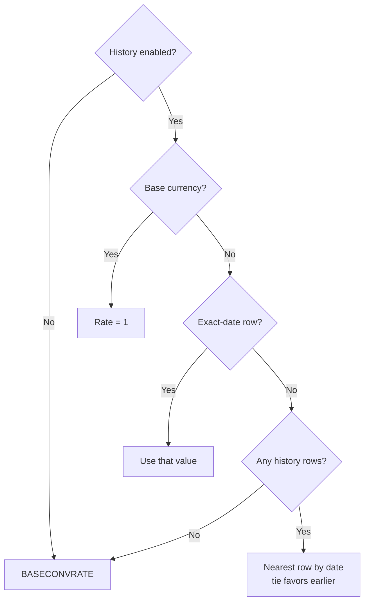
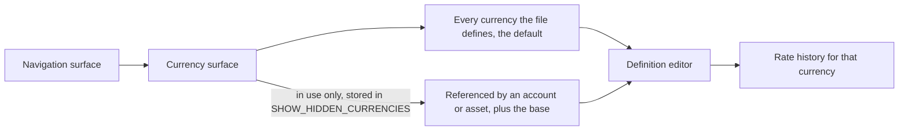
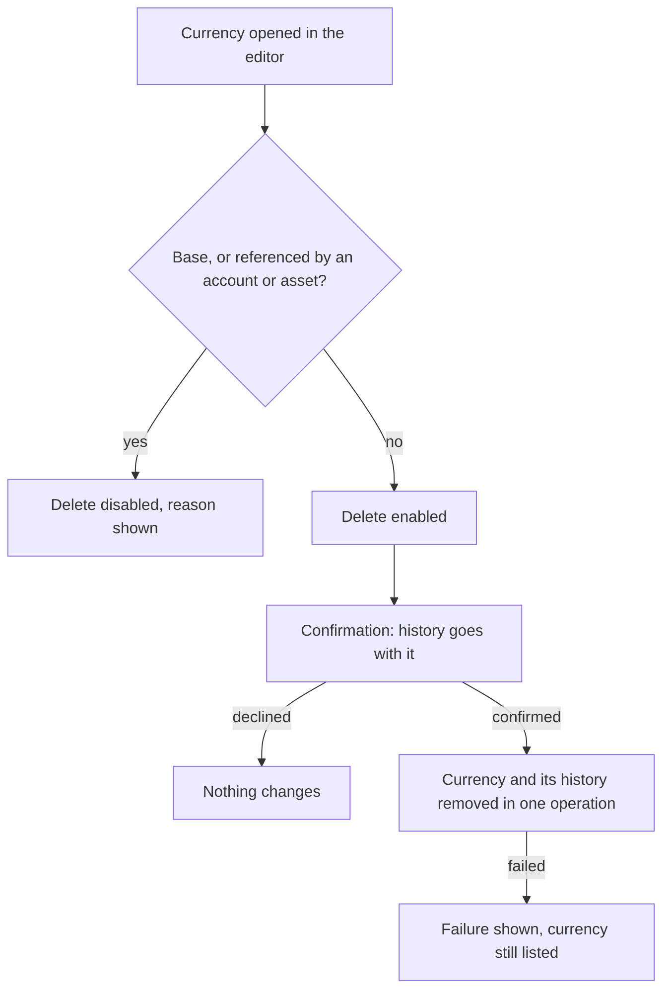

# currency-management Specification

**Capability**: `currency-management`
**Version**: 1.3.0
**Last Updated**: 2026-10-02

## Purpose

Currency definitions (`CURRENCYFORMATS_V1`), exchange-rate history (`CURRENCYHISTORY_V1`), the base currency, amount formatting and precision, date-based rate resolution, and the surface through which currencies and their rates are managed. Non-scope: fetching rates from an online source; changing which currency is the base, which `file-metadata-and-settings` owns; assigning a currency to an account, which `account-management` owns; share-quantity precision (`investment-tracking`). All rules inherit `domain-data-conventions`. A change of base currency resets every stored rate and empties the rate history, as desktop does; the settings surface invokes it and this capability owns it (operator decision 2026-10-02). The surface edits, lists, records rates for and deletes currencies as desktop's Currency Manager does, storing only definitions desktop accepts; a currency referenced by any account, closed ones included, stays in use (operator decisions 2026-10-02).

## Requirements

### Requirement: Schema Fidelity for Currency Tables

The application SHALL persist `CURRENCYFORMATS_V1` and `CURRENCYHISTORY_V1` in conformance with `domain-data-conventions`.

- New databases SHALL carry the upstream seed set of currencies (168 rows in the vendored DDL).
- `CURRENCYHISTORY_V1` rows SHALL be unique per `(CURRENCYID, CURRDATE)`, and `CURRUPDTYPE` SHALL be `1` (online) or `2` (manual).

Traceability: [mmex/database/tables.sql](../../../mmex/database/tables.sql), [mmex/moneymanagerex/src/model/Model_CurrencyHistory.h](../../../mmex/moneymanagerex/src/model/Model_CurrencyHistory.h).

#### Scenario: Currency tables round-trip

- **WHEN** a desktop-created database with currencies and rate history is opened and persisted
- **THEN** all currency and history rows the user did not edit SHALL be unchanged

### Requirement: Currency Definition

The application SHALL manage currencies with the upstream field semantics: unique name, unique symbol code, prefix and suffix display symbols, decimal point and group separator characters, unit and cent names, scale, base conversion rate, and currency type.

- `CURRENCY_TYPE` SHALL be persisted as exactly `Fiat` or `Crypto`.
- Currency name and symbol uniqueness SHALL be case-insensitive.

Traceability: [mmex/moneymanagerex/src/model/Model_Currency.h](../../../mmex/moneymanagerex/src/model/Model_Currency.h).

#### Scenario: Duplicate symbol is rejected

- **WHEN** the user attempts to create a currency whose symbol code equals an existing currency's symbol in any letter case
- **THEN** the creation SHALL be rejected as a duplicate

### Requirement: Amount Formatting and Precision

When the application formats or parses a monetary amount, it SHALL derive display precision from the currency's scale and apply the currency's formatting fields for display only, rendering as desktop MoneyManagerEx renders.

- Decimal precision SHALL be the integer part of `log10(SCALE)`, as desktop computes it — for example scale `100` renders 2 decimals, scale `1` renders 0, scale `100000000` renders 8.
- A negative amount SHALL be rendered with the minus sign after the prefix symbol and before the digits, as desktop's `toCurrency` does: `$-80.00`, or `-80.00 €` for a suffix currency.
- An amount whose magnitude is below `1e-10` SHALL render as zero, never as `-0.00`, matching desktop's tolerance.
- Formatting (prefix/suffix symbols, separators) SHALL never alter the persisted numeric value.

Traceability: [mmex/moneymanagerex/src/model/Model_Currency.cpp](../../../mmex/moneymanagerex/src/model/Model_Currency.cpp) (`toString`, `toCurrency`, `precision`), [src/domain/rules/currency.ts](../../../src/domain/rules/currency.ts).

#### Scenario: Zero-decimal currency renders without decimals

- **WHEN** the application displays an amount in a currency whose scale is `1`
- **THEN** the amount SHALL be rendered with no decimal places
- **AND** the persisted value SHALL be unaffected by the rendering

#### Scenario: A negative amount carries its sign after the prefix

- **WHEN** the application displays `-80` in a currency with prefix `$`, scale `100`
- **THEN** the rendering SHALL be `$-80.00`

#### Scenario: A vanishing negative renders as zero

- **WHEN** the application displays `-0.000000000001` in a currency with prefix `$`, scale `100`
- **THEN** the rendering SHALL be `$0.00`

### Requirement: Base Currency

The application SHALL treat the currency referenced by the `BASECURRENCYID` file fact as the base currency for all cross-currency aggregation.

- The base currency's conversion rate SHALL always be `1`.
- Every database SHALL have a base currency once initialized; changing it is a user action, never an implicit side effect.
- A change of base currency SHALL, in one logical operation, set `BASECURRENCYID` to the chosen currency, set every row's `BASECONVRATE` in `CURRENCYFORMATS_V1` to `1`, and delete every row of `CURRENCYHISTORY_V1`, because every stored rate is denominated in the old base. This is what desktop does when its base currency changes (operator decision 2026-10-02).
- The surface offering the change SHALL warn, before anything is written, that historical rates will be deleted.

*Caption: A base-currency change rewrites every rate with the pointer, as desktop does.*

Traceability: [mmex/moneymanagerex/src/model/Model_Currency.cpp](../../../mmex/moneymanagerex/src/model/Model_Currency.cpp), [mmex/moneymanagerex/src/maincurrencydialog.cpp](../../../mmex/moneymanagerex/src/maincurrencydialog.cpp) (`SetBaseCurrency`), [src/domain/repos/currency.ts](../../../src/domain/repos/currency.ts), [src/data/currencies.json](../../../src/data/currencies.json) (initialization picker data).

#### Scenario: Base currency rate is unity

- **WHEN** the application resolves a conversion rate for the base currency on any date
- **THEN** the rate SHALL be `1`

#### Scenario: Changing the base resets every rate

- **WHEN** the file holds a currency with `BASECONVRATE` `0.9` and two rows of rate history, and the user confirms a change of base currency
- **THEN** `BASECURRENCYID` SHALL reference the chosen currency, every `BASECONVRATE` SHALL be `1`, and `CURRENCYHISTORY_V1` SHALL hold no rows
- **AND** no partial state SHALL be observable: either all of it is written or none of it

#### Scenario: Nothing is written before confirmation

- **WHEN** the user chooses a different base currency and declines the warning
- **THEN** `BASECURRENCYID`, every `BASECONVRATE` and `CURRENCYHISTORY_V1` SHALL be unchanged

### Requirement: Day-Rate Resolution

When the application converts an amount to the base currency for a given date, it SHALL resolve the rate by the upstream algorithm.

- If rate history is disabled (`USECURRENCYHISTORY` false), the rate SHALL be the currency's flat `BASECONVRATE`.
- Otherwise: an exact-date history row wins; failing that, the temporally nearest history row wins, with ties between an earlier and a later row resolved in favor of the earlier; with no history at all, the flat `BASECONVRATE` applies.

*Caption: Rate resolution for a given currency and date.*

Traceability: [mmex/moneymanagerex/src/model/Model_CurrencyHistory.cpp](../../../mmex/moneymanagerex/src/model/Model_CurrencyHistory.cpp) (`getDayRate`).

#### Scenario: Nearest rate with tie favoring the earlier row

- **WHEN** rate history is enabled and a currency has history rows exactly 3 days before and 3 days after the requested date
- **THEN** the application SHALL use the earlier row's value

#### Scenario: History disabled uses the flat rate

- **WHEN** rate history is disabled
- **THEN** conversions SHALL use the currency's `BASECONVRATE` regardless of any history rows

### Requirement: Rate History Toggle Retroactivity

The application SHALL treat the rate-history toggle as retroactive: enabling or disabling `USECURRENCYHISTORY` changes every derived valuation computed thereafter, including historical ones.

- This is intentional upstream behavior and SHALL NOT be "fixed" by caching pre-toggle valuations.

Traceability: [mmex/moneymanagerex/src/model/Model_CurrencyHistory.cpp](../../../mmex/moneymanagerex/src/model/Model_CurrencyHistory.cpp).

#### Scenario: Toggling changes historical valuations

- **WHEN** the user disables rate history and the application recomputes a report or balance for a past period
- **THEN** conversions in that computation SHALL use flat `BASECONVRATE` values

### Requirement: Currency Deletion Constraints

The application SHALL refuse to delete a currency that is in use, and deleting an unused currency SHALL also delete its rate history.

- "In use" includes being referenced by any account or asset, or being the base currency.

Traceability: [mmex/moneymanagerex/src/model/Model_Currency.cpp](../../../mmex/moneymanagerex/src/model/Model_Currency.cpp).

#### Scenario: Base currency cannot be deleted

- **WHEN** the user attempts to delete the base currency
- **THEN** the deletion SHALL be refused

#### Scenario: Deleting an unused currency removes its history

- **WHEN** the user deletes a currency no account or asset references
- **THEN** its `CURRENCYHISTORY_V1` rows SHALL be removed in the same operation

### Requirement: Currency Management Surface

The application SHALL provide a currency surface at its own route, reachable from the navigation surface, listing the file's currencies with the scope desktop's Currency Manager uses.

- A currency counts as used when an account or an asset references it, or when it is the base currency.
- The surface SHALL list every currency the file defines by default, and SHALL offer a choice to list only the currencies in use. That choice SHALL be read from and written to the file fact `SHOW_HIDDEN_CURRENCIES` in `INFOTABLE_V1`, as desktop stores it; an absent key SHALL read as "show all".
- The surface SHALL offer a search over the listed set by name or symbol.
- Each entry SHALL show a rate column titled "Last rate" holding the currency's most recent historical rate when the file's rate-history setting is on, and titled "Fixed rate" holding `BASECONVRATE` when it is off. A currency with no history SHALL show its fixed rate under either title. The base currency SHALL show `1`.
- The route SHALL be declared by this capability, per the route registry rule `app-shell-navigation` establishes, and SHALL be subject to the database-readiness guard.

*Caption: The full set is the default, as desktop's; the short list is a stored choice.*

Traceability: [mmex/moneymanagerex/src/maincurrencydialog.cpp](../../../mmex/moneymanagerex/src/maincurrencydialog.cpp) (`SHOW_HIDDEN_CURRENCIES`, the "Last Rate" column), [src/pages/CurrenciesPage.vue](../../../src/pages/CurrenciesPage.vue), [src/stores/currency-store.ts](../../../src/stores/currency-store.ts), [src/router/index.ts](../../../src/router/index.ts), [src/domain/repos/currency.ts](../../../src/domain/repos/currency.ts).

#### Scenario: Only the currencies in use are listed by default

- **WHEN** the file holds `SHOW_HIDDEN_CURRENCIES` = `FALSE` and the user opens the currency surface on a file where one currency is referenced by an account and another is the base currency
- **THEN** those two SHALL be listed
- **AND** currencies nothing references SHALL NOT be listed until the user chooses to show all

#### Scenario: The full set is reachable and searchable

- **WHEN** the user chooses to show all currencies and searches by name or symbol
- **THEN** the matching currencies SHALL be listed regardless of whether anything references them

#### Scenario: Every currency is listed when the file holds no choice

- **WHEN** the file holds no `SHOW_HIDDEN_CURRENCIES` row
- **THEN** every currency the file defines SHALL be listed

#### Scenario: The scope choice is stored in the file

- **WHEN** the user switches the list to the currencies in use
- **THEN** `INFOTABLE_V1` SHALL hold `SHOW_HIDDEN_CURRENCIES` as off
- **AND** reopening the surface SHALL list only the currencies in use

#### Scenario: The rate column follows the history setting

- **WHEN** the rate-history setting is on and a currency has rates recorded on two dates
- **THEN** the column SHALL be titled "Last rate" and show the rate of the later date
- **AND** when the setting is off the column SHALL be titled "Fixed rate" and show `BASECONVRATE`

### Requirement: Editing and Adding Currency Definitions

The application SHALL let the user edit a currency's definition and add a new currency, through the fields desktop's currency dialog offers, and SHALL store only definitions desktop accepts.

- The editor SHALL present: name; code (at most 12 characters); one currency symbol with a choice of prefix or suffix placement; decimal character chosen from `.` and `,`; grouping character chosen from none, `.`, `,` and space; unit and cent names; decimal places from 0 through 9; type; and the fixed conversion rate.
- Decimal places SHALL be stored as `SCALE` = `10^n`. A stored `SCALE` that is not a power of ten SHALL be shown as the integer part of its `log10` and SHALL be normalized to `10^n` only when the user saves.
- The symbol placement SHALL be stored as exactly one of `PFX_SYMBOL` and `SFX_SYMBOL` holding the symbol and the other empty. A stored definition holding both SHALL be shown with the prefix and SHALL be normalized when the user saves.
- A stored decimal or grouping character outside desktop's sets SHALL be shown as stored and SHALL be offered as the current choice until the user picks another.
- Name and code SHALL be trimmed, and an empty name or code SHALL be refused with a message naming the field.
- The code SHALL be unique case-insensitively, as the capability already requires; a conflicting addition or edit SHALL be refused with a message naming whether the name or the code collides and with which currency.
- When decimal places are greater than 0, a grouping character equal to the decimal character SHALL be refused with a message.
- The fixed conversion rate SHALL be greater than 0; an empty, non-numeric, zero or negative entry SHALL be refused with a message. An optional numeric field cleared by the user SHALL never be stored as text.
- The type SHALL be persisted as exactly `Fiat` or `Crypto`, and SHALL be shown by its name in the user's language.
- The base currency's fixed rate SHALL always be presented as `1` and SHALL NOT be editable, because every other rate is measured against it.
- A refused save SHALL leave the stored definition unchanged and the editor open.

Traceability: [mmex/moneymanagerex/src/currencydialog.cpp](../../../mmex/moneymanagerex/src/currencydialog.cpp) (the fields, `OnOk`, `pow10(scale)`), [src/components/currency/CurrencyEditorForm.vue](../../../src/components/currency/CurrencyEditorForm.vue), [src/domain/rules/currency.ts](../../../src/domain/rules/currency.ts), [src/domain/repos/currency.ts](../../../src/domain/repos/currency.ts).

#### Scenario: A conflicting name is refused

- **WHEN** the user renames a currency to a name another currency already holds, in any letter case
- **THEN** the change SHALL be refused with a message naming the name and the currency holding it
- **AND** the stored definition SHALL be unchanged

#### Scenario: A currency outside the seeded set can be added

- **WHEN** the user adds a currency with a name and code nothing else uses, two decimal places and a prefix symbol
- **THEN** it SHALL be stored with `SCALE` `100`, the symbol in `PFX_SYMBOL` and an empty `SFX_SYMBOL`
- **AND** it SHALL be available to be referenced

#### Scenario: A conflicting code is refused by its own name

- **WHEN** the user adds a currency whose code another currency already holds
- **THEN** the addition SHALL be refused with a message naming the code and the currency holding it

#### Scenario: An empty name or code is refused

- **WHEN** the user clears the name, or the code, and saves
- **THEN** the save SHALL be refused with a message on that field
- **AND** nothing SHALL be stored

#### Scenario: Equal separators are refused when there are decimals

- **WHEN** the user chooses `,` for both the decimal and the grouping character with two decimal places and saves
- **THEN** the save SHALL be refused with a message that the grouping character cannot equal the decimal character

#### Scenario: A stored scale outside the powers of ten is shown and normalized

- **WHEN** a currency stored with `SCALE` `50` is opened in the editor
- **THEN** the editor SHALL show 1 decimal place
- **AND** saving SHALL store `SCALE` `10`

#### Scenario: A non-positive rate is refused

- **WHEN** the user enters `0`, `-1` or clears the fixed conversion rate and saves
- **THEN** the save SHALL be refused with a message on the rate field

### Requirement: Format Preview

While a currency definition is being edited, the application SHALL show how a representative amount renders under the values currently entered.

- The preview SHALL reflect the decimal places, the separators and the symbol placement as edited, before anything is saved, using the same rendering as Requirement "Amount Formatting and Precision".
- Changing the decimal places SHALL visibly change the number of decimal places shown.

Traceability: [src/domain/rules/currency.ts](../../../src/domain/rules/currency.ts), [src/components/currency/CurrencyEditorForm.vue](../../../src/components/currency/CurrencyEditorForm.vue).

#### Scenario: Changing the scale changes the preview

- **WHEN** the user changes a currency's decimal places from 2 to 0
- **THEN** the preview SHALL render the representative amount with no decimal places

#### Scenario: Moving the symbol changes the preview

- **WHEN** the user changes the symbol placement from prefix to suffix
- **THEN** the preview SHALL show the symbol after the digits

### Requirement: Exchange Rate History Management

The application SHALL let the user record an exchange rate for a currency on a date, and remove a recorded rate, as desktop's Currency Manager does.

- A rate SHALL be stored against the currency and the date, and recording a second rate for the same date SHALL replace the first rather than create a duplicate.
- Rates recorded this way SHALL be marked as manually recorded.
- A rate SHALL be a number of zero or more; an empty, non-numeric or negative entry SHALL be refused with a message and nothing SHALL be stored.
- History SHALL NOT be offered for the base currency, whose rate is always one.
- When the file's rate-history setting is on, the editor SHALL prefill the fixed-rate field with the currency's most recent recorded rate, when one exists.
- When the file's rate-history setting is off, the history panel SHALL NOT be shown, and the surface SHALL say that recorded rates are not being used because conversion falls back to the fixed rate.
- A failed history write or read SHALL be shown in the editor, and the entry fields SHALL keep what the user typed.

Traceability: [mmex/moneymanagerex/src/maincurrencydialog.cpp](../../../mmex/moneymanagerex/src/maincurrencydialog.cpp) (the history panel, its validation, `getLastRate`), [src/domain/repos/currency.ts](../../../src/domain/repos/currency.ts), [src/components/currency/CurrencyEditorForm.vue](../../../src/components/currency/CurrencyEditorForm.vue), [openspec/specs/file-metadata-and-settings/spec.md](../../../openspec/specs/file-metadata-and-settings/spec.md).

#### Scenario: A rate is recorded and used

- **WHEN** the user records a rate for a currency on a date and the file's rate-history setting is on
- **THEN** conversions for that date SHALL resolve to the recorded rate
- **AND** the rate SHALL be marked as manually recorded

#### Scenario: Recording twice for one date replaces rather than duplicates

- **WHEN** the user records a rate for a date that already has one
- **THEN** the stored rate for that date SHALL be the new value
- **AND** there SHALL be exactly one rate for that currency and date

#### Scenario: Recorded rates are shown as inactive while the setting is off

- **WHEN** the rate-history setting is off and the user opens a currency in the editor
- **THEN** the history panel SHALL NOT be shown
- **AND** the editor SHALL say that recorded rates are not being used for conversion

#### Scenario: An invalid rate entry is refused

- **WHEN** the user clears the rate field, or enters `-1`, and records
- **THEN** nothing SHALL be stored
- **AND** a message SHALL be shown on the rate field

#### Scenario: The editor prefills the latest recorded rate

- **WHEN** the rate-history setting is on and a currency has rates recorded on two dates
- **THEN** opening that currency SHALL prefill the fixed-rate field with the rate of the later date

### Requirement: Base Currency Indication

The currency surface SHALL show which currency is the base currency, and SHALL NOT offer to change it.

- Changing the base currency remains the responsibility of the settings surface, where the consequence is stated and confirmed.

Traceability: [openspec/specs/file-metadata-and-settings/spec.md](../../../openspec/specs/file-metadata-and-settings/spec.md).

#### Scenario: The base currency is identifiable but not changeable here

- **WHEN** the user views the currency surface
- **THEN** the base currency SHALL be distinguishable from the others
- **AND** the surface SHALL offer no control that changes which currency is the base

### Requirement: Currency Deletion From the Surface

The application SHALL offer to delete a currency only where the capability permits it, SHALL explain the refusal otherwise, and SHALL confirm before deleting.

- The delete control SHALL be disabled, with the reason shown, when the currency is the base currency or is referenced by an account or an asset. The reason SHALL name which: the base currency, accounts, or assets.
- When deletion is permitted, choosing it SHALL open a confirmation stating that the currency's recorded rate history is deleted with it; nothing SHALL be deleted until confirmed.
- Deleting a currency SHALL remove its recorded rate history in the same operation, as the capability already requires.
- On success the editor SHALL close and the list SHALL no longer show the currency. A failed deletion SHALL be shown on the surface and the currency SHALL remain listed.

*Caption: Deletion as desktop gates and confirms it.*

Traceability: [mmex/moneymanagerex/src/maincurrencydialog.cpp](../../../mmex/moneymanagerex/src/maincurrencydialog.cpp) (Remove enabled only when unused; the confirmation), [src/pages/CurrenciesPage.vue](../../../src/pages/CurrenciesPage.vue), [src/components/currency/CurrencyEditorForm.vue](../../../src/components/currency/CurrencyEditorForm.vue), [src/domain/repos/currency.ts](../../../src/domain/repos/currency.ts).

#### Scenario: A currency in use cannot be deleted

- **WHEN** the user opens a currency an account references
- **THEN** the delete control SHALL be disabled
- **AND** the reason shown SHALL say that accounts reference it

#### Scenario: Deleting an unused currency takes its history

- **WHEN** the user deletes a currency nothing references and confirms
- **THEN** the currency and its recorded rates SHALL both be gone
- **AND** the editor SHALL be closed

#### Scenario: The base currency cannot be deleted from the surface

- **WHEN** the user opens the base currency
- **THEN** the delete control SHALL be disabled
- **AND** the reason shown SHALL say it is the base currency

#### Scenario: Declining the confirmation deletes nothing

- **WHEN** the user chooses to delete an unused currency and declines the confirmation
- **THEN** the currency and its recorded rates SHALL be unchanged
