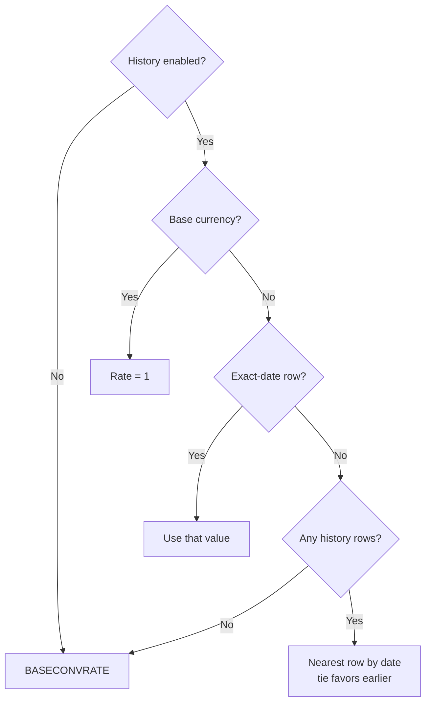

# currency-management Specification

**Capability**: `currency-management`
**Version**: 1.0.0
**Last Updated**: 2026-08-08

## Purpose

Currency definitions (`CURRENCYFORMATS_V1`), exchange-rate history (`CURRENCYHISTORY_V1`), the base currency, amount formatting and precision, and date-based rate resolution. Non-scope: online rate fetching (future change); share-quantity precision (`investment-tracking`); which store holds the base-currency pointer (`file-metadata-and-settings`). All rules inherit `domain-data-conventions`.

## Requirements
### Requirement: Schema Fidelity for Currency Tables

The application SHALL persist `CURRENCYFORMATS_V1` and `CURRENCYHISTORY_V1` in conformance with `domain-data-conventions`.

- New databases SHALL carry the upstream seed set of currencies (168 rows in the vendored DDL).
- `CURRENCYHISTORY_V1` rows SHALL be unique per `(CURRENCYID, CURRDATE)`, and `CURRUPDTYPE` SHALL be `1` (online) or `2` (manual).

Traceability: [mmex/database/tables.sql](../../../mmex/database/tables.sql), [mmex/moneymanagerex/src/model/Model_CurrencyHistory.h](../../../mmex/moneymanagerex/src/model/Model_CurrencyHistory.h).

#### Scenario: Currency tables round-trip

- **WHEN** a desktop-created database with currencies and rate history is opened and persisted
- **THEN** all currency and history rows the user did not edit SHALL be unchanged

### Requirement: Currency Definition

The application SHALL manage currencies with the upstream field semantics: unique name, unique symbol code, prefix and suffix display symbols, decimal point and group separator characters, unit and cent names, scale, base conversion rate, and currency type.

- `CURRENCY_TYPE` SHALL be persisted as exactly `Fiat` or `Crypto`.
- Currency name and symbol uniqueness SHALL be case-insensitive.

Traceability: [mmex/moneymanagerex/src/model/Model_Currency.h](../../../mmex/moneymanagerex/src/model/Model_Currency.h).

#### Scenario: Duplicate symbol is rejected

- **WHEN** the user attempts to create a currency whose symbol code equals an existing currency's symbol in any letter case
- **THEN** the creation SHALL be rejected as a duplicate

### Requirement: Amount Formatting and Precision

When the application formats or parses a monetary amount, it SHALL derive display precision from the currency's scale and apply the currency's formatting fields for display only.

- Decimal precision SHALL be `log10(SCALE)` — for example scale `100` renders 2 decimals, scale `1` renders 0, scale `100000000` renders 8.
- Formatting (prefix/suffix symbols, separators) SHALL never alter the persisted numeric value.

Traceability: [mmex/moneymanagerex/src/model/Model_Currency.cpp](../../../mmex/moneymanagerex/src/model/Model_Currency.cpp).

#### Scenario: Zero-decimal currency renders without decimals

- **WHEN** the application displays an amount in a currency whose scale is `1`
- **THEN** the amount SHALL be rendered with no decimal places
- **AND** the persisted value SHALL be unaffected by the rendering

### Requirement: Base Currency

The application SHALL treat the currency referenced by the `BASECURRENCYID` file fact as the base currency for all cross-currency aggregation.

- The base currency's conversion rate SHALL always be `1`.
- Every database SHALL have a base currency once initialized; changing it is a user action, never an implicit side effect.

Traceability: [mmex/moneymanagerex/src/model/Model_Currency.cpp](../../../mmex/moneymanagerex/src/model/Model_Currency.cpp), [src/data/currencies.json](../../../src/data/currencies.json) (initialization picker data).

#### Scenario: Base currency rate is unity

- **WHEN** the application resolves a conversion rate for the base currency on any date
- **THEN** the rate SHALL be `1`

### Requirement: Day-Rate Resolution

When the application converts an amount to the base currency for a given date, it SHALL resolve the rate by the upstream algorithm.

- If rate history is disabled (`USECURRENCYHISTORY` false), the rate SHALL be the currency's flat `BASECONVRATE`.
- Otherwise: an exact-date history row wins; failing that, the temporally nearest history row wins, with ties between an earlier and a later row resolved in favor of the earlier; with no history at all, the flat `BASECONVRATE` applies.

*Caption: Rate resolution for a given currency and date.*

Traceability: [mmex/moneymanagerex/src/model/Model_CurrencyHistory.cpp](../../../mmex/moneymanagerex/src/model/Model_CurrencyHistory.cpp) (`getDayRate`).

#### Scenario: Nearest rate with tie favoring the earlier row

- **WHEN** rate history is enabled and a currency has history rows exactly 3 days before and 3 days after the requested date
- **THEN** the application SHALL use the earlier row's value

#### Scenario: History disabled uses the flat rate

- **WHEN** rate history is disabled
- **THEN** conversions SHALL use the currency's `BASECONVRATE` regardless of any history rows

### Requirement: Rate History Toggle Retroactivity

The application SHALL treat the rate-history toggle as retroactive: enabling or disabling `USECURRENCYHISTORY` changes every derived valuation computed thereafter, including historical ones.

- This is intentional upstream behavior and SHALL NOT be "fixed" by caching pre-toggle valuations.

Traceability: [mmex/moneymanagerex/src/model/Model_CurrencyHistory.cpp](../../../mmex/moneymanagerex/src/model/Model_CurrencyHistory.cpp).

#### Scenario: Toggling changes historical valuations

- **WHEN** the user disables rate history and the application recomputes a report or balance for a past period
- **THEN** conversions in that computation SHALL use flat `BASECONVRATE` values

### Requirement: Currency Deletion Constraints

The application SHALL refuse to delete a currency that is in use, and deleting an unused currency SHALL also delete its rate history.

- "In use" includes being referenced by any account or asset, or being the base currency.

Traceability: [mmex/moneymanagerex/src/model/Model_Currency.cpp](../../../mmex/moneymanagerex/src/model/Model_Currency.cpp).

#### Scenario: Base currency cannot be deleted

- **WHEN** the user attempts to delete the base currency
- **THEN** the deletion SHALL be refused

#### Scenario: Deleting an unused currency removes its history

- **WHEN** the user deletes a currency no account or asset references
- **THEN** its `CURRENCYHISTORY_V1` rows SHALL be removed in the same operation

