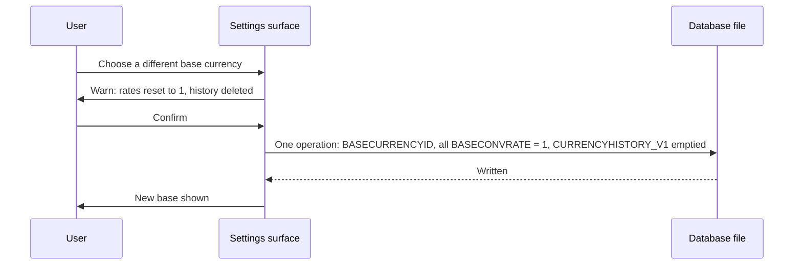
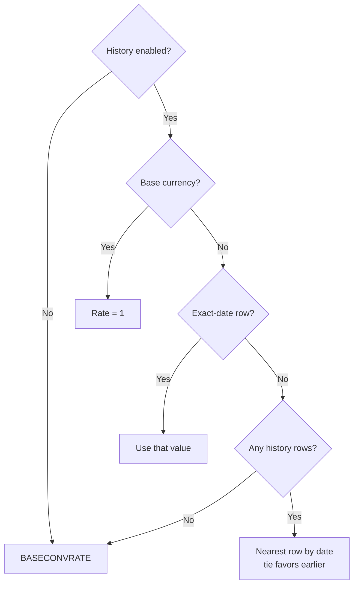
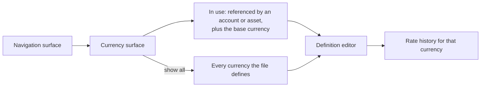

# currency-management Specification

**Capability**: `currency-management`
**Version**: 1.2.0
**Last Updated**: 2026-10-02

## Purpose

Currency definitions (`CURRENCYFORMATS_V1`), exchange-rate history (`CURRENCYHISTORY_V1`), the base currency, amount formatting and precision, date-based rate resolution, and the surface through which currencies and their rates are managed. Non-scope: fetching rates from an online source; changing which currency is the base, which `file-metadata-and-settings` owns; assigning a currency to an account, which `account-management` owns; share-quantity precision (`investment-tracking`). All rules inherit `domain-data-conventions`. A change of base currency resets every stored rate and empties the rate history, as desktop does; the settings surface invokes it and this capability owns it (operator decision 2026-10-02).

## Requirements

### Requirement: Schema Fidelity for Currency Tables

The application SHALL persist `CURRENCYFORMATS_V1` and `CURRENCYHISTORY_V1` in conformance with `domain-data-conventions`.

- New databases SHALL carry the upstream seed set of currencies (168 rows in the vendored DDL).
- `CURRENCYHISTORY_V1` rows SHALL be unique per `(CURRENCYID, CURRDATE)`, and `CURRUPDTYPE` SHALL be `1` (online) or `2` (manual).

Traceability: [mmex/database/tables.sql](../../../mmex/database/tables.sql), [mmex/moneymanagerex/src/model/Model_CurrencyHistory.h](../../../mmex/moneymanagerex/src/model/Model_CurrencyHistory.h).

#### Scenario: Currency tables round-trip

- **WHEN** a desktop-created database with currencies and rate history is opened and persisted
- **THEN** all currency and history rows the user did not edit SHALL be unchanged

### Requirement: Currency Definition

The application SHALL manage currencies with the upstream field semantics: unique name, unique symbol code, prefix and suffix display symbols, decimal point and group separator characters, unit and cent names, scale, base conversion rate, and currency type.

- `CURRENCY_TYPE` SHALL be persisted as exactly `Fiat` or `Crypto`.
- Currency name and symbol uniqueness SHALL be case-insensitive.

Traceability: [mmex/moneymanagerex/src/model/Model_Currency.h](../../../mmex/moneymanagerex/src/model/Model_Currency.h).

#### Scenario: Duplicate symbol is rejected

- **WHEN** the user attempts to create a currency whose symbol code equals an existing currency's symbol in any letter case
- **THEN** the creation SHALL be rejected as a duplicate

### Requirement: Amount Formatting and Precision

When the application formats or parses a monetary amount, it SHALL derive display precision from the currency's scale and apply the currency's formatting fields for display only.

- Decimal precision SHALL be `log10(SCALE)` — for example scale `100` renders 2 decimals, scale `1` renders 0, scale `100000000` renders 8.
- Formatting (prefix/suffix symbols, separators) SHALL never alter the persisted numeric value.

Traceability: [mmex/moneymanagerex/src/model/Model_Currency.cpp](../../../mmex/moneymanagerex/src/model/Model_Currency.cpp).

#### Scenario: Zero-decimal currency renders without decimals

- **WHEN** the application displays an amount in a currency whose scale is `1`
- **THEN** the amount SHALL be rendered with no decimal places
- **AND** the persisted value SHALL be unaffected by the rendering

### Requirement: Base Currency

The application SHALL treat the currency referenced by the `BASECURRENCYID` file fact as the base currency for all cross-currency aggregation.

- The base currency's conversion rate SHALL always be `1`.
- Every database SHALL have a base currency once initialized; changing it is a user action, never an implicit side effect.
- A change of base currency SHALL, in one logical operation, set `BASECURRENCYID` to the chosen currency, set every row's `BASECONVRATE` in `CURRENCYFORMATS_V1` to `1`, and delete every row of `CURRENCYHISTORY_V1`, because every stored rate is denominated in the old base. This is what desktop does when its base currency changes (operator decision 2026-10-02).
- The surface offering the change SHALL warn, before anything is written, that historical rates will be deleted.

*Caption: A base-currency change rewrites every rate with the pointer, as desktop does.*

Traceability: [mmex/moneymanagerex/src/model/Model_Currency.cpp](../../../mmex/moneymanagerex/src/model/Model_Currency.cpp), [mmex/moneymanagerex/src/maincurrencydialog.cpp](../../../mmex/moneymanagerex/src/maincurrencydialog.cpp) (`SetBaseCurrency`), [src/domain/repos/currency.ts](../../../src/domain/repos/currency.ts), [src/data/currencies.json](../../../src/data/currencies.json) (initialization picker data).

#### Scenario: Base currency rate is unity

- **WHEN** the application resolves a conversion rate for the base currency on any date
- **THEN** the rate SHALL be `1`

#### Scenario: Changing the base resets every rate

- **WHEN** the file holds a currency with `BASECONVRATE` `0.9` and two rows of rate history, and the user confirms a change of base currency
- **THEN** `BASECURRENCYID` SHALL reference the chosen currency, every `BASECONVRATE` SHALL be `1`, and `CURRENCYHISTORY_V1` SHALL hold no rows
- **AND** no partial state SHALL be observable: either all of it is written or none of it

#### Scenario: Nothing is written before confirmation

- **WHEN** the user chooses a different base currency and declines the warning
- **THEN** `BASECURRENCYID`, every `BASECONVRATE` and `CURRENCYHISTORY_V1` SHALL be unchanged

### Requirement: Day-Rate Resolution

When the application converts an amount to the base currency for a given date, it SHALL resolve the rate by the upstream algorithm.

- If rate history is disabled (`USECURRENCYHISTORY` false), the rate SHALL be the currency's flat `BASECONVRATE`.
- Otherwise: an exact-date history row wins; failing that, the temporally nearest history row wins, with ties between an earlier and a later row resolved in favor of the earlier; with no history at all, the flat `BASECONVRATE` applies.

*Caption: Rate resolution for a given currency and date.*

Traceability: [mmex/moneymanagerex/src/model/Model_CurrencyHistory.cpp](../../../mmex/moneymanagerex/src/model/Model_CurrencyHistory.cpp) (`getDayRate`).

#### Scenario: Nearest rate with tie favoring the earlier row

- **WHEN** rate history is enabled and a currency has history rows exactly 3 days before and 3 days after the requested date
- **THEN** the application SHALL use the earlier row's value

#### Scenario: History disabled uses the flat rate

- **WHEN** rate history is disabled
- **THEN** conversions SHALL use the currency's `BASECONVRATE` regardless of any history rows

### Requirement: Rate History Toggle Retroactivity

The application SHALL treat the rate-history toggle as retroactive: enabling or disabling `USECURRENCYHISTORY` changes every derived valuation computed thereafter, including historical ones.

- This is intentional upstream behavior and SHALL NOT be "fixed" by caching pre-toggle valuations.

Traceability: [mmex/moneymanagerex/src/model/Model_CurrencyHistory.cpp](../../../mmex/moneymanagerex/src/model/Model_CurrencyHistory.cpp).

#### Scenario: Toggling changes historical valuations

- **WHEN** the user disables rate history and the application recomputes a report or balance for a past period
- **THEN** conversions in that computation SHALL use flat `BASECONVRATE` values

### Requirement: Currency Deletion Constraints

The application SHALL refuse to delete a currency that is in use, and deleting an unused currency SHALL also delete its rate history.

- "In use" includes being referenced by any account or asset, or being the base currency.

Traceability: [mmex/moneymanagerex/src/model/Model_Currency.cpp](../../../mmex/moneymanagerex/src/model/Model_Currency.cpp).

#### Scenario: Base currency cannot be deleted

- **WHEN** the user attempts to delete the base currency
- **THEN** the deletion SHALL be refused

#### Scenario: Deleting an unused currency removes its history

- **WHEN** the user deletes a currency no account or asset references
- **THEN** its `CURRENCYHISTORY_V1` rows SHALL be removed in the same operation

### Requirement: Currency Management Surface

The application SHALL provide a currency surface at its own route, reachable from the navigation surface, listing by default only the currencies this file uses and offering a way to reach the rest.

- A currency counts as used when an account or an asset references it, or when it is the base currency.
- The surface SHALL offer a way to show every currency the file defines, and to search that set by name or symbol.
- The route SHALL be declared by this capability, per the route registry rule `app-shell-navigation` establishes, and SHALL be subject to the database-readiness guard.

*Caption: The short list is the default; the full set stays one step away.*

Traceability: [src/pages/](../../../src/pages/), [src/router/index.ts](../../../src/router/index.ts), [src/domain/repos/currency.ts](../../../src/domain/repos/currency.ts).

#### Scenario: Only the currencies in use are listed by default

- **WHEN** the user opens the currency surface on a file where one currency is referenced by an account and another is the base currency
- **THEN** those two SHALL be listed
- **AND** currencies nothing references SHALL NOT be listed until the user asks to see all

#### Scenario: The full set is reachable and searchable

- **WHEN** the user chooses to show all currencies and searches by name or symbol
- **THEN** the matching currencies SHALL be listed regardless of whether anything references them

### Requirement: Editing and Adding Currency Definitions

The application SHALL let the user edit a currency's definition — prefix and suffix symbols, decimal and grouping separators, unit and cent names, scale, type, and fixed conversion rate — and SHALL let a new currency be added.

- Names and symbols SHALL remain unique case-insensitively, as the capability already requires; a conflicting edit or addition SHALL be refused with the reason.
- The type SHALL be persisted as exactly `Fiat` or `Crypto`.
- The base currency's fixed rate SHALL always be presented as `1` and SHALL NOT be editable, because every other rate is measured against it.

Traceability: [src/domain/repos/currency.ts](../../../src/domain/repos/currency.ts), [src/domain/rules/currency.ts](../../../src/domain/rules/currency.ts).

#### Scenario: A conflicting name is refused

- **WHEN** the user renames a currency to a name another currency already holds, in any letter case
- **THEN** the change SHALL be refused with the reason
- **AND** the stored definition SHALL be unchanged

#### Scenario: A currency outside the seeded set can be added

- **WHEN** the user adds a currency with a name and symbol nothing else uses
- **THEN** it SHALL be stored and available to be referenced

### Requirement: Format Preview

While a currency definition is being edited, the application SHALL show how a representative amount renders under the values currently entered.

- The preview SHALL reflect the scale, the separators and the symbols as edited, before anything is saved.
- Because precision follows the scale, changing the scale SHALL visibly change the number of decimal places shown.

Traceability: [src/domain/rules/currency.ts](../../../src/domain/rules/currency.ts).

#### Scenario: Changing the scale changes the preview

- **WHEN** the user changes a currency's scale from one hundred to one
- **THEN** the preview SHALL render the representative amount with no decimal places

### Requirement: Exchange Rate History Management

The application SHALL let the user record an exchange rate for a currency on a date, and remove a recorded rate.

- A rate SHALL be stored against the currency and the date, and recording a second rate for the same date SHALL replace the first rather than create a duplicate.
- Rates recorded this way SHALL be marked as manually recorded.
- History SHALL NOT be offered for the base currency, whose rate is always one.
- When the file's rate-history setting is off, the surface SHALL make clear that recorded rates are not being used, because conversion falls back to the fixed rate.

Traceability: [src/domain/repos/currency.ts](../../../src/domain/repos/currency.ts), [openspec/specs/file-metadata-and-settings/spec.md](../../../openspec/specs/file-metadata-and-settings/spec.md).

#### Scenario: A rate is recorded and used

- **WHEN** the user records a rate for a currency on a date and the file's rate-history setting is on
- **THEN** conversions for that date SHALL resolve to the recorded rate
- **AND** the rate SHALL be marked as manually recorded

#### Scenario: Recording twice for one date replaces rather than duplicates

- **WHEN** the user records a rate for a date that already has one
- **THEN** the stored rate for that date SHALL be the new value
- **AND** there SHALL be exactly one rate for that currency and date

#### Scenario: Recorded rates are shown as inactive while the setting is off

- **WHEN** the rate-history setting is off and the user views a currency's recorded rates
- **THEN** the surface SHALL indicate that they are not currently being used for conversion

### Requirement: Base Currency Indication

The currency surface SHALL show which currency is the base currency, and SHALL NOT offer to change it.

- Changing the base currency remains the responsibility of the settings surface, where the consequence is stated and confirmed.

Traceability: [openspec/specs/file-metadata-and-settings/spec.md](../../../openspec/specs/file-metadata-and-settings/spec.md).

#### Scenario: The base currency is identifiable but not changeable here

- **WHEN** the user views the currency surface
- **THEN** the base currency SHALL be distinguishable from the others
- **AND** the surface SHALL offer no control that changes which currency is the base

### Requirement: Currency Deletion From the Surface

The application SHALL offer to delete a currency only where the capability permits it, and SHALL explain the refusal otherwise.

- A currency referenced by an account or an asset, or serving as the base currency, SHALL NOT be deletable, and the reason SHALL be given.
- Deleting a currency SHALL remove its recorded rate history in the same operation, as the capability already requires.

Traceability: [src/domain/repos/currency.ts](../../../src/domain/repos/currency.ts).

#### Scenario: A currency in use cannot be deleted

- **WHEN** the user attempts to delete a currency an account references
- **THEN** the deletion SHALL be refused and the reason SHALL be given

#### Scenario: Deleting an unused currency takes its history

- **WHEN** the user deletes a currency nothing references
- **THEN** the currency and its recorded rates SHALL both be gone
