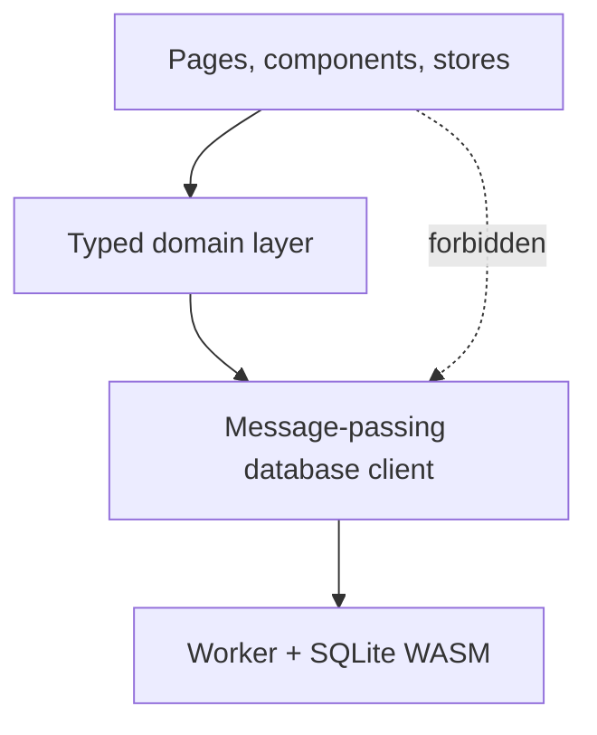

# domain-data-access Specification

**Capability**: `domain-data-access`
**Version**: 1.0.0
**Last Updated**: 2026-08-09

## Purpose

Architectural governance for how the application reaches domain data — the single typed access path, one implementation per persisted vocabulary, financial rules as pure functions, atomic multi-table operations, and derived-cache write-back discipline. Non-scope: what the data means or how each figure is computed (owned by the eleven domain capabilities); the worker, OPFS, and migration mechanics (`infrastructure-baseline`); presentation of any kind.

## Requirements
### Requirement: Single Typed Access Path

The application SHALL reach domain tables only through a typed domain layer, and SHALL NOT embed domain SQL in user-interface, routing, or application-state code.

- Every domain table read or written by the application SHALL have a typed record shape whose fields correspond to that table's columns.
- Code outside the domain layer SHALL obtain and mutate domain data exclusively through that layer's functions.
- Database lifecycle operations that carry no table semantics (opening, migrating, exporting, importing, and creating the schema) are outside this rule and remain governed by `infrastructure-baseline`.

*Caption: The domain layer is the only route from application code to domain tables.*

Traceability: [src/domain/](../../../src/domain/), [src/workers/db-client.ts](../../../src/workers/db-client.ts).

#### Scenario: Application code reads domain data through the layer

- **WHEN** application code outside the domain layer needs domain records
- **THEN** it SHALL call a domain-layer function
- **AND** it SHALL NOT construct or execute SQL against domain tables itself

### Requirement: Single Vocabulary Source

Each persisted vocabulary defined by `domain-data-conventions` and the domain capabilities SHALL have exactly one implementation in the domain layer, used for both writing and interpreting values.

- Enumerated values, reference-type strings, sentinel values, and status keys SHALL be declared once and referenced everywhere else.
- Display localization SHALL consume these values without altering what is persisted.

Traceability: [openspec/specs/domain-data-conventions/spec.md](../../../openspec/specs/domain-data-conventions/spec.md), [src/domain/](../../../src/domain/).

#### Scenario: A vocabulary value is defined once

- **WHEN** two capabilities persist the same enumerated value
- **THEN** both SHALL reference the same single declaration in the domain layer

### Requirement: Financial Rules As Pure Functions

The financial rules the domain capabilities define SHALL be implemented as pure functions over already-loaded records, free of database access and of any dependency on presentation.

- A rule function SHALL return computed values, or the statements needed to apply a change, and SHALL NOT perform input or output itself.
- Rule functions SHALL be unit-testable without a database, a worker, or a browser.

Traceability: [src/domain/](../../../src/domain/), [src/__tests__/](../../../src/__tests__/).

#### Scenario: A rule is exercised without a database

- **WHEN** a test evaluates a financial rule, such as the account-flow contribution of a transaction
- **THEN** the rule SHALL be callable with plain records and SHALL return the result without opening a database

### Requirement: Atomic Multi-Table Operations

An operation that must modify more than one table SHALL apply all of its statements in a single database transaction, so a failure leaves no partial state.

- Cascading deletions, relocations and merges, occurrence execution, and derived-cache recomputation SHALL each be applied atomically.
- The application SHALL provide a persistence primitive that applies an ordered statement list atomically.

Traceability: [src/workers/sqlite.worker.ts](../../../src/workers/sqlite.worker.ts), [src/workers/db-client.ts](../../../src/workers/db-client.ts), [src/domain/](../../../src/domain/).

#### Scenario: A failed cascade leaves no partial state

- **WHEN** one statement of a multi-table operation fails
- **THEN** none of that operation's statements SHALL remain applied

### Requirement: Derived Cache Write-Back Discipline

When a mutation invalidates a derived cache that the schema stores — stock position fields and asset value — the recomputed values SHALL be persisted within the same atomic operation as the mutation that triggered them.

- The application SHALL NOT rely on recomputing such values only for display, because desktop MoneyManagerEx reads the stored columns.

Traceability: [openspec/specs/investment-tracking/spec.md](../../../openspec/specs/investment-tracking/spec.md), [openspec/specs/asset-tracking/spec.md](../../../openspec/specs/asset-tracking/spec.md), [src/domain/](../../../src/domain/).

#### Scenario: Cache write-back rides with its trigger

- **WHEN** a transaction linked to a stock position is created, edited, deleted, restored, or purged
- **THEN** the position's recomputed fields SHALL be written in the same transaction as that mutation

