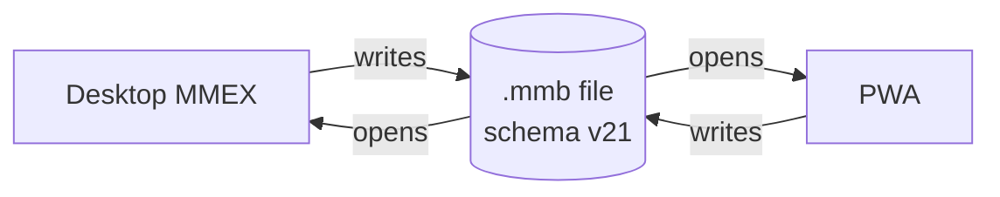
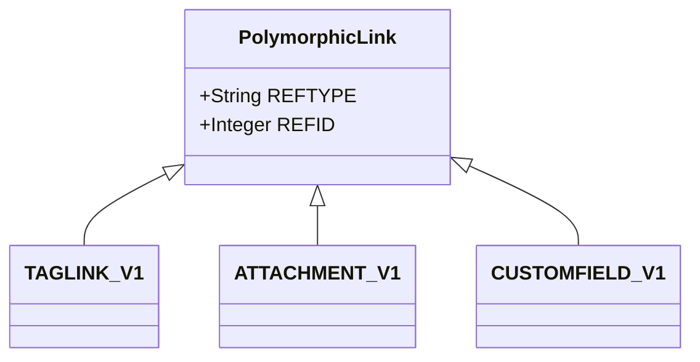

# domain-data-conventions Specification

**Capability**: `domain-data-conventions`
**Version**: 1.2.0
**Last Updated**: 2026-10-02

## Purpose

Cross-cutting rules every domain capability inherits: the `.mmb` round-trip fidelity doctrine, unknown-data custody, the polymorphic reference vocabulary, persisted-enumeration discipline, date and identifier encodings, case-insensitive name uniqueness, and application-level referential integrity. This capability owns no tables. Boundaries: `infrastructure-baseline` owns how the schema arrives (vendored submodule provenance, worker/OPFS persistence, `PRAGMA user_version` migration mechanics); `cloud-file-sync` owns file transport. This capability owns what the data inside the file means and what writers may do to it.
## Requirements
### Requirement: MMB Round-Trip Fidelity

The application SHALL read and write the MoneyManagerEx `.mmb` SQLite database file such that the same file remains fully usable by desktop MoneyManagerEx and by this application, in both directions, without data loss.

- The database SHALL conform to upstream schema version 21 as reported by `PRAGMA user_version`, and new databases SHALL carry the `INFOTABLE_V1` row `INFONAME = 'DATAVERSION'` with value `3`.
- The application SHALL NOT create, drop, or alter any schema object (table, column, index, trigger, view, foreign key, or CHECK constraint) beyond what the vendored upstream DDL and incremental migrations define.
- A database created by this application SHALL be schema-identical to one created by desktop MoneyManagerEx at the same schema version.
- Seed rows of a newly created database SHALL match the desktop-generated form: the vendored DDL's `_tr_` translation markers SHALL be stripped from seeded values at creation, mirroring the upstream generator (`util/sqlite2cpp.py`).

*Caption: One file, two writers — fidelity means neither writer ever produces a file the other cannot fully use.*

Traceability: [mmex/database/tables.sql](../../../mmex/database/tables.sql) (authoritative DDL), [mmex/moneymanagerex/util/sqlite2cpp.py](../../../mmex/moneymanagerex/util/sqlite2cpp.py) (upstream marker stripping), [src/workers/sqlite.worker.ts](../../../src/workers/sqlite.worker.ts) (schema creation and migration from the vendored sources).

#### Scenario: Desktop file opens and returns unchanged in structure

- **WHEN** the application opens a database created by desktop MoneyManagerEx at schema version 21 and later persists it
- **THEN** the file SHALL still report `PRAGMA user_version` 21 and contain exactly the upstream schema objects
- **AND** desktop MoneyManagerEx SHALL be able to open it with all data intact

#### Scenario: New database matches upstream seeding

- **WHEN** the application creates a new database
- **THEN** the database SHALL contain the upstream schema and seed rows with translation markers stripped (for example category `Bills`, never `_tr_Bills`)
- **AND** `INFOTABLE_V1` SHALL contain `DATAVERSION` = `3`

### Requirement: Unknown Data Custody

The application SHALL preserve, byte-for-byte, any table, row, column value, or key that it stores but does not interpret.

- Custody applies to whole tables the application has no feature for, and to individual columns or keys within tables it does interpret.
- Deleting a record the application does own SHALL NOT orphan-and-drop custody data owned by other rows.

Traceability: [mmex/database/tables.sql](../../../mmex/database/tables.sql).

#### Scenario: Uninterpreted table survives a foreign edit cycle

- **WHEN** a desktop-created database containing rows in a table this application has no feature for is opened, modified elsewhere, and saved by the application
- **THEN** those rows SHALL be unchanged in the persisted file

### Requirement: Polymorphic Reference Vocabulary

The application SHALL use exactly the upstream reference-type strings when persisting any polymorphic `(REFTYPE, REFID)` link: `Transaction`, `Stock`, `Asset`, `BankAccount`, `RecurringTransaction`, `Payee`, `TransactionSplit`, `RecurringTransactionSplit`.

- These strings are defined by the upstream C++ model layer; the descriptive comments in the DDL are stale (they list `Bank Account` and `Repeating Transaction` and omit the split types) and SHALL NOT be used.
- The vocabulary applies to `TAGLINK_V1.REFTYPE`, `ATTACHMENT_V1.REFTYPE`, and `CUSTOMFIELD_V1.REFTYPE`. `TRANSLINK_V1.LINKTYPE` uses its own two-value vocabulary (`Asset`, `Stock`) owned by the ledger's linkage requirement.

*Caption: Three tables share one reference-type vocabulary; the referenced entity is resolved by (REFTYPE, REFID) with no SQL foreign key.*

Traceability: [mmex/moneymanagerex/src/model/Model.cpp](../../../mmex/moneymanagerex/src/model/Model.cpp) (authoritative REFTYPE strings).

#### Scenario: Link rows carry the exact upstream strings

- **WHEN** the application persists a polymorphic link for a bank account record
- **THEN** the stored `REFTYPE` SHALL be exactly `BankAccount`

### Requirement: Persisted Enumeration Discipline

The application SHALL persist every enumerated value using the exact upstream English string, regardless of the active display locale.

- Where a DDL comment and the upstream C++ model header disagree on values or ordering, the C++ header SHALL be authoritative.
- Localization SHALL apply to display only; persisted values SHALL never be localized.
- The transaction status column is the deliberate exception to the display-string rule: it persists single-letter keys (defined in `transaction-ledger`), not display names.

Traceability: [mmex/moneymanagerex/src/model/](../../../mmex/moneymanagerex/src/model/) (authoritative enum headers), [src/locales/](../../../src/locales/) (display-only catalogs).

#### Scenario: Locale switch never rewrites persisted values

- **WHEN** the user switches the display locale and then saves any record carrying an enumerated value
- **THEN** the persisted value SHALL be the upstream English string, unchanged by the locale

### Requirement: Date and Timestamp Encoding

The application SHALL store all dates and timestamps as ISO 8601 text.

- Timestamps (including transaction dates, last-update times, and deletion times) SHALL be written in the combined form `YYYY-MM-DDTHH:MM:SS`.
- Parsers SHALL accept both the date-only form `YYYY-MM-DD` and the combined form, because upstream files written before schema version 20 contain date-only transaction dates.

Traceability: [mmex/database/incremental_upgrade/database_version_20.sql](../../../mmex/database/incremental_upgrade/database_version_20.sql) (upstream normalization to the combined form).

#### Scenario: Legacy date-only values are readable

- **WHEN** the application reads a record whose date column contains `2019-05-04`
- **THEN** the value SHALL parse as that calendar date without error

#### Scenario: New timestamps use the combined form

- **WHEN** the application writes a transaction date or audit timestamp
- **THEN** the persisted text SHALL match `YYYY-MM-DDTHH:MM:SS`

### Requirement: Identifier and Sentinel Conventions

The application SHALL treat primary keys as SQLite rowid-alias integers assigned by the database, and SHALL treat the value `-1` as the universal "none" sentinel rather than a dangling reference.

- The application SHALL NOT assume `AUTOINCREMENT` semantics (upstream declares none) and SHALL NOT reuse or hand-assign identifier values.
- `-1` denotes: a root category's `PARENTID`, an unset `COLOR`, an unset `CURRENCYID` on assets, and other "no reference" cases; such values SHALL NOT be reported as integrity violations.

Traceability: [mmex/database/tables.sql](../../../mmex/database/tables.sql).

#### Scenario: Sentinel is not an integrity error

- **WHEN** the application validates a category row whose `PARENTID` is `-1`
- **THEN** the row SHALL be treated as a root category, not as a reference to a missing parent

### Requirement: Case-Insensitive Name Uniqueness

The application SHALL enforce uniqueness of user-facing names case-insensitively, matching the upstream `COLLATE NOCASE` declarations.

- Applies to account, category (per parent), payee, tag, currency, setting, info-key, and report names.
- Name comparisons for lookup and duplicate detection SHALL fold the 26 ASCII letters only, as `COLLATE NOCASE` folds; every other character SHALL compare by code point, so two names that differ only in the case of a non-ASCII letter are distinct names (operator decision 2026-10-02).

Traceability: [mmex/database/tables.sql](../../../mmex/database/tables.sql) (`COLLATE NOCASE` declarations), [src/domain/conventions.ts](../../../src/domain/conventions.ts) (`namesEqual`).

#### Scenario: Same name with different case is a duplicate

- **WHEN** the application is asked to create a payee named `Grocery` while a payee named `GROCERY` exists
- **THEN** the creation SHALL be rejected as a duplicate

#### Scenario: Non-ASCII case is not folded

- **WHEN** the application is asked to create a payee named `époque` while a payee named `Époque` exists
- **THEN** the creation SHALL be accepted as a distinct name
### Requirement: Application-Level Referential Integrity

The application SHALL maintain referential integrity in application logic, because the schema declares only one foreign key (`TAGLINK_V1.TAGID → TAG_V1.TAGID`).

- Every mutation (create, edit, delete, merge, relocate) SHALL leave no reference pointing at a removed record, honoring each domain capability's cascade rules.
- Removing a record SHALL also remove or reassign its dependent polymorphic rows (tag links, attachments, custom field data) as specified by the owning capability.
- The application SHALL NOT add SQL foreign keys or triggers to enforce this (that would violate MMB Round-Trip Fidelity).

Traceability: [mmex/database/tables.sql](../../../mmex/database/tables.sql) (sole declared foreign key), [mmex/database/README.md](../../../mmex/database/README.md) (relations documented as not implemented at SQL level).

#### Scenario: Delete leaves no dangling polymorphic rows

- **WHEN** the application deletes a record that carries tag links, attachments, or custom field data
- **THEN** those dependent rows SHALL be removed in the same logical operation
- **AND** no schema-level constraint SHALL have been added to accomplish it

