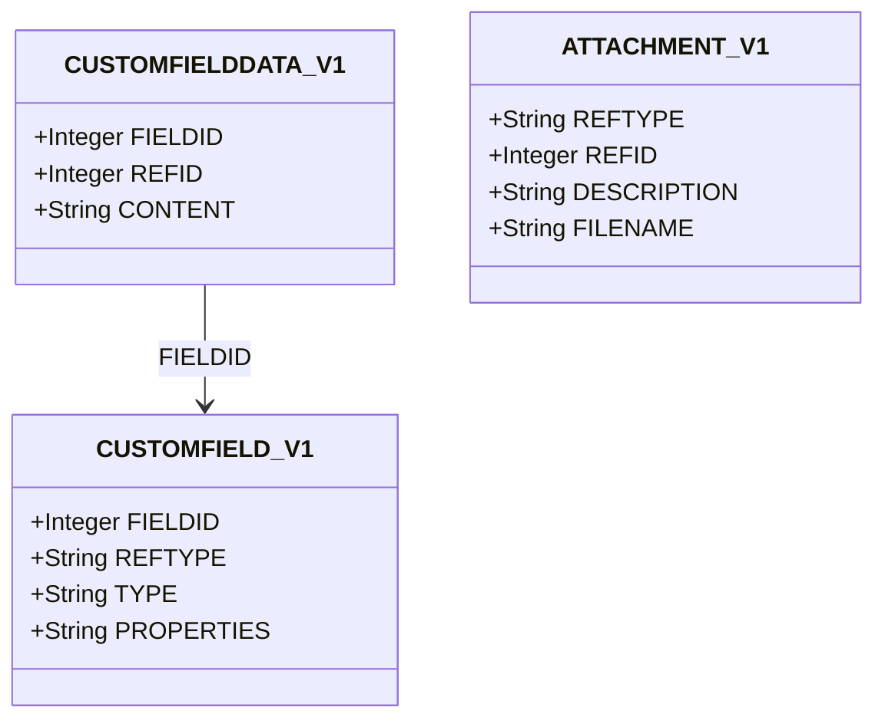

# record-extensions Specification

**Capability**: `record-extensions`
**Version**: 1.0.0
**Last Updated**: 2026-08-08

## Purpose

The polymorphic decoration tables: attachments (`ATTACHMENT_V1`, metadata only) and user-defined custom fields (`CUSTOMFIELD_V1` definitions, `CUSTOMFIELDDATA_V1` values), attached to core records via the `domain-data-conventions` reference vocabulary. Non-scope: attachment **binary** storage and transfer — the desktop stores files in a folder beside the `.mmb`, which has no OPFS/single-file-sync analogue; by operator decision (2026-08-08) the application takes a permanent read-only stance: it never manages binaries and handles metadata rows only. Tags, the third polymorphic mechanism, are owned by `transaction-taxonomy`. All rules inherit `domain-data-conventions`.

## Requirements
### Requirement: Schema Fidelity for Extension Tables

The application SHALL persist `ATTACHMENT_V1`, `CUSTOMFIELD_V1`, and `CUSTOMFIELDDATA_V1` in conformance with `domain-data-conventions`.

- `CUSTOMFIELDDATA_V1` rows SHALL be unique per `(FIELDID, REFID)`.
- All `REFTYPE` values SHALL come from the conventions vocabulary.

*Caption: Custom-field values resolve their host entity through the definition's REFTYPE; attachments reference hosts directly.*

Traceability: [mmex/database/tables.sql](../../../mmex/database/tables.sql), [mmex/moneymanagerex/src/model/Model_CustomField.h](../../../mmex/moneymanagerex/src/model/Model_CustomField.h).

#### Scenario: Extension rows round-trip

- **WHEN** a desktop-created database with attachments and custom fields is opened and persisted
- **THEN** all extension rows the application did not deliberately change SHALL be unchanged

### Requirement: Attachment Metadata Custody

The application SHALL preserve attachment rows (reference, description, file name) even though their binaries are not reachable from the browser.

- A missing binary SHALL NOT cause the row to be deleted or rewritten.
- Any future attachment feature SHALL keep row semantics compatible with the desktop's attachment manager.

Traceability: [mmex/moneymanagerex/src/attachmentdialog.h](../../../mmex/moneymanagerex/src/attachmentdialog.h) (`mmAttachmentManage`).

#### Scenario: Rows survive without binaries

- **WHEN** the application opens a database whose attachment rows point at desktop-side files
- **THEN** the rows SHALL round-trip unchanged
- **AND** the application SHALL NOT treat the unreachable binaries as an error requiring row cleanup

### Requirement: Attachment Cascade

When a host record is removed (including ledger purge) or merged, its attachment rows SHALL be removed or relocated with it, per the host capability's cascade rules.

Traceability: [mmex/moneymanagerex/src/attachmentdialog.h](../../../mmex/moneymanagerex/src/attachmentdialog.h) (`DeleteAllAttachments`, `RelocateAllAttachments`).

#### Scenario: Merge relocates attachments

- **WHEN** the user merges payee `A`, which carries attachments, into payee `B`
- **THEN** the attachment rows SHALL reference `B` afterwards

### Requirement: Custom Field Definitions

The application SHALL manage custom field definitions scoped to one reference type, with the field type persisted as exactly one of the upstream strings: `String`, `Integer`, `Decimal`, `Boolean`, `Date`, `Time`, `SingleChoice`, `MultiChoice`.

- The `PROPERTIES` JSON (tooltip, validation pattern, autocomplete flag, default value, choice list, digit scale, and register-column slot) SHALL be preserved verbatim where the application does not edit it, and edited only through its upstream shape.

Traceability: [mmex/moneymanagerex/src/model/Model_CustomField.h](../../../mmex/moneymanagerex/src/model/Model_CustomField.h).

#### Scenario: Definition properties round-trip

- **WHEN** a desktop-defined choice field with a validation pattern is opened and its unrelated description edited
- **THEN** the choice list and validation pattern in `PROPERTIES` SHALL be preserved verbatim

### Requirement: Custom Field Values

When the application edits a custom field value, it SHALL validate the content against its definition (type, validation pattern, choice membership) and store it in `CUSTOMFIELDDATA_V1` keyed by definition and host record.

- One value per `(FIELDID, REFID)` pair; editing replaces, never duplicates.

Traceability: [mmex/moneymanagerex/src/model/Model_CustomFieldData.h](../../../mmex/moneymanagerex/src/model/Model_CustomFieldData.h), [mmex/moneymanagerex/src/mmcustomdata.cpp](../../../mmex/moneymanagerex/src/mmcustomdata.cpp).

#### Scenario: Choice value must be a defined choice

- **WHEN** the user sets a single-choice field to a value not in the definition's choice list
- **THEN** the edit SHALL be rejected

### Requirement: Register Column Slot Custody

The application SHALL preserve the register-column slot assignments (`UDFC01`–`UDFC05`) inside field definitions as custody-only data; by operator decision (2026-08-08) custom fields surface in record detail and edit forms only, never as register columns.

Traceability: [mmex/moneymanagerex/src/model/Model_CustomField.h](../../../mmex/moneymanagerex/src/model/Model_CustomField.h) (`UDFC_FIELDS`).

#### Scenario: Slot assignments survive

- **WHEN** a desktop-created database assigns a custom field to register column slot `UDFC02` and the field is edited here
- **THEN** the slot assignment SHALL be preserved

### Requirement: Custom Field Cascade

When a host record is removed, its custom field values SHALL be removed with it; when a definition is deleted, all of its values SHALL be deleted in the same operation.

Traceability: [mmex/moneymanagerex/src/model/Model_CustomField.cpp](../../../mmex/moneymanagerex/src/model/Model_CustomField.cpp).

#### Scenario: Deleting a definition deletes its values

- **WHEN** the user deletes a custom field definition that has values on many records
- **THEN** all of those `CUSTOMFIELDDATA_V1` rows SHALL be removed with the definition

