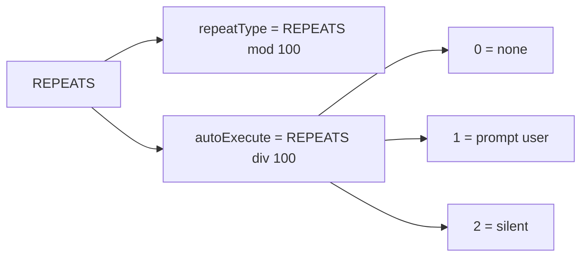
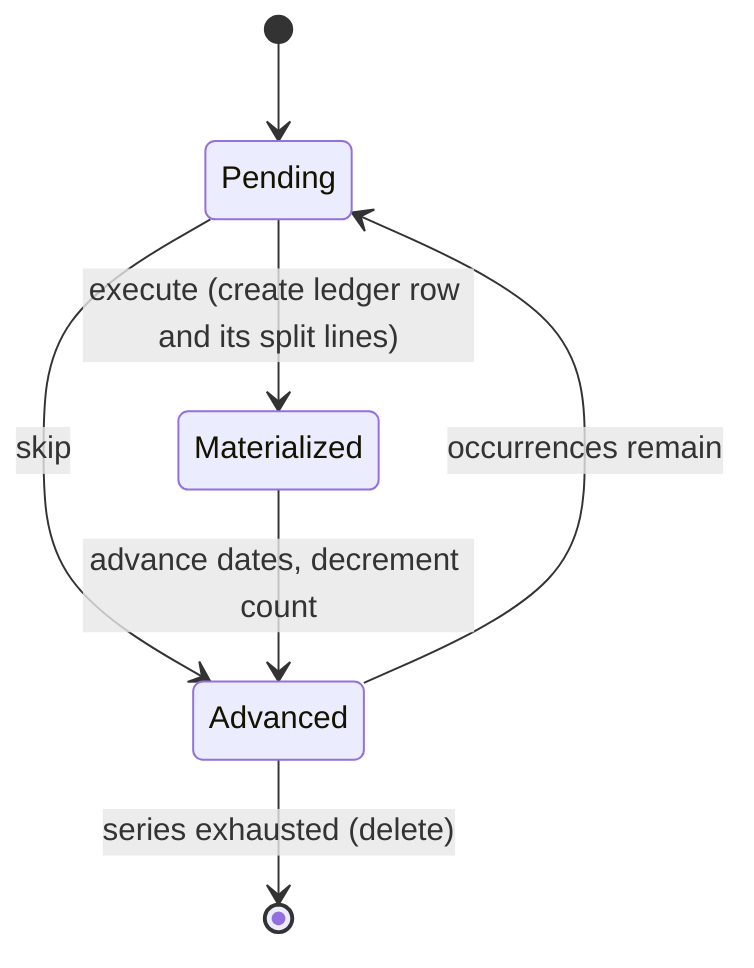

# scheduled-transactions Specification

**Capability**: `scheduled-transactions`
**Version**: 1.1.0
**Last Updated**: 2026-10-02

## Purpose

Recurring transaction series (`BILLSDEPOSITS_V1`) and their split lines (`BUDGETSPLITTRANSACTIONS_V1` — which belongs to this capability, not to budgeting, despite its name): the multiplexed repeat encoding, the seventeen repeat types, occurrence counting, series advancement on execute/skip, execution guards, auto-execute modes, and projection of future occurrences. Non-scope: the materialized ledger rows themselves (`transaction-ledger`); cashflow forecasting reports (future). All rules inherit `domain-data-conventions`.

## Requirements
### Requirement: Schema Fidelity for Scheduled Tables

The application SHALL persist `BILLSDEPOSITS_V1` and `BUDGETSPLITTRANSACTIONS_V1` in conformance with `domain-data-conventions`, mirroring the ledger's column semantics with the scheduling additions.

- `TRANSDATE` is the date paid; `NEXTOCCURRENCEDATE` is the date due; both SHALL advance together as the series progresses.
- `BUDGETSPLITTRANSACTIONS_V1` rows are split lines of a scheduled series (`TRANSID` references `BDID`) and SHALL never be interpreted as budget data.

Traceability: [mmex/database/tables.sql](../../../mmex/database/tables.sql), [mmex/moneymanagerex/src/model/Model_Billsdeposits.h](../../../mmex/moneymanagerex/src/model/Model_Billsdeposits.h).

#### Scenario: Scheduled rows round-trip

- **WHEN** a desktop-created database with recurring series of several repeat types is opened and persisted
- **THEN** all series rows and their split lines SHALL be unchanged unless the user edited them

### Requirement: Repeat Encoding

The application SHALL interpret and write the `REPEATS` column as the upstream multiplexed integer: repeat type plus one hundred times the auto-execute mode.

- `repeatType = REPEATS % 100`; `autoExecute = REPEATS / 100` with values `0` (none), `1` (prompt the user to enter the payment), `2` (execute silently).

*Caption: Decoding the multiplexed REPEATS column.*

Traceability: [mmex/moneymanagerex/src/model/Model_Billsdeposits.h](../../../mmex/moneymanagerex/src/model/Model_Billsdeposits.h) (`BD_REPEATS_MULTIPLEX_BASE`).

#### Scenario: Encoding round-trips

- **WHEN** the user configures a monthly series with silent auto-execution
- **THEN** the persisted `REPEATS` SHALL be `203`

### Requirement: Repeat Types

The application SHALL support exactly the seventeen upstream repeat types, identified by `repeatType` ordinal: `0` Once, `1` Weekly, `2` Fortnightly, `3` Monthly, `4` Every 2 Months, `5` Quarterly, `6` Half-Yearly, `7` Yearly, `8` Four Months, `9` Four Weeks, `10` Daily, `11` In (n) Days, `12` In (n) Months, `13` Every (n) Days, `14` Every (n) Months, `15` Monthly (last day), `16` Monthly (last business day).

- Advancement adds the type's period to both dates; type `15` snaps to the last day of the resulting month; type `16` additionally steps back to Friday when the last day falls on a weekend.
- For types `11`–`14`, `NUMOCCURRENCES` supplies the `(n)` parameter.

Traceability: [mmex/moneymanagerex/src/model/Model_Billsdeposits.h](../../../mmex/moneymanagerex/src/model/Model_Billsdeposits.h), [mmex/moneymanagerex/src/model/Model_Billsdeposits.cpp](../../../mmex/moneymanagerex/src/model/Model_Billsdeposits.cpp) (`nextOccurDate`).

#### Scenario: Last business day snaps off the weekend

- **WHEN** a Monthly (last business day) series advances into a month whose last day is a Sunday
- **THEN** the next due date SHALL be the preceding Friday

### Requirement: Occurrence Count Semantics

The application SHALL interpret `NUMOCCURRENCES` as: `-1` infinite, a positive value as payments remaining, and SHALL treat types `11`–`14` with a non-positive count as legacy inactive series.

- Legacy inactive series SHALL NOT be executable and their auto-execute mode SHALL be treated as none.

Traceability: [mmex/moneymanagerex/src/model/Model_Billsdeposits.cpp](../../../mmex/moneymanagerex/src/model/Model_Billsdeposits.cpp) (`decode_fields`).

#### Scenario: Legacy inactive series is quarantined

- **WHEN** the application reads an In (n) Days series whose `NUMOCCURRENCES` is `0`
- **THEN** the series SHALL be presented as inactive and SHALL NOT execute automatically or manually

### Requirement: Series Advancement on Execute or Skip

When the user executes or skips an occurrence, the application SHALL mutate the series exactly as upstream does — the operation is not idempotent.

- Executing SHALL materialize a ledger transaction from the series template (including converting the series' split lines to ledger split lines); skipping SHALL NOT.
- Every converted split line SHALL reference the transaction materialized in the same operation, however many split lines the series carries; no split line SHALL reference any other row.
- Both operations SHALL then advance `TRANSDATE` and `NEXTOCCURRENCEDATE` by one period and decrement a positive `NUMOCCURRENCES` greater than one.
- A series SHALL be deleted (with its split lines and extension rows) when exhausted: type Once, or a countable series whose remaining count reaches zero.
- Types `11` and `12` (In n Days/Months) SHALL convert to Once after firing, preserving the auto-execute multiplexer, with `NUMOCCURRENCES` set to `-1`.

*Caption: One occurrence's lifecycle — execute and skip both advance the series; only execute writes to the ledger.*

Traceability: [mmex/moneymanagerex/src/model/Model_Billsdeposits.cpp](../../../mmex/moneymanagerex/src/model/Model_Billsdeposits.cpp) (`completeBDInSeries`), [mmex/moneymanagerex/src/fusedtransaction.cpp](../../../mmex/moneymanagerex/src/fusedtransaction.cpp) (`execute_bill`, `execute_splits`), [src/domain/repos/scheduled.ts](../../../src/domain/repos/scheduled.ts).

#### Scenario: Countdown reaches zero

- **WHEN** the user executes the final occurrence of a monthly series with `NUMOCCURRENCES` `1`
- **THEN** a ledger transaction SHALL be created
- **AND** the series and its split lines SHALL be deleted

#### Scenario: Skip advances without writing

- **WHEN** the user skips an occurrence
- **THEN** no ledger transaction SHALL be created
- **AND** both series dates SHALL advance by one period

#### Scenario: Every split line lands on the new transaction

- **WHEN** the user executes an occurrence of a series that carries two split lines
- **THEN** exactly one ledger transaction SHALL be created
- **AND** both resulting split lines SHALL reference that transaction's identifier
### Requirement: Execution Guard

When executing an occurrence would breach the target account's minimum balance or credit limit, the application SHALL warn and require explicit confirmation before proceeding.

- Void series entries and non-outflow types bypass the guard.

Traceability: [mmex/moneymanagerex/src/model/Model_Billsdeposits.cpp](../../../mmex/moneymanagerex/src/model/Model_Billsdeposits.cpp) (`AllowTransaction`).

#### Scenario: Breach requires confirmation

- **WHEN** executing a withdrawal occurrence would push the account below its configured minimum balance
- **THEN** the application SHALL warn the user and proceed only on explicit confirmation

### Requirement: Auto-Execute Modes

The application SHALL honor the three auto-execute modes for due occurrences: none (user acts from the schedule surface), prompt (the user is asked to enter the payment), and silent (the occurrence executes without interaction).

- An occurrence is due when its due date is less than one day away.
- Due-occurrence processing SHALL run when the database is ready and synchronization has settled (or no sync binding exists), at most once per calendar day (operator decision 2026-08-08); prompt-mode occurrences SHALL surface through a non-blocking notification (banner and badge) leading to per-item confirmation, never a modal dialog sequence.

Traceability: [mmex/moneymanagerex/src/model/Model_Billsdeposits.cpp](../../../mmex/moneymanagerex/src/model/Model_Billsdeposits.cpp).

#### Scenario: Silent mode executes without interaction

- **WHEN** the application processes due occurrences and finds a due series in silent mode
- **THEN** the occurrence SHALL be executed and the series advanced without user interaction

### Requirement: Future Occurrence Projection

When the application projects a series' future occurrences (for schedule views or a register that includes upcoming items), it SHALL unroll from the current due date using the repeat rules, over a bounded horizon, without persisting anything.

- Projected occurrences SHALL be visually and programmatically distinguishable from real ledger rows and SHALL never contribute to balances.
- The projection horizon SHALL be bounded (by date or count) so infinite series cannot produce unbounded work.

Traceability: [mmex/moneymanagerex/src/model/Model_Billsdeposits.cpp](../../../mmex/moneymanagerex/src/model/Model_Billsdeposits.cpp) (`unroll`), [mmex/moneymanagerex/src/fusedtransaction.h](../../../mmex/moneymanagerex/src/fusedtransaction.h).

#### Scenario: Infinite series projects within the horizon only

- **WHEN** the application projects an infinite monthly series
- **THEN** only occurrences within the configured horizon SHALL be produced
- **AND** none of them SHALL be persisted or aggregated

