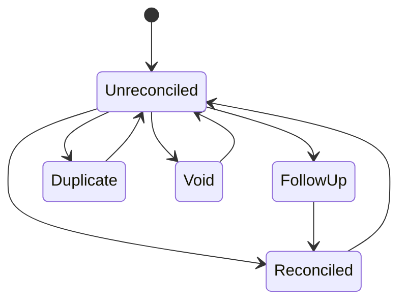
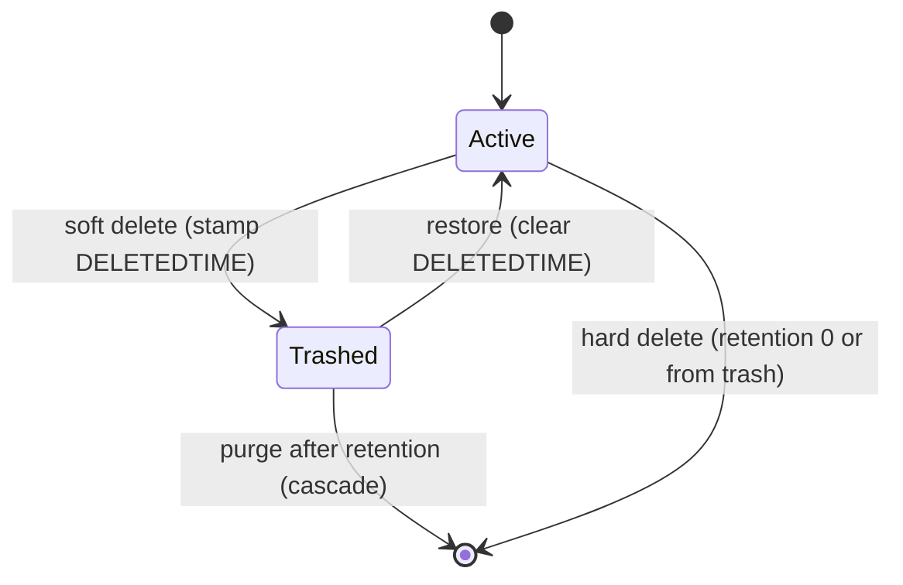

# transaction-ledger Specification

**Capability**: `transaction-ledger`
**Version**: 1.1.0
**Last Updated**: 2026-10-02

## Purpose

The core transaction ledger (`CHECKINGACCOUNT_V1`) and its split lines (`SPLITTRANSACTIONS_V1`): transaction types, statuses, the account-flow function, transfers, foreign-transaction linkage representation, soft delete with retention, statement-lock enforcement, and extension hooks. Non-scope: scheduled series and their projection (`scheduled-transactions`); stock and asset arithmetic behind linked transactions (`investment-tracking`, `asset-tracking`); bulk edit, filtering, and import/export (future changes). All rules inherit `domain-data-conventions`.

## Requirements
### Requirement: Schema Fidelity for Ledger Tables

The application SHALL persist `CHECKINGACCOUNT_V1` and `SPLITTRANSACTIONS_V1` in conformance with `domain-data-conventions`.

- Transaction status SHALL be persisted as a single-letter key: empty string (unreconciled), `R` (reconciled), `V` (void), `F` (follow up), `D` (duplicate) — not as display names.
- Transaction dates SHALL be written in the combined form `YYYY-MM-DDTHH:MM:SS`; date-only values from older files SHALL be readable.
- `COLOR` SHALL be an integer with `-1` meaning unset; the vestigial `FOLLOWUPID` column SHALL be preserved.

Traceability: [mmex/database/tables.sql](../../../mmex/database/tables.sql), [mmex/moneymanagerex/src/model/Model_Checking.h](../../../mmex/moneymanagerex/src/model/Model_Checking.h).

#### Scenario: Status keys round-trip

- **WHEN** the application persists a reconciled transaction
- **THEN** the stored `STATUS` SHALL be exactly `R`
- **AND** desktop MoneyManagerEx SHALL display it as reconciled

### Requirement: Transaction Types

The application SHALL persist the transaction type as exactly `Withdrawal`, `Deposit`, or `Transfer`, with per-type field obligations.

- A non-transfer SHALL reference a payee; a transfer SHALL reference a destination account instead.
- On `Investment` and `Shares` accounts the same three types MAY be displayed as `Buy`, `Sell`, and `Revalue`; the persisted value SHALL remain the canonical string.

Traceability: [mmex/moneymanagerex/src/model/Model_Checking.h](../../../mmex/moneymanagerex/src/model/Model_Checking.h), [mmex/moneymanagerex/src/model/Model_Checking.cpp](../../../mmex/moneymanagerex/src/model/Model_Checking.cpp).

#### Scenario: Trade alias is display-only

- **WHEN** a buy is recorded in a shares account
- **THEN** the persisted `TRANSCODE` SHALL be `Withdrawal`

### Requirement: Transaction Status Lifecycle

The application SHALL support the five transaction statuses, freely changeable by the user except where the statement lock forbids it, and SHALL accept either the stored key or the upstream display name when interpreting external data.

*Caption: Statuses are user-managed annotations; Void additionally removes the row from all monetary aggregation.*

Traceability: [mmex/moneymanagerex/src/model/Model_Checking.cpp](../../../mmex/moneymanagerex/src/model/Model_Checking.cpp) (`status_id` accepts key or name).

#### Scenario: Void removes monetary effect

- **WHEN** the user voids a withdrawal
- **THEN** the account's computed balance SHALL rise by the withdrawal amount
- **AND** the row SHALL remain visible as void

### Requirement: Account Flow and Balance Contribution

When the application computes any monetary aggregate, it SHALL use the upstream flow function: a transaction contributes to an account's flow if and only if it is not void, not soft-deleted, and not a self-transfer.

- `Withdrawal` contributes `-TRANSAMOUNT` and `Deposit` contributes `+TRANSAMOUNT` to the owning account.
- `Transfer` contributes `-TRANSAMOUNT` to the source account and `+TOTRANSAMOUNT` to the destination account.
- A self-transfer (source equals destination) contributes zero — it is a revaluation event, not a movement.

Traceability: [mmex/moneymanagerex/src/model/Model_Checking.cpp](../../../mmex/moneymanagerex/src/model/Model_Checking.cpp) (`account_flow`).

#### Scenario: Cross-currency transfer uses both amounts

- **WHEN** a transfer carries `TRANSAMOUNT` `100` and `TOTRANSAMOUNT` `92`
- **THEN** the source account's flow SHALL include `-100` and the destination's SHALL include `+92`

#### Scenario: Deleted rows never aggregate

- **WHEN** a transaction has a non-empty `DELETEDTIME`
- **THEN** it SHALL contribute nothing to any balance, statistic, report, or export

### Requirement: Split Transactions

The application SHALL support splitting a transaction into category lines (`SPLITTRANSACTIONS_V1`), whose presence makes the parent's `CATEGID` non-authoritative.

- When one or more split rows exist, aggregation by category SHALL use the split rows and ignore the parent's `CATEGID`.
- Split amounts SHALL sum to the transaction amount.
- Each split line SHALL be able to carry its own notes and tags (`TransactionSplit` reference type).
- Replacing a transaction's split lines SHALL, in one logical operation, remove the tag links of the split rows being removed, write the new split rows, and attach each new row's tags to it; no tag link SHALL be left pointing at a removed split row, and no tag given with a line SHALL be lost by the replacement.
- When the replacement changes the set of split lines — a different count, or any category, amount or note that differs — the transaction's `LASTUPDATEDTIME` SHALL be set to the time of the replacement; an unchanged set SHALL NOT stamp it.

Traceability: [mmex/moneymanagerex/src/model/Model_Splittransaction.h](../../../mmex/moneymanagerex/src/model/Model_Splittransaction.h), [mmex/moneymanagerex/src/model/Model_Splittransaction.cpp](../../../mmex/moneymanagerex/src/model/Model_Splittransaction.cpp) (`update` compares the set and stamps; `remove` deletes the row's tag links), [mmex/moneymanagerex/src/transdialog.cpp](../../../mmex/moneymanagerex/src/transdialog.cpp) (tags re-attached to the new rows), [src/domain/repos/ledger.ts](../../../src/domain/repos/ledger.ts).

#### Scenario: Splits shadow the parent category

- **WHEN** a transaction with parent category `X` carries split rows for categories `Y` and `Z`
- **THEN** category aggregation SHALL count the split amounts under `Y` and `Z` and nothing under `X`

#### Scenario: Split sum is validated

- **WHEN** the user edits split lines so their sum differs from the transaction amount
- **THEN** the application SHALL NOT persist the mismatch

#### Scenario: Split tags survive an edit

- **WHEN** the user edits a transaction whose first split line carries the tag `travel` and saves with that line unchanged
- **THEN** the saved first split line SHALL carry `travel`
- **AND** no tag link SHALL reference a split row that no longer exists

#### Scenario: Unchanged splits do not stamp

- **WHEN** the user saves a transaction whose split lines are identical to the stored ones
- **THEN** the transaction's `LASTUPDATEDTIME` SHALL be unchanged by the split replacement
### Requirement: Foreign Transaction Linkage Representation

The application SHALL preserve and honor the upstream representation of ledger rows linked to stocks and assets.

- A `Deposit` or `Withdrawal` whose `TOACCOUNTID` is greater than zero denotes a linked ("foreign") transaction; the link itself is a `TRANSLINK_V1` row whose `LINKTYPE` is exactly `Asset` or `Stock`.
- The sentinel `TOACCOUNTID` values `32701` (treat as income/expense) and `32702` (treat as transfer, excluded from accounting) SHALL be preserved verbatim and honored in flow computation.
- Editing rules for linked rows are owned by `investment-tracking` and `asset-tracking`.

Traceability: [mmex/moneymanagerex/src/model/Model_Translink.h](../../../mmex/moneymanagerex/src/model/Model_Translink.h).

#### Scenario: Sentinels survive a round-trip

- **WHEN** a desktop-created share transaction with `TOACCOUNTID` `32702` is opened, displayed, and persisted
- **THEN** the stored value SHALL still be `32702`
- **AND** the row SHALL be excluded from account flow per the sentinel's meaning

### Requirement: Soft Delete, Trash, and Retention

The application SHALL soft-delete ledger transactions by stamping `DELETEDTIME` (ISO combined, UTC), keep them restorable, and purge them after the retention window.

- Soft-deleted rows SHALL be excluded from every aggregate, report, and export, and SHALL be visible only in a dedicated trash context.
- Restore SHALL clear `DELETEDTIME` and trigger recomputation of any linked stock or asset position.
- Purge SHALL hard-delete rows whose `DELETEDTIME` is older than the `DELETED_TRANS_RETAIN_DAYS` setting (default `30`), cascading to split rows, tag links, attachments, and custom field data; a retention of `0` means delete immediately without trash. Purge SHALL run when the database is ready and synchronization has settled (or no sync binding exists), at most once per calendar day (operator decision 2026-08-08).
- `LASTUPDATEDTIME` SHALL be stamped only when a save actually changes the record, and SHALL NOT be stamped by soft-delete or restore operations.

*Caption: Transaction trash lifecycle — only CHECKINGACCOUNT_V1 has soft delete; every other table deletes hard.*

Traceability: [mmex/moneymanagerex/src/model/Model_Checking.cpp](../../../mmex/moneymanagerex/src/model/Model_Checking.cpp), [mmex/database/incremental_upgrade/database_version_16.sql](../../../mmex/database/incremental_upgrade/database_version_16.sql).

#### Scenario: Purge cascades extension rows

- **WHEN** a trashed transaction older than the retention window is purged
- **THEN** its split rows, tag links, attachment rows, and custom field data SHALL be removed with it

#### Scenario: Restore recomputes linked positions

- **WHEN** the user restores a trashed transaction linked to a stock position
- **THEN** the stock position's cached fields SHALL be recomputed and persisted per `investment-tracking`

### Requirement: Statement Lock Enforcement

When an account is statement-locked, the application SHALL treat its transactions dated on or before the statement date as read-only: no edit, no status change, no deletion.

Traceability: [mmex/moneymanagerex/src/model/Model_Checking.cpp](../../../mmex/moneymanagerex/src/model/Model_Checking.cpp) (`is_locked`).

#### Scenario: Locked transaction cannot be deleted

- **WHEN** the user attempts to delete a transaction dated before a locked account's statement date
- **THEN** the operation SHALL be refused

### Requirement: Ledger Extension Hooks

Ledger records SHALL participate in the polymorphic extension mechanisms using reference type `Transaction` for whole transactions and `TransactionSplit` for split lines.

- Tags are governed by `transaction-taxonomy`; attachments and custom fields by `record-extensions`.
- Removing a transaction (hard delete or purge) SHALL remove its extension rows, per `domain-data-conventions`.

Traceability: [mmex/moneymanagerex/src/model/Model.cpp](../../../mmex/moneymanagerex/src/model/Model.cpp).

#### Scenario: Extensions follow their transaction

- **WHEN** a transaction carrying tags, attachments, and custom field values is hard-deleted
- **THEN** all of those extension rows SHALL be removed in the same logical operation

