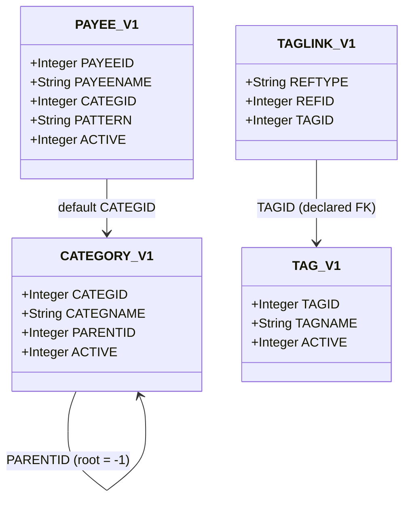

# transaction-taxonomy Specification

**Capability**: `transaction-taxonomy`
**Version**: 1.0.0
**Last Updated**: 2026-08-08

## Purpose

The classification vocabulary for ledger data: the category tree (`CATEGORY_V1`), payees (`PAYEE_V1`), tags (`TAG_V1`), and polymorphic tag links (`TAGLINK_V1`), including visibility, usage-guarded deletion, and relocate/merge semantics. Non-scope: how transactions consume these references (`transaction-ledger`, `scheduled-transactions`, `budget-management`); executing payee match patterns at import time (future import capability). All rules inherit `domain-data-conventions`.

## Requirements
### Requirement: Schema Fidelity for Taxonomy Tables

The application SHALL persist `CATEGORY_V1`, `PAYEE_V1`, `TAG_V1`, and `TAGLINK_V1` in conformance with `domain-data-conventions`.

- `TAGLINK_V1` rows SHALL be unique per `(REFTYPE, REFID, TAGID)`; its `TAGID` reference is the schema's only declared foreign key and SHALL remain the only one.

*Caption: Taxonomy entities — a self-referencing category tree, payees with a default category, and tags attached polymorphically.*

Traceability: [mmex/database/tables.sql](../../../mmex/database/tables.sql).

#### Scenario: Taxonomy rows round-trip

- **WHEN** a desktop-created database with nested categories, payees with patterns, and tag links is opened and persisted
- **THEN** all taxonomy rows the user did not edit SHALL be unchanged

### Requirement: Category Tree Structure

The application SHALL maintain categories as a self-referencing tree: `PARENTID` points at the parent category, `-1` denotes a root, and names SHALL be unique case-insensitively among siblings of the same parent.

- A category SHALL NOT be its own ancestor; reparenting that would create a cycle SHALL be rejected.
- The same name MAY exist under different parents.

Traceability: [mmex/moneymanagerex/src/model/Model_Category.h](../../../mmex/moneymanagerex/src/model/Model_Category.h), [mmex/database/incremental_upgrade/database_version_17.sql](../../../mmex/database/incremental_upgrade/database_version_17.sql) (unified tree migration).

#### Scenario: Sibling duplicate is rejected

- **WHEN** the user creates a category named `Food` under a parent that already has a child named `FOOD`
- **THEN** the creation SHALL be rejected as a duplicate

#### Scenario: Cycle is rejected

- **WHEN** the user attempts to move a category under one of its own descendants
- **THEN** the move SHALL be rejected

### Requirement: Payee Records

The application SHALL manage payees with a case-insensitively unique name, an optional default category, and the auxiliary fields (`NUMBER`, `WEBSITE`, `NOTES`).

- When a feature uses a payee's default category, it SHALL read `PAYEE_V1.CATEGID`; `-1` means no default.

Traceability: [mmex/moneymanagerex/src/model/Model_Payee.h](../../../mmex/moneymanagerex/src/model/Model_Payee.h).

#### Scenario: Payee default category is honored

- **WHEN** a transaction entry feature pre-fills a category from a payee whose default category is set
- **THEN** the pre-filled category SHALL be the payee's stored default

### Requirement: Payee Pattern Custody

The application SHALL preserve and allow editing of the payee `PATTERN` field (a JSON list of match patterns used by desktop import auto-matching) without executing it.

- Pattern matching execution is owned by a future import capability.

Traceability: [mmex/moneymanagerex/src/model/Model_Payee.h](../../../mmex/moneymanagerex/src/model/Model_Payee.h), [mmex/database/incremental_upgrade/database_version_18.sql](../../../mmex/database/incremental_upgrade/database_version_18.sql).

#### Scenario: Patterns survive editing other fields

- **WHEN** the user renames a payee that carries match patterns
- **THEN** the `PATTERN` value SHALL be preserved verbatim

### Requirement: Tags and Polymorphic Tag Links

The application SHALL manage tags with case-insensitively unique names, attached to records via `TAGLINK_V1` using the `domain-data-conventions` reference vocabulary.

- Tags SHALL be attachable to transactions (`Transaction`), scheduled transactions (`RecurringTransaction`), and individual split lines (`TransactionSplit`, `RecurringTransactionSplit`).
- Attaching the same tag twice to the same record SHALL be a no-op or rejection, never a duplicate row.

Traceability: [mmex/moneymanagerex/src/model/Model_Taglink.h](../../../mmex/moneymanagerex/src/model/Model_Taglink.h), [mmex/database/incremental_upgrade/database_version_19.sql](../../../mmex/database/incremental_upgrade/database_version_19.sql).

#### Scenario: Split lines are independently taggable

- **WHEN** the user tags one split line of a transaction
- **THEN** the persisted link SHALL carry `REFTYPE` `TransactionSplit` and the split row's identifier
- **AND** the parent transaction's tags SHALL be unaffected

### Requirement: Visibility via Active Flags

The application SHALL treat `ACTIVE` = `0` on a category, payee, or tag as hidden, not deleted: hidden entities remain valid references and continue to appear on existing records.

- Hidden entities SHALL be excluded from default pickers for new records but SHALL remain selectable through an explicit "show hidden" affordance when a picker exists.

Traceability: [mmex/moneymanagerex/src/model/Model_Category.h](../../../mmex/moneymanagerex/src/model/Model_Category.h), [mmex/moneymanagerex/src/model/Model_Payee.h](../../../mmex/moneymanagerex/src/model/Model_Payee.h), [mmex/moneymanagerex/src/model/Model_Tag.h](../../../mmex/moneymanagerex/src/model/Model_Tag.h).

#### Scenario: Hiding does not orphan references

- **WHEN** the user hides a category referenced by existing transactions
- **THEN** those transactions SHALL continue to display and aggregate under that category

### Requirement: Usage-Guarded Deletion

The application SHALL refuse to delete a category, payee, or tag that is referenced by any record, and SHALL delete unreferenced ones cleanly.

- For categories, references include transactions, splits, scheduled transactions and their splits, budget entries, and payee defaults; child categories block deletion of their parent.
- Deleting a tag SHALL delete its tag links in the same operation.

Traceability: [mmex/moneymanagerex/src/model/Model_Category.cpp](../../../mmex/moneymanagerex/src/model/Model_Category.cpp), [mmex/moneymanagerex/src/model/Model_Tag.cpp](../../../mmex/moneymanagerex/src/model/Model_Tag.cpp).

#### Scenario: Used category cannot be deleted

- **WHEN** the user attempts to delete a category referenced by a budget entry
- **THEN** the deletion SHALL be refused with the reason

### Requirement: Relocate and Merge

When the application relocates (merges) one category, payee, or tag into another, it SHALL reassign every reference from the source to the target in one logical operation and report how many records changed.

- After relocation the source SHALL be unreferenced and therefore deletable.
- Relocation SHALL cover every referencing table, including split lines and scheduled transactions.

Traceability: [mmex/moneymanagerex/src/relocatecategorydialog.cpp](../../../mmex/moneymanagerex/src/relocatecategorydialog.cpp), [mmex/moneymanagerex/src/relocatepayeedialog.cpp](../../../mmex/moneymanagerex/src/relocatepayeedialog.cpp), [mmex/moneymanagerex/src/relocatetagdialog.cpp](../../../mmex/moneymanagerex/src/relocatetagdialog.cpp).

#### Scenario: Payee merge reassigns everything

- **WHEN** the user merges payee `A` into payee `B` while `A` is referenced by transactions and scheduled transactions
- **THEN** every such reference SHALL point at `B` afterwards
- **AND** the operation SHALL report the number of records updated

