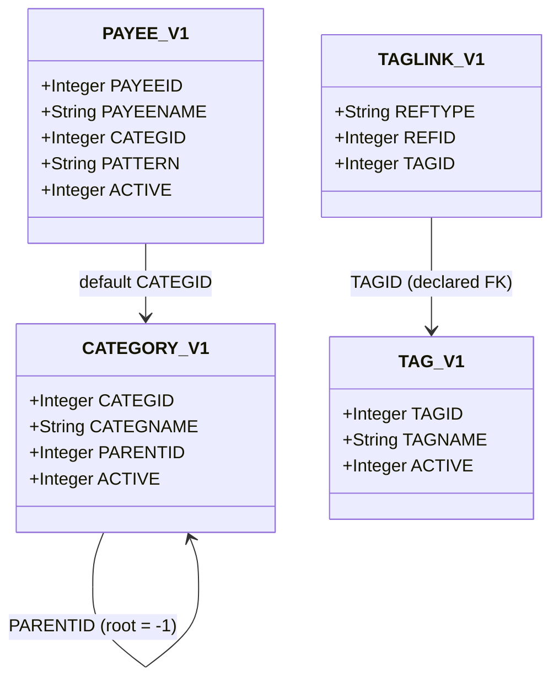
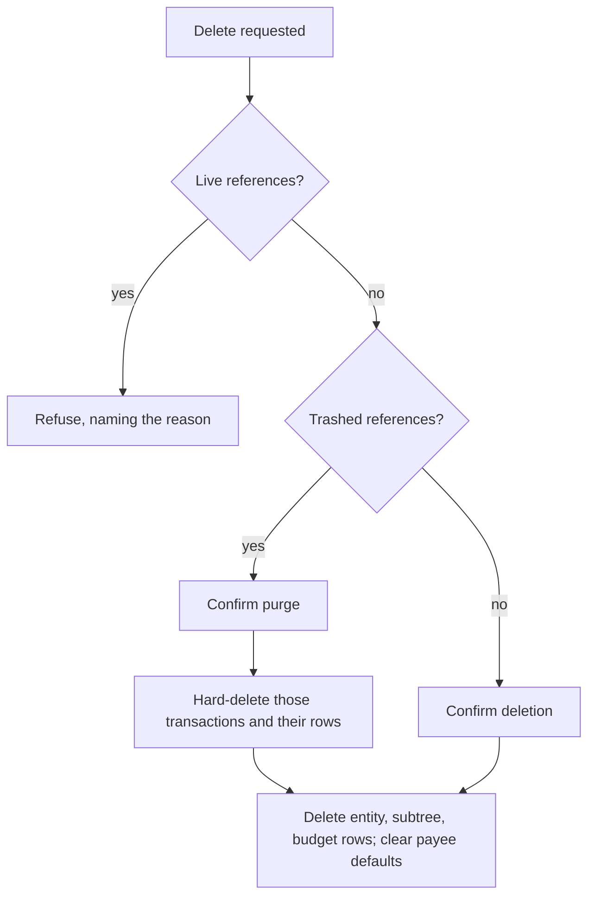
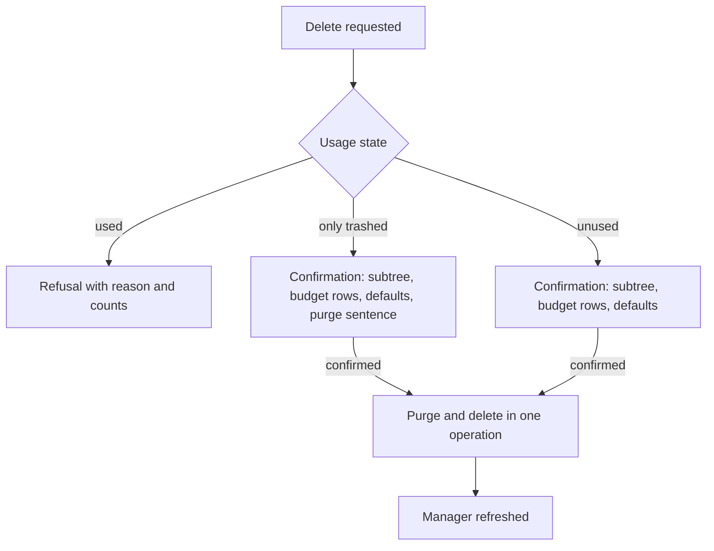
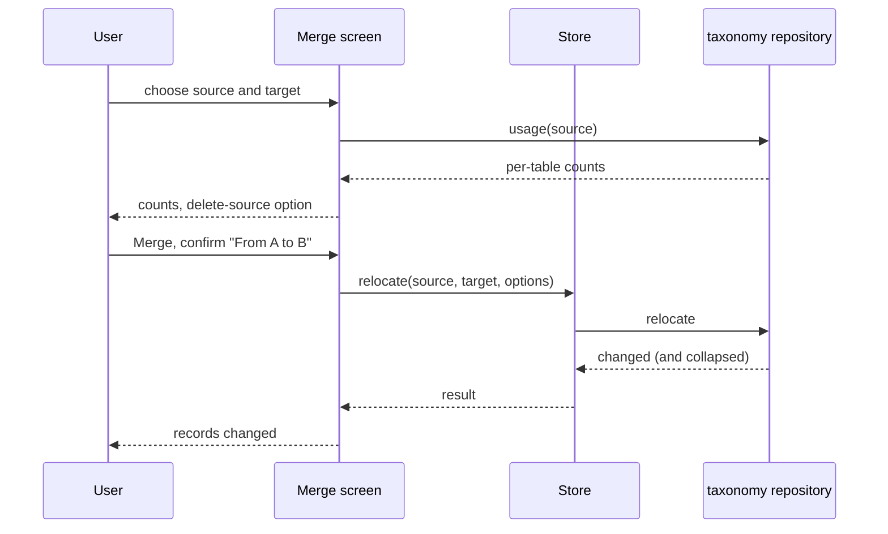

# transaction-taxonomy Specification

**Capability**: `transaction-taxonomy`
**Version**: 1.2.0
**Last Updated**: 2026-10-03

## Purpose

The classification vocabulary for ledger data: the category tree (`CATEGORY_V1`), payees (`PAYEE_V1`), tags (`TAG_V1`), and polymorphic tag links (`TAGLINK_V1`), including visibility, usage-guarded deletion, and relocate/merge semantics. Non-scope: how transactions consume these references (`transaction-ledger`, `scheduled-transactions`, `budget-management`); executing payee match patterns at import time (future import capability). All rules inherit `domain-data-conventions`.

## Requirements
### Requirement: Schema Fidelity for Taxonomy Tables

The application SHALL persist `CATEGORY_V1`, `PAYEE_V1`, `TAG_V1`, and `TAGLINK_V1` in conformance with `domain-data-conventions`.

- `TAGLINK_V1` rows SHALL be unique per `(REFTYPE, REFID, TAGID)`; its `TAGID` reference is the schema's only declared foreign key and SHALL remain the only one.

*Caption: Taxonomy entities — a self-referencing category tree, payees with a default category, and tags attached polymorphically.*

Traceability: [mmex/database/tables.sql](../../../mmex/database/tables.sql).

#### Scenario: Taxonomy rows round-trip

- **WHEN** a desktop-created database with nested categories, payees with patterns, and tag links is opened and persisted
- **THEN** all taxonomy rows the user did not edit SHALL be unchanged

### Requirement: Category Tree Structure

The application SHALL maintain categories as a self-referencing tree: `PARENTID` points at the parent category, `-1` denotes a root, and names SHALL be unique case-insensitively among siblings of the same parent.

- A category name SHALL be non-empty after trimming and SHALL NOT contain `:`; the refusal SHALL state that the colon separates categories from subcategories.
- A rename that changes only the letter case of a name SHALL be accepted (operator decision 2026-10-02; desktop refuses it as a duplicate of itself, an accident of its check, not a rule).
- A category SHALL NOT be its own ancestor; reparenting that would create a cycle SHALL be rejected. Moving a category to the top level (`PARENTID` `-1`) SHALL be accepted.
- The same name under different parents SHALL be accepted.
- A category created under a hidden parent SHALL be visible (`ACTIVE` `1`).
- The full name of a category SHALL join the names from the root down with the delimiter stored in `INFOTABLE.CATEG_DELIMITER`, `:` when the key is absent.

Traceability: [mmex/moneymanagerex/src/model/Model_Category.h](../../../mmex/moneymanagerex/src/model/Model_Category.h), [mmex/moneymanagerex/src/model/Model_Category.cpp](../../../mmex/moneymanagerex/src/model/Model_Category.cpp) (`full_name`, the delimiter), [mmex/moneymanagerex/src/categdialog.cpp](../../../mmex/moneymanagerex/src/categdialog.cpp) (the colon check, the child under a hidden parent), [mmex/database/incremental_upgrade/database_version_17.sql](../../../mmex/database/incremental_upgrade/database_version_17.sql) (unified tree migration), [src/domain/rules/taxonomy.ts](../../../src/domain/rules/taxonomy.ts), [src/domain/repos/taxonomy.ts](../../../src/domain/repos/taxonomy.ts).

#### Scenario: Sibling duplicate is rejected

- **WHEN** the user creates a category named `Food` under a parent that already has a child named `FOOD`
- **THEN** the creation SHALL be rejected as a duplicate

#### Scenario: Cycle is rejected

- **WHEN** the user attempts to move a category under one of its own descendants
- **THEN** the move SHALL be rejected

#### Scenario: Colon in a name is refused

- **WHEN** the user names a category `Food:Snacks`
- **THEN** the application SHALL refuse the name, stating that the colon separates categories from subcategories

#### Scenario: Case-only rename is accepted

- **WHEN** the user renames the category `food` to `Food`
- **THEN** the rename SHALL be accepted

#### Scenario: Move to the top level

- **WHEN** the user moves the subcategory `Snacks` out from under `Food` to the top level
- **THEN** its `PARENTID` SHALL be `-1` and its full name SHALL be `Snacks`

#### Scenario: Path uses the file's delimiter

- **WHEN** the file stores `CATEG_DELIMITER` as ` / ` and the user views the subcategory `Snacks` of `Food`
- **THEN** its full name SHALL be `Food / Snacks`

### Requirement: Payee Records

The application SHALL manage payees with a case-insensitively unique name, an optional default category, and the auxiliary fields (`NUMBER`, `WEBSITE`, `NOTES`).

- A payee name SHALL be non-empty after trimming.
- `WEBSITE` SHALL be empty or a well-formed URL: an optional `http://` or `https://` scheme, a host of at least two dot-separated labels, and at least one further character of path, query or fragment, compared after trimming and lowercasing (desktop's `isValidURI` pattern); any other value SHALL be refused naming the field.
- `NUMBER` is the payee's reference and SHALL be stored verbatim.
- `PAYEE_V1.CATEGID` SHALL be `-1` when the payee has no default category, never `NULL`. When a feature uses a payee's default category, it SHALL read `CATEGID` and treat `-1` as none.
- The default-category mode SHALL be read from `SETTING_V1.TRANSACTION_CATEGORY_NONE` as desktop's integer: `0` None, `1` Last used, `2` Unused, `3` Default; an absent or unrecognized value SHALL read as `1`. When a feature pre-fills a category from a payee, it SHALL honor the mode: None pre-fills nothing; Last used pre-fills the stored default and, when the transaction is saved, writes its category back to the payee as the new default; Unused pre-fills the root category named `Unknown`, creating it when absent; Default pre-fills the stored default and never writes back.

Traceability: [mmex/moneymanagerex/src/model/Model_Payee.h](../../../mmex/moneymanagerex/src/model/Model_Payee.h), [mmex/moneymanagerex/src/payeedialog.cpp](../../../mmex/moneymanagerex/src/payeedialog.cpp) (validation and fields), [mmex/moneymanagerex/src/primitive.cpp](../../../mmex/moneymanagerex/src/primitive.cpp) (`isValidURI`), [mmex/moneymanagerex/src/option.h](../../../mmex/moneymanagerex/src/option.h) (`USAGE_TYPE`), [mmex/moneymanagerex/src/option.cpp](../../../mmex/moneymanagerex/src/option.cpp) (`TRANSACTION_CATEGORY_NONE`, default Last used), [mmex/moneymanagerex/src/transdialog.cpp](../../../mmex/moneymanagerex/src/transdialog.cpp) (`Unknown`), [src/domain/rules/taxonomy.ts](../../../src/domain/rules/taxonomy.ts), [src/domain/repos/taxonomy.ts](../../../src/domain/repos/taxonomy.ts), [src/domain/repos/metadata.ts](../../../src/domain/repos/metadata.ts).

#### Scenario: Payee default category is honored

- **WHEN** a transaction entry feature pre-fills a category from a payee whose default category is set and the mode is Last used or Default
- **THEN** the pre-filled category SHALL be the payee's stored default

#### Scenario: Invalid website is refused

- **WHEN** the user saves a payee whose website is `not a url`
- **THEN** the save SHALL be refused naming the website field

#### Scenario: Mode is read with desktop's default

- **WHEN** the file has no `TRANSACTION_CATEGORY_NONE` setting
- **THEN** the default-category mode SHALL read as Last used

#### Scenario: No default is stored as the sentinel

- **WHEN** the user saves a payee without a default category
- **THEN** the stored `CATEGID` SHALL be `-1`

### Requirement: Payee Pattern Custody

The application SHALL preserve and allow editing of the payee `PATTERN` field — the match patterns desktop's import auto-matching uses — without executing them.

- The stored form SHALL be desktop's: a JSON object whose keys are consecutive decimal strings from `"0"` and whose values are the patterns, pretty-printed.
- Reading SHALL accept that object form and the legacy JSON array form, yielding the patterns in key order; a value that parses as neither SHALL read as no patterns and SHALL be preserved verbatim until the user edits the patterns.
- Writing SHALL drop blank patterns and renumber from `0`. A pattern beginning with `regex:` SHALL be refused when the remainder is not a valid regular expression under the application's engine, compiled case-insensitively; dialect differences from desktop's engine are recorded in the change design.
- Editing any other payee field SHALL leave `PATTERN` byte-for-byte unchanged.
- Pattern matching execution is owned by a future import capability.

Traceability: [mmex/moneymanagerex/src/payeedialog.cpp](../../../mmex/moneymanagerex/src/payeedialog.cpp) (the object writer and the `regex:` check), [mmex/moneymanagerex/src/model/Model_Payee.h](../../../mmex/moneymanagerex/src/model/Model_Payee.h), [mmex/database/incremental_upgrade/database_version_18.sql](../../../mmex/database/incremental_upgrade/database_version_18.sql), [src/domain/rules/taxonomy.ts](../../../src/domain/rules/taxonomy.ts).

#### Scenario: Patterns survive editing other fields

- **WHEN** the user renames a payee that carries match patterns
- **THEN** the `PATTERN` value SHALL be preserved verbatim

#### Scenario: A desktop pattern set round-trips

- **WHEN** the application reads a payee whose `PATTERN` is `{"0": "AMAZON*", "1": "regex:^AMZN"}` and the user saves the patterns without a change
- **THEN** the stored value SHALL again be a JSON object with keys `"0"` and `"1"` and the same two patterns in the same order

#### Scenario: Invalid regular expression is refused

- **WHEN** the user enters the pattern `regex:(unclosed`
- **THEN** the save SHALL be refused naming the pattern

### Requirement: Tags and Polymorphic Tag Links

The application SHALL manage tags with case-insensitively unique names, attached to records via `TAGLINK_V1` using the `domain-data-conventions` reference vocabulary.

- A tag name SHALL be non-empty after trimming, SHALL NOT contain a space, and SHALL NOT be exactly `&` or `|`; the refusal SHALL state the reason (the space is desktop's tag delimiter; `&` and `|` are its filter operators).
- Tags SHALL be attachable to transactions (`Transaction`), scheduled transactions (`RecurringTransaction`), and individual split lines (`TransactionSplit`, `RecurringTransactionSplit`).
- Attaching the same tag twice to the same record SHALL be a no-op or rejection, never a duplicate row.
- A record's tags SHALL be presented ordered by tag name.
- Removing a split row SHALL remove its tag links in the same operation; the owners of the split tables state when rows are removed.

Traceability: [mmex/moneymanagerex/src/model/Model_Taglink.h](../../../mmex/moneymanagerex/src/model/Model_Taglink.h), [mmex/moneymanagerex/src/tagdialog.cpp](../../../mmex/moneymanagerex/src/tagdialog.cpp) (name checks), [mmex/database/incremental_upgrade/database_version_19.sql](../../../mmex/database/incremental_upgrade/database_version_19.sql), [src/domain/rules/taxonomy.ts](../../../src/domain/rules/taxonomy.ts), [src/domain/repos/taxonomy.ts](../../../src/domain/repos/taxonomy.ts).

#### Scenario: Split lines are independently taggable

- **WHEN** the user tags one split line of a transaction
- **THEN** the persisted link SHALL carry `REFTYPE` `TransactionSplit` and the split row's identifier
- **AND** the parent transaction's tags SHALL be unaffected

#### Scenario: Reserved tag name is refused

- **WHEN** the user names a tag `&`, or `summer trip`
- **THEN** the application SHALL refuse the name, stating that the characters are reserved

#### Scenario: Tags are listed by name

- **WHEN** a transaction carries the tags `travel` and `business`, attached in that order
- **THEN** the application SHALL present them as `business`, `travel`

### Requirement: Visibility via Active Flags

The application SHALL treat `ACTIVE` = `0` on a category or payee as hidden, not deleted: hidden entities remain valid references and continue to appear on existing records.

- Tags SHALL NOT be hideable: the application SHALL write `ACTIVE` `1` for every tag and SHALL read a stored `0` as visible.
- Hiding or unhiding a category SHALL apply the same state to every category in its subtree.
- Hidden categories and payees SHALL NOT be offered when a new record is entered; a record being edited SHALL keep its current category or payee, hidden or not; a hidden payee or category SHALL be reachable for a new record by entering its exact name.
- Each manager SHALL offer a show-hidden toggle whose state is the Show-Hidden Preferences requirement's stored value.

Traceability: [mmex/moneymanagerex/src/categdialog.cpp](../../../mmex/moneymanagerex/src/categdialog.cpp) (hide and unhide over the subtree), [mmex/moneymanagerex/src/model/Model_Payee.h](../../../mmex/moneymanagerex/src/model/Model_Payee.h), [mmex/moneymanagerex/src/model/Model_Tag.h](../../../mmex/moneymanagerex/src/model/Model_Tag.h) (no hidden state), [src/domain/rules/taxonomy.ts](../../../src/domain/rules/taxonomy.ts), [src/domain/repos/taxonomy.ts](../../../src/domain/repos/taxonomy.ts).

#### Scenario: Hiding does not orphan references

- **WHEN** the user hides a category referenced by existing transactions
- **THEN** those transactions SHALL continue to display and aggregate under that category

#### Scenario: Hiding a parent hides its subtree

- **WHEN** the user hides the category `Food`, which has the subcategories `Groceries` and `Snacks`
- **THEN** `Food`, `Groceries` and `Snacks` SHALL all carry `ACTIVE` `0`

#### Scenario: Hidden is not offered for a new record

- **WHEN** a transaction entry feature lists payees for a new transaction while the payee `Old Shop` is hidden
- **THEN** `Old Shop` SHALL NOT be in the list
- **AND** typing `Old Shop` exactly SHALL select it

#### Scenario: A stored inactive tag reads as visible

- **WHEN** the application opens a file whose tag `legacy` carries `ACTIVE` `0`
- **THEN** the tag SHALL be presented as visible

### Requirement: Usage-Guarded Deletion

The application SHALL refuse to delete a category, payee, or tag that is used, SHALL offer to purge references that are only in the trash, and SHALL delete unused ones cleanly.

- An entity is used when a live transaction (`DELETEDTIME` empty) references it directly or through a split line, or when a scheduled series or one of its split lines references it. For a category, use of any descendant counts as use of the category; budget rows and payee defaults do not count.
- A tag link whose record no longer exists SHALL NOT count as use.
- When an entity is referenced only by trashed transactions, deletion SHALL require a confirmation stating that those transactions will be purged, then SHALL hard-delete them with their split rows, tag links, attachment rows and custom field data before deleting the entity, in one logical operation.
- Deleting a category SHALL delete its subtree with it, SHALL set the default category of every payee pointing at the category or its subtree to `-1`, and SHALL delete the `BUDGETTABLE_V1` rows of the category and its subtree (operator decision 2026-10-02; desktop leaves those budget rows orphaned).
- Deleting a tag SHALL delete its remaining tag links in the same operation. Deleting a payee SHALL delete its attachment rows and custom field data in the same operation.
- Every deletion SHALL be confirmed by the user before it runs; for a category the confirmation SHALL list the subcategories that go with it (operator decision 2026-10-02; desktop confirms only the purge case).

*Caption: Deletion refuses live use, purges trash on confirmation, and deletes cleanly otherwise.*

Traceability: [mmex/moneymanagerex/src/model/Model_Category.cpp](../../../mmex/moneymanagerex/src/model/Model_Category.cpp) (`is_used`), [mmex/moneymanagerex/src/model/Model_Payee.cpp](../../../mmex/moneymanagerex/src/model/Model_Payee.cpp) (`is_used`), [mmex/moneymanagerex/src/model/Model_Tag.cpp](../../../mmex/moneymanagerex/src/model/Model_Tag.cpp) (`is_used`, the three states), [mmex/moneymanagerex/src/categdialog.cpp](../../../mmex/moneymanagerex/src/categdialog.cpp) (purge and subtree removal), [mmex/moneymanagerex/src/tagdialog.cpp](../../../mmex/moneymanagerex/src/tagdialog.cpp) (purge), [src/domain/repos/taxonomy.ts](../../../src/domain/repos/taxonomy.ts).

#### Scenario: Used category cannot be deleted

- **WHEN** the user attempts to delete a category whose subcategory is referenced by a live transaction
- **THEN** the deletion SHALL be refused with the reason

#### Scenario: Only trashed references are purged on confirm

- **WHEN** the user deletes a payee referenced only by two trashed transactions and confirms the purge
- **THEN** both transactions SHALL be hard-deleted with their split rows, tag links, attachment rows and custom field data
- **AND** the payee SHALL be deleted in the same operation

#### Scenario: Unused subtree goes with the parent

- **WHEN** the user deletes the unused category `Food`, whose subcategory `Snacks` is the default of the payee `Kiosk` and has a budget row
- **THEN** `Food` and `Snacks` SHALL be deleted, `Kiosk` SHALL have default category `-1`, and the budget row SHALL be deleted

#### Scenario: Budget entry does not block

- **WHEN** the user attempts to delete a category referenced only by a budget entry
- **THEN** the deletion SHALL proceed after confirmation

### Requirement: Relocate and Merge

When the application relocates (merges) one category, payee, or tag into another, it SHALL reassign every reference from the source to the target in one logical operation and report how many records changed.

- The source and target SHALL differ, and the target SHALL NOT be hidden; either condition SHALL be refused before anything is written.
- Before the merge the application SHALL report the number of referencing rows per table — transactions, split lines, scheduled series, series split lines, and for categories also budget rows and payee defaults; after the merge it SHALL report the total number of rows changed.
- Relocation SHALL cover every referencing table, including split lines and scheduled series. Every re-pointed live transaction SHALL have `LASTUPDATEDTIME` set to the time of the merge; trashed transactions SHALL be re-pointed without a stamp.
- A category merge SHALL delete the source's `BUDGETTABLE_V1` rows rather than re-point them, counting them as changed.
- The user SHALL be able to request deletion of the source after the merge, off by default; the option SHALL be unavailable for a category that has children. For a payee, that deletion SHALL remove the source's attachment rows; the merge itself SHALL leave attachment rows on the source.
- A tag merge SHALL re-point every link that would not duplicate an existing link on the target and SHALL delete the links that would; the report SHALL state both counts (operator decision 2026-10-02; desktop has no defined outcome for the collision).
- After relocation the source SHALL be unreferenced and therefore deletable.

Traceability: [mmex/moneymanagerex/src/relocatecategorydialog.cpp](../../../mmex/moneymanagerex/src/relocatecategorydialog.cpp), [mmex/moneymanagerex/src/relocatepayeedialog.cpp](../../../mmex/moneymanagerex/src/relocatepayeedialog.cpp), [mmex/moneymanagerex/src/relocatetagdialog.cpp](../../../mmex/moneymanagerex/src/relocatetagdialog.cpp), [mmex/moneymanagerex/src/model/Model_Checking.cpp](../../../mmex/moneymanagerex/src/model/Model_Checking.cpp) (the stamp on save of a live row), [src/domain/repos/taxonomy.ts](../../../src/domain/repos/taxonomy.ts).

#### Scenario: Payee merge reassigns everything

- **WHEN** the user merges payee `A` into payee `B` while `A` is referenced by transactions and scheduled transactions
- **THEN** every such reference SHALL point at `B` afterwards
- **AND** the operation SHALL report the number of records updated

#### Scenario: Merge into itself is refused

- **WHEN** the user attempts to merge tag `travel` into tag `travel`
- **THEN** the merge SHALL be refused and no link SHALL change

#### Scenario: Budget rows of the merged category are deleted

- **WHEN** the user merges category `Snacks`, which has a budget row for 2026, into `Food`, which also has one
- **THEN** the `Snacks` budget row SHALL be deleted and the `Food` budget row SHALL be unchanged

#### Scenario: Tag merge collapses duplicates

- **WHEN** the user merges tag `trip` into tag `travel` while one transaction carries both
- **THEN** that transaction SHALL carry `travel` once
- **AND** the report SHALL state one link collapsed

#### Scenario: Live transactions are stamped

- **WHEN** the user merges payee `A` into `B` while `A` is referenced by one live and one trashed transaction
- **THEN** the live transaction's `LASTUPDATEDTIME` SHALL be the time of the merge
- **AND** the trashed transaction SHALL point at `B` with its `LASTUPDATEDTIME` unchanged

### Requirement: Show-Hidden Preferences

The application SHALL store the show-hidden choice of the category manager under `SETTING_V1.SHOW_HIDDEN_CATEGS` and of the payee manager under `SETTING_V1.SHOW_HIDDEN_PAYEES`, as desktop's boolean strings; an absent key SHALL read as on.

- The key SHALL be written when the user changes the toggle, never on read.

Traceability: [mmex/moneymanagerex/src/categdialog.cpp](../../../mmex/moneymanagerex/src/categdialog.cpp) (`SHOW_HIDDEN_CATEGS`, default `true`), [mmex/moneymanagerex/src/payeedialog.cpp](../../../mmex/moneymanagerex/src/payeedialog.cpp) (`SHOW_HIDDEN_PAYEES`), [src/domain/rules/metadata.ts](../../../src/domain/rules/metadata.ts), [src/domain/repos/metadata.ts](../../../src/domain/repos/metadata.ts).

#### Scenario: Absent preference shows hidden entries

- **WHEN** the file has no `SHOW_HIDDEN_CATEGS` setting
- **THEN** the category manager SHALL show hidden categories

#### Scenario: Toggle is persisted

- **WHEN** the user turns the payee manager's show-hidden toggle off
- **THEN** `SHOW_HIDDEN_PAYEES` SHALL be stored as desktop's false value

### Requirement: Taxonomy Surface Routes

The application SHALL provide a category manager at `/categories`, a payee manager at `/payees` and a tag manager at `/tags`, each reachable from the navigation surface.

- The three routes SHALL be declared by this capability, per the route registry rule `app-shell-navigation` establishes, and SHALL be subject to the database-readiness guard.
- Editors, pickers, confirmations and merge screens SHALL be presented over their manager without routes of their own, as the account and currency surfaces do.

Traceability: desktop reaches the managers from the Tools menu ([mmex/moneymanagerex/src/mmframe.cpp](../../../mmex/moneymanagerex/src/mmframe.cpp)). Implementation: [src/router/index.ts](../../../src/router/index.ts), [src/pages/CategoriesPage.vue](../../../src/pages/CategoriesPage.vue), [src/pages/PayeesPage.vue](../../../src/pages/PayeesPage.vue), [src/pages/TagsPage.vue](../../../src/pages/TagsPage.vue).

#### Scenario: The managers are reachable

- **WHEN** the user navigates to `/categories`, `/payees` or `/tags` on a ready database
- **THEN** the corresponding manager SHALL be displayed

#### Scenario: The managers appear in navigation

- **WHEN** the navigation surface is shown
- **THEN** entries for categories, payees and tags SHALL be present
- **AND** selecting one SHALL navigate to its route

### Requirement: Category Manager Display

The category manager SHALL present the categories as the tree they form, with a search, a show-hidden toggle and the actions desktop's Category Manager offers.

- The tree SHALL show every root category with its subtree beneath it; expand-all and collapse-all SHALL be offered.
- The search SHALL match case-insensitively on a substring of the category's full name (root to leaf, joined with the file's delimiter), and a matching category SHALL be shown with its ancestors.
- Hidden categories SHALL be shown only while the show-hidden toggle is on; the toggle's initial state SHALL be the stored `SHOW_HIDDEN_CATEGS` preference (absent → on) and changing it SHALL write the preference. A hidden category that is shown SHALL be visibly marked as hidden.
- The selection SHALL offer New (a child of the selected category, or a top-level category when nothing is selected), Edit, Delete, Merge, Move to…, and Hide or Unhide according to the selection's state.

Traceability: [mmex/moneymanagerex/src/categdialog.cpp](../../../mmex/moneymanagerex/src/categdialog.cpp) (tree, search mask over `full_name`, "Show All" bound to `SHOW_HIDDEN_CATEGS`, buttons and context menu). Implementation: [src/pages/CategoriesPage.vue](../../../src/pages/CategoriesPage.vue), [src/stores/category-store.ts](../../../src/stores/category-store.ts).

#### Scenario: Search matches the full path

- **WHEN** the user types `snack` while `Food` has the subcategory `Snacks`
- **THEN** `Snacks` SHALL be shown under `Food`
- **AND** unrelated roots SHALL NOT be shown

#### Scenario: Hidden categories follow the preference

- **WHEN** the file stores `SHOW_HIDDEN_CATEGS` as false and the category `Old` is hidden
- **THEN** `Old` SHALL NOT be shown until the user turns the toggle on
- **AND** turning the toggle on SHALL store `SHOW_HIDDEN_CATEGS` as true and show `Old` marked as hidden

### Requirement: Category Creation, Renaming and Moving

The category manager SHALL let the user create, rename and move categories within the rules of Requirement "Category Tree Structure", presenting each refusal with its reason.

- Creation SHALL ask for a name and create the category under the selected parent, or at the top level; the new category SHALL be visible even under a hidden parent.
- Renaming SHALL offer the current name for editing; a rename that changes only letter case SHALL succeed.
- Moving SHALL present a picker of possible parents — every visible category that is not the category itself or one of its descendants, plus the top level — and SHALL confirm the move, stating the old and new parent, before it runs (operator decision 2026-10-02: a picker and a confirmation, not drag-and-drop).
- A refused name (empty, containing `:`, or duplicate among the new siblings) SHALL be reported next to the entry with desktop's reason, and nothing SHALL be written.

Traceability: [mmex/moneymanagerex/src/categdialog.cpp](../../../mmex/moneymanagerex/src/categdialog.cpp) (`OnAdd`, `OnEdit`, the colon and duplicate messages, drag-and-drop reparenting that the picker replaces). Implementation: [src/pages/CategoriesPage.vue](../../../src/pages/CategoriesPage.vue), [src/components/category/](../../../src/components/category/).

#### Scenario: A duplicate sibling is refused at the entry

- **WHEN** the user creates `food` under a parent that already has `Food`
- **THEN** the entry SHALL show that a category with this name already exists for the parent
- **AND** no category SHALL be created

#### Scenario: A move is confirmed and performed

- **WHEN** the user moves `Snacks` from `Food` to the top level through the picker and confirms
- **THEN** `Snacks` SHALL be shown as a root category afterwards

#### Scenario: A cyclic move is not offered

- **WHEN** the user opens the move picker for `Food`, which has the subcategory `Snacks`
- **THEN** neither `Food` nor `Snacks` SHALL be offered as the new parent

### Requirement: Category Visibility Actions

The category manager SHALL let the user hide and unhide categories per Requirement "Visibility via Active Flags".

- Hide and Unhide SHALL apply to the selected category and its whole subtree in one operation.
- An "Unhide all" action SHALL be offered that makes every category visible (operator decision 2026-10-02).

Traceability: [mmex/moneymanagerex/src/categdialog.cpp](../../../mmex/moneymanagerex/src/categdialog.cpp) (`MENU_ITEM_HIDE`, `MENU_ITEM_UNHIDE` over `sub_tree`). Implementation: [src/pages/CategoriesPage.vue](../../../src/pages/CategoriesPage.vue), [src/domain/repos/taxonomy.ts](../../../src/domain/repos/taxonomy.ts).

#### Scenario: Hiding takes the subtree

- **WHEN** the user hides `Food`, which has the subcategories `Groceries` and `Snacks`
- **THEN** all three SHALL be marked hidden and SHALL disappear while the show-hidden toggle is off

### Requirement: Category Deletion from the Surface

The category manager SHALL delete categories per Requirement "Usage-Guarded Deletion", always after a confirmation that states what goes.

- The confirmation SHALL name the category, list the subcategories deleted with it, and state that budget rows of the subtree are deleted and payee defaults pointing into it are cleared (operator decision 2026-10-02: always confirm; desktop confirms only the purge case).
- When only trashed transactions reference the category or its subtree, the confirmation SHALL additionally carry desktop's statement that deleted transactions exist and will be purged; confirming SHALL purge them with the deletion.
- When the category is used, the action SHALL be refused with desktop's reason ("Category in use" or "Subcategory in use", with the tip to merge) and the live reference counts; nothing SHALL be written.
- A failed deletion SHALL be reported on the manager and the category SHALL remain listed.

*Caption: Deletion from the category manager — refuse, confirm with purge, or confirm.*

Traceability: [mmex/moneymanagerex/src/categdialog.cpp](../../../mmex/moneymanagerex/src/categdialog.cpp) (`mmDoDeleteSelectedCategory`, `showCategDialogDeleteError`). Implementation: [src/pages/CategoriesPage.vue](../../../src/pages/CategoriesPage.vue), [src/stores/category-store.ts](../../../src/stores/category-store.ts).

#### Scenario: Deletion with subtree is confirmed

- **WHEN** the user deletes the unused category `Food`, which has the subcategory `Snacks`
- **THEN** the confirmation SHALL list `Snacks`
- **AND** confirming SHALL remove both and refresh the tree

#### Scenario: Purge is disclosed

- **WHEN** the user deletes a category referenced only by trashed transactions
- **THEN** the confirmation SHALL state that the deleted transactions will be purged
- **AND** confirming SHALL remove the transactions and the category in one operation

#### Scenario: Live use is refused on the surface

- **WHEN** the user deletes a category whose subcategory is referenced by a live transaction
- **THEN** the manager SHALL show that the subcategory is in use, with the count, and offer the merge tip
- **AND** the category SHALL remain

### Requirement: Payee Manager Display

The payee manager SHALL list payees with desktop's columns, a search, a show-hidden toggle, and a selection the actions apply to.

- The columns SHALL be Name, Hidden, the default category titled "Default Category" or "Last Used Category" according to the default-category mode, Reference (`NUMBER`), Website, Notes, Match Pattern (the patterns joined by a space) and Used.
- Used SHALL be the number of live transactions plus the number of scheduled series referencing the payee, read in one query for the whole list.
- The search SHALL match case-insensitively on a substring of the name.
- Hidden payees SHALL be shown only while the show-hidden toggle is on; the toggle's initial state SHALL be the stored `SHOW_HIDDEN_PAYEES` preference (absent → on) and changing it SHALL write the preference. A hidden payee that is shown SHALL be visibly marked.
- On a narrow viewport the list SHALL present each payee as a card carrying the same fields, per the responsive-hybrid stance (operator decision 2026-08-08).
- One or many payees SHALL be selectable; the actions of Requirement "Payee Selection Actions" apply to the selection.

Traceability: [mmex/moneymanagerex/src/payeedialog.cpp](../../../mmex/moneymanagerex/src/payeedialog.cpp) (columns, the usage pass over live transactions and series, `FilterPayees`, `SHOW_HIDDEN_PAYEES`). Implementation: [src/pages/PayeesPage.vue](../../../src/pages/PayeesPage.vue), [src/stores/payee-store.ts](../../../src/stores/payee-store.ts), [src/domain/repos/taxonomy.ts](../../../src/domain/repos/taxonomy.ts) (bulk usage counts).

#### Scenario: The default-category column follows the mode

- **WHEN** the file's `TRANSACTION_CATEGORY_NONE` is absent or `1`
- **THEN** the column SHALL be titled "Last Used Category"
- **AND** with `3` it SHALL be titled "Default Category"

#### Scenario: Used counts live transactions and series

- **WHEN** a payee is referenced by two live transactions, one trashed transaction and one scheduled series
- **THEN** its Used cell SHALL show `3`

### Requirement: Payee Editing

The payee manager SHALL create and edit payees with desktop's fields, within Requirements "Payee Records" and "Payee Pattern Custody".

- The editor SHALL carry Payee (name), Hidden, the default category (titled per the mode) with a category picker that offers visible categories and keeps a hidden current value, Reference, Website, Notes, and the match patterns as an editable list of lines.
- Saving SHALL refuse an empty name, a duplicate name, an invalid website and an invalid `regex:` pattern, each reported next to its field with desktop's wording; nothing SHALL be written on a refusal.
- Saving a payee whose other fields changed SHALL leave `PATTERN` untouched unless the pattern list was edited.

Traceability: [mmex/moneymanagerex/src/payeedialog.cpp](../../../mmex/moneymanagerex/src/payeedialog.cpp) (`mmEditPayeeDialog`). Implementation: [src/components/payee/](../../../src/components/payee/), [src/stores/payee-store.ts](../../../src/stores/payee-store.ts).

#### Scenario: An invalid website is reported at its field

- **WHEN** the user saves a payee whose website is `not a url`
- **THEN** the website field SHALL show "Please enter a valid URL"
- **AND** nothing SHALL be written

#### Scenario: Patterns are edited as lines

- **WHEN** the user adds the line `regex:^AMZN` to a payee with the pattern `AMAZON*` and saves
- **THEN** the stored `PATTERN` SHALL be the object with `"0": "AMAZON*"` and `"1": "regex:^AMZN"`

### Requirement: Payee Selection Actions

The payee manager SHALL offer desktop's selection actions over one or many selected payees, each as one operation.

- Hide Selected and Show Selected SHALL set the hidden state of every selected payee.
- Define Category SHALL set the default category of every selected payee to a category chosen from a picker; Remove Category SHALL clear it (`-1`).
- Remove SHALL delete the selected payees per Requirement "Payee Deletion from the Surface".
- Merge Payee SHALL open the merge screen with the selected payee as the source (single selection).

Traceability: [mmex/moneymanagerex/src/payeedialog.cpp](../../../mmex/moneymanagerex/src/payeedialog.cpp) (`OnItemRightClick` menu: Hide Selected, Show Selected, Remove, Define Category, Remove Category, Merge Payee). Implementation: [src/pages/PayeesPage.vue](../../../src/pages/PayeesPage.vue), [src/domain/repos/taxonomy.ts](../../../src/domain/repos/taxonomy.ts) (`setHiddenStatements`, `setDefaultCategoryStatements`, `removeMany`).

#### Scenario: A default category is defined for a selection

- **WHEN** the user selects three payees, chooses Define Category and picks `Food`
- **THEN** all three SHALL show `Food` as their default category afterwards

### Requirement: Payee Deletion from the Surface

The payee manager SHALL delete payees per Requirement "Usage-Guarded Deletion", always after a confirmation.

- The confirmation SHALL name the payees to be deleted; when any of them is referenced only by trashed transactions it SHALL carry desktop's purge statement, and confirming SHALL purge those transactions with the deletion.
- A used payee SHALL be refused with desktop's reason ("Payee in use") and the counts; in a multi-selection the deletable payees SHALL be deleted and the refused ones reported by name.
- A failed deletion SHALL be reported on the manager.

Traceability: [mmex/moneymanagerex/src/payeedialog.cpp](../../../mmex/moneymanagerex/src/payeedialog.cpp) (`OnDeletePayee`). Implementation: [src/pages/PayeesPage.vue](../../../src/pages/PayeesPage.vue), [src/stores/payee-store.ts](../../../src/stores/payee-store.ts).

#### Scenario: A mixed selection is partly deleted

- **WHEN** the user deletes a selection of one used and one unused payee and confirms
- **THEN** the unused payee SHALL be removed
- **AND** the manager SHALL report that the used payee was kept, with its counts

### Requirement: Tag Manager Display

The tag manager SHALL list tags with a search, a usage count, and the actions desktop's Tag Manager offers.

- Each tag SHALL show its name and the number of live transactions, split lines, scheduled series and series split lines carrying it, read in one query for the whole list (operator decision 2026-10-02: counts in the manager).
- The search SHALL match case-insensitively on a substring of the name.
- One or many tags SHALL be selectable; Add, Edit (single selection), Delete and Merge (single selection) SHALL be offered. No hide action SHALL exist, because tags are never hidden.

Traceability: [mmex/moneymanagerex/src/tagdialog.cpp](../../../mmex/moneymanagerex/src/tagdialog.cpp) (list with check selection, search, Add, Edit, Delete). Implementation: [src/pages/TagsPage.vue](../../../src/pages/TagsPage.vue), [src/stores/tag-store.ts](../../../src/stores/tag-store.ts).

#### Scenario: Tags list their use

- **WHEN** the tag `travel` is carried by two live transactions and one split line of a trashed transaction
- **THEN** its count SHALL show `2`

### Requirement: Tag Creation and Renaming

The tag manager SHALL create and rename tags within Requirement "Tags and Polymorphic Tag Links", presenting each refusal with desktop's reason.

- Creation and renaming SHALL ask for a name; a space, the names `&` and `|`, an empty name and a duplicate SHALL be reported next to the entry with desktop's wording, and nothing SHALL be written.

Traceability: [mmex/moneymanagerex/src/tagdialog.cpp](../../../mmex/moneymanagerex/src/tagdialog.cpp) (`OnAdd`, `OnEdit`, `validateName`). Implementation: [src/pages/TagsPage.vue](../../../src/pages/TagsPage.vue), [src/components/tag/](../../../src/components/tag/).

#### Scenario: A reserved name is refused at the entry

- **WHEN** the user creates a tag named `summer trip`
- **THEN** the entry SHALL show desktop's message that the space character is not allowed in a tag name
- **AND** no tag SHALL be created

### Requirement: Tag Deletion from the Surface

The tag manager SHALL delete the selected tags per Requirement "Usage-Guarded Deletion", always after a confirmation.

- The confirmation SHALL name the tags; when any is referenced only by trashed transactions it SHALL carry desktop's purge statement for that tag, and confirming SHALL purge those transactions with the deletion.
- A used tag SHALL be refused with desktop's reason ("Tag 'name' in use"); in a multi-selection the deletable tags SHALL be deleted and the refused ones reported by name, as desktop continues past them.

Traceability: [mmex/moneymanagerex/src/tagdialog.cpp](../../../mmex/moneymanagerex/src/tagdialog.cpp) (`OnDelete`). Implementation: [src/pages/TagsPage.vue](../../../src/pages/TagsPage.vue), [src/stores/tag-store.ts](../../../src/stores/tag-store.ts).

#### Scenario: Deleting a used tag is refused by name

- **WHEN** the user deletes a selection containing the used tag `travel`
- **THEN** the manager SHALL report "Tag 'travel' in use"
- **AND** `travel` SHALL remain

### Requirement: Merge Screens

Each manager SHALL offer a merge screen performing Requirement "Relocate and Merge" for its kind, presenting desktop's Merge dialog.

- The source list SHALL offer only used entities; the target list SHALL offer only visible entities other than the source (operator decision 2026-10-02).
- Before merging, the screen SHALL show desktop's per-table counts for the source: transactions, split transactions, scheduled transactions, scheduled split transactions, and for categories also default payee category and budget.
- A "Delete source after merge" option SHALL be offered, off by default; for a category with subcategories it SHALL be unavailable with desktop's note.
- Merge SHALL be confirmed with "From <source> to <target>"; afterwards the screen SHALL report the number of records changed, and for tags also the number of links collapsed.
- A refusal (same entity, hidden target) SHALL be shown on the screen and nothing SHALL be written.

*Caption: The merge screen shows what will change, confirms, and reports what changed.*

Traceability: [mmex/moneymanagerex/src/relocatecategorydialog.cpp](../../../mmex/moneymanagerex/src/relocatecategorydialog.cpp), [mmex/moneymanagerex/src/relocatepayeedialog.cpp](../../../mmex/moneymanagerex/src/relocatepayeedialog.cpp), [mmex/moneymanagerex/src/relocatetagdialog.cpp](../../../mmex/moneymanagerex/src/relocatetagdialog.cpp). Implementation: [src/components/taxonomy/MergeDialog.vue](../../../src/components/taxonomy/MergeDialog.vue), the three stores.

#### Scenario: Counts are shown before the merge

- **WHEN** the user picks a source category referenced by two transactions, one split line and one budget row
- **THEN** the screen SHALL show those counts before the merge runs

#### Scenario: The merge reports what changed

- **WHEN** the user confirms merging payee `A` into `B` while `A` is referenced by three records
- **THEN** the screen SHALL report three records changed
- **AND** `A` SHALL remain listed unless the delete-source option was on

### Requirement: Refusal Presentation

Every refusal the taxonomy repository raises SHALL be presented in the user's language on the surface that caused it, never as a raw error.

- Name refusals (empty, colon, space, reserved, duplicate) SHALL appear at the entry field with desktop's wording.
- In-use refusals SHALL name the kind and show the live counts per table; the purge case SHALL become a confirmation, not a refusal.
- Merge refusals (same entity, hidden target, source has children) and payee validation refusals (name, website, pattern with its line) SHALL appear on the screen or at the field they concern.
- A write that fails in the database SHALL be reported on the manager with the entity unchanged in the list.

Traceability: the typed errors of [src/domain/repos/taxonomy.ts](../../../src/domain/repos/taxonomy.ts) (`TaxonomyNameError`, `TaxonomyInUseError`, `TaxonomyMergeError`, `PayeeValidationError`); the message strings of [mmex/moneymanagerex/src/categdialog.cpp](../../../mmex/moneymanagerex/src/categdialog.cpp), [mmex/moneymanagerex/src/payeedialog.cpp](../../../mmex/moneymanagerex/src/payeedialog.cpp), [mmex/moneymanagerex/src/tagdialog.cpp](../../../mmex/moneymanagerex/src/tagdialog.cpp). Implementation: [src/locales/](../../../src/locales/), the three pages.

#### Scenario: A refusal is translated

- **WHEN** the user's language is Traditional Chinese and a tag name is refused for containing a space
- **THEN** the message SHALL be shown in Traditional Chinese
- **AND** no reason code SHALL reach the user
